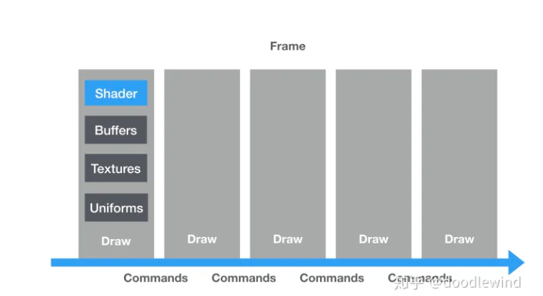

# WebGL基础库设计

WebGL一些基础的概念:

- shader 着色器: 存放图形算法的对象. 在GPU上并行执行
- resource 资源: 传递给着色器的数据, 包括大量的订单数据, 纹理图像以及全局的配置项
- draw 绘制: 选好资源后运行着色器的请求. 要想渲染真实的场景, 一般需要多组着色器和多个资源, 来回绘制多次才能完成一帧 . 每次回之前需要选择住哟色漆, 并为其关联好不同的资源, 每次都会启动一次图形渲染管线
- command 命令: 执行绘制前的配置. 每次绘制前, 我们需要小心的处理好状态机. 这些状态变更是通过命令来实现的.

三个核心的API:

- `shader`: 管理着色器
- `resource`: 管理资源
- `draw`: 进行绘制

buffer, textures, uniforms 都是典型的资源.

一帧中可能存在多次绘制, 每次绘制都需要着色器和相应的资源.

在绘制之间, 我们通过命令来管理好`webGL`的状态.

