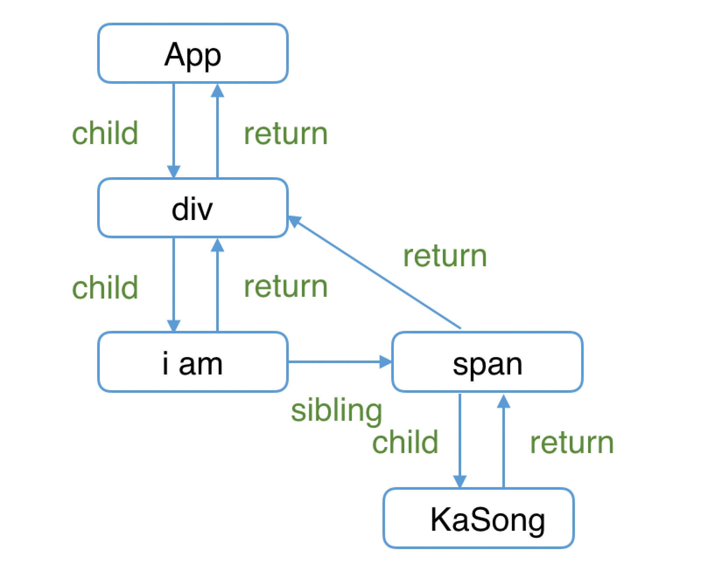

# [04]Fiber

## 复习: 代数效应

假设我们有一个函数`getTotalPicNum`, 传入2个用户名称, 可以分别查找用在平台保存的图片数量, 最后将图片数量相加后返回.

```js
function getTotalPicNum(user1, user2) {
  const picNum1 = getPicNum(user1);
  const picNum2 = getPicNum(user2);

  return picNum1 + picNum2;
}
```

在`getTotalPicNum`中, 我们只关注: "获取到两个数字后将他们相加的结果返回"这个过程.

一般来说, 获取"用户在平台保存的图片数量"这个动作是一个请求的异步动作. 我们可能需要这么实现:

```js
async function getTotalPicNum(user1, user2) {
  const picNum1 = await getPicNum(user1);
  const picNum2 = await getPicNum(user2);

  return picNum1 + picNum2;
}
```

我们发现, 上层调用者也被异步性侵染了. 这就是异步的传染性.

我们虚构一种语法:`try...handle`, 并提供两种操作符`perform`, `resume`.

```js
function getPicNum(name) {
  const picNum = perform name;
  return picNum;
}

try {
  getTotalPicNum('kaSong', 'xiaoMing');
} handle (who) {
  switch (who) {
    case 'kaSong':
      resume with 230;
    case 'xiaoMing':
      resume with 122;
    default:
      resume with 0;
  }
}
```

当执行到`getTotalPicNum`的时候, 会执行`perform name`, 然后从调用栈中跳出来, 执行副作用方法后回到`perform`的调用栈.

这就是所谓的代数效应.

### 代数效应和react hooks

hooks的设计就是一种代数效应的应用. 

对于类似`useState`, `useReducer`, `useRef`这样的`Hook`来说, 我们不需要关注`FunctionComponent`的`state`在hooks中是如何保存的, 我们只需要假设`useState`返回的就是我们想要的state, 并且关注业务逻辑的编写就可以了.

```js
function App() {
  const [num, updateNum] = useState(0);
  
  return (
    <button onClick={() => updateNum(num => num + 1)}>{num}</button>  
  )
}
```

### 代数效应和Generator

从旧的架构到新的架构, reconciler重构的一个目的在于: 将老的`同步更新`的架构变为`异步可中断更新`.

所以的`异步可中断更新`, 就可以理解为: `更新`在执行过程中可能会被打断(浏览器时间分片用尽或者有更高优先任务插队), 当可以继续执行的时候就恢复之前执行的中间状态.

也就是所谓的`try...handle`语法, 在浏览器中, 则正指向了`generator`语法. 但是这个语法有存在一些问题:

- 作为`async`实现的基础, 本质上也是存在传染性的
- 执行的中间状态是上下文关联的

上下文关联的问题在于无法提供优先级插队的能力. 比如下面这个例子:

```js
function* doWork(A, B, C) {
  var x = doExpensiveWorkA(A);
  yield;
  var y = x + doExpensiveWorkB(B);
  yield;
  var z = y + doExpensiveWorkC(C);
  return z;
}
```

当浏览器有空闲时间的时候, 会执行一个`doExpensiveWork`, 当时间用完了则会中断, 当再次恢复的时候会从中断的位置继续执行. 

单一任务执行的中断和继续是没有问题的, 但是如果有个高优任务插队进入. 如果B组件接收到一个高优更新, 由于`Generator`执行的`中间状态`是上下文关联的, 所以计算`y`的时候无法复用之前已经计算好的`x`, 需要重新计算.

所以, React使用了其他方法来实现协调器, 也就是`Fiber`.

在React中, `Fiber`可以理解为:

在内部实现的一套状态更新机制, 支持任务不同的优先级, 可以中断和恢复, 并且恢复后可以复用之前的中间状态.

其中每个任务更新单元为`React Element`对应的`Fiber`节点.


## Fiber: 含义

Fiber有三层含义:

1. 作为架构来说, 之前的旧架构采用递归的方式执行, 数据保存在递归调用栈中, 所以被称为`stack reconciler`, 而新的架构基于`fiber`节点实现, 被称为`fiber reconciler`
2. 作为静态的数据结构, 每个`fiber`节点对应一个`react element`, 保存了该组件的类型, 对应DOM的节点信息等
3. 作为动态的工作单元来说, 每个`fiber`节点保存了本次更新中该组件改变的状态, 要执行的工作等等

## Fiber: 结构

Fiber节点的属性定义很多, 大概可以分成三层:

```js
function FiberNode(
  tag: WorkTag,
  pendingProps: mixed,
  key: null | string,
  mode: TypeOfMode,
) {
  // 作为静态数据结构的属性
  this.tag = tag;
  this.key = key;
  this.elementType = null;
  this.type = null;
  this.stateNode = null;

  // 用于连接其他Fiber节点形成Fiber树
  this.return = null;
  this.child = null;
  this.sibling = null;
  this.index = 0;

  this.ref = null;

  // 作为动态的工作单元的属性
  this.pendingProps = pendingProps;
  this.memoizedProps = null;
  this.updateQueue = null;
  this.memoizedState = null;
  this.dependencies = null;

  this.mode = mode;

  this.effectTag = NoEffect;
  this.nextEffect = null;

  this.firstEffect = null;
  this.lastEffect = null;

  // 调度优先级相关
  this.lanes = NoLanes;
  this.childLanes = NoLanes;

  // 指向该fiber在另一次更新时对应的fiber
  this.alternate = null;
}
```

我们可以从三个角度来归类`Fiber`的这些属性

### 作为架构

每个Fiber节点都有对应的`React Element`, 多个Fiber节点连接形成树:

```js
// 指向父级Fiber节点
this.return = null;
// 指向子Fiber节点
this.child = null;
// 指向右边第一个兄弟Fiber节点
this.sibling = null;
```

以下面这个简单的dom树为例:

```js
function App() {
  return (
    <div>
      i am
      <span>KaSong</span>
    </div>
  )
}
```

对应的Fiber树大概是这样的:



### 作为静态数据结构的属性

Fiber保存了组件相关的信息:

```js
// Fiber对应组件的类型 Function/Class/Host...
this.tag = tag;
// key属性
this.key = key;
// 大部分情况同type，某些情况不同，比如FunctionComponent使用React.memo包裹
this.elementType = null;
// 对于 FunctionComponent，指函数本身，对于ClassComponent，指class，对于HostComponent，指DOM节点tagName
this.type = null;
// Fiber对应的真实DOM节点
this.stateNode = null;
```

### 作为动态的工作单元

Fiber中保存了本次更新的相关信息.

```js
// 保存本次更新造成的状态改变相关信息
this.pendingProps = pendingProps;
this.memoizedProps = null;
this.updateQueue = null;
this.memoizedState = null;
this.dependencies = null;

this.mode = mode;

// 保存本次更新会造成的DOM操作
this.effectTag = NoEffect;
this.nextEffect = null;

this.firstEffect = null;
this.lastEffect = null;
```

另外, 通过`lanes`字段和`childLanes`字段会保存调度优先级相关的信息.

## Fiber: 工作原理

Fiber节点构成的Fiber树对应了组件的DOM树结构.

那么Fiber是符合更新DOM的? 这里主要有一种双缓存的技术.

### 双缓存 Fiber 树

在canvas绘图中, 如果某一帧的计算量比较大, 会提前在缓存中绘制当前帧的动画, 等绘制完毕后替换上一帧的画面, 从而避免画面闪烁的问题.

这种在"内存中构建并直接替换"的技术就叫做 **"双缓存"**.

React就是借助双缓存来完成Fiber树的构建和替换(对应DOM树的创建和更新)

在React中, 最多会同时存在两颗`Fiber树`. 当前屏幕上的内容对应一个Fiber树, 叫做`current fiber tree`. 正在内存中构建的`fiber tree`就叫做`workInProgress fiber tree`.

理所当然的, 在`current fiber tree`中的节点叫做`current fiber`, 在`workInProcess fiber tree`中的节点叫做`workInProcess fiber`, 对应的节点可以通过`alternate`属性连接起来.

```js
currentFiber.alternate === workInProgressFiber;
workInProgressFiber.alternate === currentFiber;
```

React的根节点通过使`current`指针在不同的`fiber`树的`rootFiber`之间切换来完成`current Fiber`树的指向的切换.

每次状态的更新都会产生新的`workInProgress Fiber tree`, 通过两个树的替换, 从而完成对DOM的更新操作.

### mount

以这个例子为例:

```js
function App() {
  const [num, add] = useState(0);
  return (
    <p onClick={() => add(num + 1)}>{num}</p>
  )
}

ReactDOM.render(<App/>, document.getElementById('root'));
```

#### step.1

第一次执行`render`函数会创建`fiberRoot`和`rootFiber`. 其中`fiberRootNode`是整个应用的根节点, `rootFiber`则是所在组件数的根节点.

区分这两者的意义在于, 我们可以多次的调用`render`来创建多个`rootFiber`,但是`fiberRoot`只会有一个.

`fiberRoot`的`current`会指向`current fiber tree`, 也就是`rootFiber`节点.

此时,`rootFiber`上是一个空的树, 没有挂载任何节点.

#### step.2

接下来进入`render`阶段, 会根据组件的jsx一次创建`fiber`节点, 然后构成`fiber`树, 并且挂载到`workInProgress fiber tree`上.

在这个构建过程中, 会尝试复用`current Fiber tree`上已有节点中的属性, 在mount节点是没有复用的.

#### step.3

将构建完的`workInProgress fiber tree`在`commit`阶段渲染到页面上.

### update

当页面发生交互的时候, 就需要更新当前的`fiber tree`. 

这个时候,会开启一次新的`render`阶段,并且构建一颗新的`workInProcess fiber tree`.

同样的, 在创建过程中, 会去尝试复用`current fiber`树上的节点数据. 这部分依赖于diff算法.

在`render`阶段完成后, 会进入`commit`阶段并渲染到页面上, 渲染结束后, `workInProfress fiber tree`会转换为`current fiber`树.

