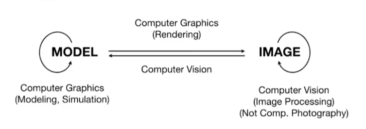

# CP01. 介绍

主要内容：

- 光栅化：将三维空间的几何形体显示在屏幕上
- 曲线和曲面： 如何绘制光滑的曲面
- 光线追踪：绘制更好的画面
- 动画与模拟：重力，材质模拟

## 计算机图形学

计算机视觉和计算机图形学的关系和区别

- 所有需要猜测的东西都是属于计算机视觉的。

- model: 描述几何物体的东西。
- image：一幅图。
- model->image: 计算机图形学，渲染
- image->model: 计算机视觉，建模
- model-> model: 仿真，描述等等, 仍然属于图形学
- image->image: 图像分析，图像处理，仍然属于计算机视觉

