# [02]线性基础

- 图形学的基础依赖：

  - 基础数学：线性代数，微积分，统计
  - 基础物理：光学，力学。波动光学？
  - 杂项：信号处理，数值分析......

  - 一点点美学

## 向量：

- 向量：箭头，具有方向和长度。

- 向量的长度: $||a||$

- 单位向量：
  - 一个长度为1的向量
  - 归一化：$a = a / ||a||$
  - 用来代表一个方向
  
### 向量基础运算  

- 向量求和：坐标相加。（平行四边形法则，三角形法则）
- 向量的表示： 
  - 默认是竖直写
  - 向量的转置: $A^T=(x,y)$
  - 向量的模：$||a||$
  
### 向量的点乘

1. 点乘的运算

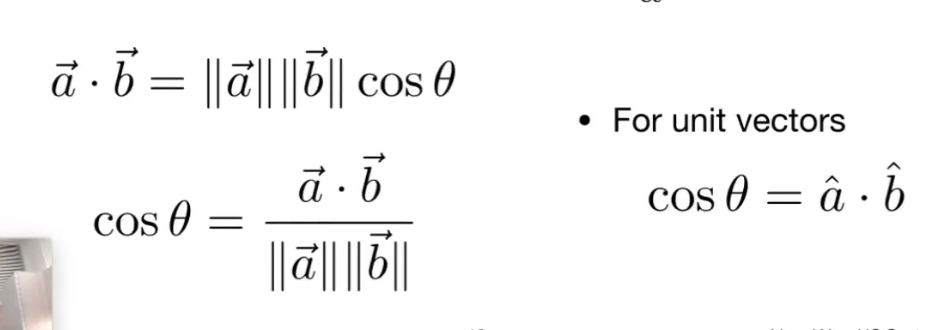

2. 点乘满足：交换律，分配率以及数乘

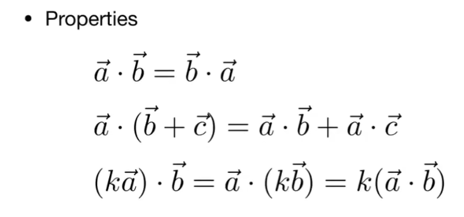

3. 点乘的坐标运算：

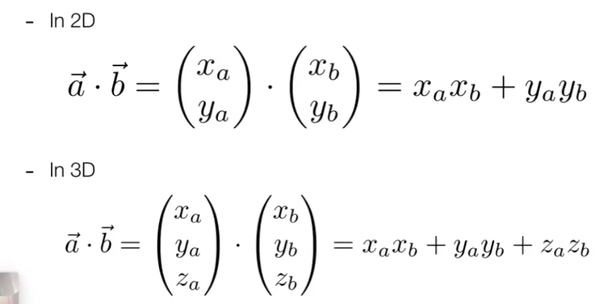

4. 点乘的应用：

- 找到两个向量之间的夹角（测量两个向量有多接近）
- 找到一个向量相对于另一个向量的投影（分解出投影以及对应的垂直向量，计算如下）
-  决定向量的前后关系：a和b是相同方向， a和c是相反相仿的（点乘为正则正向，点乘为负为反向）

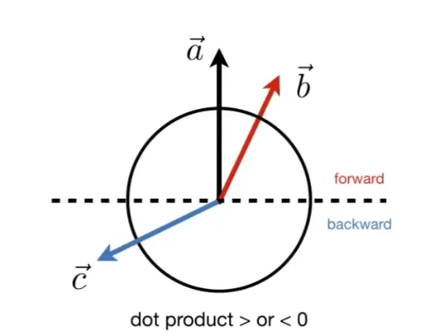

5. 投影的计算

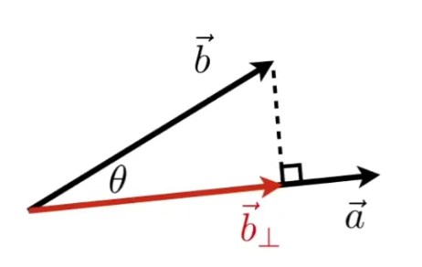

- b投影的方向与a一致，所以：$b=ka$
- b的长度计算如下：$k=||b||cosθ$
- 通过$b-b投影$可以分解出一个垂直向量：

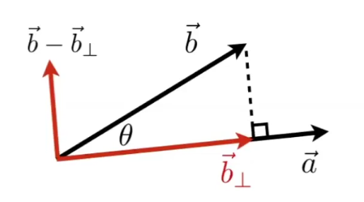

### 向量的叉乘

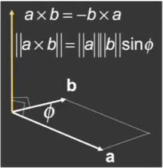

1. 基本属性

- 叉积：输入两个向量，输出一个新的向量
- 方向垂直于原本的两个向量，遵循右手螺旋定则，长度等于a和b的平行四边形的面积（行列式值）
- 如果我们$x \times y = z$， 那么我们说我们得到了一个右手坐标系。在OpenGL中，会假设我们使用的是左手坐标系。

2. 叉乘的其他性质：

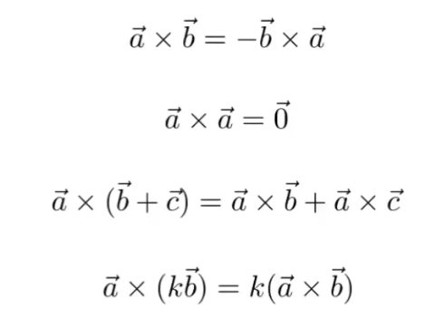

叉乘的代数运算：

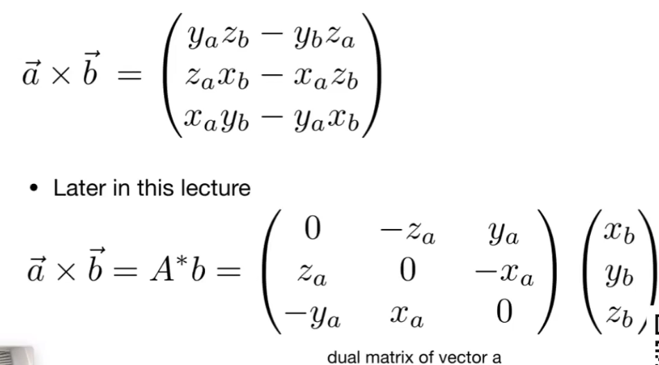

3. 向量的叉乘在图形学中的作用：判断 左、右，判断 内、外

- 比如，当向量a 叉乘 向量b， 如果叉积是正的，说明向量b在向量a的左侧，反之，则向量b在a的右侧。
- 再比如，判断点是否在三角形的内部，可以依次将p和三角形顶点组成的向量和三角形三条边做叉积，如果三个叉积的符号是一致的，那么就说明点在三角形的内部。（**三角形的光栅化基础**）

4. 用叉乘定义坐标系

假如，我们有：

- u, v，w三个单位向量
- 三个单位向量的点积为0
- $\vec{w} = \vec{u} \times \vec{v}$

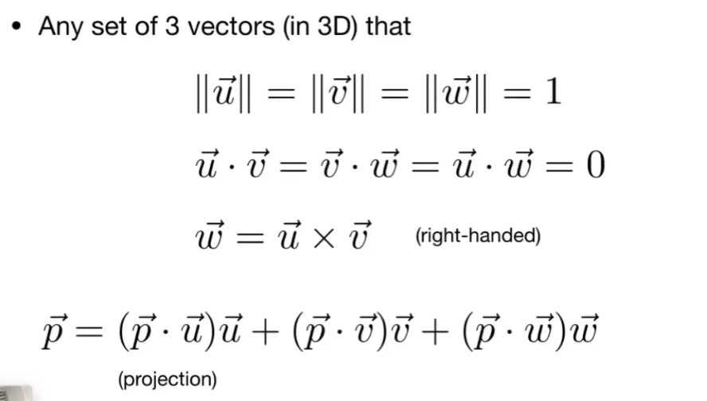

## 矩阵

什么是矩阵？

矩阵就是一个数组，并且按照m行n列排列起来。

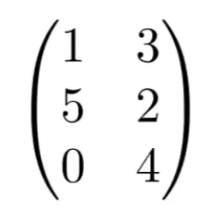

### 矩阵的乘积

可以相乘的矩阵必须满足：

$$(M \times N)(N \times P) = (M \times P)$$

矩阵的计算可以这么算：结果矩阵中的元素`（i,j）`为A矩阵中的第i行和B矩阵中的第j列的点积值。

### 矩阵的性质

- 不存在任何交换律
- 存在结合律和分配率
  - `(AB)C=A(BC)`
  - `A(B+C)=AB+AC`
  - `(A+B)C=AC+BC`

### 矩阵 x 向量

- 向量必须是列向量
- 一个简单的按y轴对称：

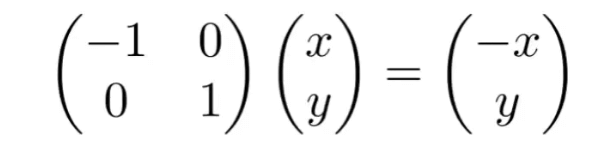

### 矩阵的转置

将行和列互换：

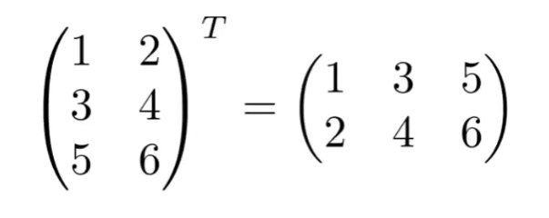

矩阵转置的性质：

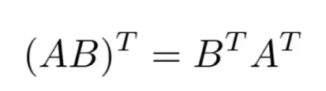

### 单位矩阵

单位矩阵是一个对角阵。

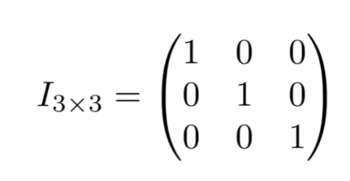

单位矩阵具有以下的性质：

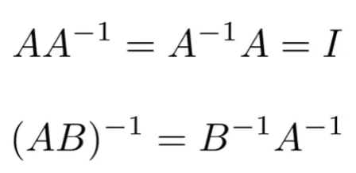

### 向量的乘法-矩阵的表示形式

- 点乘：

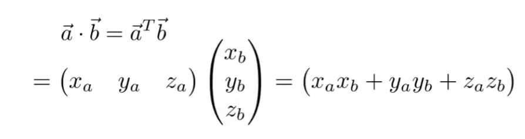

- 叉乘：

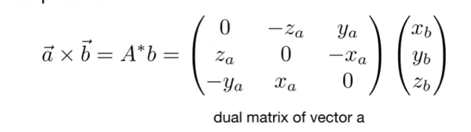

