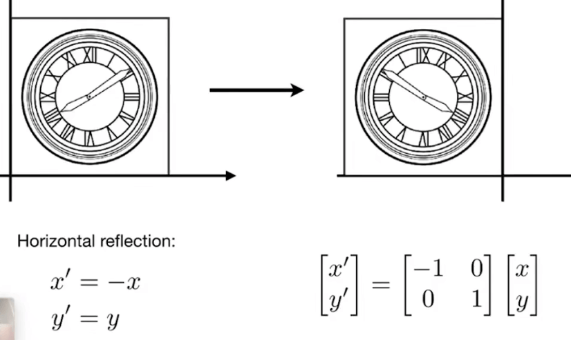
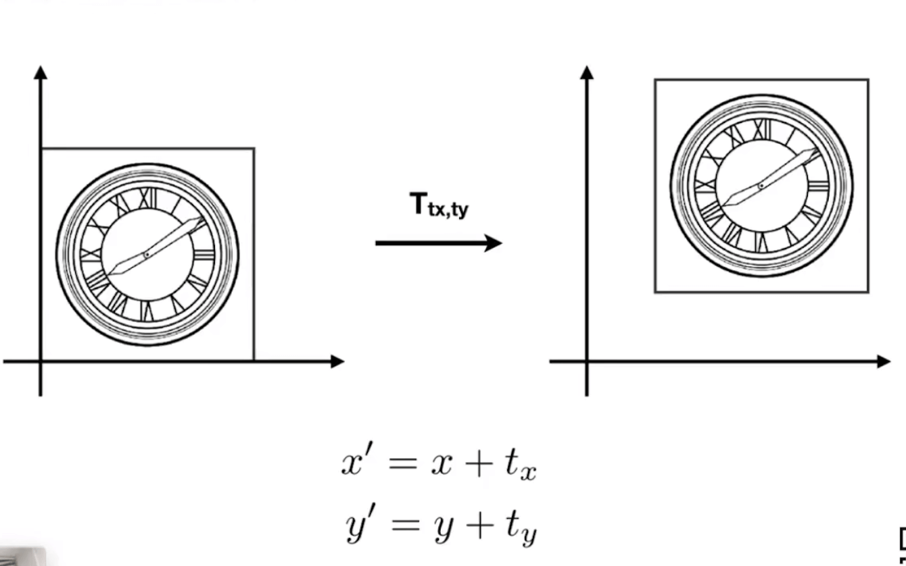

# [03]变换

- 什么是变换
- 二维变换: 旋转,缩放, 裁剪
- 齐次坐标
- 复合变换

## 什么是变换

变换可以分成两种类型的变换:

- 模型变换
- 视图变换

变换的应用:

- 光栅化, 三维世界转换为二维的图像
- 动画

## 二维的变换

- 矩阵和变换

### 缩放矩阵

### 反射矩阵

### 裁剪矩阵(切变)

### 旋转矩阵

默认情况下, 我们一般默认旋转是逆时针并且围绕原点(0,0)进行旋转.

我们发现, 旋转矩阵的逆就是一个旋转矩阵的转置:

在数学上, 如果一个矩阵的转置和它的逆相等, 我们就叫这种矩阵是一个正交矩阵. 

## 齐次坐标

### 线性变换的定义

任何能够写成这种形式的变换都可以叫做线性变换. 

### 从平移变换开始说起

平移变换是一种比较特殊的变换. 

我们考虑线性变换的书写方式, 发现无法写成线性变换的定义, 只能写成:

但是我们总希望不要特殊的去表示这个平移变换. 

那么, 有没有一种统一的办法来表示平移变换和其他上面说到的变换呢?

解决办法就是引入齐次坐标.

增加第三个坐标, 也就是所谓的`w-coordinate`:

- 2D point = (x, y, 1)T: 表示一个二维的点
- 2D vector = (x, y, 0)T: 表示一个二维的向量

用矩阵表示这个变换:

为什么向量是0,而点是1?

### 仿射变换

这种一个线性变换加上一个位移的操作, 我们统一的称为仿射变换, 用下面的齐次坐标来表示的话:

以仿射变换来重写上面提到的缩放, 旋转和平移:

齐次坐标能够方便的统一变换的表示, 额外的代价是引入了一个额外的坐标. 

### 逆变换

逆变换本质上就是逆矩阵

### 组合变换

表现为矩阵的乘法, 矩阵的乘法与顺序相关.

### 矩阵分解

在其他坐标下的旋转, 比如这里有个例子: 绕c进行旋转:

## 三维的变换

三维的变换其实类似于二维的变换. 

只是从二维的三阶矩阵变成了三维的四阶矩阵. 

一般来说, 三维点的坐标表示也是类似的:

对于是哪位变换来说, 我们一般看到的可能是一个4阶的矩阵, 比如三维的仿射(affine)变换:

## 三维变换矩阵

在三维的变换下, 点和向量的表示类似于二维中的表示:

这样表示的点, 就是用xyz分别除以w的值:

$$(x/w, y/w, z/w)$$

### 三维空间中的变换

类似于二维空间, 我们依然扩展了一个维度来表示三维空间中的变换:

在这个线性变换下, 我们是先应用线性变换再加上对应的平移量.

下面是简单的三维变换矩阵:

#### 三维旋转变换

三维空间中的旋转会比二维空间要复杂的多, 先考虑一些比较特殊的围绕轴旋转的坐标矩阵:

> 绕谁谁不变

注意观察绕y轴的矩阵, 其变换是相反的, 可以考虑两个向量的叉积关系.

对于任意的某个旋转, 我们可以分解为一些简单的旋转:

- 这三个角一般会被称为欧拉角
- 我们常常用航行的词来模拟: roll, pitch, yaw

在图形学中, 我们可以通过[罗德里德斯旋转公式](https://baike.baidu.com/item/%E7%BD%97%E5%BE%B7%E9%87%8C%E6%A0%BC%E6%97%8B%E8%BD%AC%E5%85%AC%E5%BC%8F/18878562?fr=aladdin)表示任意的旋转:

我们通过给定的旋转轴n和一个旋转角度α进行任意角度的旋转

而对于任意轴的旋转, 我们可以通过之前视角转换矩阵来进行位移.