# [04]投影

## viewing(观测) transformation

视图变换: 

- view(视图)/camera 变换
- Projection(投影) 变换
  - Orthographic(正交) projection
  - Perspective(透视) projection

### 视图变换

什么是视图变换?

如何拍好照片:
1. 找到一个位置(模型变换)
2. 找到一个视角(视图变换)
3. 拍照(投影变换)

对于图形学来说, 步骤是一模一样的. 

我们先来介绍视图变换.

视图变换的本质就是在放置照相机.

放置的关键:

1. 放置的位置
2. 朝向的位置
3. 向上的方向

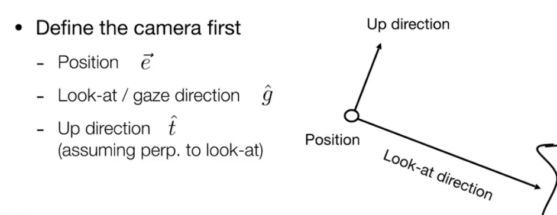

考虑到相对运动的原理, 我们可以考虑这样定义相机:

- 相机永远在原点, 并且上方为y轴, 并且观察-z轴的方向
- 所有物体的变化就会相对于相机进行变换. 

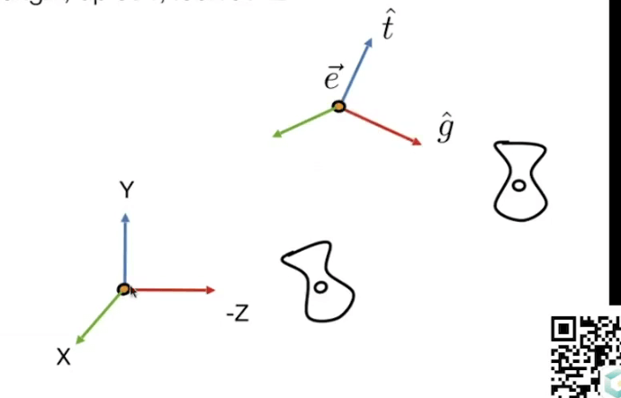

相机矩阵(Mview)怎么表示呢?

在数学上, 需要做这些事:

- 将相机所在的点e移动到原点
- 旋转g到到-Z轴
- 旋转t到Y轴
- 旋转`g x t`到X轴

由于轴旋转并不好表示, 而对应的逆变换更容易表示, 所以我们可以用其逆变换来写出这个相机矩阵.

并且由于旋转矩阵是正交矩阵, 所以旋转矩阵的逆就是旋转矩阵的转置矩阵. 

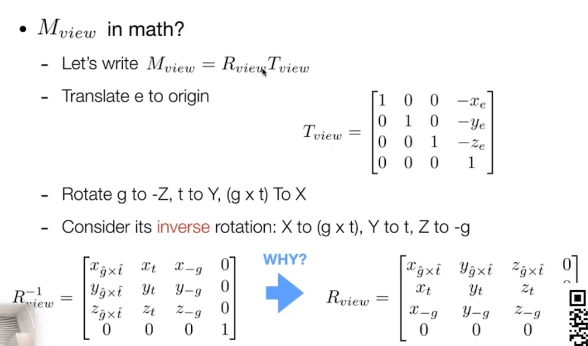

最终, 我们得到的矩阵, 就是所谓的视图矩阵.

为了保持相对位置一致, 所以其他的所有物体也都需要应用这个矩阵.

### 小结

- 所有的物体都要和相机一起变换
- 相机的位置之中会固定到一个约定的位置

模型变换和视图变换一般会放在一起叫做: `ModelView Transformation`, 模型视图变换.

## Projection Transformation 

图形学中的投影:

- 是一种3D到2D的转换
- 正交投影: 平行视角的投影, 不存在近大远小, 一般用在工程制图之中
- 透视投影: 更多应用在现实模拟, 存在近大远小.

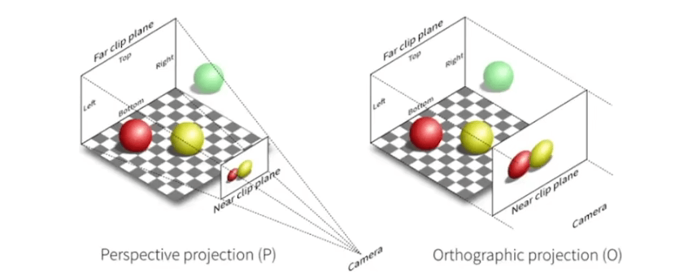

### 正交投影

正交投影的一种比较简单的换算:

- 将相机放在原地, 看向-Z轴, up朝向为Y轴
- 将Z轴坐标放弃
- 将所有的坐标缩放到[-1, 1]的范围中

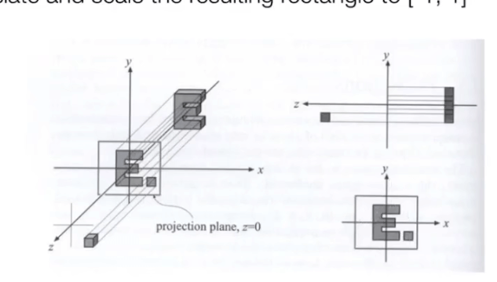

其中缩放到[-1, 1]中是一种约定.

上述是一种比较简单的正交投影计算. 但是一般话的正交投影定义大致如下:

定义一个立方体, 分别有左(l),右(r),上(t),下(b),前(f),后(n)6个面.

- 将立方体的中心变换到原点(平移变换)
- 将立方体缩放到一个"正规"(canonical)立方体中去

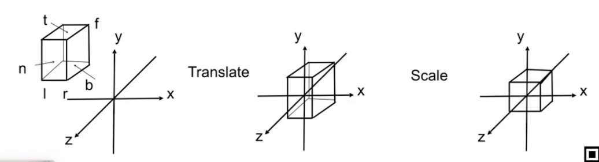

那么如何将上面的变换写成矩阵形式:

- 先将中心平移到原点, 然后进行缩放:

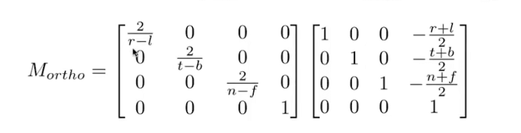

注意:

1. n要大于f
2. FYI: 这就是为什么OpenGL会采用左手坐标系

### 透视投影

#### 如何从正交投影推导透视投影

- 透视投影是在计算机图形学, 艺术和可视化系统中应用的最广泛的投影
- 遵循近大远小的规则
- 平行线不是平行的, 并且最终会汇集到一个点上

那么如何进行透视投影呢?

- 首先"挤压"视椎体到一个立方体中
- 然后建立一个正交投影的矩阵(我们已知正交投影的矩阵了)

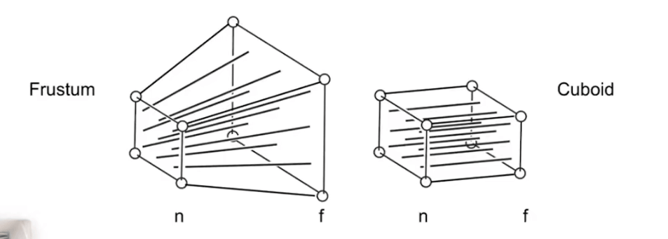

为了寻找到一个变换, 能够将点(x', y', z')和(x, y, z)联系起来:

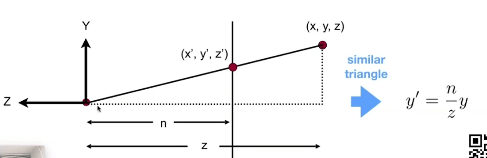

通过相似的运算, 我们可以得到下面的关系:

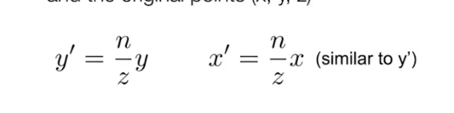

通过齐次坐标运算:

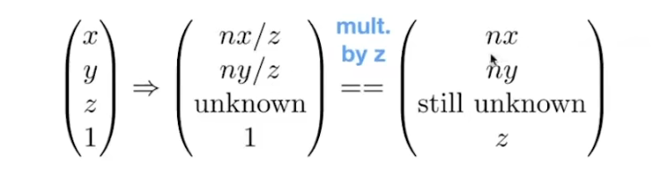

也就是说, 存在一个矩阵, 使得:

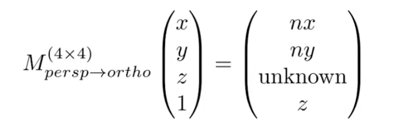

根据已有的信息, 我们可以推断出这个矩阵M的部分参数:

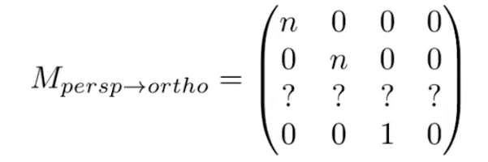

目前就还有一行的未知量了.

通过近平面和远平面上的性质, 可以推断剩余的位置量:

- 任何在近平面上的点都没有发生变化, 根据这个性质, 我们可以得出:

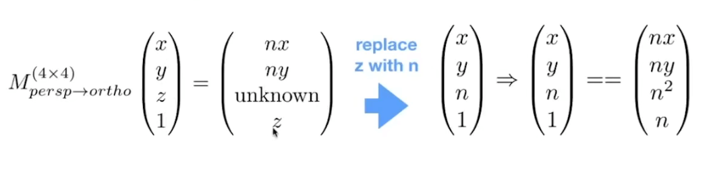

所以, 剩余未知量中的前两个必然是0:

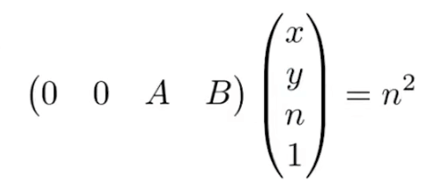

另外, 远平面中的中心点也没有发生辩护, 也就是说:

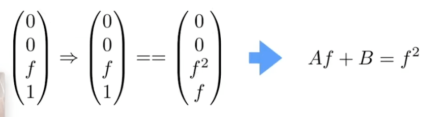

这样依赖, 剩余的两个位置量也能解决了:

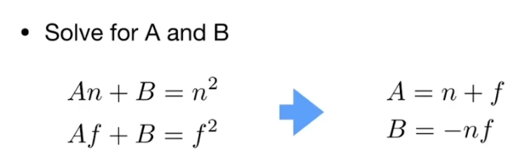

最终, 我们的透视投影到正交投影的变换矩阵就完成了.

反过来说, 我们已经知道了正交投影的矩阵表示, 那么透视投影也就推导出来了.

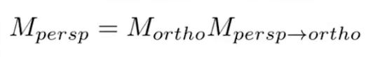

#### 从定义推导透视投影

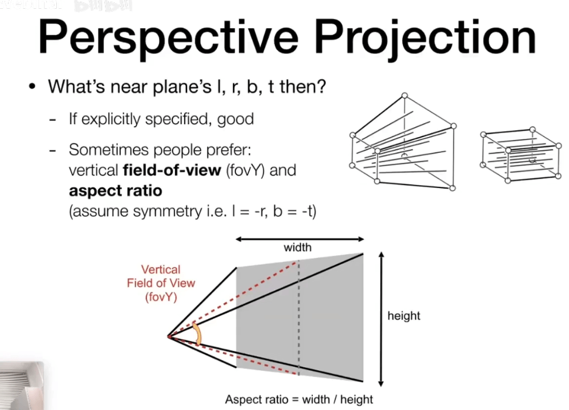

透视投影的几个参数的定义:

- 远平面, 近平面
- 宽高比
- 可视角

那么如何从宽高比和可视角去定义视椎体:

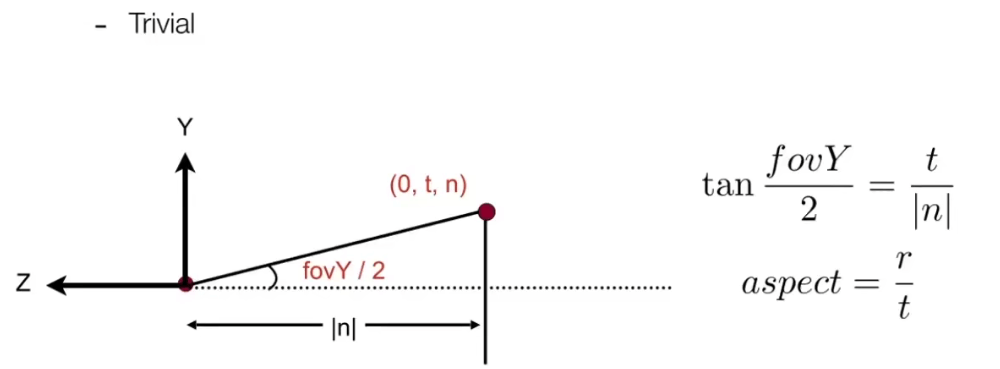

#### MVP

上述介绍的过程, 常被称为MVP, 也就是:

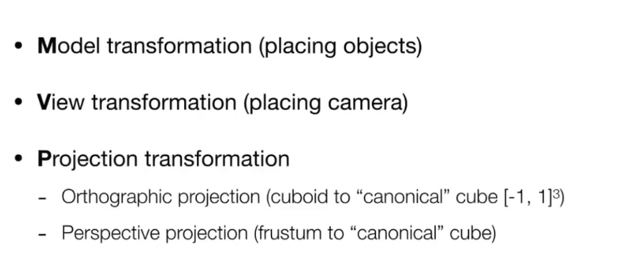

在进行完MVP之后, 下一步是什么呢?
