# [05]光栅化-三角形

## 什么是光栅

在完成MVP之后, 就是把物体绘制到`屏幕`上.

在图形学中, 所谓的屏幕, 就是指:

- 一个像素的数组
- 所谓的分辨率就是指数组的大小
- 屏幕是一个典型的光栅显示器

概念解释:

- Raster, 光栅, 就是德语中屏幕的意思
- Rasterize, 光栅化, 就是指绘制到屏幕上的意思
- Pixel(FYI, picture elemnet的缩写)
  - 可以理解为一个小的正方形, 每个像素表示一个颜色
  - 颜色可以从(rgb)中进行获取

## 定义屏幕空间

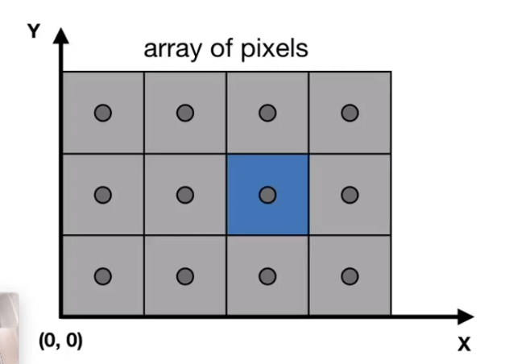

- 一般我们认为, 屏幕的左下角是原点, 向右为x轴, 向上为y轴
- 可以用`(x, y)`的整数组来表示一个像素的具体位置
- 像素的中心可以定义为`(x+0.5, y+0.5)`
  
## 坐标的映射

所谓的光栅化的过程, 就是我们将空间中的`(0,1)`范围内的物体映射到屏幕上的过程.

- irrelevant to z: 剥离z轴的影响
- 转换xy平面到`[0, width]` 和 `[0, height]`
- 视角变换矩阵如下:

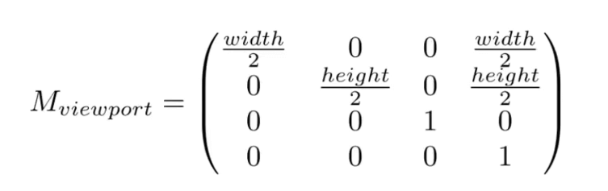

## 绘制机器和显示设备

除了我们的显示器外, 还有很多绘制机器, 比如激光雕刻, CNC绘制机器等.

### 示波器

CRT屏幕

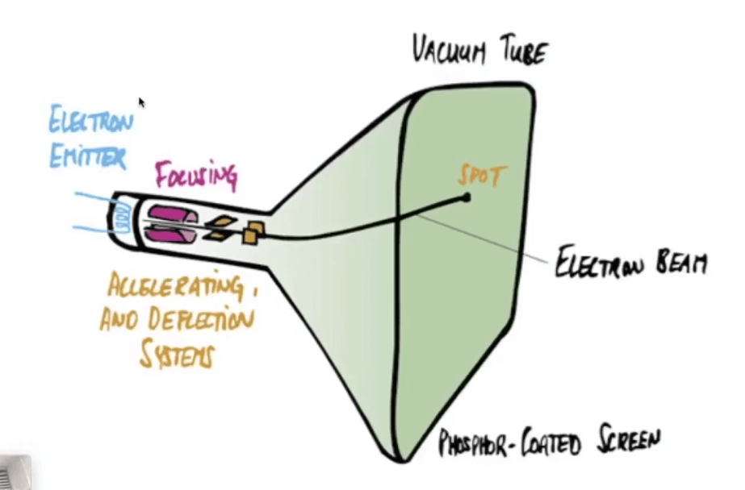

- 隔行扫描

### 显示器

LCD: 液晶显示器

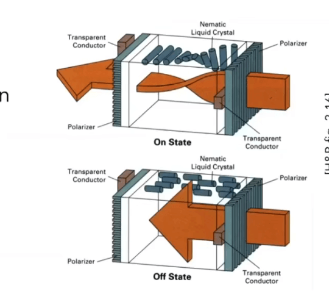

## 三角形

- 三角形是最基础的三角形
- 任何其他的多边形都可以用三角形表示
- 给定三个点组成的三角形其内部一定是平面的
- 三角形的内外定义是非常清晰的
- 只要定义顶点的属性, 可以方便的计算插值和渐变

### 三角形的光栅化步骤

1. 进行采样

> 采样: 将一个函数离散化的过程

我们这里的采样指的是利用像素中心进行采样. 

定义二元函数:

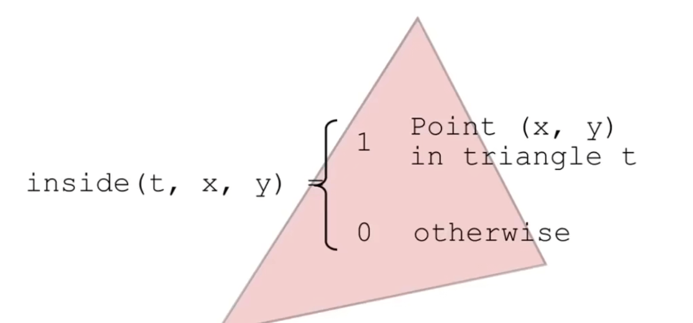

遍历整个平面, 收集所有在三角形内部的点:

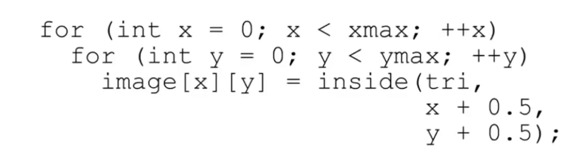

这样就能获取到所有在三角形内部的点了.

通过判断点与三角形的三条边的叉积的符号是否相同就可以判断点是否在三角形的内部.

对于刚好落在三角形边上的点, 我们可以不做处理, 也可以自己定义这些规则.

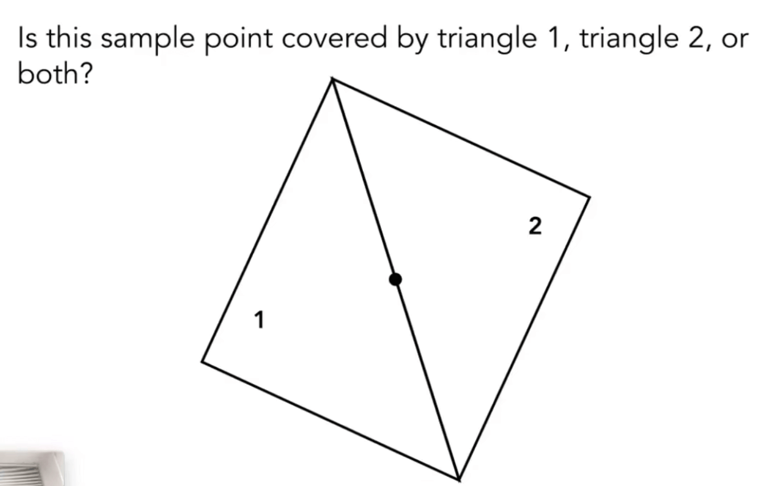

2. 优化: 判断三角形的包围盒, 然后遍历包围盒(aabb盒)中的像素而不是整个屏幕的像素

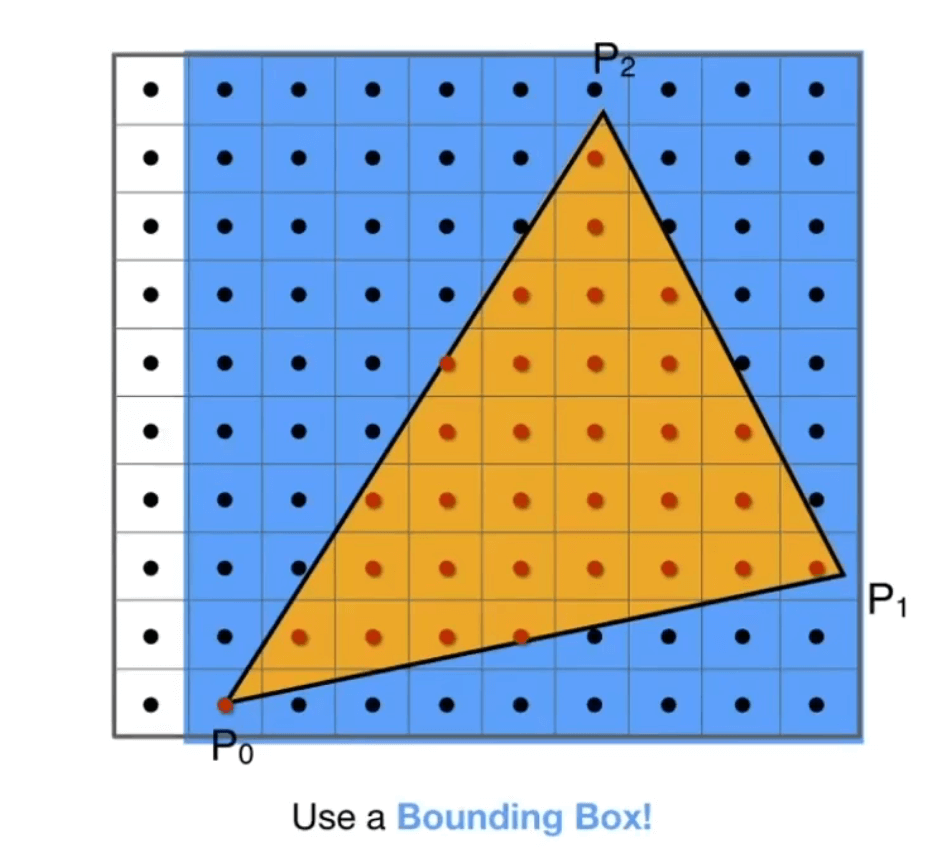

另外还有一种优化方式: 每行都判断一次边界

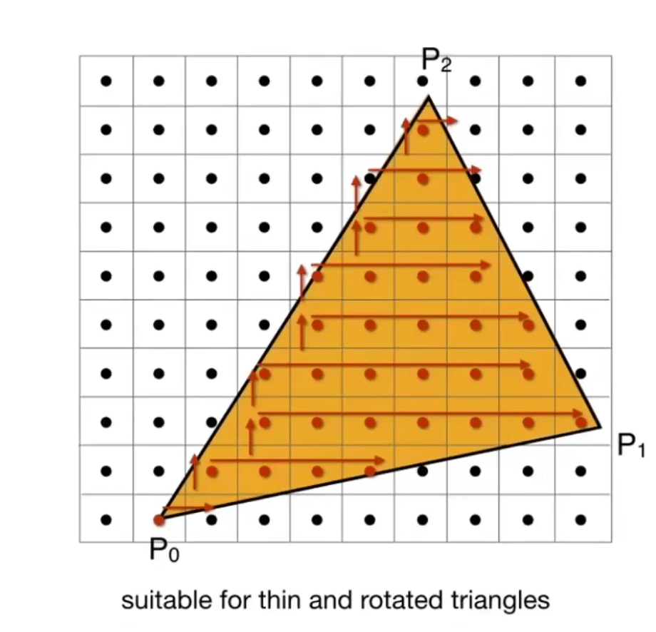

如果一个三角形旋转过或者是个非常锐利的三角形,就比较适合使用这种优化方式.

## 实际上的光栅化

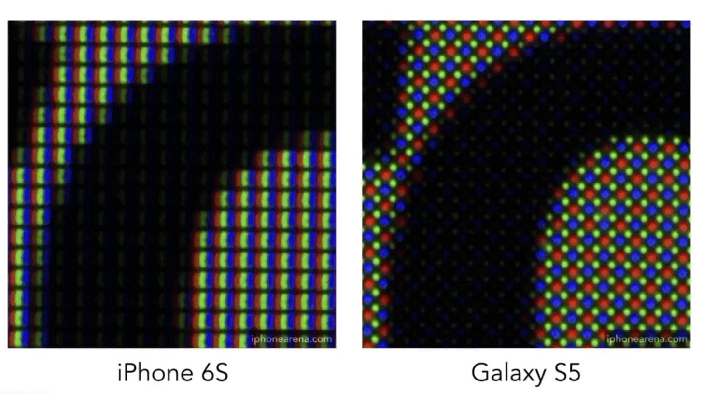

- 绿色的排布会多一点, 因为人眼对绿色更加敏感.

## 锯齿

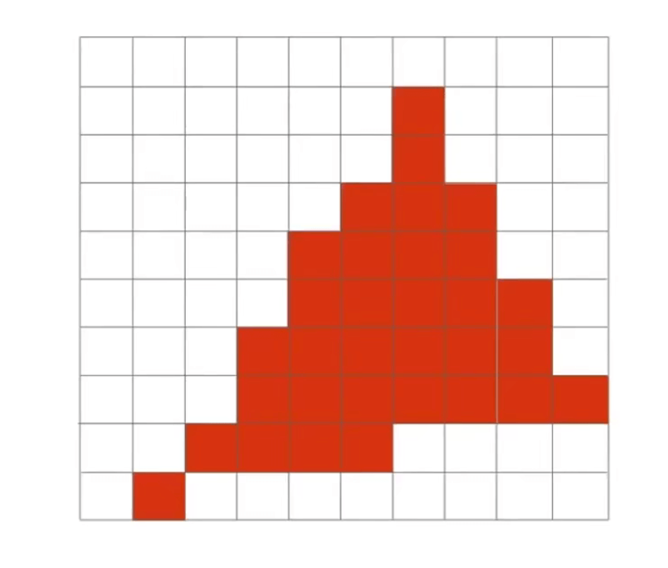

我们填充掉之前获取到的像素点, 会发现一个崎岖的几何图案.

这也叫所谓的走样, 也叫作锯齿.

