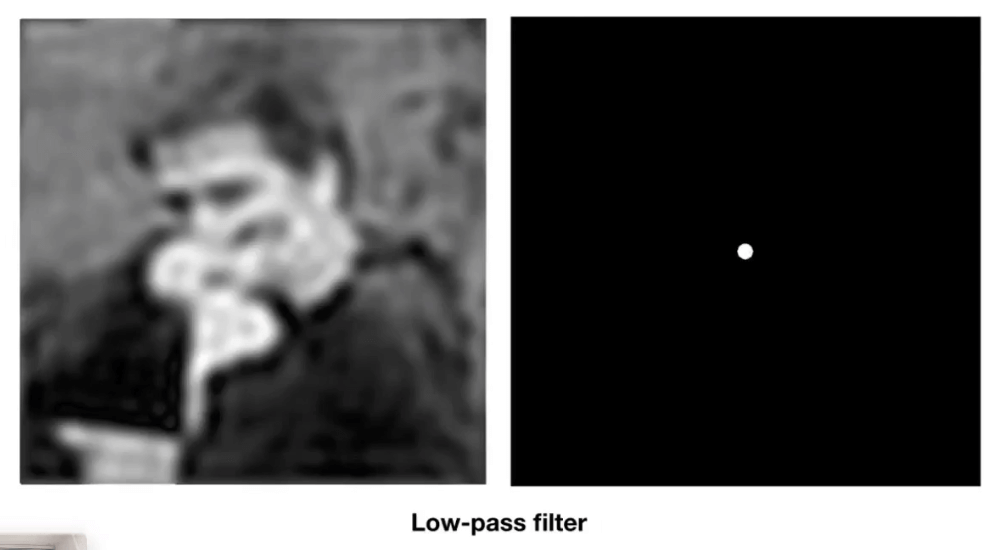
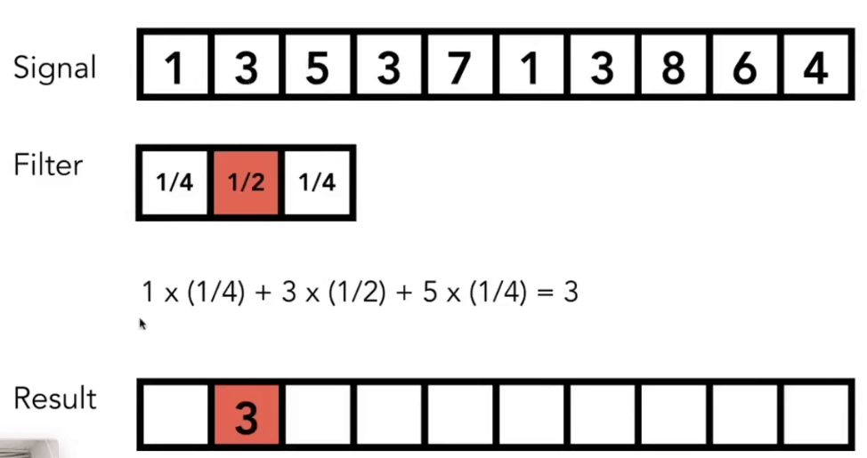
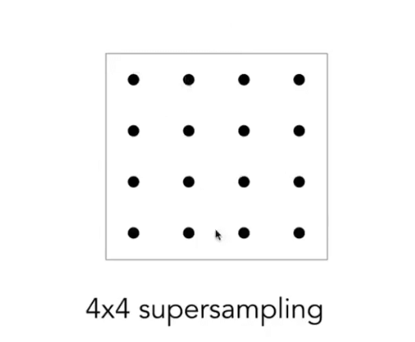

# [06]光栅化-反走样&深度缓冲

之前说到了, 在光栅化的过程中, 点阵像素不能很好的精确的表示图像的形状, 而会出现锯齿. 

在图形学中, 为了解决这个问题的方法就是抗锯齿, 或者叫反走样. 

## Aliasing (走样)

- 采样: 光栅化的过程就是一种采样, 采样有很多种, 针对画面采样的, 比如照片; 针对时间采样, 比如动画; 针对频率采样, 比如音乐等等.

采样是广泛存在的, 采样产生的问题(sampling artifacts), 也是广泛存在的

> artifacts: 瑕疵, 在图形学中, 泛指错误, 缺陷, 不合理的地方

采样产生的问题:

- 锯齿: 图形边缘不平滑

- 摩尔纹: 采样的时候跳过了奇数行和奇数列

- 车轮效应(Wagon Wheel Illusion): 因为采样问题, 旋转像是在向相反的方向进行(人眼的采样问题)

- 其他...

**采样问题的本质: 采样速度更不上信号的变化速度**

信号的变化速度, 我们就可以用**频率**来描述它.

### 反走样方法: 采样之前进行 模糊(滤波) 操作

以之前的三角形采样为例:

在采样之前, 对三角形进行模糊处理, 然后在对取值进行范围化的处理.

注意, 不能先采样, 然后在进行模糊处理. 

为什么呢

## 频域

先来看经典的正弦和余弦函数:

通过调整其系数, 可以得到频率不同的函数.

我们定义这个就是所谓的频率, 也就是数据变化的快慢程度. 

依据傅里叶级数展开, 任何一个周期函数, 都可以用正弦和余弦函数进行分解.

### 傅里叶变换(Fourier Transform)

比如这里波形的展开

傅里叶级数展开和傅里叶变换是精密相关的.

所谓的傅里叶变换, 就是说: 给定任何一个函数, 我都可以通过一个复杂的操作, 将其装换为另一个函数, 同样, 也可以通过逆变换, 变回来:

所谓的傅里叶变换, 就是把函数变为不同频率的段.

### 高频率为什么需要快速采样

可以看到, 在相同频率的采样中, 频率越高的函数, 采样的精准度是极速的下降的. 

当采用的评率远低于信号变化的频率的时候, 就是发生走样.

**所谓的走样, 就是指, 在一定的采样频率下, 对于两种截然不同的频率变化, 得到的数据是一样的, 我们称之为发生了走样.**

滤波: 对于给定的信号, 去掉一些特定的频率, 我们称之为滤波.

## 时域

傅里叶变换可以把一个函数从时域变换到频域

这是将图片分析到频域上的例子.

中心为低频区域, 边缘为高频区域, 对于信息的变化, 则通过亮度来表示.

基本上来说, 自然图片都是类似的, 基本都集中的低频区域.

这里的频率的高低, 是表示颜色变化的剧烈程度.

对于这张图来说, 我们就认为整个图像会作为一个周期.

一般来说, 图像的左边界和右边界会产生剧烈的而变化, 因此产生了垂直和水平的额两条亮先.

## 滤波

以上面为例: 

加入我们将低频的信息通过滤波过滤, 然后再复原到图像, 我们会发现整个图像好像还是有意义的. 

这种滤波就叫**高通滤波(high-pass filter): 只剩下高频信息的滤波.**

为什么? 因此边界一般就是信息量高的地方, 也就是我们的高频信号. 

而如果我们只留下低频信息:

我们会发现图像变得非常的模糊.

这种滤波, 就做**低通滤波(low-pass filter)**

再来看, 如果我们只留下其中一段频率的信息, 我们会得到什么:

结果是一段不怎么清晰的边界.

这里的结果应该是可以理解的. 

所以, 可以理解的是, 滤波一定程度上等于平均(模糊滤波)

## 卷积

所谓的滤波, 就是去掉一定频率的信息.

滤波也等于**卷积**. 

所谓的卷积操作, 就是将信号通过滤波得到一定的结果. 

将信号与滤波器进行点乘, 得到一个新的结果. 

这个过程就是卷积. 

### 卷积定理

**时域上, 如果我想对两个信号进行卷积, 实际上就是对两个信号的频域的乘积.**

同样的, 频域上的乘积也对应了时域上的卷积

比如这是一个模糊的卷积, 表示了 时域的卷积和频域的乘积的对应关系.

卷积核的频率可以理解为卷积矩阵的大小.

## 采样 = 频域上的内容

- b是a在频域上的表示
- a和c(这是一个冲击函数)在时域上相乘得到一些离散的点, 得到e
- 时域上的乘积对应频域上的卷积, 也就是说, b和d的卷积就是f
- 我们发现, 时域上的采样, 就是在频域上复制的相同的频率

所以, 所谓的采样, 就是在重复一个原始型号的频谱.

采样的不同间隔, 会影响频谱的复制粘贴:

这种情况, 我们就说采样发生了走样. 

## 反走样

如何解决走样错误?

方法一: 增加采样频率

- 本质上是在增加了频域中的语句
- 使用更高分辨率的显示器, 传感器以及帧缓冲.
- 但是代价可能会非常高

方法二: 抗锯齿

- 在重复频域之前使用傅里叶变换去过滤掉一些高频的频率信号.

那么现在的问题就是如何将三角形模糊化呢?

简单的, 可以使用一个卷积核去处理一个图像. 

解决方案：

- 用1像素框模糊卷积f（x，y）

    - 调用：卷积=过滤=平均

- 然后在每个像素中心采样

### Antialiasing By Supersampling(超采样抗锯齿, MSAA)

超采样, 意思是说, 我们将一个像素划分为4x4的像素矩阵, 然后对每个像素进行卷积平均计算.

比如, 一个三角形覆盖了若干个三角形.

那么进行2x2的超采样, 大致如下:

然后针对每个像素考虑像素中被覆盖的数量, 然后求得平均值. 最终得到的可能是:

通过MSAA可以对像素进行模糊.

经过MSAA, 我们得到一个模糊的结果:

## 那么, 代价是什么

引入反走样, 增加了计算量

## 其他抗锯齿方案

- FXAA(Fast Approximate AA), 快速近似抗锯齿

先得到一个有锯齿的图像, 然后找到边界, 在模糊化边界

- TAA(Temporal AA), 使用相邻两帧类似的原理, 复用上一帧抗锯齿的结果, 减少计算量

## Super resolution 超分辨率

- 从低分辨率转换搞高分辨率
- 存在没有足够的采样的问题
- 通过dlss(Deep Learning Super Sampling), 猜测像素, 补充细节

## 深度缓冲

在实际的场景中, 会有很多三角形, 并且会存在遮挡的问题. 

这就需要`z-buffer`深度缓冲来解决.

### 画家算法

物体在三维场景中存在绘制的先后顺序问题. 

简单的方法, 从远处的物体依次绘制到近处. 然后近处的物体会覆盖远处的物体.

这就是所谓的画家算法.

画家算法在一定程度上是可以解决问题的. 我们将所有物体进行排序(O(nlogn)), 然后依次绘制. 

但是画家算法不能解决一些深度问题, 比如下面这种情况:

这样, 我们就无法定义物体的深度序列了.

为了解决这个问题, 我们引入了`Z-Buffer`.

### Z-Buffer

我们没法对某个物体进行深度的判断, 但是我们可以针对每个像素进行深度判断.

所以我们需要一个附加的缓冲区来缓存深度信息

- 使用一个帧缓存来存储颜色信息
- 使用深度缓存来存储深度信息

> 不同于之前的z轴的定义, 我们为了方便计算, 定义z轴值小的离我们近, 值大的离我们远.

我们用颜色的深浅表示一个像素离我们的距离:

我们根据深度的值, 可以判断绘制的覆盖关系.

上图就是创建深度缓存的逻辑

#### 复杂度

- 对于n个三角形, 复杂度是`O(n)`
- 为什么这里只需要线性的时间? 因为这里没有涉及排序, 只是记录的对应的深度数据.

另外的:

- 使用`z-buffer`不需要考虑绘制的顺序.
- 对于MSAA, 深度缓存需要对每个采样点进行计算
- Z-buffer 处理不了透明物体