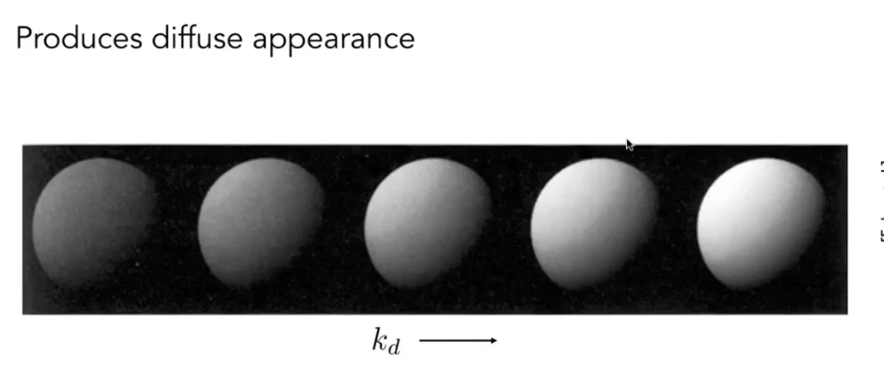
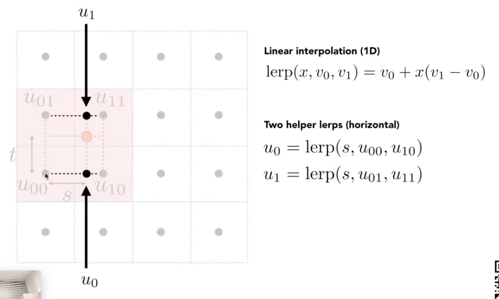

# [07]渲染-光照,着色和渲染管线

到目前位置, 我们完成了矩阵, 视角, 相机, 光栅化和采样的一些知识

下面我们就要处理着色的概念

##  Shading 着色

着色就是: 引入明暗或者颜色的概念.

对于图形学, 就是对不同的物体应用不同的材质的过程. 

这里有一个最简单的着色模型(Blinn-Phong Reflectance Model)

我们可以发现几个特点:

- 有一个地方是有一个高光的
- 其他的地方有一个缓慢的渐变

## 光照

### 关于光照的前置定义

针对某一个点进行光照的考虑.

其中, 

- v: 观测方向
- n: 平面的法线
- l: 光照方向
- 表面参数(color, shininess)

> 注意, 我们在着色中不考虑阴影, shading ≠ shadow

### 漫反射 diffuse reflection

- 漫反射

- 光线和反射平面的角度决定了光线的强度

我们可以根据`Lambert's cosine Law`定律计算光线强度. 

假设, 我们有一个点光源, 点光源的能量会集中在一个球形的平面上, 并且会随着距离点光源的距离变远, 单位面的光源能量会衰减, 这就是`Light Falloff`

单位面积接受到的能量和强度成平方反比

这样我们就可以来计算漫反射的光源的能力信息了:

而物体表面的颜色的表现, 则取决于材料吸收光的程度

> 漫反射和观测方向无关, 这可以从图中的公式中可以看出.

### 高光 Specular Term

当我们的观察视角接近入射角的反射的时候, 视角上就能看到高光, 也就是所谓的高光. 

我们可以通过点乘判断h和n是否接近. 

- `ks`通常被称为**高光系数**
- 指数`p`是为了将高光收敛到一定的区间:

一般, 在`Blinn-Phone`模型下, p一般会取100到200, 下面是该模型在不同系数下的渲染表现:

### 环境光照 Ambient Term

我们假设任何一个点接受到的环境光的强度是相同的, 从而得到一个近似的环境光.

### Blinn-Phong Reflection Model

结合环境光, 漫反射以及高光, 我们就得到了`Blinn-Phong`反射模型:

## 着色频率

着色是以某个平面所谓着色的单元, 也可以在每个三角形面上进行一次着色, 或者在每个顶点上进行一次着色计算.

- Flat shading: 平面着色, 三角形面作为平面, 每个面计算其发现, 从而着色, 结果并不会很光滑.

- Gouraud shading: 针对每个顶点进行法线的计算, 然后对三角形内部进行插值, 从而进行着色.

- Phong shading: 对每个像素进行发现的计算, 然后进行着色(不是Blinn-Phong模型)

三种渲染模式的效果区别:

### 法线的计算

如何得到一个顶点的法线? 

任何一个顶点周围一定有若干个三角形, 那么该顶点的发现, 就是器周围三角形的法线的平均值.

此外, 我们可以根据周围三角形的面积来进行过加权平均, 就能得到一个顶点的法线.

然后对两个顶点之间的像素进行发现的差值

## 实时渲染管线

将上述的所有内容合并起来(光照, 着色, 模型), 就是实时渲染管线.

1. 三维坐标点
2. 投影计算
3. 形成三角形
4. 通过光栅化绘制到平面上
5. 针对每个像素进行着色和计算
6. 显示到屏幕上

这些操作都是在硬件中实现的. 

三个大的步骤:

1. 顶点计算
2. 光栅化
3. 着色

### 着色器程序 shader programes

`shader`意思是能在硬件上执行的语言. 比如下面是opengl下的glsl语言:

`shader`会分为顶点着色器和片段着色器

### 显卡: 渲染管线的实现

GPU本身是一个高度集成的并行计算器. 所谓的核心数量就是可以并行计算的数量. 

## 纹理映射 Texture Mapping

我们希望能有一种方法, 对于球上的任意的一个点, 去定义它自己的一些属性和颜色.

这就是引入纹理映射的基本思路. 

首先, 需要定义一个物体表面的点:

任何三维物体的表面都是二维的. 

所以, 纹理的本质就是一张二维的图片, 然后通过映射到模型的表面上.

有两种方法:

- 通过三维创作者的创作, 默认我们是知道这种映射关系的
- 通过自动的计算, 通过一些手段进行映射(参数化)

### 纹理坐标

一般我们会用uv表示一个纹理上的坐标

用不同的颜色来表示纹理的坐标的话, 大概是图上那样的.

默认`uv`都在0到1之内

无缝纹理: tiled textures 的设计是很难的

当我们已经知道了三角形顶点的uv坐标, 那么对于三角形内部的uv值应该如何计算呢?

## 重心坐标 Barycentric Coordinates

为什么需要进行插值:

- 指定顶点的值
- 在三角形的内部获得平滑变换的值

我们想要对什么对象进行插值:

- 纹理坐标, 颜色, 法向量

如何进行插值:

- 通过**重心坐标**进行计算

重心坐标是定义在三角形内部的一个点, 在三角形内部, 任意一个点`x,y`都可以用三角形的三个顶点线性表示, 并且, 三个参数之和为1. 其中, 这三个参数都大于0.

在这种定义下, 三个顶点的表示是这样的:

另外两个顶点的表示类似. 

重心坐标的计算可以通过下面的方式任意一个点的重心坐标:

更加简化的,利用坐标计算的公式如下:

通过这个定义, 我们可以得到一个特殊的点, 也就是三角形的重心:

所以, 我们可以利用重心坐标进行插值. 

但是重心坐标有个问题, 即在坐标的投影变换后, 其重心坐标会发生变化.

如果我们想要插值一些三维空间中的物体, 我们只能在具体的三维坐标中计算重心坐标. 

而不是在投影后的物体中进行重心坐标计算. 

### 纹理是如何应用到渲染中的

屏幕上的采样点,都有自己的坐标位置. 我们可以通过插值获取到这个点的差值坐标`u,v`, 然后可以在纹理上查询对应`u,v`的颜色值. 这样就将纹理和物体贴合在一起了.

## 纹理映射的问题

### 问题1: 纹理放大 Texture Manification

当纹理太小的时候, 纹理映射到物体上就会被放大.

- 纹理上的元素叫做纹理元素, 或者纹素(textel)

如果像素小于纹素, 会进行四舍五入得到一个模糊的纹理图像, 比如上图中的第一个纹理.

解决方法之一: 双线性插值(Bilinear Interpolation)

比如在这里, 我们不是直接获取其最近的一个像素坐标, 而是通过临近的四个像素点, 通过点和四个像素的距离, 进行**线性插值**, 计算出纹素坐标对应的像素坐标.

- 首先横向进行插值计算出u1, u0
- 然后使用u1,u0纵向进行插值得到我们的纹素值.

更加复杂的 Bicubic 双向三次插值, 取周围16个点,然后通过更加复杂的非线性计算

### 问题2: 纹理过于大了 Texture Magnification (hard case)

当纹理过于大的时候,就会发生图中的这种情况, 也就是所谓的走样(摩尔纹). 

因为近大远小的问题, 越远的像素, 覆盖的纹理区域就越大. 

从而出现了锯齿状的效果. 因此我们可以用MSAA之类的抗锯齿方法, 来处理这种走样.

另外的解决思路是, 就是跳过采样, 而直接得到一个区域中的平均值的思路.

实际上, 纹理过大是一种经典的**点查询和区域查询的问题**. 

#### Mipmap: 允许我们进行**快速, 近似, 正方形**的范围查询

mipmap本质就是纹理分层

在图形学界, 也叫图像金字塔.

mipmap的问题在于会引入额外的存储空间. 通过求等比数列, 可以知道大致多了`1/3`的空间.

可以通过映射到纹理上的距离的比较, 可以得到近似的mipmap level

解决上面的问题, 主要我们**通过查询某块区域的对应mipmap中刚好为一个像素的层级所在的像素颜色, 就能快速的获取该区域的平均像素是多少**. 

基本上就是, 离我们近的, 需要更低的mipmap层级, 而离我们远的(单个像素代表更多的uv区域), 需要在高的mipmap层级. 

如果, 我们需要在中间的非整数层mipmap进行查询, 那么需要进行插值, 也就是在D层和D+1层的数据进行香型插值. 

这是一种三线性插值(对于上面提到的双线性插值而言). 

当应用到之前的场景是, 我们发现mipmap过于模糊了. 

这是因为mipmap只能用于方块下的线性查值. 

那么有其他的方法吗. 

#### 各向异性过滤 Anisotropic Filtering

对于原来的图形区域来说, 区域压缩的图像不一定是一个正方形

各项异性过滤本质上就是可以查询一些矩形的区域. 而EWA过滤, 则是查询一个圆形区域.

各项异性过滤的开销是原本的三倍, 生成的图像叫做`Ripmaps`.

## 纹理的应用

### 环境光照

我们可以对每个方块进行渲染, 也可以逐像素渲染. 然后也可以渲染对应的问题.

这里主要要介绍环境光照, 也就是最后一张图. 

纹理本质上就是一张图.

从计算机的本质来说, 纹理是一段连续的二维数据, 可以进行数据的查询. 

因此纹理还能用来做更多除了贴图之外的应用, 比如环境光照.

这里的茶壶叫做犹他茶壶, 是一个经典的图形学模型. 

对于环境光, 我们都是假设环境光都是来自无限远的地方, 所以基本上在一个环境下, 我们都认为环境光是一样的(只记录它的方向信息).

将环境光描述到纹理上, 可以实现一些反射的效果. 

我们将环境图像展开, 会有比较明显的扭曲问题. 

所以, 我们可以将其展开到一个盒子上.

我们一般叫这种包围盒叫做CubeMap.

### 凹凸贴图 & 法线贴图

纹理还可以定义一个表面相对高度是多少。也就是可以做一些凹凸的贴图。 

法线贴图也是可以定义一些复杂的问题: 将任意一个像素的法线进行一定的扰动

我们通过高度的变化来重新计算其法线的变化.

那么如何去计算法线的计算呢?

- 首先考虑一个一维上的高度的变换.
- 计算其在p点的其切线(求导)
- 与切线垂直的就是对应的法线(将切线逆时针旋转90度)

而在实际的场景中, 我们一般得到的是二维的切图.

- 一样的, 我们能得到对应的梯度(二维求导)
- 计算对应的切线并且求点积

注意, 这里的计算都是本地坐标系. 在实际的场景中, 需要转换到世界坐标系中.

### 位移贴图

现代化的图形学中, 还有位移贴图.

在位移贴图中, 会真正去移动顶点的位置. 凹凸贴图实际上就没有移动顶点位置, 所以在边缘位置就看不到凹凸效果.

而唯一贴图则存在贴图的精细程度问题. 

> DX9有一种动态精细度的技术.

### 三维的纹理(空间纹理)

定义空间中任意一个点的值.

通过一个噪声函数, 给定空间中任意一个点, 计算出该点所在的位置的纹理. 

上图就是一个典型的图形学例子.

### 阴影纹理

纹理还可以用来存储一些已经记录好的信息. 

比如, 一些阴影的计算结果可以保存纹理中.

### 体渲染

三维空间的体渲染也可以看做一种纹理

