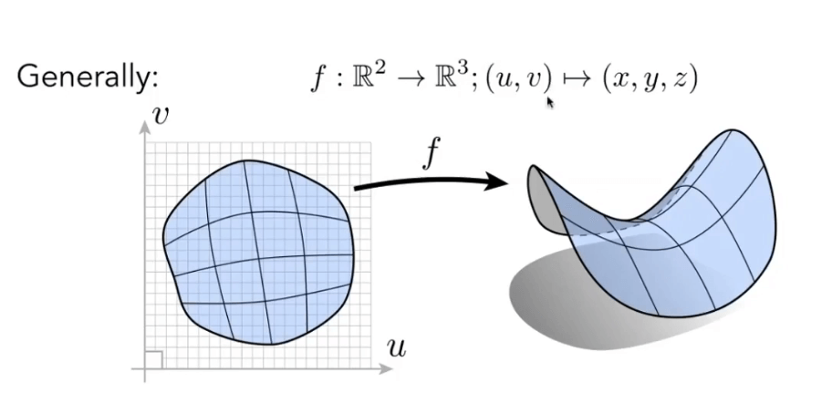
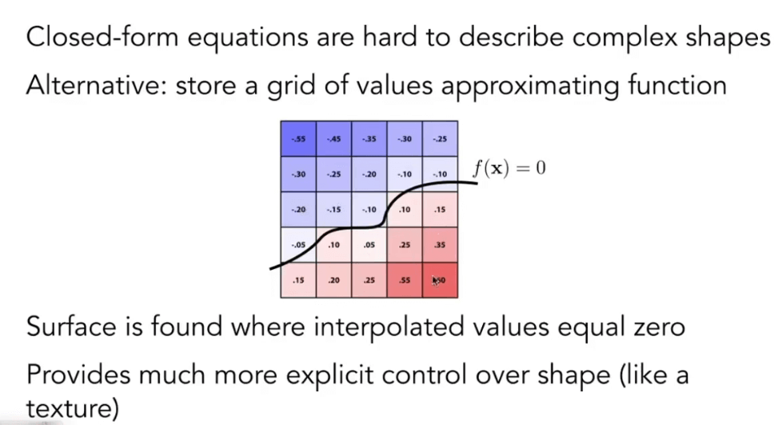
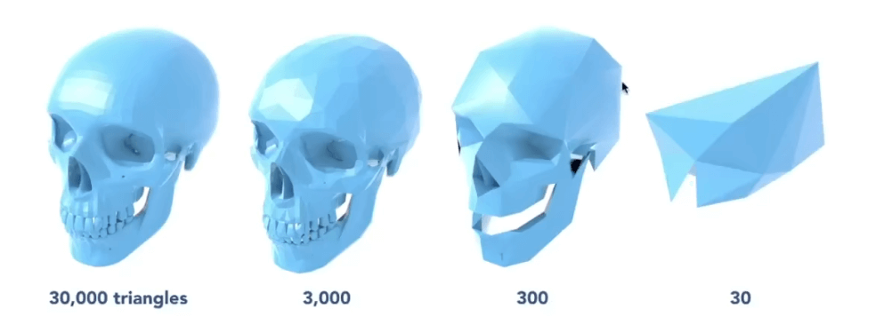

# [10-12]几何-曲线和曲面

- 很多非规则的光滑的曲面
- 复杂的机械结构
- 布面材料, 纤维材料如何表示
- 水滴等材料的表示
- 巨大几何体(比如城市)如何表示
- 毛发的表达
- 细胞, 微观建模
- 植物, 树枝的建模表达

## 几何的分类

### 隐式几何

- 满足特定关系的点, 并不同告诉你具体的点

E.g: 所有满足`x^2+y^2+z^2=1`表面上的点

更通用的说法: 只要点满足 `f(x,y,z) = 0`, 就在这个几何上.

隐式几何的问题, 在于无法直观的找到所有几何上的点, 但是好处在于可以很简单的判断某个点是否在该物体上/内/外.

### 显示几何

所有的点是直接给出的或者是通过参数映射得到的.

在这个例子, 就是说给定所有的uv坐标, 能得到所有的`x,y,z`

比如这个就是一个显示的几何.

对于显式的几何, 好处在于能很简单的得到有哪些点在几何上, 但是很难判断某个点是在几何上/内/外

## 隐式几何的表示

这里有几个例子:

可以看到隐式比较难以表示复杂的几何体.

### Constructive Solid Geometry(Implicit)

有一种几何表示的方法(CSG): 通过集合体的逻辑运算去定义一些复杂的几何体.

比如这个例子:

我们可以通过对简单几何体的逻辑组合形成复杂的运算.

### Distance Functions(Implicit)

对于任何一个几何, 我们都不直接去描述它的表面, 而是描述一个点到它表面上的任何一个点的最小距离, 就是距离函数(Distance Functions) 

这个距离可以是正的也可以是负的. 两个距离函数可以做blend, 这样就把两个物体融合到一起了.

比如这个融合的过程就是通过距离函数实现的.

这是运用距离函数的一个例子.

假设有个物体挡住了左边的三分之一, 另一个物体B挡住了左边的三分之二. 而我们想要获得A变换到B的中间态.

如果进行简单的线性融合, 我们是无法得到中间态的. B会遮盖掉A的部分.

所以我们先要得到A的距离函数(`SDF(A)`)和到B的距离函数(`SDF(B)`). 这样, 再对距离函数进行`blend`. 的就能到中间态了.

距离函数可以得到很复杂的几何形体.

距离函数`blend`得到的函数, 在通过`f(x)=0`的时候就是某种几何体的表面.

### Level Set Methods

距离函数也不一定要以式子的形式表现, 也可以像上图这样显示为表格.

这就是水平集.

水平集不一定是二维的, 三维也是可以的.

### 分型 Fractals

每个形状的小分支都是自身形状的衍生.

### 小结

优点:

- 描述非常的紧凑
- 比较容易判断和查询
- 对于光线追踪来说比较容易
- 对于几点的形状很合适用来描述

缺点:

- 比较难以描述复杂的几何体

## 显式几何的表示

显示几何有很多的表示方式

### 点云

将物体表面用点表示， 只要点足够细，就可以忽略点与点之间的缝隙。

图形学中有很多研究是将点云转换为三角形面。

### 多边形面 Polygon Mesh

用三角形名描述一些几何物体

####  `.obj`模型文件格式(The Wavefront Object Format)

## 曲线 Curves

### 贝塞尔曲线

用一系列的控制点去定义一个曲线

- 给定任意的一些列控制点
- 在某一个时间t上计算对应线段上的点

这也是一种显式的几何表示(通过参数t来进行表示)

通过t的平滑移动, 就能得到一个平滑的曲线. 

上面的栗子是一个二阶贝塞尔曲线, 如果给定4个控制点, 则可以计算出三阶的贝塞尔曲线

更高阶的也是如此递推.

显式的将贝塞尔曲线的表达式写出来, 大概是这样:

递推到更高阶的贝塞尔曲线公式, 我们可以得到一个多项式, 表达如下:

这个多项式是一个"伯恩斯坦多项式".

根据这些特定, 我们可以得到一些不错的性质.

比如说, 我们可以在三维空间中得到一个贝塞尔曲线.

#### 伯恩斯坦多项式

- 所有的交点坐标加起来为1
- 多项式左右是对称的

#### 贝塞尔曲线的性质

- b(0)=b0, b(1)=b1
- 对于三次贝塞尔曲线,`b'(0)=3(b1-b0)`, `b'(1)=3(b3-b2)`
- 对顶点做仿射变换, 仿射变换后的曲线上的点和原本的曲线上的点是一一对应的. 所以仿射变换中只需要对控制点进行仿射变换就可以了(注意范围: 仿射变换)
- 凸包性质: 贝塞尔曲线一定在控制点形成的凸包内.

> 所谓的凸包, 就是给定所有点, 能够包围这些点的最小凸多边形. 你可以用一个橡皮筋包围一些列的钉子, 然后形成的多边形, 就是这些'钉子'的凸包.

#### 分段的贝塞尔曲线

高阶的贝塞尔曲线存在的问题:

- 当控制点比较多的时候不太容易控制(不明显)
- 计算量复杂

所以就有了分段的贝塞尔曲线.

一般, 我们常用三阶贝塞尔曲线(四个控制点)来定义分段的贝塞尔曲线.

当衔接的两个控制点(3,4,5)在同一条直线上(共线且大小一致)的时候, 就可以保证分段的贝塞尔曲线是光滑衔接的.

- 如果第一段的结束点等于第二段的起始点, 我们说这两段贝塞尔曲线`C0连续`(点连续)
- 如果第一段的第三个控制点与第二段的第二个控制点共线切对称, 我们说这两段贝塞尔曲线`C1连续`(切线连续)

- `C2连续`就是更高阶的连续, 也叫曲率连续, 等等.

### Splines 样条曲线

定义: 一种连续曲线, 通过给定的集合构造, 并有一定数量的连续导数. 简单来说, 是一种受控状态的曲线

#### B-Splines

- **基样条曲线**(Basis Splines)的简称
- 需要比贝塞尔曲线更多的信息
- 满足贝塞尔曲线的所有重要特性(超集)

## 曲面 Surfaces

曲面也是一种显式几何表示方法

### 贝塞尔曲面

用4x4个控制点, 可以得到一个简单的贝塞尔曲面. 本质上就是用双线性差值来后见平滑曲线

当然, 这里包含了很多信息. 包括分段的贝塞尔曲面, 以及曲面之间的连续问题.

## Mesh Operations

- Mesh Subdivision: 三角形的细分, 使得模型更加细致
- Mesh Simplificaton: 网格的简化, 使得计算量更小
- Mesh Regularization: 三角形的正则化, 使得三角形更加规则

### Loop Subdivision (卢氏细分)

通用的三角形细分操作:

- 首先, 创建更多的三角形
- 然后, 调整他们的顶点位置

将一个三角形切分成四个小的三角形

然后将顶点分为新的顶点和老的顶点. 

然后更新新的顶点的位置.

找到相邻的两个三角形面， 进行对应的加权平均。

对于旧的顶点, 则使用下面的方法进行更新.

通过这样更新的顶点更新计算, 则能够细分mesh, 大致如下的效果:

### Catmull-Clark Subdivision (General Mesh)

在loop细分中, 我们默认是通过三角形进行细分的.

而在Catmull-Clark中, 则不一定是三角面.

- Non-quad face: 非四边形面
- Extraordinary Vertex: 奇异点(度不为4的点)

如何进行细分: 去线上的点和面中心的点连起来, 然后进行调整顶点. 

当前, 分析现有的奇异点. 发现多了两个新的奇异点. 这样我们就有了4个奇异点. 

我们发现, 只要在非四边形面中加入一个中心点, 那么就会多出奇异点. 但是我们会发现, 在上图中, 所有的非四边形面都消失了. 

我们发现Catmull细分有如下的性质.

- 经过一次细分, 会增加非四边形面个数的奇异点
- 这些奇异点会把所有的非四边形分解为四边形, 在其之后的细分中, 就永远不会增加奇异点

那么现在如何更新顶点的坐标.

对于新的点和旧的点的计算如图所示. 

和之前的LoopSubdivision没有本质上的区别.

和Loop Subdivision的区别在于:

- Loop细分只能用于三角形面, 而Catmull-Clark细分可以应用于任何面的细分

## Mesh Simplification

优化: 减少三角形的数量

减少三角形的数量能够提高渲染的速度, 在不同的场景下使用合适的三角形数量也会更合适.

这个与我们之前看到的纹理的层次结构mipmap很相似, 但是相对来说, 几何的层次结构会更加的复杂.

### Collapsing An Edge 

edge collapsing, 边坍缩.

如何进行边坍缩? 这里介绍一种方法: 二次误差度量(Quadric Error Metrics)

- 简化会引入多少集合误差
- 指定顶点的局部平均不是一个好的方法
- 二次误差: 新的顶点应该最小化其平方和到先前相关三角形平面的距离. 

我们可以假设所有的边进行探索, 然后选择二次度量误差最小的边进行坍缩.

每次进行边探索, 都会影响下次的边坍缩的值的计算. 因此我们需要一个最小堆或者优先队列来处理这个问题. 

#### 计算步骤

迭代边坍缩计算:

如何选择需要被坍缩的边? 使用二次误差度量分配一个分数

- 到曲面的近似距离为包含三角形的平面的距离之和
- 以最小的分数迭代坍缩边
- 贪婪算法...得到最终的结果

这是一个使用边坍缩的例子:

