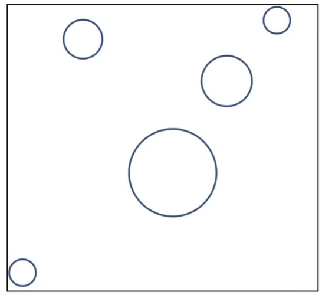

# [13]阴影-光线追踪

## 阴影

着色是一种局部动作, 而从不考虑其他部分对你的影响. 

阴影则不然. 如何绘制阴影. 经典的做法有Shadow Mapping

### Shadow Mapping

> Shadow Mapping 只能处理点光源产生的阴影, 并且生成的阴影是硬阴影

Shadow Mapping 是一种图像空间算法
- 阴影计算的时候不需要了解场景中的几何体
- 必须处理aliasing artifacts

本质思想:
- 如果点不在阴影中本质上意味着: 观察者能看到这个点, 并且光线能看到这个点.

#### 技术步骤

1. 先从光源看向场景, 得到图像的深度图像.

2. 从观察者(摄像机)看向场景, 得到所有的点, 将点投影回光源

如果相机记录的深度和光源记录的深度是一致的, 那么这个点不再阴影中, 否则这个点就在阴影之中.

#### 问题

- 在计算过程中会涉及到浮点数的比较, 导致阴影图会比较脏
  - 解决问题有几种处理方式, 但是都不解决本质问题

- shadow map 本身有分辨率的问题, 如果分辨率的场景不匹配, 就会导致一些锯齿的问题. 所以shaodw map会存在走样问题

Shaodw Mapping是一个被广泛使用的技术.

### 硬阴影和软阴影

- 一个点能完全看到光源: 无阴影
- 一个点能部分的看到光源: 半影
- 一个点完全看不到光源: 本影

## 光线追踪(Whitted-Style Ray Tracing)

光栅化的问题:

- 软阴影的处理不好
- 对于Glossy的反射(半透明)没有办法很好的处理
- 对于间接光照无法很好的处理

光栅化是一种快速但是近似的处理方式. 

光线追踪是一种准确但是非常慢的处理算法.

- 光栅化: 实时的, 光线追踪: 离线的

#### 基础光线追踪算法

三个基础的假设(不一定符合真实的情况):

1. 光线是沿着直线传播的
2. 光线和光线不会发生碰撞
3. 光线从光源触发, 最终到达我们的眼睛(reciprocity, 光线具有可逆性)

光线的可逆性假设, 就是`追踪`一词的来源.

下面是 Appel 1968-Ray 射线投射:

1. 通过每个像素投射一条光线生成图像
2. 通过向灯光发送光线来检查阴影

如何进行光线追踪:

1. 从眼睛出发, 通过绘制平面看到场景中交汇的第一个点
2. 将这个点与光源连接, 判断改点是否对光源可见, 并且计算改面的法线
3. 计算并且绘制这个面的着色, 写回像素的值

在这个计算过程中, 光线只反射了一次. 

在实际的光线追踪的时候, 光线实际上会进行反射也会进行折射. 并且可以反射很多次.

对于每次的折射点或者反射点, 都与光源进行计算. 并且在最后的计算像素的值时, 都合并到像素的颜色值中去.

### 交点计算

- 光线: 一个有起点和方向的向量

光线上的任意一个点, 都可以通过时间参数`t`确定.

与物体求交点:

可以联立方程:

根据解的数量, 我们可以知道光线和物体的相交情况(相离, 相交, 相切)

推广到任何隐式几何的表现的交点.

这个求交的运算, 可以有非常广泛的应用:

- 渲染: 可见性, 阴影的计算, 光线
- 几何上: 判断点在物体内还是物体外部

#### 如何计算光线和三角形几何体的交点?

- 简单的想法: 计算光线和每一个三角形的交点
- 这样计算很简单, 但是会很慢
- 这样计算会得到对应的交点: 0个或者1个

**那么如何求解光线和三角形的交点?**

- 先求光线和三角形所在的平面的交点
- 然后判断交点是否在三角形内

那么就需要定义平面, 定义平面需要两个要素:

- 给定一个平面的法线
- 给定平面上任意的一个点

这里是两种平面的定义方法.

光线和平面的交点一定即在平面上, 也在光线上. 因此我们可以联立方程:

另外也有一种Moller Trumbore Algorithm来判断光线与三角形的交点:

本质上是通过判断重心坐标和射线联立进行计算的.

现在, 我们需要解决原来的问题: 如何计算光线和几何体的交点

- 简单的想法会消耗很多的计算, 我们应该要如何来优化它呢?

这里有几种加速计算的方法.

#### 包围盒

对于一个复杂的物体, 我们可以用一些相对简单的物体将其框起来. 

这个就是包围盒. 我们可以先判断是否和包围盒是否相交. 如果你没有合包围盒相交, 那么坑顶没有和物体相交.

以长方体的包围盒为例, 我们可以理解为长方体是三组面.

我们常用的包围盒有有一种叫AABB包围盒

使用包围盒之后, 我们的问题就从判断光线和包围盒的相交情况开始了. 

#### 包围盒与光线求交

对两个线段进行交集运算, 就能得到光线从进入到出去的时间间隔. 

在三维的情况下:

- 只有当光线进入了所有的对面才算进入了盒子
- 当光线出了任意一组对面就出了包围盒

所以:

- 对于每一对面, 求`t-min`和`t-max`.
- 对于三维的包围盒: `t-enter = max{t-min}`, `t-exit = min{t-max}`

这样我们就知道光线什么时候进入盒子, 什么时候离开盒子.

当`t-enter < t-exit`, 则说明光线与盒子有交点, 否则就是没有交点.

现在则考虑为负数的几种情况:

1. 光线是射线, 所以`t > 0`
2. 如果`t-exit < 0`: 这个盒子在光线的后面, 没有交点
3. 如果`t-exit >= 0`并且`t-enter < 0`: 说明光线的起点在盒子中, 所以肯定有交点

总的来说: 如果光线和AABB有交点, 当且仅当: `t-enter < t-exit && t-exit >= 0`

### 光线追踪加速-格子划分法

光线和盒子的求交是非常快的. 所以对于光线追踪的场景, 我们可以先对盒子求交再采取下一步的操作.

以一个简单的场景为例:

1. 首先我们找到这个场景的包围盒

2. 创建均匀的网格, 然后判定那些格子中存在物体(注意, 只判断表面)

通过预处理, 我们就知道在场景中那些格子中可能存在物体.

这样, 我们就可以开始计算光线追踪了. 当遇到有物体的格子的时候, 进一步的去判断光线是否与物体相交. 

格子很稀疏的时候, 光线的加速效果不明显, 而当格子非常密集的时候, 计算量又会变得很大.

启发式的算法告诉我们:

- 在三维的场景下大概是27个.

但是从具体的场景来说, 要看具体的场景来分析, 不同的场景划分的格子密度应该是不同的.

但是在现代场景下, 格子划分的这种方法其实不是很常用.

### 光线追踪加速-空间划分结构

这里是三种空间划分的方法.

- Oct-Tree: 八叉树, 将空间且给为8分.(二维情况下是四叉树). 可以定义一个停止切割的规则
- KD-Tree: 类似于八叉树的思路, 但是每次分割都只将当前的空间分割为两份, 并且不是平均分割的. 基本上, 我们是水平的砍一刀, 然后竖直的砍一刀(在三维空间上就是每次沿不同的轴), 这样可以保证尽可能的多用空间
- BSP-Tree: 类似KD-Tree, 对空间进行二分, 每次方向不固定.(计算不方便, 并且维度越高越不好计算)

这里我们主要来介绍`KD-Tree`.

1. 使用KD-Tree来对空间进行预处理

- 用树结构表示空间的划分结构
- 在叶子节点中存储我们具体的盒子

2. 现在, 我们导入物体和光线, 来进行光线追踪的计算.

- 判断光线是否和场景的包围盒是否有交点
- 继续判断是否个子节点有交点
- 对于有交点的子节点继续和其根节点求交, 直到求出所有有交点的空间列表

KD-Tree有两个问题:
-  如何判断三角形与空间盒是否相交, 这个问题比较难以判断并且计算起来异常的复杂
-  一个物体有可能出现在多个叶子节点中

### 光线追踪加速-物体空间划分 Bounding Volumn Hierarchy(BVH)

- 定义一个根节点
- 然后将一个场景中的物体分成两部分, 连接到根节点上
- 对于分出来的两部分继续划分, 直到某一个标准, 比如一个节点中只有5个三角形.

这样一来:

- 一个物体就只出现在一个节点中
- 不需要判断包围盒和三角形的判断关系

BVH的问题在于:

- 划分出的物体空间是相交的(当然在划分的时候应该尽量避免相交, 这是个很难的问题)

一些划分节点的技巧:

- 每次选择一个维度去划分节点
- 总是选择最长的维度去划分, 去划分成两半
- 也可以取中间的物体(比如中位数)划分成两半(需要对所有的物体排序-快速划分算法)

下面是BVH算法的伪代码实现:

## Baisc Radiometry 辐射度量学

之前, 我们知道光线是有强度的.

辐射度量学就是用来精确描述光线的物理属性, 以及所有与物体表面的反应的效果.

辐射度量学是基于物理的对光线的精准描述.

这里有几个名词:

- Radiant flux
- intensity
- irradiance
- radiance

### Radiant Energy 辐射能

电磁辐射的能量, 单位是焦耳

### Radiant flux

辐射通量, 或者功率.

单位时间释放(emitted)、反射(emitted)、透射(transmitted)或接受(received)的能量。

单位时间的能量, 功率(power), 单位瓦特

在图形学中也用流明来表示

### Radiant Intensity 辐射强度

辐射强度是单位立体角(solid angle)由点光源发出的功率(power)

candelas是七个SI基本单位之一.

#### 角度和单位立体角

角度的定义: 圆上的弧长与半径的比值

立体角就是三维空间中对角度的定义: 球面上的投影面积与半径的平方之比

单位立体角, 单位积分以及微分立体角:

对于整个球面来说:

#### 其他

- 方向向量: ω (单位长度)

- 各项同性点源(Isotropic Point Source)

