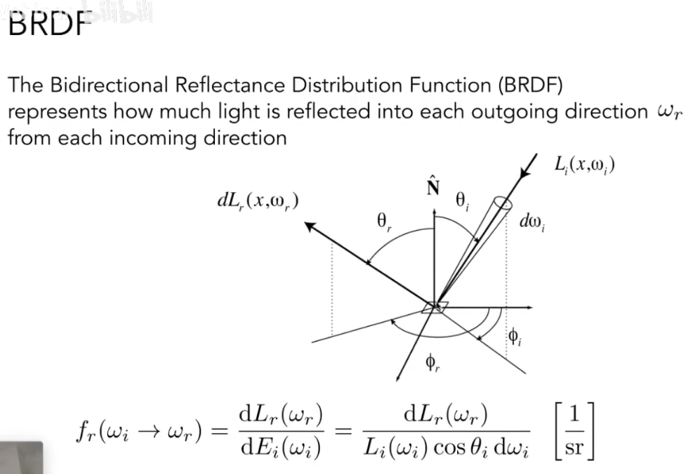
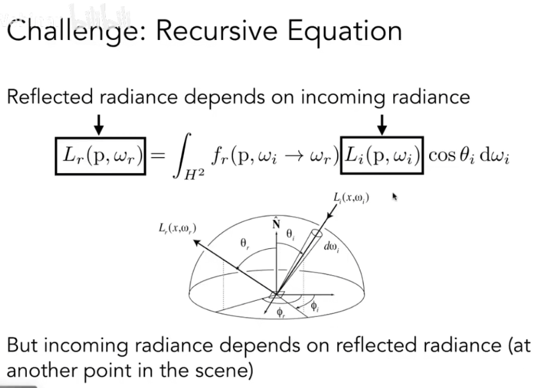
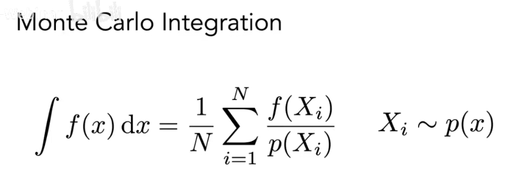

# [15-16]光线追踪-路径&反射&渲染&全局光照

## 辐射度量学概念回顾

- Radiant: 能量, 比较少用.
- Radiant flux(power): 辐射通量, 功率, 单位时间的能量
- Radiant intensity: 辐射强度, 单位立体角上的能量
- Solid Angle: 立体角
- Differential Solid Angles: 微分立体角, 表示一个极小的立体角

### Irradiance 辐照度

Irradiance: 表面上一个点的单位面积的能量.

辐照度E: 每单位面积入射到一个表面上一点的辐射通量, 单位: lux, 照度(拉克丝)

### 兰伯特余弦定律

表面辐照度与光方向和表面发现夹角的余弦值成正比(也就是说, 只要在表面法线方向的辐射度分量)

### Irradiance Falloff 辐照度衰减

辐照度Irradiance会随着里光源的距离的增加而衰减

所以, 本质上不是光线的强度在衰减, 而是单位面积的能量变的稀疏了, 所以衰减了.

### Radiance

Radiance: 辐射, 是描述光在环境中分布的基本场量.

- 辐射是与光线有关的量
- 渲染就是关于计算辐射的

辐射(Radiance)或者亮度(luminance) L:是指一个表面在每单位立体角, 每单位投影面积上所发射(emitted), 反射(reflected), 透射(transmitted)或者接收(received)的辐射通量(功率)

辐射强度(Radiant, Intensity), 辐照度(Irradiance), 辐射(Radiance) 这三者的关系:

- 辐射强度: 单位立体角的辐射通量
- 辐照度: 单位投影面积的辐射通量
- 辐射: **单位投影面积**的**辐射强度**或者是**单位立体角**的**辐照度**(单位立体角, 单位投影面积的辐射通量)

**入射辐射**(Incident Radiance): 指到达表面的**单位立体角**的**辐照度**, 机它是沿着给定光线到达表面的光(入射方向指向表面)

**出射辐射**(Exiting Radiance): 离开表面的单位投影面积的辐射强度. 例如, 对于面光(area light), 它是沿着给定光线发射的光(出射方向指向表面)

### 辐照度(Irrandiace) vs 辐射(Radiance)

- 辐照度: 在面积`dA`的总辐射通量
- 辐射: 在面积`dA`, 方向`dw`上的辐射通量

最后, 所以目前我们学习到的辐射度量学的概念回归

- 等于号: 在某些条件下相等
- 恒等号: 在任何条件下都相等

## Bidirectional reflectance Distribution Function (BRDF, 双向反射分布函数)

这个函数主要用来描述: 有多少能量, 从某个方向进入, 会如何向不同的方向分散, 在不同的反射方向上分布多少能量. 

以能量的角度理解光照: 吸收入射光, 然后释放出射光. 

BRDF可以计算一个表面如何将入射的光线进行反射, 并且描述反射的角度和强度.

BRDF能够决定材质是如何表现的. 

使用BRDF, 我们可以计算出某个点看到的光的强度的最终的定义.

这就是我们的反射方程

除了反射方程, 我们还需要考虑着色方程.

我们从反射方程知道, `Reflected Radiance`, 出射的辐射是依赖于入射的辐射的.

但是入射的辐射也依赖于场景中其他的点的出射的辐射.

因为反射的存在, 所以我们的入射辐射不一定是来来自于光源.

所以, 我们要从反射方程推演出更加通用的渲染方程.

1. 考虑到一些自发光的物体, 我们给出`Le(p,w0)`, 加到最终的渲染颜色重
2. 对反射方程进行积分

最终, 我们经过一系列的推导, 就得到了最终的渲染方程.

## 渲染方程

我们总结一下. 反射方程是一个描述光线如何从入射辐射反射到出射辐射的:

而对于很多的点光源, 我们就对这些光源进行求和:

对于面光源, 我们可以看做是一推的点光源的集合, 从而对面光源进行积分即可.

再进一步的, 考虑其他物体的反射, 将其他物体的反射光也当做光源来处理.

此时, 计算光照就是一个递归的计算过程.

最后的最后, 我们将完成的渲染方程简写为:

或者:

这个简写的好处, 在于可以离散成一个简单的矩阵方程(或者一个联立线性方程组)

(其中L, E为矢量, K为光传输矩阵)

L是一个递归的定义, 我们将等式做一定的变换, 可以得到:

对于`(I-K)-1`这种的形式, 则可以继续分解

其中K是反射操作符.

最终, 我们得到一个光线追踪的方程:

- 所有的一次光照, 二次光照以及更多的光照的和, 就是我们所谓的全局光照. (也就是所有带K系数的项的和).
- `E+KE`就是我们的光栅化(Shading in Rasterization)

对于真实的运算来说, 无限次的全局光照会收敛到一个亮度(能量守恒), 也就是说, 8次光线追踪和16次的光线追踪最终表现到画面上来是差不多的.

## Probability Review 概率论回顾

### 随机变量

- `X`: 随机变量. 表示一些潜在的值的分布
- `X ~ p(x)`: 概率密度函数（PDF）。描述随机过程选择值的相对概率

示例: 统一PDF, 域上的所有值都具有相同的可能性, 比如投掷骰子的概率

### 期望

在概率论和统计学中，数学期望(mean)（或均值，亦简称期望）是试验中每次可能结果的概率乘以其结果的总和，是最基本的数学特征之一。它反映随机变量平均取值的大小。

期望有离散期望和连续期望。

### 连续期望

对于连续期望, 需要用积分来进行计算:

### 随机变量函数

## Monte Carlo Path Tracing 蒙特卡洛路径追踪

### Monte Carlo Integration 蒙特卡洛积分

蒙特卡洛是为了解决积分的计算:

更通用的写法, 是如下的公式:

蒙特卡洛积分的思路是: 

- 随机在定积分区域`[a, b]`上取点`x1`, 使用`f(x1) * (b-a)`估算矩形面积. 
- 采样N个点`x1`, 求平均面积, 其值近似真实的积分面积.

注意点:

- 采样点越多, 结果越精确
- 采样点在X, 积分也在X

### Path Tracing 路径追踪

回到我们的`Whitted-Style Ray Tracing`:

- 始终执行镜面反射/折射
- 在漫反射的曲面上停止反射

那么这两个事其实是不一定对的.

先来看这两个材质的水壶:

这个模型叫做`The Utah teaport`

另外一个理由是, 反射不应在漫反射物体的表面上就停止了.

这里的场景叫做`The Cornell Box`, 常用来测试全局光照

所以, 我知道`Whitted-Style`不是真实的, 而我们的渲染方程才是对的.

但是这里有两个问题需要解决:

- 需要求解半球上的积分
- 需要递归执行

#### 一个简单的蒙特卡洛解决方案

对于这个点来说, 其直接光照的结果都来自于四周的入射光.

> 尽管它很奇特，但它仍然只是方向上的一种整合

本质上这个式子还是一个积分, 所以我们可以用蒙特卡洛方法来进行计算.

所以, 我们可以把我们的渲染方程写成蒙特卡洛积分方程:

我们可以用伪代码表示出来:

直接光照到这里就计算完成了.

那么更进一步的, 如何计算记下来的间接光照:

#### 间接光照

对于P点, 除了来自于光源的直接光照, 还有可能来自Q点的间接光照. 对着这样的光照, 我们可以理解为:

- 从P点看向Q点, 计算Q点反射出来的光线(类似我们看向P点时直接光照的计算)

在伪代码上, 我们可以增加一个分支:

其中`shade(q, -wi)`就形成了递归调用

但是这样的计算其实还是有问题的.

#### 问题1: 光线数量太多了

指数的数量级明显是不可接受的, 所以, 我们可以采用`N=1`, 只选择一根光线来进行计算. 

修改我们的伪代码逻辑如下:

当`N=1`的时候, 这个蒙特卡洛积分就叫做:`path tracing`, 路径追踪.

`N=1`的问题在于, 形成的噪声会非常大. 但是这不是问题. 只要对一个像素进行更多的路径最终并且对他们的辐射进行平均就可以了.

这里的伪代码非常类似于光线追踪中的光线投射:

#### 问题2: 递归需要一个停止条件

- 真实世界: 光线确实没有停止反弹
- 分割: 反射 === 分割能量

解决办法: Russian Roulette (RR), 俄罗斯轮盘

RR是关于概率的问题:

- 当概率在`0~1`之间, 结果为TRUE
- 当概率在`1-P`, 结果为FALSE

我们引入RR来决定是否对光线进行往下的追踪.

- 之前, 我们总是在着色点获取光线并得到着色结果`L0`
- 现在, 我们引入概率P(P由人为决定)
- 在概率P下, 反射光线是否产生取决于概率P: `L0/P`
- 在概率`1-P`, 就不会发射出光线.

我们会发现最终得到的期望是:

所以, 最终的期望L0是没有变化的.

修改我们的伪代码描述:

而到此为止, 我们已经得到一个正确的路径追踪的方法了.

#### 问题3: 效率比较低

剩下的问题在于, 这个算法的效率并不算高

> SPP: samples per pixel, 每个像素打出多少光线

我们先来理解, 为什么这个算法的效率比较低:

可以看到, 是否能打到光源完全看运气, 也就是很多光线被浪费了.

原因在于, 我们在使用蒙特卡洛积分的时候, 使用了均匀采样的方法.

而蒙特卡洛本身并不会限制你使用何种采样方法.

那我们如果能只对光源进行采样, 那么就不会产生光线的浪费了.

模拟下面这样一种场景:

光源的pdf函数是`pdf=1/A`, 这里假设光源的面积是A, 并且`dA=1`.

我们的渲染方程是关于物体表面的单位立方角的积分:

蒙特卡洛要求: 在x上采样, 在x上积分.

所以, 我们要知道`dA`相对于`dω`的关系. 

`dω`本质上是`dA`在半圆体上的投影, 所以我们可以计算出来:

更进一步, 重写对应的方程:

现在, 我们重新来进行采样:

1. 对于来自光源的光线, 我们直接进行对光源积分(不通过RR)
2. 对于其他的光线, 我们采用(RR)进行积分

表示为伪代码如下:

我们把光线拆分为: 直接光照+间接光照, 其中直接光照对光源积分, 间接光照通过RR进行积分

## 一些其他事

- Ray tracing:
  - 所有光线处理方法的总称
  - 路线追踪(单向追踪, 双向追踪)
  - Photon mapping
  - Metropolis light transport
  - VCM / UPBP

- 半球的均匀采样
  - 如何进行均匀采样

- 蒙特卡洛积分:
  - 如何最好的pdf(重要性采样)

- 让RR的随机数更合理
  - low discrepancy sequences

- 我们也可以结合光源采样和均匀采样做?
  - multiple imp. sampling

- 像素的亮度是响度的颜色吗?
  - 不是的, 这里涉及到(伽马矫正, 曲线, 颜色空间)

- 路径追踪是否仍然是"Introductory"
  - 是的, 敬畏科学

