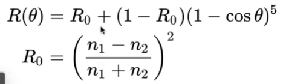
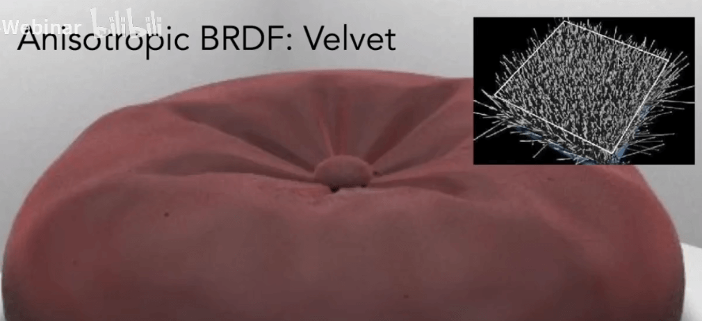
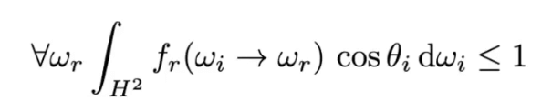

# [17-18]材质和外观

材质是什么:


我们知道我们的渲染方程是描述了材质的, 实际上:

```
BRDF === Material
```

## 漫反射 Diffuse/Lambertian


漫反射材质: 光线在出射方向是均匀分布的, 比如木头, 塑料等


假如物体不吸收能量, 那么光线入射的能量应该均匀的在半球体上分布出射.

所以, Li等于Lo, 并且我们定义一个反射率在0到1之间.

这样就得到了漫反射的BRDF.

## 反射和折射


抛光材质类似于金属, 比如打磨的铜镜:


还有一个类似的材质, 有反射也有折射, 类似玻璃或者水(Ideal reflective / refractive material)


### 光的反射


光的反射: 入射角等于出射角. 夹角是与法线的角度.

可以简单通过入射光`wi`计算出出射光`w0`.

镜面反射的BRDF不好写(可以自己去了解)

### 光的折射

光会在透明的物体中进行折射.

我们可以用`Snell's Law`来定义光的折射:


`折射率*折射角`是相等的.

常见的折射率:


折射角的计算可以简单的推导一下:


需要满足一定的条件下, 折射才有可能发生.

观察根号中的式子, 当`ηi/ηt > 1`的时候, 式子就不成立了.

也就是说, 当入射的介质的折射率大于折射的介质的折射率的时候, 是没有折射的, 这种现象就是**全反射现象**(入射的介质更加密)

比如, 人在水底看向睡眠的时候:


只能看到一个锥形的区域. 你可以看到这就是因为全反射现象.

> BRDF + BTDF = BSDF

### 菲涅尔项


反射程度会依赖于入射光线的角度.

一般我们认为, 如果入射光线的角度距离平面越接近(入射角越大), 反射的光线就会越多.


反之, 能量被反射的就越少. 

本质上, 这与光线的极化性质有关. (光线是沿着两个方向(S, P)震动的.)

当然, 上面的反应了某种折射率是1.5的材质的菲涅尔项曲线(绝缘套题), 对于金属来说(导体), 则菲涅尔项有非常不一样:


金属在大部分情况下, 反射率都非常高.

菲涅尔项的计算公式大概如下:


通过极化的光的一些计算, 然后进行平均就可以计算出一个材质的菲涅尔项

Schilck's approximation, 简化的计算:



## MicroFacet Material: 微表面模型

微表面理论:

1. Macroscale: flat(平滑的) & rough(粗糙的)
2. Microscale: bumpy(崎岖的) & specular(镜面的)

其中, 各个表面的各个面就像是镜子一样:

- 这些我们叫做 microfacet (微表面)
- 每一个microfact都有自己的法线


关键在于, 我们可以观察这些微表面的法线的**分布**情况:


两种不同的微表面情况就分别表示了两种不同的材质(glossy和diffuse).

这样一来, 我们就可以用法线的分布情况来表示表面的粗糙程度.

我们可以使用一个BRDF来描述微表面模型材质:


- 半程向量与法向量越接近, 则能够反射的光线越多, 当微表面的法向量和半程向量重叠的时候, 能够完全的反射光线
- `F(i,h)`表示材质的菲尼尔项
- `D(h)`表示微表面上的法线分布, 是决定光线分布的决定性的项
- `G(i,o,h)`, 表示几何项, 微表面是可能存在相互之间的遮挡的. 

当光线几乎和平面平行进入的时候, 我们就叫这种情况为: `Grazing Anglr`, 掠射角度, 在这种情况下, `shadwing-masking`就比较容易发生. `G(i,o,h)`就是为了修正这种边缘情况的.

微表面模型非常强大, 可以描述非常多的材质, 金属, 皮质, 玻璃等等.

## Isotropic / Anisotropic Materials (BRDFs)

我们把材质分为两类:

- 各向同性材质: 微表面没有什么方向性
- 各向异性材质: 微表面存在一个固定的方向性


### Anisotropic BRDFs

各向异性材质的定义:


如果BRDF不满足, 在方位角上旋转后得到的还是同一个BRDF, 那么我们就叫他是一个各项异性的BRDF.


#### 各向异性: 尼龙


#### 各向异性: 天鹅绒



## BRDFs的性质

- 非负性:


- 线性的: 不同的BRDF可以相加


- 可逆性: 交换入射和出射得到的BRDF值是一样的


- 能量守恒:



- 各项同性: 可以降维


更进一步的, 我们可以推演:


也就是不需要再考虑角度的大小.

## BRDFs的测量

- 理论和实际有差距
- 可以直接用测量数据而不需要建立模型

### 如何测量?

brdf本质就是两个方向(入射方向, 出射方向)的函数. 

我们使用光源和相机模拟光线的入射和出射, 然后环绕物体移动, 采集到每个点的数据. 


实际上也是这样测量的.

最终, 我们可以枚举出所有采样到的入射数据和出射数据.


然后我们可以提升一定的效率:

- 各项同性是可以将4d降低到3d的
- 如果只考虑相对方位角, 又能降低一般的计算量
- 只采样部分的点, 然后猜测其余部分的值

### 如何表示/保存 ?

- 紧凑表示
- 测量数据的精确表示
- 任意方向对的有效性评价
- 重要抽样的良好分布

### Tabular Respresentation

MERL BRDF DataBase: 一个优秀的BRDF库, 1.0版本包含了很多各项同性的材质.


