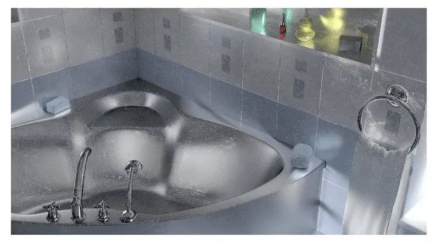

# [18]高级渲染

## 高级光追方法

- Unbiased light transport methods: 无偏光线传播方法
  - Bidirectional path tracing(BDPT) 双向路径追踪
  - Metropolis light transport(MLT)
- Biased light transport methods: 偏光传输方法
  - Photon mapping: 光子映射
  - Vertex connection and merging(VCM): 顶点联合
- Instant radiosity(VPL many light methods)

## 无偏 & 有偏

- 无偏的蒙特卡洛技术, 是指没有任何的系统误差
  - 无论你使用了多少个样本, 无偏估计量的期望总是正确的

- 所有其他的情况, 就是有偏的
  - 有一个特殊的case: 当使用无限样本时，期望值收敛到正确值, 那么我们说它是**一致**的

在渲染的角度来激励:

- 有偏 = 模糊
- 一致的: 只要样本是无限的, 那么最终能够得到不模糊的结果

## 双向路径追踪 Bidirectional Path Tracing (BDPT)

- 原本的路径追踪: 一个路径, 连接相机和光源
- BDPT:
  - 生成两个半路径(sub-paths), 分别从相机和光源
  - 连接两个半路径的终点

### 特点

- 适用于光源侧比较复杂的情况
- 实现起来很困难, 并且效率比较慢

## Metropolis Light Transport(MLT)

- 马尔可夫链 蒙特卡罗（MCMC）应用
  - 使用一些PDF(概率密度函数)从当前示例跳到下一个示例

从当前的样本的周围生成新的样本, 然后去估计下一个函数的值

也就是说, 给你任何一条路径, 可以生成一条相似的路径.

- 关键思想:
  - 局部扰动现有路径以获得新路径

### 特点

- 适合做非常困难的光线传播
- 同样是无偏的

### 缺点

- 很难估计它收敛的速度
- 不能保证每个像素的收敛速度是相等的
- 所以进场会产生一些脏结果
- 所以通常不能用来渲染都动画

## Photon Mapping 光子映射

- 是一个有偏的估计, 是一个两步的做法
- 非常适合用来渲染Specular-Diffuse-Specular(SDS)路径以及生成`caustics`

### 步骤(光子映射的其中一种做法)

1. 光子追踪: 从光源发射光子, 然后在环境中反弹, 直到射到漫反射的曲面上, 然后记录光子

2. 从摄像机开始发射路径(sub-paths), 也是反射+折射, 直到漫反射的物体上.

将两步得到的结果合并, 进行计算:

3. local density estimation
   1. 核心思路: 光子越多的地方越亮
   2. 对于每个着色点, 查找其最近的N个光子, 计算其N个光子所占据的面积
   3. 计算光子的密度

最终的计算结果, 随着光子的增多, 画面更好, 但是也会更模糊.

为什么?

- 因为区域的密度计算是`dN / dA != δN / δA`
- 从极限角度看, 光子越多 => 相同的n个光子就能覆盖比较小的面积, 面积就更加接近`δA`
- 所以, 整体来看, 是有偏的, 但是是一致的.

为什么不固定面积, 而得到光子的密度?

- 因为这样是不一致的, 面积无法趋向于零, 就永远是不正确的

## Vertex Connection and Merging, VCM

- 结合了双向追踪和光子映射的方法
- 关键想法:
  - 不要浪费BDPT中的子路径, 如果他们的端点无法连接, 那就合并
  - 使用光子映射处理那些附近区域中的"光子"

## Instant Radiosity (IR)

- 有时候也被叫做 many-light approaches (很多光源处理)
- 关键想法: 微表面都被当做光源来处理
- 处理方法:
  1. 从光源打出一些`sub-path`, 然后假设每个子路径的端店都是一个虚拟点光源(VPL, Virtual Point Light)
  2. 使用这些VPL去正常的渲染场景

### 特点

- 好的: 快, 并且在漫反射场景下往往能得到不错的结果
- 不好的: 会有在一些地方产生错误的光源点
- 不能处理`glossy`材质

## Advanced Appearance Modeling 高级外观建模

- 非表面模型
  - 散射介质
  - 头发/毛发/纤维(BCSDF)
  - 颗粒材料
- 表面模型
  - 半透明模型
  - 布料
  - 复杂度比较高的模型
- 程序化生成模型

## 散射介质

雾/云等等定义在空间中的物体.

定义: 在光通过散射介质的任何点上, 它都可以被(部分)吸收和分散

使用相位函数(Phase Function)描述散射介质中任意点`x`处光散射的角分布.

### 散射介质的渲染

- 随机的选择一个要反弹的方向
- 随机的算则直行的距离
- 在每个着色点, 连接到灯光

散射介质有浓的(一些液体, 比如茶, 巧克力等等), 也是稀薄的(云)

## Hair Appearance

### Kajiya-Kay Model

我们把头发考虑成会反射出一个圆锥的模型.

但是这种模型得到的效果并不好.

所以, 现在的人更多会这样考虑

### Marschner Model

同时考虑反射和折射.

反射为:R, 穿透为T, 穿透后再反射为TRT.

- 首先将头发当做一个glass的材质
- 头发内部有颜色, 会改变光线的颜色

考虑三种与光线的作用:

综合考虑之后, 就能得到一个比较好的渲染结果:

### 动物毛发和人的头发的区别

人的毛发内部是有三层结构的, 对于动物来说, 髓质要大的多. 而髓质会影响光线的散射.

所以, 我们还需要对光线的模型引入髓质的概念.

### Double Cylinder Model

这里做了一个双层的模型, 用来模拟髓质的效果.

光线遇到毛发, 会和髓质发生影响.

有一部分的光在穿过髓质的时候会发生反射和散射.

所以, 我们可以用5个不同的分量去描述毛发.

## Granular Material 颗粒状材质

## Translucent Material 透光性材质

Jade 玉石

光线在其中不仅发生了折射还发生了散射

为了描述这种反射, 我们定义它叫做: Subsurface Scattering, 次表面散射

次表面散射可以理解为对BRDF的一种概念延伸. (BSSRDF)

光线从某个着色点进入, 然后可以从其他的点再出去. 其渲染方程如上图所示

透光性材质, 就好像有两个光源在材质中和材质表面.

### 应用

## Cloth 布料

- 纤维的缠绕集合
- 纤维缠绕形成股, 股缠绕形成线, 线再被织成布料

布料可被当做表面材料进行渲染, 比如BRDF.

布料也能被处理为散射介质来进行渲染.

或者作为真实的fiber来进行渲染.

## Detailed Appearance: Motivation

复杂表面材质处理.

渲染结果是过于完美的,而显得不够真实.

回顾我们微表面的BRDF模型. 

我们可以用一些更加真实的法线分布:

这样就能得到更好的效果.

### 如何计算

通过一个像素去覆盖一定的微表面, 然后一起去计算.

不同的微表面结构分布会得到不同的法线分布:

## Recent Trend: Wave Optics

波动光学, 光学的衍射和干涉

## 程序化生成表面 Procedural Appearance

通过噪声函数, 可以生成一些程序化的虚拟的纹理

并且, 三维空间中的噪声函数是体纹理, 而不是面纹理

噪声函数可以生成水面, 地形等等. 