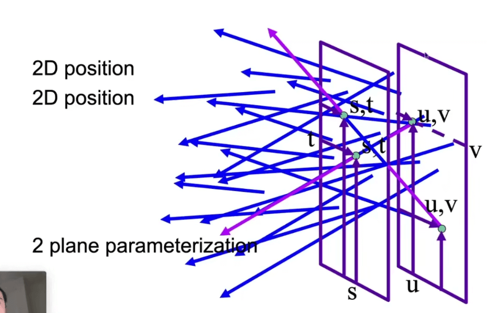
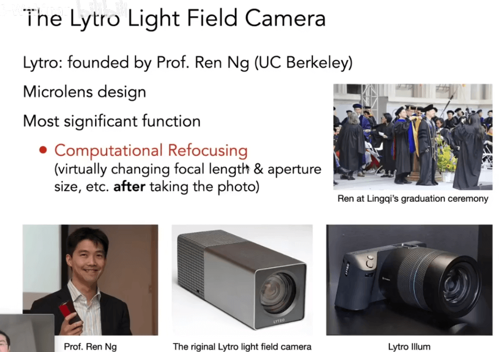

# [19]相机&透镜&光场

## 成像

计算机有两种成像方法:

- 光栅化
- 光线追踪

我们也可以通过捕捉(Capture)方法来成像.

这是相机的典型成像方法

## 相机成像

小孔成像和带棱镜的相机是两种成像方式:

- 快门: 控制光进入的时间
- 传感器: 记录光的Irradiance

### 针孔相机

- 针孔相机是没有景深的, 所有深度没有虚化和模糊

### Field Of View (FOV)

视场, 说的是我们能看到多大的范围.

从图中, 我们可以知道决定视场的有几个因素(针孔相机)`f`和`h`.

我们以35毫米的胶片为基准, 然后通过定义焦距来定义视场的大小.

但是我们现在说焦距28mm, 实际说的是等效的`focal length`, 而不是实际有28mm的焦距存在.

不同的焦距能获取的范围不同:

#### 传感器大小对Fov的影响

### 曝光 Exposure

曝光取决于: 光的强度和时间

曝光时间由快门(shutter)控制

而光照度由:

- 传感器单位面积接受到的光的能量
- 光圈的大小

决定.

#### 摄影中的曝光控制

- 孔径的大小: 通过打开/关闭光圈, 该更改f光圈
- 快门速度: 更改传感器的感光持续时间
- IOS增益(感光度): 在传感器和数字图像之间修改放大(模拟或者数字)

IOS增益在提高亮度的同时, 也会方法噪声.

### 光圈 F-Number / F-Stop: Exposure Levels

### 快门 shutter

快门的Rolling shutter问题:

### 快门和光圈的等效

亮度可能是一致的, 但是光圈还会影响景深.

景深和运动模糊是不可兼得

## 镜头: 透镜 (理想化的简单透镜)

- 焦点: 光线通过透镜聚焦到一个点
- 焦距: 焦点距离透镜的距离

我们假设透镜能够改变其焦距(透镜组)

- z0: 物距
- zi: 相距
- f: 焦距

## Defocus Blur

### Computing Circle of Confusion(CoC) Size

虚焦出现的原理: 物象被放大后, 点形成的面重叠在一起了.

### CoC vs Aperture Size

## 光线追踪和透镜

## Depth of Field 景深

景深的定义:

## Light Field / Lumigraph 光场

人眼接受的到光线是无法判断距离的, 我们可以用一个全光函数(Plenopic Function)来描述我们能看到的所有东西.

假设, 我们站在一个场景中, 我们可以定义一个函数:

这些参数分别代表了:

- 两个关于视角的方向(极坐标表示)
- 一个关于波长的函数(用于表示颜色)
- 一个关于时间的参数`t`

加上时间的概念, 就是表达一个电影的概念所需要的所有参数.

而进一步扩展, 引入观察者的位置, 那么就能够表示全息电影.

最后, 从其他的角度来理解, 我们在任何位置的任何时间看到的所有视角, 就可以用这7个维度的函数来表示. (类似游戏?)

> 任何时刻, 任何时间, 任何位置. 就是我们所看到的世界.

这个用来表示整个世界的七维函数, 就是我们的全光函数.

### 光场的定义

光场的概念就是从这里开始的. 

- 光场就是在各个点上记录的来自各个方向的光的信息
- 光场可以看做是全光函数的一部分.

#### 光线的定义

定义光场之前, 我们先来定义光线:

在这个定义中, 我们需要5个维度来定义光线.

也可以有其他的定义光线的方法:

这种方式是用空间中的两个点来定义一个光线(方向是已知的). 这样就是只需要4个参数就可以了.

#### 物体的定义

然后我们来定义物体:

物体被观察的情况, 就是`我们`从`任何位置`, `任何方向`看向这个物体.

反过来说, 我们想要描述这个物体, 我们也可以描述物体在`任何位置`, 向`任何方向`发出的光线. 

我们用一个函数来表示这个物体, 本质上, 这个函数记录了`不同的点`(物体表面上不同的位置), `往不同的方向`发出光线(光的强度)的情况. 

把这些信息记录下来的这个函数, 就是光场. (二维的位置-物体表面是二维的, 二维的方向-极坐标表示方向)

#### 小结

当我们有了一个物体的光场:

我们可以从任意一个位置看到这个物体, 并且知道应该看到什么样的物体.

也就是我们可以从光场在任意位置看到任意物体的表面情况.

而且本质上来说, 我们并不关心物体本身是什么东西, 我们只关心在观测点上, 光场的情况.

(观测点在包围盒外面)

从这个角度来理解, 我们可以定义一个平面:

在平面上, 我们可以用一个点`s`和一个角度`θ`来描述一个光线.

也可以定义两个平面来, 然后在平面上各定义一个点, 来确定光线:

这样就能用四个参数来表示不同位置的不同方向的光线(u,v,s,t)

只要知道所有的uv和st, 就能得到光场的所有的值.

对于这两个点, 我们有两种不同的理解方式.

固定`s,t`, 我们可以理解为从不同的点, 看向`u,v`所在平面的所有的光线的情况.

这样就可以理解为看到从一个固定的角度看到的物体, 随着uv的变化

反过来看, 固定`s,t`, 然后从所有的`u,v`去看, 则是观察到某个点上在不同的方向的细节.

这种可以类比与昆虫的复眼:

### 光场照相机

光场照相机, 可以先记录光信息, 然后在后期处理聚焦的问题

光场照相机, 本质上就是将原来的成像平面用一些微透镜来替换掉.

这些微透镜会将来自不同的光分散到一片区域上.

得到光场的信息后, 还需要将其还原成像素上的图片.

简单来说, 就是在每个透镜上选取一种一个固定的位置. 然后得到成像.

光场照相机的问题在于分辨率比较低, 而且成本比较高
