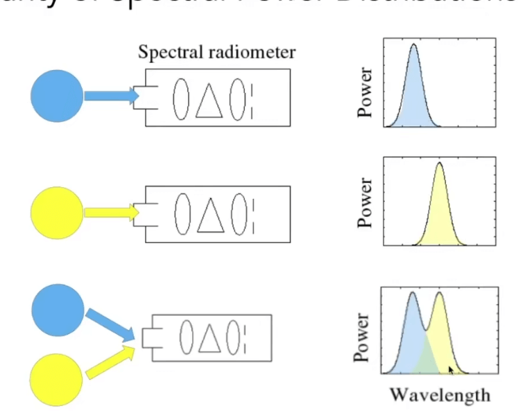
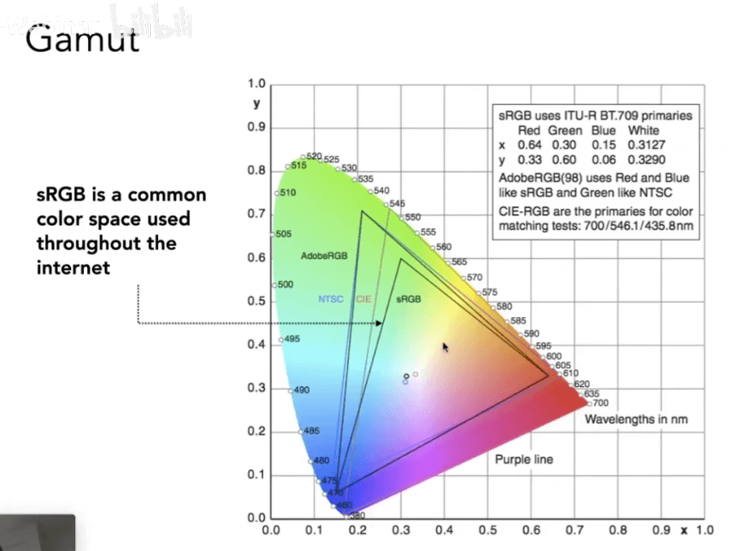

# [20]颜色&感知

## 颜色的物理基础

颜色就是不同波段的波长的光对应的折射率.

图形学中关心的是可见光的光谱:

### Spectral Power DIstribution (SPD, 谱功率密度)

SPD用于测量光的显著性:

- 用于表示波长的光量
- 单位: 
  - 辐射测量单位/纳米(比如: 瓦/纳米)
  - 也可以是没有单位的
- 当绝对单位补充要的时候, 通常使用"相对单位"缩放到最大坡长或者跨波长比较

不同的光对应不同的SPD:

SPD是满足线性性质的:

### 颜色的定义

- 颜色是人的感知, 它不是一个光的属性, 颜色主观存在的
- 不同波长的光不是"颜色"

### 人眼的结构

视网膜是最终光线到达的地方. 视网膜上有感光细胞.

视网膜上有两种吸饱: `Rol`和`Cone`

`Rol`用来感知灰度, `Cone`可以用来感知颜色.

`Cone`细胞的内部会被分为三类, 分别是S, M和L.

- S-Cone: 感知高频的波长光
- M-Cone: 感知中间波长
- L-Cone: 感知长波长

不同的人的感知细胞类型分布完全不一样:

给定波长和感知细胞进行积分, 就是最终得到的颜色的结果:

所以, 人感知到的颜色系统大致过程如下:

## Metamerism 同色异谱

同色异谱是说, 不同波长的光线进入要眼睛中得到的积分又是相同的. 

利用同色异谱可以得到颜色的调和:

这也就是我们能用颜色混合然后得到一个新的颜色的根本原理.

### Additive Color

我们常见的计算机是一种加色系统.

给定一些基本的颜色(RGB), 然后按照一定的比例进行混合, 就能得到一个新的颜色.

所谓的加色就是指当后面混合以后, 得到的最终是个白色.

不同于绘画, 那中叫做减色系统

#### CIE RGB

给定一个单波长的颜色, 然后要用三个波长混合出你想要的颜色.

混合的量就是下面这图表示的:

任意一个波长的混合量就是当前波长上各个单色的值之和.

对这三条曲线积分, 就能得到RGB的值:

#### CIE XYZ

认为定义的颜色曲线, 其中Y表示亮度

将XYZ所能够表示的颜色在坐标上表示出来:

其中, `x+y+1=1`, 所以我们可以用三个数中的两个来表示三个值.

通常会选择x和y, 然后用(x,y)坐标来表示亮度Y

这个表示出来的区域, 就是色域.

## 色彩空间 Color Spaces

Standardized RGB (sRGB)

- 使特定的监视器作为rgb标准
- 其他色彩设备通过校准模拟监视器
- 在今天被广泛的采用
- 能够表示的色域范围的有限的

### 色域

色域就是所有能够表现的颜色空间

不同的颜色系统能够表示的颜色各不相同.

#### HSV

- H: 色调
- S: 饱和度
- L(V): 亮度

#### CIEAB Space (AKA L\*a\*b\*)

这是一种三维的空间定义:

轴的两端是互补色(通过实验得到的)

## 减色系统

一个典型的减色系统: CMYK

