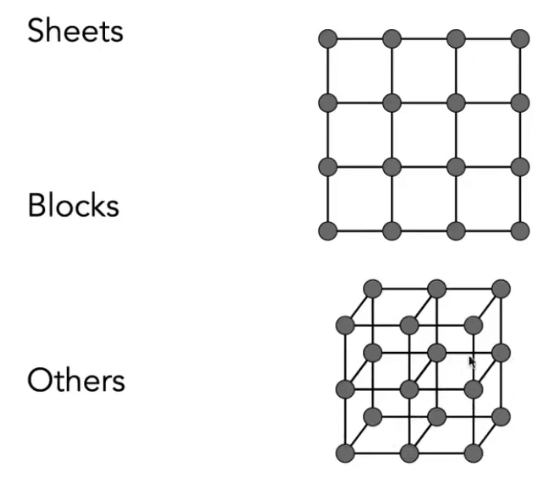
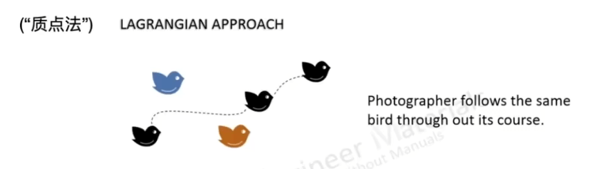

# [21]动画

动画本质上是通过视觉暂留效应, 在每秒钟绘制连续的画面形成动态的画面.

## 关键帧动画


- 关键帧: 给定一系列不同的帧, 然后在帧间进行自动插值


插值有线性的插值和非线性的插值.


## 物理模拟

从牛顿定律开始:


所谓的模拟或者仿真, 就是在物理定律的基础上, 模拟物体的运动轨迹.

比如衣服的模拟

## Mass Spring System, 质点弹簧系统

质点弹簧系统, 是一系列的相互连接的质点和弹簧. 

最简单的模型是一个弹簧连接着两个质点:


我们假设一个理想化的弹簧:

- a和b是两个向量, 两个点收到的力的关系满足图中的关系式, 并且满足胡克定律.
- 我们再假设, 弹簧的长度默认为`l`


这个弹簧的问题在于会永远的进行震动, 所以我们需要加入一个摩擦力.

> 点标记在模拟仿真中的作用是求导:
> 
> 

所以我们加入一个`damping`摩擦力`f`.


- 物体的摩擦力和物体的运动方向相反
- 问题在于, 会让所有的运动都慢慢停下来.

这里的摩擦力`f`只能描述外部的力, 而不能描述内部的力.

比如在弹簧模型中就无法描述弹簧内部的损耗, 所以我们需要把这类的内部摩擦力加入到这个系统中去:


加入内部摩擦力的本质是要最终恢复弹簧的形变. 考虑这个力的大小:

1. 必然和a点与b点的相对速度相关
2. 这里的点乘本质上是坐标的投影(投影到ab方向上的速度是多少), 目的是去除方向上的问题(可以考虑圆周运动的场景)

### 弹簧结构



可以用最简单的弹簧结构, 组成各种物体.

以模拟一张布为例, 我们要如何使用弹簧质点系统来模拟呢?

### 布的弹簧质点结构


注意, 这里的红线弱, 蓝线强.

## 其他方法

除了质点弹簧系统, 我们也有其他的方法, 比如:

- 有限元方法

## 粒子系统

粒子系统就是建立大量的粒子, 然后定义每个粒子收到的力.

粒子系统可以很容易的模拟很多效果. 

- 粒子系统很好理解
- 可以使用足够多的粒子
- 可以用来模拟一些复杂的流体

粒子系统的步骤(对于每一帧来说):

1. 创建一些新的粒子
2. 计算每个粒子的力
3. 更新每个粒子的力
4. 销毁已经死亡的例子
5. 渲染整个粒子系统

### 粒子的力

- 重力, 电力
- 摩擦力
- 碰撞检测
- ...

### 粒子的系统


## 运动学

运动学分为正向运动学和逆向运动学两种.

我们这里先讨论正向运动学.


假如我们要模拟一个人的关节和骨架, 我们需要知道:

- 拓扑(什么连接到什么)
- 关节的几何关系
- 树结构(无循环时)

关节的类型有:

- 滑车关节(一维的旋转)
- 球窝关节(二维的旋转)
- 导轨(平移)


以两个滑车关节为例:


我们可以通过角度的叠加计算, 计算出最终p点所在的位置.

这就是所谓的正向的运动学

逆运动学, 则是先确定p点的位置, 然后在确定每个角度的变化.

### 逆运动学

还是以上面的例子为例:


- 逆运动学的计算非常的复杂
- 逆运动学的解不是唯一的
- 有时候解是不存在的


逆运动学的优化:

一般的`N-link IK`的问题的数值解法:

- 选择一个初始的配置
- 定义一个误差度量
- 计算作为配置函数的梯度误差
- 应用梯度下降法(或者牛顿法, 或者其他优化程序)

## Rigging(绑定, 操纵)


Rigging是一种对于模型进行形变的修改方法.

- 类似于木偶上的生子
- 能捕获所有有意义的动作
- 对于不同模型都是不一样的

Rigging是非常难创建的:

- 是个繁重的体力活
- 需要艺术和技术的培训

### Blend Shapes


指在动画上对控制点进行插值, 以形成平滑的过渡效果

### Motion Capture 动作捕捉

动作捕捉就是通过对真实存在的人物去打上一些控制点.


- 特点: 能很快地建立控制点, 并且很真实
- 缺点: 捕捉的控制点不能很好的反馈到预期的目标上

#### 动作数据


## 动画电影制作


## 单个粒子的模拟

首先我来研究单个微粒的运动情况, 再将其归纳为大量的粒子系统.

- 假设例子的运动由速度矢量场决定
- 所谓的速度矢量场是一个关于位置和时间的函数

```
v(x, t)
```


在速度场中, 我们可以知道任意一个位置的粒子的速度(理想情况), 先来考虑一个例子的情况.

### Ordinary Differential Equation (ODE), 一阶常微分方程

考虑一个粒子的运动.

对于任何一个`x`,我们都有一个一阶的常微分方程:


那么我们知道任意时刻粒子的速度, 想要求这个粒子的位置.


- 给定起始位置, 给定任意时间t, 想要知道该粒子的位置

#### Euler's Method, 显示欧拉方法(前向欧拉方法)


基本思想是: 将时间离散化, 每一步都进行位置的计算.

这个计算方法的问题在于: 这个方法经常是不稳定的.

- 它的每次计算都存在一定的误差, 而随着误差的累计, 其结果会出现比较大的偏差


步长越短, 则误差会减小.

- 另外一个问题在于稳定性


- 精度是随着时间步长的减小而增加的
- 不稳定是一种常见的严重的可能会导致模拟发散的问题

### 解决不稳定的方法

- 中点法
- 自适应步长
- 隐式方法
- 其他基于物理的方法

#### 中点法

- 计算一个步长后终点的速度
- 取这个步长中点时候的速度(更能代表这个步长内运动的平均情况)
- 使用中点的速度重新计算这个步长结束时候的速度和位置

简答来说, 就是运用了两次欧拉方法计算


根据中点法, 可以修改欧拉公式如下:


#### 自适应步长

利用中点法的思想, 我们可以用步长的中点, 利用两次欧拉计算去提高精度. 

和直接缩短步长的区别在于, 这里会根据实际的误差来决定是否采用减少步长.


并且会根据结果再次决定是否继续减小误差.

#### 隐式欧拉方法(后向欧拉方法)


- 隐式欧拉用的加速度是下一个时刻的速度和加速度
- 这个计算其实比较复杂, 常用一些求根公式或者一些其他的优化方法
- 隐式欧拉方法的好处在于非常的稳定

##### 如何衡量 "稳定性"

- 使用每个步长中的局部的截断误差/或者使用每一步的总累计误差衡量
- 绝对值是不重要的, 但是要关注其"阶"
- 隐式欧拉的阶数是1, 这就意味着:
  - 局部误差为: `O(h^2)`
  - 全局误差为: `O(h)`

> `O(h)`: 如果我们有一个`h`, 如果我们把h减小一半, 那么最终我们的误差也会减小一半, 阶数越高代表稳定性越好

#### Runge-Kutta Ramilies 龙格库塔方法

这是一类用于解ODEs的方法

- 对于处理非线性方法非常优秀
- 有一个4阶的方法得到的广泛的应用: RK4


> 去学数值分析????

### Position-Based / Verlet intergration

这是一种不是基于物理的方法, 核心的想法就是:

- 通过修改前向欧拉方法, 约束例子的位置, 以防止发散和不稳定的问题
- 使用受约束的位置计算速度
- 两种方法都会消耗能量, 并且提高稳定性

好处: 快速简单

坏处: 不基于物理, 对于能量消耗的计算是错误的

## 刚体的模拟

刚体的点所有的运动方式是一样的, 本质上和粒子的运动差不多, 只不过要考虑更多的物理量, 比如刚体的位置, 速度, 朝向, 角速度.


## 流体的模拟

### 一个关于水流的简单的Position-Based方法

关键想法:

- 假定1: 水是有很多小的球体组成的
- 假定2: 水是不可压缩的

**所以: 给定任意时刻, 给定位置的密度, 如果密度发生了变化, 就需要修正该位置的密度到原来的密度(通过修改小球的位置)**

为了进行修正, 所以我们需要知道所有位置的梯度/密度是多少.

这个修正过程就是: gradient descent (梯度下降)

### 质点法 & 网格法

我们模拟物体的方法有两种, 一种是上面水流的例子, 我们叫质点法(拉格朗日视角):



另一种叫网格法(欧拉视角):


也就是将物体的变化通过时间的变化, 关注每个区域中不同时间的变化.

还可以将这两种方法混合(Hybrid, Material Point Method, MPM):

- 将物体考虑为由粒子组成
- 在变化过程中用网格法去计算
- 将计算结果写回粒子中

