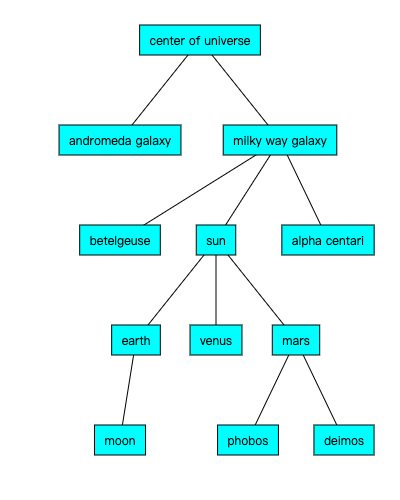

# [基础]场景图

场景图通常是一个树结构, 每一个节点都会创建一个矩阵, 这个可能不是一个很有意义的定义.

大多数三维引擎使用场景图, 将需要显示的东西放在场景图中, 引擎会遍历场景图找出需要绘制的东西.

场景图具有层级结构. 假如你要创建一个宇宙, 其场景图可能如下所示:



场景图的首要作用就是为矩阵提供父子关系, 就像我们讲过的矩阵运算一样. 

比如在一个模拟的宇宙的例子中, 星星在它们所在的星系运动, 同样的月亮绕着地球运动, 如果地球移动, 月亮也会更者运动. 

比如, 在二维矩阵运算中, 多个矩阵相乘能实现物体的平移, 旋转和缩放. 场景图的功能就是, 提供了一个结构, 为矩阵作用在哪个物体上提供了帮助. 

理论上场景图中的每个Node都代表一个**逻辑空间**.

为这个逻辑空间提供合适的矩阵, 而不必考虑在它之上的物体. 另一种表达的方式是月亮只关心绕地球的的运动轨迹, 而不需要考虑相对于太阳的运动轨迹. 

有了场景图就只需要让月亮成为地球的子节点然后绕地球运转。 地球绕太阳运转的部分场景图会处理，它通过遍历节点并把矩阵相乘，就像这样

```c++
worldMatrix = greatGrandParent * grandParent * parent * self(localMatrix)
```

按照这样的描述来说, 我们的宇宙关系应该是这样的:

```c
worldMatrixForMoon = galaxyMatrix * starMatrix * planetMatrix * moonMatrix;
```

我们可以用一个简单的递归函数实现这个运算:

```js
function computeWorldMatrix(currentNode, parentWorldMatrix) {
    // 通过把我们的父节点的世界矩阵和当前结点的局部矩阵相乘，
    // 计算出当前节点的世界矩阵
    var worldMatrix = m4.multiply(parentWorldMatrix, currentNode.localMatrix);
 
    // 让子节点做同样的事
    currentNode.children.forEach(function(child) {
        computeWorldMatrix(child, worldMatrix);
    });
}
```

这里用了三维场景中比较常用的术语:

- `localMatrix`: 当前节点的局部矩阵. 它会在局部空间的原点对自己和子节点进行转换操作
- `worldMatrix`: 将当前节点的局部空间的变换转换到场景图根节点坐在的空间. 换句话说, 它将节点放在了世界空间中, 如果我们计算月球的世界矩阵, 就会得到一个复杂的矩阵变换.

场景图是很容易实现的功能, 让我们来定义一个简单的Node对象. 组织场景图的方式有很多种. 常用的方式是有一个可选的绘制物体字段. 

```js
var node = {
   localMatrix: ...,  // 当前节点的局部矩阵
   worldMatrix: ...,  // 当前结点的世界矩阵
   children: [],      // 子节点序列
   thingToDraw: ??,   // 当前节点需要绘制的物体
};
```

我们来做一个太阳系的场景图. 首先创建几个方法来帮助我们管理节点. 首先定义一个节点类.

```js
var Node = function() {
  this.children = [];
  this.localMatrix = m4.identity();
  this.worldMatrix = m4.identity();
};
```

然后提供一个设定父节点的方式:

```js
Node.prototype.setParent = function(parent) {
  // 从父节点中移除
  if (this.parent) {
    var ndx = this.parent.children.indexOf(this);
    if (ndx >= 0) {
      this.parent.children.splice(ndx, 1);
    }
  }
 
  // 添加到新的父节点上
  if (parent) {
    parent.children.append(this);
  }
  this.parent = parent;
};
```

这段代码根据父子节点关系和局部矩阵计算世界矩阵. 如果我们从父节点调用, 它会递归计算出子节点的世界矩阵. 

```js
Node.prototype.updateWorldMatrix = function(parentWorldMatrix) {
  if (parentWorldMatrix) {
    // 传入一个矩阵计算出世界矩阵并存入 `this.worldMatrix`。
    m4.multiply(this.localMatrix, parentWorldMatrix, this.worldMatrix);
  } else {
    // 没有矩阵传入，直接将局部矩阵拷贝到世界矩阵
    m4.copy(this.localMatrix, this.worldMatrix);
  }
 
  // 计算所有的子节点
  var worldMatrix = this.worldMatrix;
  this.children.forEach(function(child) {
    child.updateWorldMatrix(worldMatrix);
  });
};
```

为了简单起见, 我们只包含太阳, 月亮和地球, 使用假的距离使得内容便于呈现在屏幕上. 

demo详情查看: [demo](./code/场景图/index.html)

## 正交归一化

对于每一个对象, 我们都有一个`localMatrix`, 并且每一帧都会去修改它. 这样会在运算的过程中不断的累积错误. 有一个解决方法叫正交归一化矩阵, 不过就算是这样也不是绝对没有问题的. 

比如, 我们缩放到0然后再恢复, 只对一个`x`值事假变换. 

```js
x = 246;       // frame #0, x = 246
 
scale = 1;
x = x * scale  // frame #1, x = 246
 
scale = 0.5;
x = x * scale  // frame #2, x = 123
 
scale = 0;
x = x * scale  // frame #3, x = 0
 
scale = 0.5;
x = x * scale  // frame #4, x = 0  OOPS!
 
scale = 1;
x = x * scale  // frame #5, x = 0  OOPS!
```

可以看到, x值被丢失了. 我们可以添加其他的类从外部更新矩阵. 让我们给Node的定义中添加一个`source`, 如果`source`存在就从它哪里获取局部矩阵. 

```js
var Node = function(source) {
  this.children = [];
  this.localMatrix = m4.identity();
  this.worldMatrix = m4.identity();
  this.source = source;
};
 
Node.prototype.updateWorldMatrix = function(matrix) {
 
  var source = this.source;
  if (source) {
    source.getMatrix(this.localMatrix);
  }
 
```

然后我们创建一个源. 通常一个源会提供平移, 旋转和缩放变换. 比如这样:

```js
var TRS = function() {
  this.translation = [0, 0, 0];
  this.rotation = [0, 0, 0];
  this.scale = [1, 1, 1];
};
 
TRS.prototype.getMatrix = function(dst) {
  dst = dst || new Float32Array(16);
  var t = this.translation;
  var r = this.rotation;
  var s = this.scale;
 
  // 通过平移，旋转和缩放计算矩阵
  m4.translation(t[0], t[1], t[2], dst);
  matrixMultiply(m4.xRotation(r[0]), dst, dst);
  matrixMultiply(m4.yRotation(r[1]), dst, dst);
  matrixMultiply(m4.zRotation(r[2]), dst, dst);
  matrixMultiply(m4.scaling(s[0], s[1], s[2]), dst, dst);
  return dst;
};
```

然后这样使用它:

```js
// 在初始化阶段用源初始化节点
var someTRS  = new TRS();
var someNode = new Node(someTRS);
 
// 渲染阶段
someTRS.rotation[2] += elapsedTime;
```

这样一来, 每次我们都会创建一个新的矩阵.

这里有一个方块人的[DEMO](./code/场景图:TRS/index.html)可以查看


