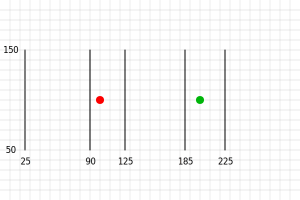

# [技术]GPGPU

GPGPU是通用GPU, 意思是将GPU用于绘制像素以外的其他用途. 

在WebGL中, GPGPU的基本实现是纹理不是图像, 它是一个二维的值数组. 在关于纹理的文章中, 我们曾介绍从纹理获取数据, 在渲染到纹理的文章中, 我们也介绍了如何写入纹理. 因此, 如果实现纹理是一个二维值数组, 我们可以说我们已经知道了如何写入和读取二维数组的办法. 这就是WebGL中的GPGPU的本质. 

在js中有一个`Array.prototype.map`函数, 它给定一个数组, 在每个元素上调用一个函数.

```js
function multBy2(v) {
  return v * 2;
}
 
const src = [1, 2, 3, 4, 5, 6];
const dst = src.map(multBy2);
 
// dst 现在是 [2, 4, 6, 8, 10, 12];
```

我们可以考虑实现一个`multBy2`的着色器, 实现类似于`map`的功能, 可能会用到`gl.drawArrays`或者`gl.drawElements`. 这两者当然是有一些差异的.

1. 着色器不会生成新的数组, 你必须自己提供一个
2. 着色器不返回设置的值`gl_FragColor`
3. 着色器是基于目标的, 而不是基于源的

```js
let gl_FragColor;

function multBy2(src) {
  return function (i) {
    gl_FragColor = src[i] * 2;
  };
}

function mapSrcToDst(dst, fn) {
  for (let i = 0; i < dst.length; ++i) {
    fn(i);
    dst[i] = gl_FragColor;
  }
}

const src = [1, 2, 3, 4, 5, 6];

const dst = new Array(6); // 为了模拟在 WebGL 中，我们必须分配一个纹理
mapSrcToDst(dst, multBy2(src));

// dst 现在是 [2, 4, 6, 8, 10, 12];
console.log(dst);
```

4. 着色器中, 需要你提供值的索引或者ID: fl_FragCoord
5. 在webgl中, 纹理是二维数组

```js
let gl_FragColor, gl_FragCoord;

function multBy2(src, across) {
  return function () {
    gl_FragColor = src[gl_FragCoord.y * across + gl_FragCoord.x] * 2;
  };
}

function mapDst(dst, across, up, fn) {
  for (let y = 0; y < up; ++y) {
    for (let x = 0; x < across; ++x) {
      gl_FragCoord = { x, y };
      fn();
      dst[y * across + x] = gl_FragColor;
    }
  }
}

const src = [1, 2, 3, 4, 5, 6];

const dst = new Array(6); // 为了模拟在 WebGL 中，我们必须分配一个纹理
mapDst(dst, 3, 2, multBy2(src, 3));

// dst 现在是 [2, 4, 6, 8, 10, 12];
console.log(dst);
```

让我们继续, 上面的例子可以帮助你了解webgl中的gpgpu概念, 现在让我们在实际的webgl中实际执行上述操作. 

> [demo2](./code/[技术]GPGPU/demo2.js)

对于这部分的代码, 有一些注意事项:

- 我们绘制了一个剪辑空间从-1到+1的四边形, 假设视口是正确的,我们将绘制目标中的所有像素.换句话说, 我将要求着色器为结果数组中的每一个元素生成一个值. 在这种情况下, 该数组是画布本省.
- gl_FragCoord是像素坐标, 但是纹理是由纹理坐标使用, 这意味着要查找srcTex, 我们就需要从像素坐标转换为纹理坐标的值. 那是这条线.

```glsl
vec2 texcoord = gl_FragCoord.xy / srcDimensions;
```

- 着色器的每个像素都会输出4个值, 这种情况下, 就会影响读取输出的方式, 或许我们可以利用webgl一次处理4个值.
- 我们的输入数据和输出数据都是`UNSIGNED_BYTE`的值, 这意味着我们只能传入和返回0到255之间的整数值. 我们可以通过提供不同格式的纹理来使用不同的格式进行输入. 我们也可以尝试渲染到不同格式的纹理以获得更多范围的值.

在上面的例子中, src和dst的大小是相同的. 我们来修改它, 然后添加src中的每2个值来生成dst. 要从纹理中获取任意的值, 我们需要生成纹理坐标, 从二维数组中获取值:

```js
y = floor(indexInto1DArray / width);
x = indexInto1DArray % width;
```

对于纹理, 我们需要将该值转换为纹理坐标:

```js
vec2 texcoord = (vec2(x, y) + 0.5) / dimensionsOfTexture;
```

## 一个例子: 粒子

假设我们有一个非常简单的粒子系统. 每个粒子都只有一个位置和一个速度, 如果它离开屏幕的边缘, 就会从另一侧的位置出现.

我们可以这样更新js中的例子的位置:

```js
for (const particle of particles) {
  particle.pos.x = (particle.pos.x + particle.velocity.x) % canvas.width;
  particle.pos.y = (particle.pos.y + particle.velocity.y) % canvas.height;
}
```

然后每次绘制一个粒子:

```js
useProgram (particleShader)
setup particle attributes
for each particle
  set uniforms
  draw particle
```

或者你可以上传所有新的粒子位置:

```js
bindBuffer(..., particlePositionBuffer)
bufferData(..., latestParticlePositions, ...)
useProgram (particleShader)
setup particle attributes
set uniforms
draw particles
```

在前端的文章中, 我们介绍了如何在纹理中存储位置. 如果我们将位置和速度都存储在纹理中, 那么我们就可以使用上面的GPPU技术来更新着色器中的粒子位置. 

为了简单起见, 我们希望能使用浮点纹理. 这是WebGL的可选功能, 大部分的设备可以读取浮点纹理, 台式机可以渲染浮点纹理, 但是大部分的智能手机不行. 

同样的, 为了支持`pulling vertices`, 我们也要检查顶点着色器是否可以使用纹理, 这也是一个可选功能. 我们可能应该确切的检查支持. 在这种情况下, 我们只需要在顶点着色器中使用一个纹理, 所以我们应该检查是否支持知道1个的纹理. 

```js
// 检查我们是否可以使用浮点纹理
  const ext1 = gl.getExtension('OES_texture_float');
  if (!ext1) {
    alert('Need OES_texture_float');
    return;
  }
  // 检查我们是否可以渲染到浮点纹理
  const ext2 = gl.getExtension('WEBGL_color_buffer_float');
  if (!ext2) {
    alert('Need WEBGL_color_buffer_float');
    return;
  }
  // 检查我们是否可以在顶点着色器中使用纹理
  if (gl.getParameter(gl.MAX_VERTEX_TEXTURE_IMAGE_UNITS) < 1) {
    alert('Can not use textures in vertex shaders');
    return;
  }
```

更新粒子位置的片元着色器如下:

```glsl
  precision highp float;

  uniform sampler2D positionTex;
  uniform sampler2D velocityTex;
  uniform vec2 texDimensions;
  uniform vec2 canvasDimensions;
  uniform float deltaTime;

  vec2 euclideanModulo(vec2 n, vec2 m) {
  	return mod(mod(n, m) + m, m);
  }

  void main() {
    // there will be one velocity per position
    // so the velocity texture and position texture
    // are the same size.

    // further, we're generating new positions
    // so we know our destination is the same size
    // as our source so we only need one set of 
    // shared texture dimensions

    // 从gl_FragCoord 计算 texcoord
    vec2 texcoord = gl_FragCoord.xy / texDimensions;
    
    vec2 position = texture2D(positionTex, texcoord).xy;
    vec2 velocity = texture2D(velocityTex, texcoord).xy;
    vec2 newPosition = euclideanModulo(position + velocity * deltaTime, canvasDimensions);

    gl_FragColor = vec4(newPosition, 0, 1);
  }
```

每个位置都会有一个速度, 因此速度纹理和位置纹理的大小是相同的. 此外, 我们正在为纹理生成新的位置, 因此我们知道目标纹理的大小和源纹理是相同的, 因此我们可以使用`texDImensions`所有的三个纹理. 

在下面的着色器中, 我们使用了一个顶点ID, 使用这个ID, 我们可以从中提取位置.

```glsl
  attribute float id;
  uniform sampler2D positionTex;
  uniform vec2 texDimensions;
  uniform mat4 matrix;

  vec4 getValueFrom2DTextureAs1DArray(sampler2D tex, vec2 dimensions, float index) {
    float y = floor(index / dimensions.x);
    float x = mod(index, dimensions.x);
    vec2 texcoord = (vec2(x, y) + 0.5) / dimensions;
    return texture2D(tex, texcoord);
  }

  void main() {
    // 从纹理中提取出位置
    vec4 position = getValueFrom2DTextureAs1DArray(positionTex, texDimensions, id);

    // 做公共矩阵计算
    gl_Position = matrix * vec4(position.xy, 0, 1);
    gl_PointSize = 10.0;
  }
```

我们需要3个纹理, 一个用于速度, 两个位于位置. 为什么需要两个, 因此我们无法写入正在读取的纹理, 所以我们只能这样去计算位置:

```glsl
newPositions = oldPositions + velocities
```

然后, 我们将在每一帧中交换`newPositions`和`oldPositions`.

## 第二个例子, 查找距离点最近的线索

问题如下: 我们有500个点和1000个线段, 对于每个点, 我们需要找到最接近的线段. 暴力做法大概如下:

```glsl
for each point
  minDistanceSoFar = MAX_VALUE
  for each line segment
    compute distance from point to line segment
    if distance is < minDistanceSoFar
       minDistanceSoFar = distance
       closestLine = line segment
```

双重循环, 大约进行50万次判断. 现代的GPU有100到1000个内核, 如果能够在GPU上执行这个操作, 我们的运行速度可能会提高数百或者数千倍.

我们再次将数据放入到纹理中. 点一个纹理, 每条线段的起点和终点都是一个纹理, 并且, 每一个纹理会为每个点写入最近的线的ID.

这是为了单个点找到最近先的片段的着色器, 实现的正是上述的暴力算法.

```js
function closestLineFS(numLineSegments) {
  return `
precision highp float;

uniform sampler2D pointsTex;
uniform vec2 pointsTexDimensions;
uniform sampler2D linesTex;
uniform vec2 linesTexDimensions;

vec4 getAs1D(sampler2D tex, vec2 dimensions, float index) {
    float y = floor(index / dimensions.x);
    float x = mod(index, dimensions.x);
    vec2 texcoord = (vec2(x, y) + 0.5) / dimensions;
    return texture2D(tex, texcoord);
}

// from https://stackoverflow.com/a/6853926/128511
// a is the point, b,c is the line segment
float distanceFromPointToLine(in vec3 a, in vec3 b, in vec3 c) {
  vec3 ba = a - b;
  vec3 bc = c - b;
  float d = dot(ba, bc);
  float len = length(bc);
  float param = 0.0;
  if (len != 0.0) {
    param = clamp(d / (len * len), 0.0, 1.0);
  }
  vec3 r = b + bc * param;
  return distance(a, r);
}
 
void main() {
  // gl_FragCoord is the coordinate of the pixel that is being set by the fragment shader.
  // It is the center of the pixel so the bottom left corner pixel will be (0.5, 0.5).
  // the pixel to the left of that is (1.5, 0.5), The pixel above that is (0.5, 1.5), etc...
  // so we can compute back into a linear index 
  float ndx = floor(gl_FragCoord.y) * pointsTexDimensions.x + floor(gl_FragCoord.x); 
 
  // find the closest line segment
  float minDist = 10000000.0; 
  float minIndex = -1.0;
  vec3 point = getAs1D(pointsTex, pointsTexDimensions, ndx).xyz;
  for (int i = 0; i < ${numLineSegments}; ++i) {
    vec3 lineStart = getAs1D(linesTex, linesTexDimensions, float(i * 2)).xyz;
    vec3 lineEnd = getAsID(linesTex, linesTexDimensions, float(i * 2 + 1)).xyz;
    float dist = distanceFromPointToLine(point, lineStart, lineEnd);
    if (dist < minDist) {
      minDist = dist;
      minIndex = float(i);
    }
  }
 
  // convert to 8bit color. The canvas defaults to RGBA 8bits per channel
  // so take our integer index (minIndex) and convert to float values that
  // will end up as the same 32bit index when read via readPixels as
  // 32bit values.
  gl_FragColor = vec4(
    mod(minIndex, 256.0),
    mod(floor(minIndex / 256.0), 256.0),
    mod(floor(minIndex / (256.0 * 256.0)), 256.0) ,
    floor(minIndex / (256.0 * 256.0 * 256.0))) / 255.0;
}
    `;
}
```

我们需要生成着色器. 在WEBGL1中的着色器必须具有常量证书的表达式的循环, 所以我们无法传入线段的数量, 我们必须将其硬编码到着色器中.  

`pointsTex`包含了点. `linesTex`包含成对的线段点.

先准备一些测试数据, 这里有两个点和5条线, 并用`0,0`进行填充. 

```js
const points = [
  100, 100, 0, 0,
  200, 100, 0, 0,
];
const lines = [
   25,  50,   0, 0,
   25, 150,   0, 0,
   90,  50,   0, 0,
   90, 150,   0, 0,
  125,  50,   0, 0,
  125, 150,   0, 0,
  185,  50,   0, 0,
  185, 150,   0, 0,
  225,  50,   0, 0,
  225, 150,   0, 0,
];
const numPoints = points.length / 4;
const numLineSegments = lines.length / 4 / 2;
```

将其绘制出来的话大概是这样的:



这些点段从左到右编号为0到4. 然后我们将这些数据放入纹理中. 

```js
const {tex: pointsTex, dimensions: pointsTexDimensions} =
    createDataTexture(gl, points, gl.FLOAT);
const {tex: linesTex, dimensions: linesTexDimensions} =
    createDataTexture(gl, lines, gl.FLOAT);
 
function createDataTexture(gl, data, type) {
  const numElements = data.length / 4;
 
  // 计算一个可以容纳我们所有数据的大小
  const width = Math.ceil(Math.sqrt(numElements));
  const height = Math.ceil(numElements / width);
 
  const bin = type === gl.FLOAT
      ? new Float32Array(width * height * 4)
      : new Uint8Array(width * height * 4);
  bin.set(data);
 
  const tex = gl.createTexture();
  gl.bindTexture(gl.TEXTURE_2D, tex);
  gl.texImage2D(
      gl.TEXTURE_2D,
      0,        // mip 级别
      gl.RGBA,  // 内部格式
      width,
      height,
      0,        // 边境
      gl.RGBA,  // 格式
      type,     // 类型
      bin,
  );
  gl.texParameteri(gl.TEXTURE_2D, gl.TEXTURE_MIN_FILTER, gl.NEAREST);
  gl.texParameteri(gl.TEXTURE_2D, gl.TEXTURE_MAG_FILTER, gl.NEAREST);
  gl.texParameteri(gl.TEXTURE_2D, gl.TEXTURE_WRAP_S, gl.CLAMP_TO_EDGE);
  gl.texParameteri(gl.TEXTURE_2D, gl.TEXTURE_WRAP_T, gl.CLAMP_TO_EDGE);
  return {tex, dimensions: [width, height]};
}
```

这种情况下, 我们让代码选择纹理的尺寸并且填充纹理. 比如, 我们给他一个包含7个条目的数组, 它会将其粘贴在3x3的纹理中. 它返回它选择的纹理和尺寸.

理想情况下, 我们可以将数据视为一维位置数组, 一维线点数组等, 所以, 我们可以吧纹理声明为Nx1. 不幸的是, GPU有一个最低的维度, 比如1024或者2048. 如果限制是1024, 那么我们的数组中需要1025个值, 我们必须把数据放进纹理中, 比如513x2. 通过将数据放在一个正方形中, 我们不会达到限制, 直到我们达到最大纹理尺寸的平方. 对1024的维度限制, 这就能允许超过100万个值的数组. 

从GPU回读很慢, 加入我们想要一些可视化的结果. 用canvas2d去绘制他们就会很快.


## 关于GPGPU的一些注意事项

- webgl1中的gpgpu主要限于使用2d数组作为输出, 尽管你可以使用`WEBGL_draw_buffers`扩展同时输出多个2d数组, webgl2添加了仅处理任意大小的一位数组的能力, webgpu允许你进行随机访问写入.
- GPU的精度和CPU不同, 要确保能接受其结果
- GPGPU还是有开销的, 比如在上面的例子中, 我们为了通过gpu进行计算, 需要设置缓冲区, 创建纹理和变量. 对于没有到达一定规模的数据, 在js中进行是更好的选择.
- readPixels是非常缓慢的, 因此要尽量去避免. 作为示例, 上面的粒子系统和动画都没有将结果返回js. 在可能的情况下还是保留在GPU上. 
- GOU可以并行做很多事情, 但大多数不能像CPU一样处理多任务. GPU通常不能进行"抢占式多任务处理", 这意味着, 如果给你一个非常复杂的着色器, 说需要5分钟才能运行, 它就可能会冻结你的整个技巧5分钟. 很多优秀的操作系统, 会检查让CPU检查上次给GPU发出命令依赖已经过去了多长的时间, 如果时间过长了并且GPU没有响应, 那么他们唯一的选择就是重置GPU.
- 移动设别通常是不支持渲染到浮点纹理的

我们需要理解, GPGPU的关键思想就是WebGL读取和写入2D纹理, 这些纹理实际上是二维的数据数组, 而不仅仅是图像的像素. 

他们的工作方式类似于`map`函数, 因为为每个值调用的函数无法决定其值的存储位置. 而是由函数外部决定的. 在WebGL的情况下, 这取决于你要如何设置绘制的内容. 一旦你调用`gl.drawXXX`着色器, 就会为每个需要的值调用着色器. 


