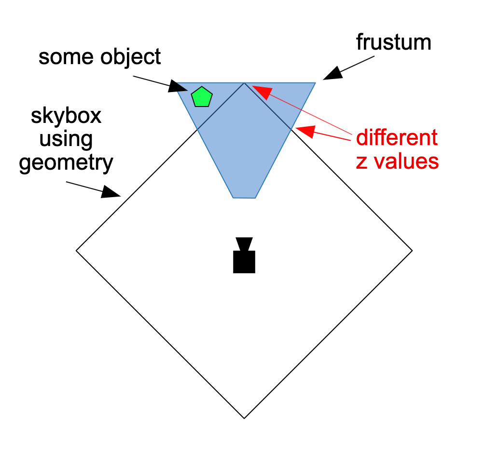

# [技术]天空盒

天空盒是一个赋予材质的盒子, 看起来好像四周都是天空,或者看起来像是在很远的地方, 包括地平线. 

许多3D游戏用一个立方体实现天空盒, 使其非常的大, 并且赋予其天空的材质.

这是有效的, 但是也存在一定的问题. 其中一个问题是这样的, 如果你有一个立方体, 你需要看向各个方向, 无论相机看到什么方向,你希望最远的物体都能被绘制. 但是你不希望立方体的角在裁剪面之外. 深入解释这个问题, 出于性能考虑, 你希望在远的物体绘制之前, 先绘制近的物体, 因此GPU使用深度缓冲检测, 会不会只无法通过检测的像素. 

所以理想情况下, 你需要在深度检测之后再绘制天空盒. 但是, 如果你真的用了一个盒子, 当相机朝向不同的方向看的时候, 盒子的角会比侧面更远, 这就会引起一些问题。

可以从上面这张图中看到，我们需要确保立方体最远的点在视椎体内， 但是这样一来，立方体的某些边缘是可能会遮挡一些我们原来不想遮挡的物体的。

典型的解决方案是：关闭深度检测并且首先绘制天空盒，但是这样一来，我们也不能利用深度检测实现一些物体覆盖绘制的特性了。

代替使用立方体，我们可以仅仅绘制一个覆盖整个画布的矩形， 并且使用“立方体贴图”。通常我们使用视图投影矩阵在三维空间中投影矩阵。

如果是这样做的话，通常我们会做一些相反的事。我们会反过来使用视图投影矩阵的你来获取相机看向矩阵的每一个像素的方向。这会是看向立方体贴图的方向。

