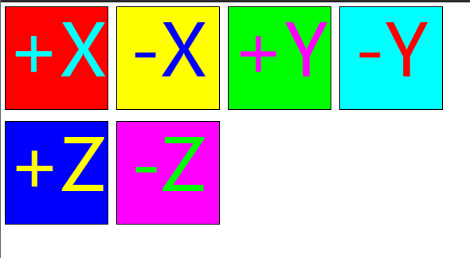

# 立方体贴图

在[三维纹理中](./[纹理]三维纹理.md)，我们介绍了如果使用纹理，是怎样通过横纵从0到1的纹理坐标引用，以及如何使用mip筛选。

还有一种纹理是cubemap，它包含了6个纹理，代表立方体的6个面。不像常规纹理坐标由两个维度，立方体纹理使用法向量，换句话说，这是三维的纹理。根据法向量的朝向选取立方体6个面中的一个，这个面的像素用来采样生成颜色。

这6个面通过他们相对于立方体中的方向被引用。

```js
gl.TEXTURE_CUBE_MAP_POSITIVE_X
gl.TEXTURE_CUBE_MAP_NEGATIVE_X
gl.TEXTURE_CUBE_MAP_POSITIVE_Y
gl.TEXTURE_CUBE_MAP_NEGATIVE_Y
gl.TEXTURE_CUBE_MAP_POSITIVE_Z
gl.TEXTURE_CUBE_MAP_NEGATIVE_Z
```

我们来做一个简单的例子, 使用二维的canvas来生成6个面的图片.

首先是填充画布纯色和中心文字的代码.

```js
function generateFace(ctx, faceColor, textColor, text) {
  const {width, height} = ctx.canvas;
  ctx.fillStyle = faceColor;
  ctx.fillRect(0, 0, width, height);
  ctx.font = `${width * 0.7}px sans-serif`;
  ctx.textAlign = 'center';
  ctx.textBaseline = 'middle';
  ctx.fillStyle = textColor;
  ctx.fillText(text, width / 2, height / 2);
}
```

然后调用它生成6个图片的代码:

```js
// 获取二维上下文
/** @type {Canvas2DRenderingContext} */
const ctx = document.createElement("canvas").getContext("2d");
 
ctx.canvas.width = 128;
ctx.canvas.height = 128;
 
const faceInfos = [
  { faceColor: '#F00', textColor: '#0FF', text: '+X' },
  { faceColor: '#FF0', textColor: '#00F', text: '-X' },
  { faceColor: '#0F0', textColor: '#F0F', text: '+Y' },
  { faceColor: '#0FF', textColor: '#F00', text: '-Y' },
  { faceColor: '#00F', textColor: '#FF0', text: '+Z' },
  { faceColor: '#F0F', textColor: '#0F0', text: '-Z' },
];
faceInfos.forEach((faceInfo) => {
  const {faceColor, textColor, text} = faceInfo;
  generateFace(ctx, faceColor, textColor, text);
 
  // 展示结果
  ctx.canvas.toBlob((blob) => {
    const img = new Image();
    img.src = URL.createObjectURL(blob);
    document.body.appendChild(img);
  });
});
```

最终绘制的结果如下图所示:



现在, 我们要将其应用在立方体上. 我们会使用三维纹理中的纹理图集的代码.

首先来创建着色器, 来使用立方体纹理. 首先修改一下着色器代码:

```c++
attribute vec4 a_position;
        
uniform mat4 u_matrix;

varying vec3 v_normal;

void main() {
    // 将位置和矩阵相乘
    gl_Position = u_matrix * a_position;

    // 传递法向量. 因为位置是以集合中心为原点的
    // 我们可以直接传递位置
    v_normal = normalize(a_position.xyz);
}
```

回忆一下三维方向光源这篇文章, 法向量通常是用来描述顶点所在面的方向的. 由于我们使用单位化的位置来作为法向量, 如果光照, 我们会得到平滑的光照立方体. 对于发现立方体, 我们需要为每个面的顶点设定不同的法向量.

我们已经不使用纹理坐标了, 所以不需要所有的设定纹理坐标相关的代码. 

在片元着色器中, 我们需要用`samplerCube`来代替`sampler2D`, 用`textureCube`代替`texture2D`. `textureCube`需要`vec3`方向值, 所以我们传递单位化的法向量. 因为法向量是`varing`会被插值, 所以我们是需要单位化的.

```c++
precision mediump float;
 
// 从顶点着色器传入。
varying vec3 v_normal;
 
// 纹理。
uniform samplerCube u_texture;
 
void main() {
   gl_FragColor = textureCube(u_texture, normalize(v_normal));
}
```

之后, 在js中我们需要设置纹理.

```js
// 生成纹理。
var texture = gl.createTexture();
gl.bindTexture(gl.TEXTURE_CUBE_MAP, texture);
 
// 获取2维上下文。
/** @type {Canvas2DRenderingContext} */
const ctx = document.createElement("canvas").getContext("2d");
 
ctx.canvas.width = 128;
ctx.canvas.height = 128;
 
const faceInfos = [
  { target: gl.TEXTURE_CUBE_MAP_POSITIVE_X, faceColor: '#F00', textColor: '#0FF', text: '+X' },
  { target: gl.TEXTURE_CUBE_MAP_NEGATIVE_X, faceColor: '#FF0', textColor: '#00F', text: '-X' },
  { target: gl.TEXTURE_CUBE_MAP_POSITIVE_Y, faceColor: '#0F0', textColor: '#F0F', text: '+Y' },
  { target: gl.TEXTURE_CUBE_MAP_NEGATIVE_Y, faceColor: '#0FF', textColor: '#F00', text: '-Y' },
  { target: gl.TEXTURE_CUBE_MAP_POSITIVE_Z, faceColor: '#00F', textColor: '#FF0', text: '+Z' },
  { target: gl.TEXTURE_CUBE_MAP_NEGATIVE_Z, faceColor: '#F0F', textColor: '#0F0', text: '-Z' },
];
faceInfos.forEach((faceInfo) => {
  const {target, faceColor, textColor, text} = faceInfo;
  generateFace(ctx, faceColor, textColor, text);
 
  // 上传画布到立方体贴图的每个面。
  const level = 0;
  const internalFormat = gl.RGBA;
  const format = gl.RGBA;
  const type = gl.UNSIGNED_BYTE;
  gl.texImage2D(target, level, internalFormat, format, type, ctx.canvas);
});
gl.generateMipmap(gl.TEXTURE_CUBE_MAP);
gl.texParameteri(gl.TEXTURE_CUBE_MAP, gl.TEXTURE_MIN_FILTER, gl.LINEAR_MIPMAP_LINEAR);
```

在这段代码中:

- 使用`gl.TEXTURE_CUBE_MAP`代替`gl.TEXTURE_2D`, 这是告诉webgl生成一个立方体纹理而不是二维纹理
- 用特殊的目标上传纹理的每个面:

```
gl.TEXTURE_CUBE_MAP_POSITIVE_X, gl.TEXTURE_CUBE_MAP_NEGATIVE_X, 
gl.TEXTURE_CUBE_MAP_POSITIVE_Y, gl.TEXTURE_CUBE_MAP_NEGATIVE_Y, 
gl.TEXTURE_CUBE_MAP_POSITIVE_Z, 和 gl.TEXTURE_CUBE_MAP_NEGATIVE_Z.
```

- 每个面都是正方形. 上面的例子是128x128的.

立方体纹理需要正方形纹理. 和二维纹理一样, 如果在两个方向上不是2的幂大小, 我们就不能用mip记性筛选. 这个例子中尺寸是特意设定的. 

立方体纹理通常不是给立方体设置纹理的.

正确或者说标准的给立方体设置纹理的方法是使用之前三维纹理中介绍的纹理图集的方法. 

那么立方体纹理一般使用用来做什么的呢?

最常见的用法是用来做**环境贴图**. 
