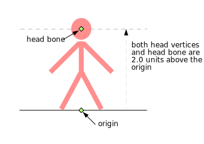
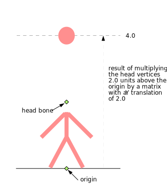
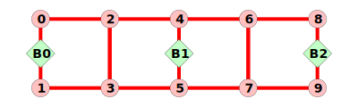
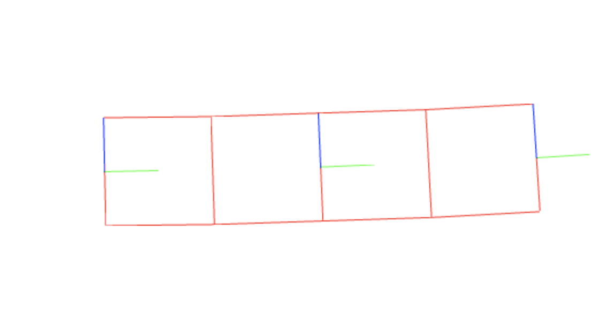
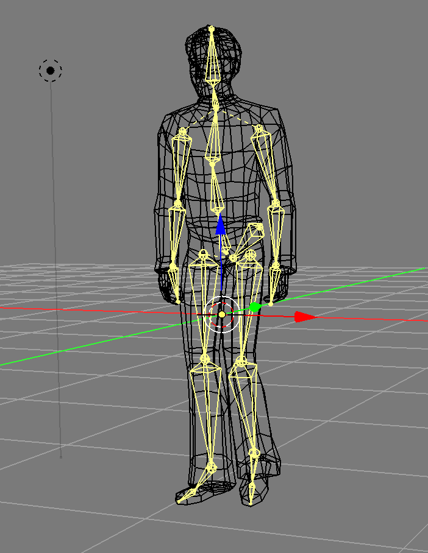
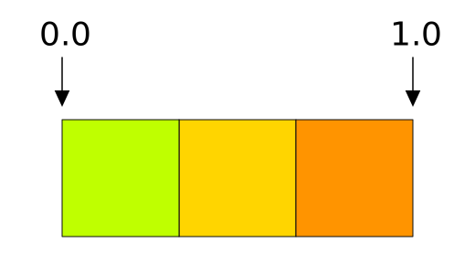
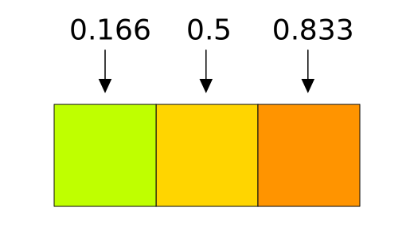
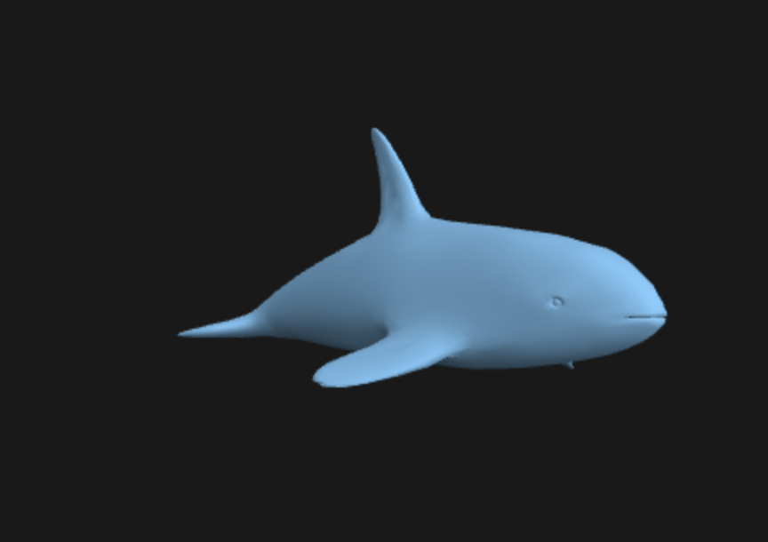

# [技术]蒙皮

图形学中的蒙皮是根据多矩阵的加权影响来移动一组顶点。

它被称为蒙皮是因为通常使3D角色拥有骨骼“Bone”组成的骨架“skeleton”, 在这里, 骨骼"bone"是矩阵的另一种表述方式, 并对每个顶点设置每个骨骼对该顶点一些影响。

举个例子，一个角色的手部的谷歌对靠近手的顶点的影响几乎是100%，脚部的谷歌对于这些顶点则不会有影响。 手腕附近的顶点会受手骨一些影响还会受臂骨一些影响。

基本你需要骨骼和权重。权重是每个顶点从0到1表示某一个骨骼矩阵对此顶点位置的影响程度。 从数据上看，权重有点像顶点颜色。每个顶点有一组权重。换句话说权重放在缓冲中通过属性提供。

通常你需要限制每个顶点的权重数量， 否则数据量就太大了。比如说，一个角色可能拥有300个骨骼。如果你不限制数量， 那么对于300个骨骼而言，每个顶点需要300权重对应300骨骼，如果你有100个顶点，那么就会需要300万的权重数据。

所以，大多数的实时蒙皮系统会限制每个顶点只有0~4个权重。通常会在模型导出、转换的时候进行处理，像bender、maya、3dsmax之类的3d软件中，对于每个顶点会找4个权重，并且对权重进行归一化处理。

非蒙皮顶点通常会这样计算：

```glsl
gl_Position = projection * view * model * position;
```

而蒙皮顶点经常是被这样计算的：

```glsl
gl_Position = projection * view *
              (bone1Matrix * position * weight1 + // 权重1
               bone2Matrix * position * weight2 + // 权重2
               bone3Matrix * position * weight3 + // 权重3
               bone4Matrix * position * weight4); // 权重4
```

这里还有一个问题，假如你有一个人物的模型，圆点（0，0，0）放在两脚之间的地上。


假设，你放置一个矩阵matrix/骨骼bone/关节joint在头部位置，并想用它作为蒙皮的骨骼。简单起见，假设你只设定了头部的顶点对于头部的骨骼有1.0的权重，其他地方的关节则不影响这些节点。



那么这里会有一个问题，头部顶点在原点上面2个单位，头部的骨骼也在原点上面两个单位。如果你想头部顶点和头部骨骼矩阵相乘，那么你会得到原点上面4个单位的位置。也就是等于原本顶点2个单位+头部骨骼矩阵的2个单位。



一种解决方案是存储“绑定姿势”，给每个关节增加一个额外的矩阵，你用矩阵来作用于顶点位置之前的位置。举个例子，头部矩阵的绑定姿势比原点高2个单位。那就用该矩阵的逆来减去额外的2个矩阵。

换句话说，传递给着色器的骨骼矩阵每个都乘以了他们的绑定姿势的逆矩阵，以便只影响从原有位置的变化。

举个例子。我们将制作类似这样的格子动画：



- `b0`, `b1`和 `b2`是骨骼矩阵。
- `b1`是`b0`的子，`b2`是`b1`的子
- 点`0,1`对于骨骼b0的权重为1.0
- 点`2,3`对于骨骼b0和骨骼b1的权重都为0.5
- 点`4,5`对于骨骼b1的权重为1.0
- 点`6,7`对于骨骼b1和骨骼b2的权重都为0.5
- 点`8,9`对于骨骼b2的权重为1.0

首先，我们需要顶点位置和影响每个顶点的每个骨骼下标以及0到1的数字权重来表示这个骨骼的影响程度。

```js
var arrays = {
  position: {
    numComponents: 2,
    data: [
     0,  1,  // 0
     0, -1,  // 1
     2,  1,  // 2
     2, -1,  // 3
     4,  1,  // 4
     4, -1,  // 5
     6,  1,  // 6
     6, -1,  // 7
     8,  1,  // 8
     8, -1,  // 9
    ],
  },
  boneNdx: {
    numComponents: 4,
    data: [
      0, 0, 0, 0,  // 0
      0, 0, 0, 0,  // 1
      0, 1, 0, 0,  // 2
      0, 1, 0, 0,  // 3
      1, 0, 0, 0,  // 4
      1, 0, 0, 0,  // 5
      1, 2, 0, 0,  // 6
      1, 2, 0, 0,  // 7
      2, 0, 0, 0,  // 8
      2, 0, 0, 0,  // 9
    ],
  },
  weight: {
    numComponents: 4,
    data: [
     1, 0, 0, 0,  // 0
     1, 0, 0, 0,  // 1
    .5,.5, 0, 0,  // 2
    .5,.5, 0, 0,  // 3
     1, 0, 0, 0,  // 4
     1, 0, 0, 0,  // 5
    .5,.5, 0, 0,  // 6
    .5,.5, 0, 0,  // 7
     1, 0, 0, 0,  // 8
     1, 0, 0, 0,  // 9
    ],
  },
 
  indices: {
    numComponents: 2,
    data: [
      0, 1,
      0, 2,
      1, 3,
      2, 3, //
      2, 4,
      3, 5,
      4, 5,
      4, 6,
      5, 7, //
      6, 7,
      6, 8,
      7, 9,
      8, 9,
    ],
  },
};
// 调用gl.createBuffer, gl.bindBuffer, gl.bufferData
var bufferInfo = webglUtils.createBufferInfoFromArrays(gl, arrays);
```

定义全局变量包括对应每个骨骼的矩阵：

```js
// 4个矩阵, 每个骨骼一个
var numBones = 4;
var boneArray = new Float32Array(numBones * 16);
 
var uniforms = {
  projection: m4.orthographic(-20, 20, -10, 10, -1, 1),
  view: m4.translation(-6, 0, 0),
  bones: boneArray,
  color: [1, 0, 0, 1],
};
```

在boneArrays中创建视图，每个矩阵一个：

```js
// 为所有骨骼创建视图
// 在一个数组中以便上传，但是是分割的
// 数学计算用到的数组
var boneMatrices = [];  // 全局变量数据
var bones = [];         // 乘以绑定矩阵的逆之前的值
var bindPose = [];      // 绑定矩阵
for (var i = 0; i < numBones; ++i) {
  boneMatrices.push(new Float32Array(boneArray.buffer, i * 4 * 16, 16));
  bindPose.push(m4.identity());  // 仅仅分配存储空间
  bones.push(m4.identity());     // 仅仅分配存储空间
}
```

接下来是一些计算骨骼矩阵的代码。我们只是需要在层级中进行旋转。

```js
// 旋转每个骨骼角度，模拟一个层级
function computeBoneMatrices(bones, angle) {
  var m = m4.identity();
  m4.zRotate(m, angle, bones[0]);
  m4.translate(bones[0], 4, 0, 0, m);
  m4.zRotate(m, angle, bones[1]);
  m4.translate(bones[1], 4, 0, 0, m);
  m4.zRotate(m, angle, bones[2]);
  // bones[3]没有用
}
```

然后调用一次来生成初始位置，用结果再绑定姿势矩阵的逆。

```js
// 计算每个矩阵的初始位置
computeBoneMatrices(bindPose, 0);
 
// 计算他们的逆
var bindPoseInv = bindPose.map(function(m) {
  return m4.inverse(m);
});

```

现在我们就可以开始渲染了。

首先为骨骼设置动画，为每一个骨骼计算一个新的世界矩阵。

```js
var t = time * 0.001;
var angle = Math.sin(t) * 0.8;
computeBoneMatrices(bones, angle);
```

之后，我们将结果乘以绑定姿势的逆来解决之前提到的问题。

```js
// 每个都乘以绑定矩阵的逆
bones.forEach(function(bone, ndx) {
  m4.multiply(bone, bindPoseInv[ndx], boneMatrices[ndx]);
});
```

然后就是所有常规的步骤，设置属性，设置全局变量，渲染：

```js
gl.useProgram(programInfo.program);
// 调用gl.bindBuffer, gl.enableVertexAttribArray, gl.vertexAttribPointer
webglUtils.setBuffersAndAttributes(gl, programInfo, bufferInfo);
 
// 调用gl.uniformXXX, gl.activeTexture, gl.bindTexture
webglUtils.setUniforms(programInfo, uniforms);
 
// 调用gl.drawArrays or gl.drawIndices
webglUtils.drawBufferInfo(gl, bufferInfo, gl.LINES);
```

最终显示的效果大致如下：



红色是蒙皮网格。绿线和蓝线则分别代表每个骨骼或者“关节”的x轴和y轴。你可以看到顶点是如何受多个骨骼影响并在他们之间移动的。我们没有介绍如何绘制骨骼，因为它对于解释蒙皮是怎么工作的并不重要。

注意， 骨骼bones 关节joints让人迷惑。 但是都指向的是一件事情：矩阵。但是，在3d模型包中通常会画一个gizmo在矩阵之间，最终看起来像骨骼一样。关节是矩阵所处的位置，他们从一个关节到下一个画一条线或椎体使它看起来像一个骨架。



另外一个需要注意的小事，上面的例子权重和骨骼下标使用的是浮点数，可以使用`UNSIGNED_BYTE` 来节省一些空间。

不幸的是， 着色器中可以使用的全局变量的数量是有限制的。位于webgl，比较低的限制可能是64个vec4， 也就是8个mat4，你可能需要一些全局变量用于其他的事情，比如片元着色器中的`color`以及`projection`和`view`这意味着，如果我们在一个限制为64个vec4的设备上，我们最多只能创建5个骨骼。大多数设备支持128个vec4，其中70%支持256个vec4，但是对于上面的例子来说，者分别只有13个骨骼和29个骨骼。这与现代游戏中使用的骨骼数量相去甚远。

关于这个问题有很多种办法。一个是离线预处理模型并打破它们为多个部分，每个使用不超过N个骨骼。这样的处理方式会带来比较大的复杂度。

另外一种方法是将骨骼矩阵存储在纹理中。一个重要的启示：纹理不仅仅是图片，它们实际上是你可以传递给着色器的随机访问的2d数组矩阵，你可以使用他们来做各种事情，不仅仅是读取图像。

让我们用纹理传递矩阵，来绕过全局变量的限制问题。让其简单我们准备使用浮点型纹理。浮点型纹理是wengl的可选能力，不过还好大多数设备是支持它的。

这是获得扩展的代码。如果它失败了，我们可能就要告诉用户他们运气不好或者选择其他的解决方案。

```javascript
var ext = gl.getExtension('OES_texture_float');
if (!ext) {
  return;  // 扩展在这个设备上不存在
}
```

让我们更新着色器从纹理中获取矩阵。我们会制作每行一个矩阵的纹理。纹理的每个纹素texel有R、G、B和A，则是4个值，所以每个矩阵我们只需要4个像素，一个像素对应矩阵的每一行。纹理在某一维度上的限制通常至少2048个像素，所以我们得到了一个至少2048的骨骼矩阵空间。这就足够使用了。

```js
attribute vec4 a_position;
attribute vec4 a_weight;
attribute vec4 a_boneNdx;
 
uniform mat4 projection;
uniform mat4 view;
uniform sampler2D boneMatrixTexture;
uniform float numBones;
 
// 这些偏移假设纹理每行4像素
#define ROW0_U ((0.5 + 0.0) / 4.)
#define ROW1_U ((0.5 + 1.0) / 4.)
#define ROW2_U ((0.5 + 2.0) / 4.)
#define ROW3_U ((0.5 + 3.0) / 4.)
 
mat4 getBoneMatrix(float boneNdx) {
  float v = (boneNdx + 0.5) / numBones;
  return mat4(
    texture2D(boneMatrixTexture, vec2(ROW0_U, v)),
    texture2D(boneMatrixTexture, vec2(ROW1_U, v)),
    texture2D(boneMatrixTexture, vec2(ROW2_U, v)),
    texture2D(boneMatrixTexture, vec2(ROW3_U, v)));
}
 
void main() {
 
  gl_Position = projection * view *
                (getBoneMatrix(a_boneNdx[0]) * a_position * a_weight[0] +
                 getBoneMatrix(a_boneNdx[1]) * a_position * a_weight[1] +
                 getBoneMatrix(a_boneNdx[2]) * a_position * a_weight[2] +
                 getBoneMatrix(a_boneNdx[3]) * a_position * a_weight[3]);
 
}

```

需要注意的是，纹理中像素的纹理坐标是从他们的边缘计算的。像我们在纹理的文章中提到的纹理坐标从0到1，0是最左边缘的像素，1是最右边缘的像素。如果你有宽度为3像素的纹理，那就像这样。



如果要选取某个特定的像素，那么公式就是：

```js
(x + .5) / width
```

上面的每个像素就是：

```javascript
(0 + .5) / 3  = 0.166
(1 + .5) / 3 =  0.5
(2 + .5) / 3 =  0.833
```

或者：



现在，我们设定一个放入骨骼矩阵的纹理

```javascript
// 准备纹理来存骨骼矩阵
var boneMatrixTexture = gl.createTexture();
gl.bindTexture(gl.TEXTURE_2D, boneMatrixTexture);
// 因为我们希望使用纹理的原始数据
// 我们关闭筛选
gl.texParameteri(gl.TEXTURE_2D, gl.TEXTURE_MIN_FILTER, gl.NEAREST);
gl.texParameteri(gl.TEXTURE_2D, gl.TEXTURE_MAG_FILTER, gl.NEAREST);
// 也关闭包裹，因为纹理也许不是2的幂
gl.texParameteri(gl.TEXTURE_2D, gl.TEXTURE_WRAP_S, gl.CLAMP_TO_EDGE);
gl.texParameteri(gl.TEXTURE_2D, gl.TEXTURE_WRAP_T, gl.CLAMP_TO_EDGE);
```

所以这就是蒙皮的基础知识。写呈现蒙皮网格的代码并不困难。更困难的部分实际上是获取数据。你通常需要一些3d软件， 然后要么写你自己的导出器或者找到一个导出器提供所有你需要的数据。你会看到向我们介绍的一样加载蒙皮相较于展示它会有10倍多的代码。

相对于这些代码，引擎是最简单的部分。

## 加载GLTF 模型

首先还是先来尝试显示没有添加蒙皮的模型.

首先我们要加载一个glTF文件, glTF是为了WebGL设计的.

glTF有两种格式, `.gltf`是一个JSON文件, 通常引用一个`.bin`文件, 这是一个二进制文件,  通常只包含几何体, 可能会包含动画数据. 另一种格式是`.glb`二进制格式. 通常是JSON和其他文件连接到一个二进制文件内,  每个连接部分之间有一个短头和一个大小/类型的描述. 对于js来说, `.gltf`是比较容易上手格式. 

下面的代码则主要是用来实现一个glTF的模型加载器。首先，加载先关的数据：

```javascript
async function oadGLTF(url) {
  const gltf = await loadJSON(url);

  // 加载所有gltf文件相关联的文件
  const baseURL = new URL(url, location.href);
  gltf.buffers = await Promise.all(
    gltf.buffers.map(buffer => {
      const url = new URL(buffer.uri, baseURL.href);
      return loadBinary(url.href);
    })
  );
}

function loadFile(url, typeFunc) {
  const response = await fetch(url);
  if (!response.ok) {
    throw new Error(`counld not load:${url}`);
  }
  return await response[typeFunc]();
}

function loadBinary(url) {
  return loadFile(url, 'arrayBuffer');
}

function loadJSON(url) {
  return loadFile(url, 'json');
}
```

我们需要遍历所有的数据，然后将其连接起来。

glTF是如何定义一个网格的呢？网格是图元的集合。图元实际上是渲染所需要的缓冲和属性。我们会遍历文件中的所有网格，为每个网格创建一个传递给`webglUtils.setBuffersAndAttributes`的`BufferInfo`, 回忆`BufferInfo`实际上只是一些属性信息，下标（如果有的话）以及传递给`gl.drawXXX`的元素数量。举个例子，一个只有位置和法线的立方体会构建如下结构的`BufferInfo`:

```javascript
const cubeBufferInfo = {
  attribs: {
    'a_POSITION': { buffer: WebGLBuffer, type: gl.FLOAT, numComponents: 3, },
    'a_NORMAL': { buffer: WebGLBuffer, type: gl.FLOAT, numComponents: 3, },
  },
  numElements: 24,
  indices: WebGLBuffer,
  elementType: gl.UNSIGNED_SHORT,
}
```

我们会去遍历每一个图元，然后生成一个像这样的`BufferInfo`。

图元有一组属性, 每个属性引用一个访问器. 访问器描述数据的类型. 比如`VEC3/gl.FLOAT`并引用一个视图缓冲. 给定一个访问器的下标, 我们可以编写一些代码来返回一个WebGLBuffer, 其中会包含加载的数据, 访问器, 缓冲视图的stride.

```javascript
/**
 * 给定一个访问器下标返回一个访问器, WebGLBuffer和一个stride
 * @param {*} gl 绘图上下文
 * @param {*} gltf 模型数据
 * @param {*} accessorIndex 访问器下标
 * @returns
 */
function getAccessprAndWebGLBuffer(gl, gltf, accessorIndex) {
  const accessor = gltf.accessors[accessorIndex];
  const bufferView = gltf.bufferViews[accessor.bufferView];
  if (!bufferView.webglBuffer) {
    const buffer = gl.createBuffer();
    const target = bufferView.target || gl.ARRAY_BUFFER;
    const arrayBuffer = gltf.buffers[bufferView.buffer];
    const data = new Uint8Array(arrayBuffer, bufferView.byteOffset, bufferView.byteLength);
    gl.bindBuffer(target, buffer);
    gl.bufferData(target, data, gl.STATIC_DRAW);
    bufferView.webglBuffer = buffer;
  }
  return {
    accessor,
    buffer: bufferView.webglBuffer,
    stride: bufferView.stride || 0,
  };
}
```

然后我们需要一个将gltf访问器的type类型转换为数字的方法.

```javascript
// 将访问器的类型转换为数字的方法
function accessorTypeToNumComponents(type) {
  function throwNoKey(key) {
    throw new Error(`no key: ${key}`);
  }

  const accessorTypeToNumComponentsMap = {
    SCALAR: 1,
    VEC2: 2,
    VEC3: 3,
    VEC4: 4,
    MAT2: 4,
    MAT3: 9,
    MAT4: 16,
  };

  return accessorTypeToNumComponentsMap[type] || throwNoKey(type);
}
```

然后利用这些工具函数, 我们可以使用他们来设置网格.

注意: glTF文件是可以定义材质的, 但是我们这里的导出器没有导出任何材质到文件内. 如果文件中没有材质的话, 我们会使用默认材质. 

```javascript
// 定义默认材质
const defaultMaterial = {
  uniforms: {
    u_diffuse: [0.5, 0.8, 1, 1],
  },
};

// 设置网格
gltf.meshes.forEach(mesh => {
  // 遍历gltf的所有网格
  mesh.primitives.forEach(primitive => {
    // 遍历所有网格单元
    const attribs = {};
    let numElements;
    for (const [attribName, index] of Object.entries(primitive.attributes)) {
      const { accessor, buffer, stride } = getAccessorAndWebGLBuffer(gl, gltf, index);
      numElements = accessor.count;
      attribs[`a_${attribName}`] = {
        buffer,
        type: accessor.componentType,
        numComponents: accessorTypeToNumComponents(accessor.type),
        stride,
        offset: accessor.byteOffset | 0,
      };
    }

    const bufferInfo = {
      attribs,
      numElements,
    };

    if (primitive.indices !== undefined) {
      const { accessor, buffer } = getAccessorAndWebGLBuffer(gl, gltf, primitive.indices);
      bufferInfo.numElements = accessor.count;
      bufferInfo.indices = buffer;
      bufferInfo.elementType = accessor.componentType;
    }

    primitive.bufferInfo = bufferInfo;

    // 存储图元的材质信息
    primitive.material = (gltf.materials && gltf.materials[primitive.material]) || defaultMaterial;
  });
});
```

现在每个图元都有一个`bufferInfo`和一个`material`属性.

对于蒙皮, 我们通常是需要某种场景图的.  场景图的代码可以参考之前场景图相关的示例.

将glTF文件中的节点数据存储为数字. 我们会转换glTF文件中的节点数据为Node示例. 我们存储节点数据的就数组则为`originNodes`.

```javascript
// 将gltd中的节点数据转变为Node示例, 将原本的数据保存为`origNodes`
const origNodes = gltf.nodes;
gltf.nodes = gltf.nodes.map(n => {
  const { name, skin, mesh, translation, rotation, scale } = n;
  const trs = new TRS(translation, rotation, scale);
  const node = new Node(trs, name);
  const realMesh = gltf.meshes[mesh];
  if (realMesh) {
    node.drawables.push(new MeshRenderer(realMesh));
  }
  return node;
});
```

上面的代码中, 我们为每个节点创建了一个`TRS`实例, 一个`Node`实例, 我们可以查找之前的网格数据, 如果有mesh属性的话, 创建一个`MesgReanderer`来进行绘制. 

MeshRenderer的创建如下. 这里只是渲染单个模型代码的封装, 所做的就是存一个对于网络的引用, 然后为每个图元设置程序, 属性以及全局变量, 最终通过`webglUtls.drawBufferInfo`调用`gl.drawArrays`或者`gl.drawElemnts`.

```javascript
class MeshRenderer {
  constructor(mesh) {
    this.mesh = mesh;
  }
  render(node, projection, view, sharedUniforms) {
    const { mesh } = this;
    gl.useProgram(meshProgramInfo.program);
    for (const primitive of mesh.primitives) {
      webglUtils.setBuffersAndAttributes(gl, meshProgramInfo, primitive.bufferInfo);
      webglUtils.setUniforms(meshProgramInfo, {
        u_projection: projection,
        u_view: view,
        u_world: node.worldMatrix,
      });
      webglUtils.setUniforms(meshProgramInfo, primitive.material.uniforms);
      webglUtils.setUniforms(meshProgramInfo, sharedUniforms);
      webglUtils.drawBufferInfo(gl, primitive.bufferInfo);
    }
  }
}
```

节点已经创建了, 现在我们需要将它们实际加入到场景中. 在gltd中,  大概需要两步来完成. 

首先, 每个节点有一个可选的children属性, 为子节点的下标数组, 所以我们可以遍历所有节点为它们的子节点设定父节点.

```javascript
function addChildren(nodes, node, childIndices) {
  childIndices.forEach((childNdx) => {
    const child = nodes[childNdx];
    child.setParent(node);
  });
}
 
// 将节点加入场景图
gltf.nodes.forEach((node, ndx) => {
  const children = origNodes[ndx].children;
  if (children) {
    addChildren(gltf.nodes, node, children);
  }
});
```

然后有一个场景的数组. 一个场景有一个场景底部节点在nodes数组下来引用这些节点. glTF中不会从一个单个的根节点开发, 所以我们需要创建一个根节点, 作为所有场景子节点的父节点. 

```javascript
  // 设置场景
  for (const scene of gltf.scenes) {
    scene.root = new Node(new TRS(), scene.name);
    addChildren(gltf.nodes, scene.root, scene.nodes);
  }
```

这样就完成了网格部分的模型加载. 

下一步是需要一个与gltf文件中的数据匹配的着色器. gltf中的图元数据如下:

```json
{
    "name" : "orca",
    "primitives" : [
        {
            "attributes" : {
                "JOINTS_0" : 5,
                "NORMAL" : 2,
                "POSITION" : 1,
                "TANGENT" : 3,
                "TEXCOORD_0" : 4,
                "WEIGHTS_0" : 6
            },
            "indices" : 0
        }
    ]
}
```

这样, 我们只需要使用`NORMAL`和`POSITION`来进行渲染. 我们需要一个这样的着色器:

```glsl
attribute vec4 a_POSITION;
attribute vec3 a_NORMAL;
 
uniform mat4 u_projection;
uniform mat4 u_view;
uniform mat4 u_world;
 
varying vec3 v_normal;
 
void main() {
  gl_Position = u_projection * u_view * u_world * a_POSITION;
  v_normal = mat3(u_world) * a_NORMAL;
}
```

片元着色器中则使用一个简单的平行光:

```glsl
precision mediump float;
 
varying vec3 v_normal;
 
uniform vec4 u_diffuse;
uniform vec3 u_lightDirection;
 
void main () {
  vec3 normal = normalize(v_normal);
  float light = dot(u_lightDirection, normal) * .5 + .5;
  gl_FragColor = vec4(u_diffuse.rgb * light, u_diffuse.a);
}
```

接下来就是常规的渲染了.  稍有不同的地方在于:

```javascript
const sharedUniforms = {
  u_lightDirection: m4.normalize([-1, 3, 5]),
};
 
function renderDrawables(node) {
  for(const drawable of node.drawables) {
      drawable.render(node, projection, view, sharedUniforms);
  }
}
 
for (const scene of gltf.scenes) {
  // 更新场景中的世界矩阵。
  scene.root.updateWorldMatrix();
  // 遍历场景并渲染所有renderables
  scene.root.traverse(renderDrawables);
}
```

之前我们用于计算投影, 相机矩阵, 视图矩阵这些代码我们要遍历每个场景, 调用`scene.root.updateWorldMatrix`来更新图中的所有节点的矩阵. 然后为`renderDrawables`调用`scene.root.traverse`.

`renderDrawables`调用节点上所有绘制对象的渲染方法, 传入投影, 视图矩阵以及`sharedUniforms`包含的光照信息.



## 为模型添加蒙皮

首先需要创建一个代表蒙皮的类:

```js
// 蒙皮
  class Skin {
    constructor(joints, inverseBindMatrixData) {
      this.joints = joints;
      this.inverseBindMatrices = [];
      this.jointMatrices = [];
      // 为每个关节分配足够的空间
      this.jointData = new Float32Array(joints.length * 16);
      // 为每个关节和绑定逆矩阵创建视图
      for (let i = 0; i < joints.length; ++i) {
        this.inverseBindMatrices.push(
          new Float32Array(
            inverseBindMatrixData.buffer,
            inverseBindMatrixData.byteOffset + Float32Array.BYTES_PER_ELEMENT * 16 * i,
            16
          )
        );
        this.jointMatrices.push(new Float32Array(this.jointData.buffer, Float32Array.BYTES_PER_ELEMENT * 16 * i, 16));
      }
      // 创建存储关节矩阵的纹理
      this.jointTexture = gl.createTexture();
      gl.bindTexture(gl.TEXTURE_2D, this.jointTexture);
      gl.texParameteri(gl.TEXTURE_2D, gl.TEXTURE_MIN_FILTER, gl.NEAREST);
      gl.texParameteri(gl.TEXTURE_2D, gl.TEXTURE_MAG_FILTER, gl.NEAREST);
      gl.texParameteri(gl.TEXTURE_2D, gl.TEXTURE_WRAP_S, gl.CLAMP_TO_EDGE);
      gl.texParameteri(gl.TEXTURE_2D, gl.TEXTURE_WRAP_T, gl.CLAMP_TO_EDGE);
    }
    update(node) {
      const globalWorldInverse = m4.inverse(node.worldMatrix);
      // 遍历每个关节获取当前世界矩阵
      // 计算绑定矩阵的逆
      // 在纹理中存储整个结果
      for (let j = 0; j < this.joints.length; ++j) {
        const joint = this.joints[j];
        const dst = this.jointMatrices[j];
        m4.multiply(globalWorldInverse, joint.worldMatrix, dst);
        m4.multiply(dst, this.inverseBindMatrices[j], dst);
      }
      gl.bindTexture(gl.TEXTURE_2D, this.jointTexture);
      gl.texImage2D(gl.TEXTURE_2D, 0, gl.RGBA, 4, this.joints.length, 0, gl.RGBA, gl.FLOAT, this.jointData);
    }
  }
```

它会管理关节列表, 关节就是我们所说的节点, 它还会有绑定矩阵的逆矩阵, 蒙皮也会管理我们放入关节矩阵的材质对象. 

类似于`MeshRender`, 我们需要一个`SkinRenderer`来调用`Skin`渲染蒙皮网格, 以及需要一个支持渲染蒙皮的着色器程序. 

注意, 我们在这里用了`u_world`相乘, 在`Skin.update`中减去了它. 

之所以要这样做, 是为了允许实例化蒙皮. 换句话说, 我们可以在相同帧的不同的地方渲染蒙皮网格. 如果有更多的关节, 对于一个蒙皮网格做所有的矩阵运算是非常慢的,  上面的做法使得我们只需要进行一次的原酸, 然后就能通过一个不同的世界矩阵, 将蒙皮网格重新渲染在任何的地方. 

这对于显示一群角色是有用的, 但是不幸的是所有的角色都会有相同的姿势, 所以我并不清楚这是否有用. 

我们需要让一些节点动起来. 遍历Skin中的每个节点, 然后在本身的x轴上加一点点旋转.

为此, 我们需要保存每个关节的原始本地矩阵. 我们在每一帧中旋转一些本地矩阵. 然后在渲染的时候调用它.

当然这不是一种常用的做法, 理想情况下, 我们应该去加载一些动画, 或者我们应该知道我们想要以某种方式去擦操作某些特定的关节的时候. 这里只是为了看看蒙皮是否是有效的. 


