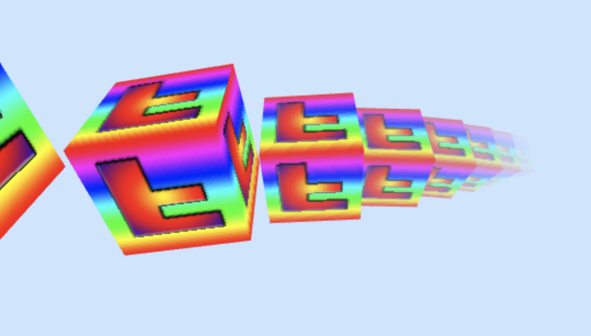
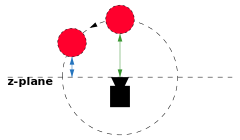
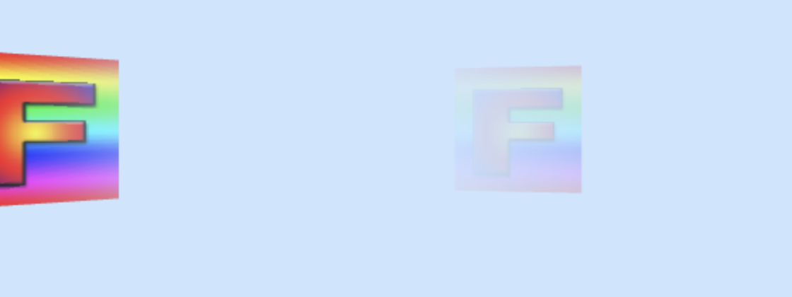
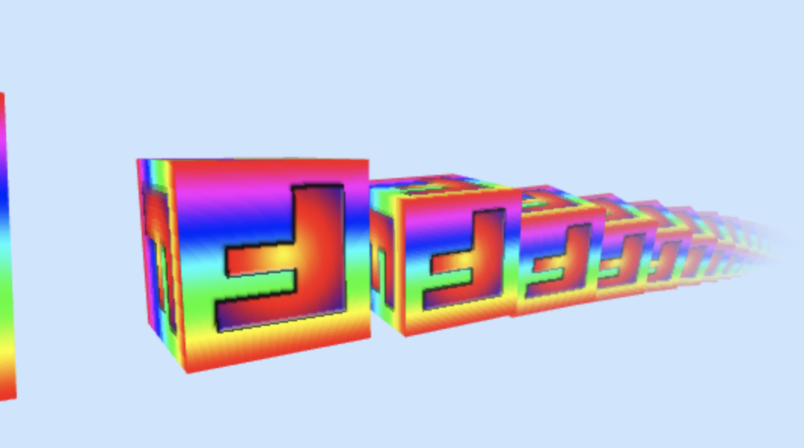

# 雾

如何在WebGL中实现雾的效果, 基本上的思路就是你在说色漆中使用某些从相机位置计算的深度或者距离来使得颜色或多或少的称为雾色. 

换句话说, 我们是从这样的基本公式开始的:

```glsl
gl_FragColor = mix(originalColor, fogColor, fogAmount);
```

其中`fogAmount`是0到1之间的值. `mix`函数混合了前面的两个值.

当`fogAmount`为0的时候, mix返回`OriginalColor`. 当`fogAmount`为1 的时候, `mix`返回`fogColor`, 在0到1之间的时候, 则会获得两个颜色按百分比混合的颜色值. 我们也可以这样实现一个`mix`:

```glsl
gl_FragColor = originalColor + (fogColor - originalColor) * fogAmount;
```

所以我们真正需要做的就是根据一些原则, 比如以相机为基准的深度来计算雾量代替传入雾量.

回顾关于相机的一些文章, 在我们应用视图矩阵之后, 所有位置转换为相对于相机的位置. 相机看向`-z`轴, 所以如果我们只看z位置, 在乘以世界和视图矩阵以后, 我们能得到一个值, 代表相较于相机所在z平面的距离.

我们可以改变顶点着色器来传递这个数据给片元着色器, 是的我们能够用它来计算雾量. 

为此, 我们可以将`u_matrix`分为两部分, 一个投影矩阵和一个世界视图矩阵. 

```glsl
attribute vec4 a_position;
        attribute vec2 a_texcoord;
        
        uniform mat4 u_worldView;
        uniform mat4 u_projection;
        
        varying vec2 v_texcoord;
        varying float v_fogDepth;
        
        void main() {
          // 给位置乘以矩阵
          gl_Position = u_projection * u_worldView * a_position;
        
          // 传递纹理给片元着色器
          v_texcoord = a_texcoord;
        
          // 传递相对于相机的负z位置
          // 相机看向-z方向, 所以通常在相机前面的物体会有一个负z位置
          // 取负, 我们就得到一个正的深度
          v_fogDepth = -(u_worldView * a_position).z;
        }
```

现在在片元着色器中, 如果我们希望深度小于一定的值的时候, 不融合雾色, 如果深度大于某些值, 则雾色为100%. 在两个值之间则融合颜色.

可以通过编写代码来实现这点, 也可以借助GLSL的`smoothstep`函数来进行插值. 

```glsl
precision mediump float;

        // 从顶点着色器获取的数据
        varying vec2 v_texcoord;
        varying float v_fogDepth;
        
        // 纹理
        uniform sampler2D u_texture;
        uniform vec4 u_fogColor;
        uniform float u_fogNear;
        uniform float u_fogFar;
        
        void main() {
          vec4 color = texture2D(u_texture, v_texcoord);
          // 计算插值
          float fogAmount = smoothstep(u_fogNear, u_fogFar, v_fogDepth);
        
          gl_FragColor = mix(color, u_fogColor, fogAmount);  
        }
```

下面的事情就简单了.



使用深度来计算雾量是很简单, 但是有个问题.

假如我们有一个绕相机运动的物体, 我们根据相机z平面的距离计算, 物体会在视觉夹角比较大的位置显性. 





修复的办法是用计算到相机的距离代替. 

为此, 我们只需要将视图空间中的顶点位置从顶点着色器传递到片元着色器. 

然后在片元着色器中我们可以使用位置来计算距离. 

```glsl
precision mediump float;
 
// 从顶点着色器传入
varying vec2 v_texcoord;
varying vec3 v_position;
 
// 纹理。
uniform sampler2D u_texture;
uniform vec4 u_fogColor;
uniform float u_fogNear;
uniform float u_fogFar;
 
void main() {
  vec4 color = texture2D(u_texture, v_texcoord);
 
  float fogDistance = length(v_position);
  float fogAmount = smoothstep(u_fogNear, u_fogFar, fogDistance);
 
  gl_FragColor = mix(color, u_fogColor, fogAmount);  
}
```

到目前为止, 我们所有的雾都使用了线性计算. 换句话说, 在最近处到最远处之间雾颜色被线性的施加. 像现实中的需索事物一样, 雾是指数方式显示的. 它根据观察者距离的平方变厚. 一个常见的指数雾公式如下:

```glsl
#define LOG2 1.442695
 
fogAmount = 1. - exp2(-fogDensity * fogDensity * fogDistance * fogDistance * LOG2));
fogAmount = clamp(fogAmount, 0., 1.);
```

要使用这个公式, 可以把对应的计算方式修改一下. 

```glsl
precision mediump float;

        // 从顶点着色器获取的数据
        varying vec2 v_texcoord;
        varying vec3 v_position;
        
        // 纹理
        uniform sampler2D u_texture;
        uniform vec4 u_fogColor;
        uniform float u_fogDensity;
        
        void main() {
            vec4 color = texture2D(u_texture, v_texcoord);

            #define LOG2 1.442695
          
            float fogDistance = length(v_position);
            float fogAmount = 1. - exp2(-u_fogDensity * u_fogDensity * fogDistance * fogDistance * LOG2);
            fogAmount = clamp(fogAmount, 0., 1.);
          
            gl_FragColor = mix(color, u_fogColor, fogAmount);    
        }
```

大致修改后的效果如下:



需要注意的是, 基于密度的雾没有最近值和最远值设置. 它可能更符合真实情况但也可能不符合你的审美需求. 

其实还有很多计算雾的方法. 在底薪能GPU上, 你可能只是用`gl_FragCoord.z`. `gl_FragCoord`是WebGL内置的全局变量, x和y是被绘制像素的坐标, z是像素的深度, 范围是从0到1. 虽然不能直接转换到距离, 但是你可以选取从0到1的某些值作为最近值和最远值来获得看起来像雾的效果. 没有需要从顶点着色器传递到片元着色器的值, 也不需要进行距离计算, 所以这时一个在低性能GPU上的好办法.