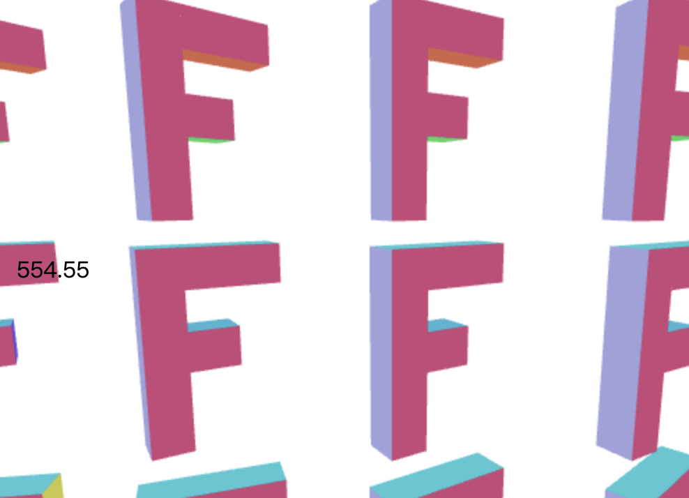

# [文字]Html

在WebGL中, 一个常见的问题就是"如何在WebGL中绘制文字", 首先你需要问自己绘制文字的目的是什么. 你在浏览器中, 浏览器是可以显示文字的, 所以, 第一种方法就是直接使用HTML显示文字. 

首先来用一个简单的例子来说明: 假设你只需要在WebGL上方绘制文字, 这种类型就叫做"覆盖文字", 这样的文字基本上是固定在某个位置的. 

简单的实现方式就是用HTML创建元素, 然后使用CSS让他们覆盖在画布上. 

这种技术并不复杂. 进一步的需求可能是文字的位置和渲染的东西需要相互关联. 

首先我们创建一个容器, 放入画布和其他的节点, 以及我们需要移动的HTML内容.

```html
<div class="container">
  <canvas id="canvas" width="400" height="300"></canvas>
  <div id="divcontainer"></div>
</div>
```

设置对应的CSS:

```css
.container {
    position: relative;
    overflow: none;
    width: 400px;
    height: 300px;
}
 
#divcontainer {
    position: absolute;
    left: 0px;
    top: 0px;
    width: 100%;
    height: 100%;
    z-index: 10;
    overflow: hidden;
 
}
 
.floating-div {
    position: absolute;
}
```

找到`divcontainer`, 创建div:

```javascript
// 找到 divcontainer
var divContainerElement = document.querySelector("#divcontainer");
 
// 创建 div
var div = document.createElement("div");
 
// 设置 CSS 类
div.className = "floating-div";
 
// 创建一个文字节点作为内容
var textNode = document.createTextNode("");
div.appendChild(textNode);
 
// 加到 divcontainer 里
divContainerElement.appendChild(div);
```

然后通过设置样式来改变位置:

```js
div.style.left = Math.floor(x) + "px";
div.style.top  = Math.floor(y) + "px";
textNode.nodeValue = clock.toFixed(2);
```



这样数字会随着值的变化而移动. 

下一步是让位置和三维场景中的东西进行关联. 

我们知道如何在三维场景中使用矩阵, 我们也可以在js中进行相同的运算:

```js
gl.drawArrays(...);
 
// 我们刚计算出绘制三维 F 的矩阵
 
// 选择物体空间中 'F' 的一点
//             X  Y  Z  W
var point = [100, 0, 0, 1];  // 这是正面的右上角
 
// 使用矩阵计算出这一点的裁剪空间坐标
var clipspace = m4.transformVector(matrix, point);
 
// 将 X 和 Y 除以 W，和 GPU 一样
clipspace[0] /= clipspace[3];
clipspace[1] /= clipspace[3];
 
// 从裁剪空间转换到像素值
var pixelX = (clipspace[0] *  0.5 + 0.5) * gl.canvas.width;
var pixelY = (clipspace[1] * -0.5 + 0.5) * gl.canvas.height;
 
// 定位 div
div.style.left = Math.floor(pixelX) + "px";
div.style.top  = Math.floor(pixelY) + "px";
textNode.nodeValue = clock.toFixed(2);
```

