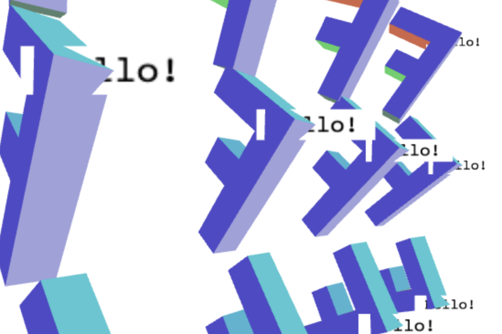

# [文字]使用纹理

在二维的canvas中绘制图片, 确实是一种可行并且容易实现的方法, 但是也存在一些限制, 比如不能被三维的物体遮挡. 为了实现这个就需要在webgl中进行绘制. 

最简单的办法是制作一个文字纹理, 你可以使用ps或者其他绘图软件制作一个含有文字的图片, 然后创建一个平整的几何体显示它. 这是很多游戏中所使用的方法

当然也可以在运行时创建纹理, 由于WebGL运行在浏览器中, 我们可以借助Canvas2D API的帮助来生成纹理. 

```js
var textCtx = document.createElement("canvas").getContext("2d");
 
// 将文字放在画布中间
function makeTextCanvas(text, width, height) {
  textCtx.canvas.width  = width;
  textCtx.canvas.height = height;
  textCtx.font = "20px monospace";
  textCtx.textAlign = "center";
  textCtx.textBaseline = "middle";
  textCtx.fillStyle = "black";
  textCtx.clearRect(0, 0, textCtx.canvas.width, textCtx.canvas.height);
  textCtx.fillText(text, width / 2, height / 2);
  return textCtx.canvas;
}
```

现在需要使用WebGL绘制两个不同的物体, F和文字. 所以我们先创建'F'和单位矩阵. 

```js
// 创建 'F' 的数据
var fBufferInfo = primitives.create3DFBufferInfo(gl);
// 创建一个单位矩形供文字使用
var textBufferInfo = primitives.createPlaneBufferInfo(gl, 1, 1, 1, 1, m4.xRotation(Math.PI / 2));
```

单位矩阵是一个单位大小的矩形(正方形), 这个矩阵以原点为重. `createPlaneBufferInfo`创建一个在xz面的平面, 我们传入一个矩阵将它变成xy平面的单位矩形.

然后创建两个着色器:

```js
// 设置着色程序
var fProgramInfo = createProgramInfo(gl, ["vertex-shader-3d", "fragment-shader-3d"]);
var textProgramInfo = createProgramInfo(gl, ["text-vertex-shader", "text-fragment-shader"]);
```

创建文字纹理:

```js
// 创建文字纹理
var textCanvas = makeTextCanvas("Hello!", 100, 26);
var textWidth  = textCanvas.width;
var textHeight = textCanvas.height;
var textTex = gl.createTexture();
gl.bindTexture(gl.TEXTURE_2D, textTex);
gl.texImage2D(gl.TEXTURE_2D, 0, gl.RGBA, gl.RGBA, gl.UNSIGNED_BYTE, textCanvas);
// 确保即使不是 2 的整数次幂也能渲染
gl.texParameteri(gl.TEXTURE_2D, gl.TEXTURE_MIN_FILTER, gl.LINEAR);
gl.texParameteri(gl.TEXTURE_2D, gl.TEXTURE_WRAP_S, gl.CLAMP_TO_EDGE);
gl.texParameteri(gl.TEXTURE_2D, gl.TEXTURE_WRAP_T, gl.CLAMP_TO_EDGE);
```

设置F和文字的全局变量:

```js
var fUniforms = {
  u_matrix: m4.identity(),
};
 
var textUniforms = {
  u_matrix: m4.identity(),
  u_texture: textTex,
};
```

计算出 F 的矩阵并保存它的视图矩阵:

```js
var fViewMatrix = m4.translate(viewMatrix,
    translation[0] + xx * spread, translation[1] + yy * spread, translation[2]);
fViewMatrix = m4.xRotate(fViewMatrix, rotation[0]);
fViewMatrix = m4.yRotate(fViewMatrix, rotation[1] + yy * xx * 0.2);
fViewMatrix = m4.zRotate(fViewMatrix, rotation[2] + now + (yy * 3 + xx) * 0.1);
fViewMatrix = m4.scale(fViewMatrix, scale[0], scale[1], scale[2]);
fViewMatrix = m4.translate(fViewMatrix, -50, -75, 0);
```

然后绘制F:

```js
gl.useProgram(fProgramInfo.program);
 
webglUtils.setBuffersAndAttributes(gl, fProgramInfo, fBufferInfo);
 
fUniforms.u_matrix = m4.multiply(projectionMatrix, fViewMatrix);
 
webglUtils.setUniforms(fProgramInfo, fUniforms);
 
// 绘制几何体
gl.drawElements(gl.TRIANGLES, fBufferInfo.numElements, gl.UNSIGNED_SHORT, 0);
```

对于文字, 我们需要将原点移动到F, 也需要将单位矩形缩放到纹理的大小, 最后需要乘以投影矩阵:

```js
// 只使用 'F' 视图矩阵的位置
var textMatrix = m4.translate(projectionMatrix,
    fViewMatrix[12], fViewMatrix[13], fViewMatrix[14]);
// 缩放单位矩形到所需大小
textMatrix = m4.scale(textMatrix, textWidth, textHeight, 1);
```

然后渲染文字:

```js
// 绘制文字设置
gl.useProgram(textProgramInfo.program);
 
webglUtils.setBuffersAndAttributes(gl, textProgramInfo, textBufferInfo);
 
m4.copy(textMatrix, textUniforms.u_matrix);
webglUtils.setUniforms(textProgramInfo, textUniforms);
 
// 绘制文字
gl.drawElements(gl.TRIANGLES, textBufferInfo.numElements, gl.UNSIGNED_SHORT, 0);
```



你可能会看到文字部分覆盖了F, 那是应为我们绘制了一个矩形, 画布的默认颜色是灰色透明的. 