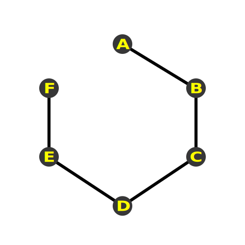
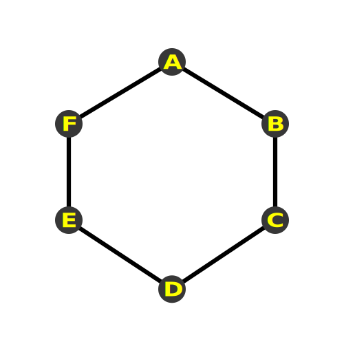

# [杂项]点-线-三角

webgl绘制点, 线以及三角形调用方法的区别, 其实就是`drawArrays`和`drawElemnets`的第一个有效参数. 

## POINTS

```js
const [minSize, maxSize] = gl.getParameter(gl.ALIASED_POINT_SIZE_RANGE);
```

对于每个顶点着色器输出的裁剪空间顶点, 绘制以该顶点为中心的正方形, 正方形的大小, 由设置在顶点着色器中的特殊变量`gl_PointSize`决定, 它是预期的像素值大小, 其最大最小值可以通过上面的代码进行查询.

## LINES

对于每两个顶点着色器输出的裁剪空间的顶点, 绘制链接两个点的线, 如果我们有点A,B,C,D,E,F, 我们就得到了三条线段. 


我们可以通过调用`gl.lineWidth`来指定像素宽度来设置线的粗细, 尽管宽度的最大值取决于WebGL的实现, 但通常大多数情况下最大宽度为1.

```js
const [minSize, maxSize] = gl.getParameter(gl.ALIASED_LINE_WIDTH_RANGE);
```

因为, 在桌面端的OPENGL中, 大于1的值被弃用了

## LINE_STRIP

对于每个顶点着色器输出的裁剪空间的顶点, 绘制链接到顶点着色器输出的前一个点的线.

如果我们有ABCDEF, 那么我们会得到5条线.



## LINE_LOOP

和上面这个类似, 但是多了从最后一个点到第一个点的线



## TRIANGLES

对于没三个顶点, 着色器会绘制一个顶点三角形, 是目前我们最常用的模式


 ## TRIANGLES_STRIP

对于每个顶点着色器输出的裁剪空间顶点, 绘制以最后三个点位顶点的三角形. 也就是说, 如果输出了6个点, 你会得到四个三角形


## TRIANGLES_FAN

对于每个顶点着色器输出的裁剪空间顶点, 绘制以第一个点和最后两个点位顶点的三角形.


`TRIANGLE_FAN`和`TRIANGLE_STRIP`这两种类型, 其实最好避免使用, 因为它们只适用于一些特殊的情况, 而且需要额外的代码来处理, 这并不值得, 尤其是你可能使用工具来构建法线, 生成纹理坐标或者对顶点数据进行其他处理, 使用基础的`TRIANGLES`并没有什么问题.

类似的, `LINE_LOOP`和`LINE_STRIP`其实也不是很有用, 它们都有类似的问题.  使用的场景比较特殊, 对调试和代码来说也非常不友好. 

