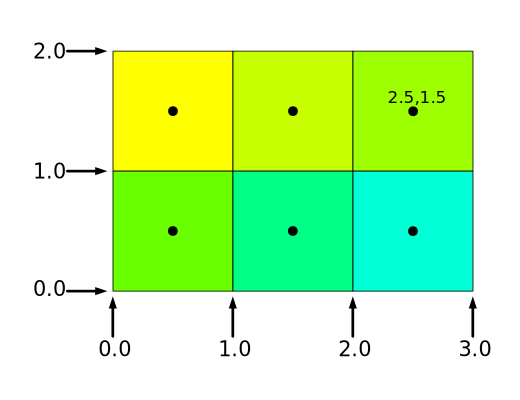

# [相机]多个视图多个画布

如果你想绘制同一个场景的多个视图, 应该如何做呢?

第一个方法是渲染到纹理, 然后将这些纹理绘制到画布上. 这当然是一种有效的办法. 问题在于, 它需要我们分配纹理, 向这些纹理渲染内容, 然后在画布上渲染这些纹理. 这意味着我们有效的进行了双重渲染. 这有时候是合适的, 比如在赛车游戏中, 我们想要渲染后视镜中的视图, 我们会将汽车后面的内容渲染为纹理, 然后使用该纹理绘制后视镜.

另一种方法是设置 viewport, 并且打开 `scissor test(剪刀测试)`. 如果我们的视角是不交叠的, 那么这是一种更好的办法. 我们不需要进行双重渲染. 

在之前的文章中, 我们通过调用设置`webgl`的`viewport`来把裁剪空间的映射到像素空间. 

```js
gl.viewport(left, bottom, width, height);
```

这里最常见的参数是设置为`0,0,gl.canvas.width,gl.canvas.height`.

那么从这里着手, 我们可以把这些参数这是为画布的一部分. 比如这样:

```js
gl.viewport(
   10,   // 剩下
   20,   // 底部
   30,   // 宽度
   40,   // 高度
);
```

那么, `x=-1`的裁剪空间和+1的裁剪空间就会不一样了. 

这个时候, 如果我们调用`gl.clearColor(1, 0, 0, 1);`, 你会发现无法分开来进行颜色的清除. 这就需要我们开启`scissor test`. 所谓的剪刀测试, 就是让我们定义一个矩形. 如果启用了剪刀测试, 则该矩形之外的任何内容都不会受到音响. 

剪刀测试是默认关闭的. 可以这样启用它:

```js
gl.enable(gl.SCISSOR_TEST);
```

它默认是画布的初始大小, 我们可以调用相同的参数设置`gl.scissor`:

```js
gl.scissor(
   10,   // 剩下
   20,   // 底部
   30,   // 宽度
   40,   // 高度
);
```

这样, 就可以了. DEMO在[这里](./code/[[相机]多视图&多画布/index.html])

## 绘制多个画布

这是模拟多个画布的好方法. 加入你在游戏中为游戏制作角色选择屏幕, 并且想要在列表中显示每个头部的3D模型, 那就可以用这个办法. 

最简单的办法, 是每个要显示项目的地方都放置一个canvas. 但是这样你会遇到很多问题, 比如说每个画布都需要不同的webgl上下文, webgl上下文不能共享资源, 因此, 你必须为每个画布都编译一个着色器, 为每个画布加载纹理, 为每个画布上传几何图形.

另一个问题是大多数浏览器对他们支持同时显示的画布数量是有限制的. 对于大多数人的电脑而言, 它一般只有8. 这意味着一旦你创建了第九个画布, 第一个画布就会失去它的上下文. 

我们可以通过只制作一个覆盖浏览器整个窗口的大型画布来解决这个问题, 然后, 我们在每个div上放置一个占位符. 使用`element.getBoundingClientRect`来设置在哪里设置视口和剪刀, 以便在这个区域进行绘制.

这样, 我们就只需要一个webgl上下文, 并且可以共享资源并且不会遇到上下文的限制. 

[DEMO](./code/[相机]多画布/index.html)

## 像素坐标

WebGL中的像素坐标由它们的边缘引用. 例如, 如果我们有一个3x2像素大的画布, 我们将视口设置为:

```js
gl.viewport(
  0, // 剩下
  0, // 底部
  3, // 宽度
  2, // 高度
);
```

然后, 我们真正定义了矩阵:



这意味着`x=-1.0`的裁剪空间对应于矩阵的左边缘, 而`x=1.0`的裁剪空间对应与右侧.