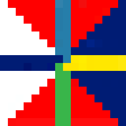
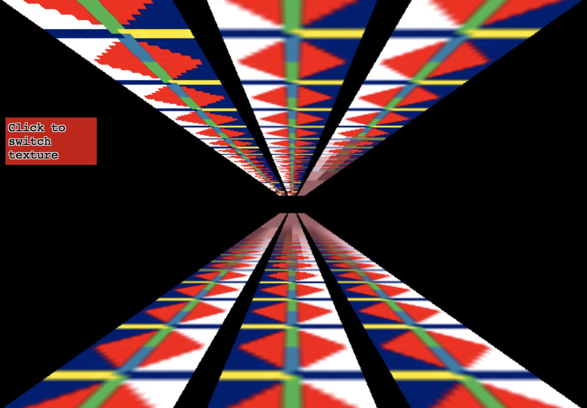

# [纹理]三维纹理

简单的使用纹理和之前并无区别. 

参见如下[DEMO](./code/[纹理]三维纹理/index.html)

如果只想要使用一部分图像要怎么做呢?

纹理是通过纹理坐标来引用的, 纹理坐标0.0到1.0对应纹理从左到右, 0.0到1.0对应的第一个像素所在行到最后一行. 上下在纹理坐标空间中是没有意义的, 因为绘制一些东西后再重定向后, 是没有上下概念的, 主要是依据传递给WebGL的纹理数据, 纹理数据开头对应纹理坐标0,0, 结尾对应纹理坐标1,1.

我们可以获取一些节点的坐标, 然后将像素坐标转换到纹理坐标:

```js
texcoordX = pixelCoordX / (width  - 1)
texcoordY = pixelCoordY / (height - 1)
```

如果你使用代码生成几何体, 通常情况下, 计算期望的纹理坐标也是比较容易的. 另一方面, 如果通过软件, 例如Blender, Maya制作几何体, 那么软件本身会调整纹理坐标. 

如果纹理坐标在0.0到1.0之外, webgl默认会重复纹理. 0.0到1.0是一份纹理的拷贝, 1.0到2.0是另外一份拷贝. -4.0到-3.0也是另外一封拷贝.

类似这样:

```js
// Fill the buffer with texture coordinates for a plane.
function setTexcoords(gl) {
  gl.bufferData(
      gl.ARRAY_BUFFER,
      new Float32Array(
        [
          -3, -1,
           2, -1,
          -3,  4,
          -3,  4,
           2, -1,
           2,  4,
        ]),
      gl.STATIC_DRAW);
}
```

并且, 可以使用`CLAMP_TO_EDGE`告诉webgl在某个方向不需要重复, 例如:

```js
gl.texParameteri(gl.TEXTURE_2D, gl.TEXTURE_WRAP_S, gl.CLAMP_TO_EDGE);
gl.texParameteri(gl.TEXTURE_2D, gl.TEXTURE_WRAP_T, gl.CLAMP_TO_EDGE);
```

## gl.generateMipmap

加入我们有一个16x16像素的纹理:



加入我们要将它绘制到屏幕的2x2个像素上, 那么这4个像素应该使用什么颜色呢? 这里一共有256个像素可以选择, 如果在ps中将16x16的图像缩放到2x2, 它会将每个角8x8的像素的平均值赋给这四个像素. 不幸的是, 绘制64个像素再求平均在GPU中是非常慢的. 

实际上, GPU使用的是一个纹理铁铺, 纹理贴图是一个逐渐缩小的图像集合, 每一个是前一个的四分之一大小, 16x16纹理的纹理贴图看起来是这样的:


通常每个子图都是前一级的双线性插值, 这就是`gl.generateMipmap`做的事情, 它根据原始图像创建所有的缩小级别, 你也可以自己提供缩小级别的图像. 

现在如果你想将16x16像素的纹理绘制到屏幕的2x2像素上, webgl会从创建的贴图中找到之前级别贴图, 插值创建出的2x2贴图来使用. 

- `NEAREST` = 从最大的贴图中选择 1 个像素
- `LINEAR` = 从最大的贴图中选择4个像素然后混合
- `NEAREST_MIPMAP_NEAREST` = 选择最合适的贴图，然后从上面找到一个像素
- `LINEAR_MIPMAP_NEAREST` = 选择最合适的贴图，然后取出 4 个像素进行混合
- `NEAREST_MIPMAP_LINEAR` = 选择最合适的两个贴图，从每个上面选择 1 个像素然后混合
- `LINEAR_MIPMAP_LINEAR` = 选择最合适的两个贴图，从每个上选择 4 个像素然后混合

你可以通过[这个](./code/[纹理]纹理贴图/index.html)例子看到贴图的重要性, 第一个显示的是使用`NEAREST`或者`LINERA`, 只从最大的体贴图上选择像素, 当物体运动时就会出现抖动, 由于每个像素都从最大的图上选择, 随着位置和大小的改变, 可能会在不同的时间选择不同的像素像素, 从而出现抖动. 

而观察左边和中间的抖动会多于右边. 由于右边的使用多级贴图并且混合颜色, 绘制的越小, webgl挑选的像素离原图关系就越远. 

中间小图虽然使用了`liner`混合了四个像素的颜色, 但这4个像素是从大图中选出来的, 不同的选择会有比较大的差别. 



这个例子显示了一些深入屏幕中的多边形.

这6个深入屏幕的图形使用了6中不同的筛选模式.

- 左上: NEAREST. 有明显的块状感
- 中上: LINEAR. 差不多
- 右上: NEAREST_MIPMAP_NEAREST: 可以清晰的看到使用的是哪个贴图
- 左下: LINEAR_MIPMAP_NEAREST. 这种模式会挑选最合适贴图的四个像素进行缓和. 贴图的切换会非常突兀
- 中下: NEAREST_MIPMAP_LINEAR. 也就是找最合适的两个贴图各取一点.
- 右下: LINEAR_MIPMAP_LINEAR. 选出最合适的两个贴图各取4点进行混合

理论上`LINEAR_MIPMAP_LINEAR`是效果最好的, 那么为什么不用这种方式呢?

1. LINEAR_MIPMAP_LINEAR是最慢的, 读8个像素比读1个像素要慢一些. 一旦贴图多了, 就会慢很多.
2. 另一个原因是如果要实现特定的效果, 比如做一些复古的效果, 就可能需要使用`NEAREST`, 贴图也是占内存的. 实际上, 它占用额外内存的33%.

### 使用

设置筛选器可以调用`gl.texParameter`:

```js
gl.texParameteri(gl.TEXTURE_2D, gl.TEXTURE_MIN_FILTER, gl.LINEAR_MIPMAP_LINEAR);
gl.texParameteri(gl.TEXTURE_2D, gl.TEXTURE_MAG_FILTER, gl.LINEAR);
```

- `TEXTURE_MIN_FILTER`: 是绘制的比最大贴图小的时候
- `TEXTURE_MAG_FILTER`: 是绘制的比最大的贴图大的时候, 对于此选项, 只有`NEAREST`和`LINEAR`两个设置可选.

## 纹理尺寸

加入我们要使用这个纹理:


你会发现是加载不上去的.

因为webgl限制了纹理的维度必须是2的整数次幂. 键盘的纹理尺寸是`320x240`, 都不是2的幂. 所以显示纹理就会失败.

在着色器中, 当`texure2D`被调用的时候, 由于纹理没有正确的显示, 就会使用黑色.

解决这个问题, 只需要将包裹模式设置为`CLAMP_TO_EDGE`并且通过设置过滤器为`LINERA`或者`NEAREST`来关闭贴图映射. 

```js
...
  // 检查每个维度是否是 2 的幂
  if (isPowerOf2(image.width) && isPowerOf2(image.height)) {
     // 是 2 的幂，一般用贴图
     gl.generateMipmap(gl.TEXTURE_2D);
  } else {
     // 不是 2 的幂，关闭贴图并设置包裹模式为到边缘
     gl.texParameteri(gl.TEXTURE_2D, gl.TEXTURE_WRAP_S, gl.CLAMP_TO_EDGE);
     gl.texParameteri(gl.TEXTURE_2D, gl.TEXTURE_WRAP_T, gl.CLAMP_TO_EDGE);
     gl.texParameteri(gl.TEXTURE_2D, gl.TEXTURE_MIN_FILTER, gl.LINEAR);
  }
...
```

## 立方体的纹理

一个常见的问题是"如何为立方体的每个面设置不同的图像?".

最好的办法就是将图像放在一个纹理中, 然后利用纹理坐标映射不同的图像放到每个面. 这是很多高性能应用使用的技术. 

[DEMO](./code/[纹理]纹理图集/index.html)

这种将多个图像通过一个纹理提供的方法通常叫做纹理图集, 它是最好的方式. 因为只需要加载一个贴图, 着色器也会因为只用一个贴图而保持简单, 不同于多个平面需要多次调用绘制, 这样只需要调用一次绘制. 

## 数据纹理

用js为纹理创建数据是比较直接的, 默认情况下, webgl1支持少量数据类型的纹理.

| 格式            | 数据类型               | 通道数 | 单像素字节数 |
| --------------- | ---------------------- | ------ | ------------ |
| RGBA            | UNSIGNED_BYTE          | 4      | 4            |
| RGB             | UNSIGNED_BYTE          | 3      | 3            |
| RGBA            | UNSIGNED_SHORT_4_4_4_4 | 4      | 2            |
| RGBA            | UNSIGNED_SHORT_5_5_5_1 | 4      | 2            |
| RGB             | UNSIGNED_SHORT_5_6_5   | 3      | 2            |
| LUMINANCE_ALPHA | UNSIGNED_BYTE          | 2      | 2            |
| LUMINANCE       | UNSIGNED_BYTE          | 1      | 1            |
| ALPHA           | UNSIGNED_BYTE          | 1      | 1            |

让我们创建3x2像素的`LUMINANCE`(亮度/黑白)纹理, 由于它是LUMINANCE纹理, 所以每个像素只有一个值, 在RGB通道是一样的. 

大概创建的代码是这样的:

```js
    const level = 0;
    const internalFormat = gl.LUMINANCE;
    const width = 3;
    const height = 2;
    const border = 0;
    const format = gl.LUMINANCE;
    const type = gl.UNSIGNED_BYTE;
    const data = new Uint8Array([128, 64, 128, 0, 192, 0]);
    const alignment = 1;
    gl.pixelStorei(gl.UNPACK_ALIGNMENT, alignment);
    gl.texImage2D(
        gl.TEXTURE_2D,
        level,
        internalFormat,
        width,
        height,
        border,
        format,
        type,
        data,
    );
    // set the filtering so we don't need mips and it's not filtered
    gl.texParameteri(gl.TEXTURE_2D, gl.TEXTURE_MIN_FILTER, gl.NEAREST);
    gl.texParameteri(gl.TEXTURE_2D, gl.TEXTURE_MAG_FILTER, gl.NEAREST);
    gl.texParameteri(gl.TEXTURE_2D, gl.TEXTURE_WRAP_S, gl.CLAMP_TO_EDGE);
    gl.texParameteri(gl.TEXTURE_2D, gl.TEXTURE_WRAP_T, gl.CLAMP_TO_EDGE);
```

此外还有需要设置的一点, webgl中有一个首次创建OpenGL后的模糊设定, 计算机有时在数据为某些特定大小时速度会快一些, 例如一次拷贝2,4或8个字节比一次拷贝1个字节要快. WebGL默认使用4字节长度, 所以它期望每一行数据是多4个字节.

我们使用的数据每行只有3个字节, 总共为6字节. 我们可以告诉webgl一次处理一个字节:

```js
const alignment = 1;
gl.pixelStorei(gl.UNPACK_ALIGNMENT, alignment);
```

有效参数: 1,2,4,8

## Pixel vs Texel

有时纹理上的像素叫texels, 像素是图片元素的简写, Texel是纹理元素的简写. 

## 使用多个纹理

首先改变代码加载两个图像, 这部分的逻辑是js的事情.

基本上有两种方式来处理图像的加载, 一种是重构代码, 让它在没有纹理的时候运行, 当图像加载后, 再更新程序. 

这个[例子](./code/[纹理]多纹理/index.html)中, 就等两个图像都加载完成后再开始绘制.

### 回顾纹理单元

理解纹理单元的简单方式是: 所有的纹理方法可以在"激活的纹理单元"上使用, "激活的纹理单元"就是一个全局变量指向你想使用的所有纹理单元. 每个纹理单元有两个目标队形, `TEXTURE_2D`目标和`TEXTURE_CUBE_MAP`目标. 每个纹理方法针对激活纹理单元上的一个目标, 如果用JS表示webgl方法可能像这样:

```js
var getContext = function() {
  var textureUnits = [
    { TEXTURE_2D: ??, TEXTURE_CUBE_MAP: ?? },
    { TEXTURE_2D: ??, TEXTURE_CUBE_MAP: ?? },
    { TEXTURE_2D: ??, TEXTURE_CUBE_MAP: ?? },
    { TEXTURE_2D: ??, TEXTURE_CUBE_MAP: ?? },
    { TEXTURE_2D: ??, TEXTURE_CUBE_MAP: ?? },
    ...
  ];
  var activeTextureUnit = 0;
 
  var activeTexture = function(unit) {
    // 将纹理单元枚举转换成索引
    var index = unit - gl.TEXTURE0;
    // 设置激活纹理单元
    activeTextureUnit = index;
  };
 
  var bindTexture = function(target, texture) {
    // 设置激活纹理单元的目标对象纹理
    textureUnits[activeTextureUnit][target] = texture;
  };
 
  var texImage2D = function(target, ... args ...) {
    // 绑定对应纹理单元调用相应的方法
    var texture = textureUnits[activeTextureUnit][target];
    texture.image2D(...args...);
  };
 
  // 返回 WebGL API
  return {
    activeTexture: activeTexture,
    bindTexture: bindTexture,
    texImage2D: texImage2D,
  }
};
```

着色器获得纹理单元:

```js
gl.uniform1i(u_image0Location, 0);  // 纹理单元 0
gl.uniform1i(u_image1Location, 1);  // 纹理单元 1
```

需要注意的是, 设置全局变量的时候, 使用索引代替纹理单元, 但是调用`gl.activeTexture`的时候你需要传递特殊的常量`gl.TEXTURE0`,`gl.TEXTURE1`之类的. 

不过这些常量是连续的, 所以你也可以这么写:

```js
gl.activeTexture(gl.TEXTURE0);
gl.bindTexture(gl.TEXTURE_2D, textures[0]);
gl.activeTexture(gl.TEXTURE1);
gl.bindTexture(gl.TEXTURE_2D, textures[1]);

// 可以写成
gl.activeTexture(gl.TEXTURE0 + 0);
gl.bindTexture(gl.TEXTURE_2D, textures[0]);
gl.activeTexture(gl.TEXTURE0 + 1);
gl.bindTexture(gl.TEXTURE_2D, textures[1]);
```

或者这样写:

```js
for (var ii = 0; ii < 2; ++ii) {
    gl.activeTexture(gl.TEXTURE0 + ii);
    gl.bindTexture(gl.TEXTURE_2D, textures[ii]);
}
```

## 纹理跨域

通常我们会将图像下载并上传GPU当做纹理使用. 

基本上, 我们像这样下载图像:

```js
// 创建纹理信息 { width: w, height: h, texture: tex }
// 纹理起初为 1×1 像素
// 当图像下载完成后加载图像
function loadImageAndCreateTextureInfo(url) {
  var tex = gl.createTexture();
  gl.bindTexture(gl.TEXTURE_2D, tex);
  // 用 1x1 蓝色像素填充纹理
  gl.texImage2D(gl.TEXTURE_2D, 0, gl.RGBA, 1, 1, 0, gl.RGBA, gl.UNSIGNED_BYTE,
                new Uint8Array([0, 0, 255, 255]));
 
  // 假设所有的图像大小都不是 2 的整数次幂
  gl.texParameteri(gl.TEXTURE_2D, gl.TEXTURE_WRAP_S, gl.CLAMP_TO_EDGE);
  gl.texParameteri(gl.TEXTURE_2D, gl.TEXTURE_WRAP_T, gl.CLAMP_TO_EDGE);
  gl.texParameteri(gl.TEXTURE_2D, gl.TEXTURE_MIN_FILTER, gl.LINEAR);
 
  var textureInfo = {
    width: 1,   // 在图像下载完之前不知道大小
    height: 1,
    texture: tex,
  };
  var img = new Image();
  img.addEventListener('load', function() {
    textureInfo.width = img.width;
    textureInfo.height = img.height;
 
    gl.bindTexture(gl.TEXTURE_2D, textureInfo.texture);
    gl.texImage2D(gl.TEXTURE_2D, 0, gl.RGBA, gl.RGBA, gl.UNSIGNED_BYTE, img);
  });
  img.src = url;
 
  return textureInfo;
}
```

问题是图像可能会含有一些私有信息, 在canvas中, 如果使用的图像来自于不同的域名, 浏览器就会将画布标记为被污染, 然后当你调用`ctx.getImageData`的时候就会得到一个安全错误. 

WebGL则更进一步, 在webGL中, `gl.readPixels`和`ctx.getImageData`是相似的, 所以你可能以为把这个接口封闭就好了, 但事实是即使不能直接获取像素值, 也可以创建一个基于图像颜色的着色器, 虽然效率低但是可以等同于获取到了图像信息. 

所以WebGL会直接禁止所有来自不同域名的图像

我们可以借助CORS来处理这个问题:

只要设置`crossOrigin`属性, 就可以了:

```js
img.crossOrigin = "";   // 请求 CORS 许可
img.src = url;
```

`crossOrigin`接受的值有三种:

- undefined: 默认值, 表示不需要请求徐克
- anonymous: 表示请求许可但不发送任何其他信息
- use-credentials: 表示发送cookies和其他可能需要的信息, 服务器通过这些信息决定是否授予许可.

我们可以定义一个方法，当图像资源在其他域名下时就设置 crossOrigin 属性。

```js
function requestCORSIfNotSameOrigin(img, url) {
  if ((new URL(url, window.location.href)).origin !== window.location.origin) {
    img.crossOrigin = "";
  }
}
```

需要注意的是, 请求许可不是表示你一定会得到许可, 结果取决于服务器. 

