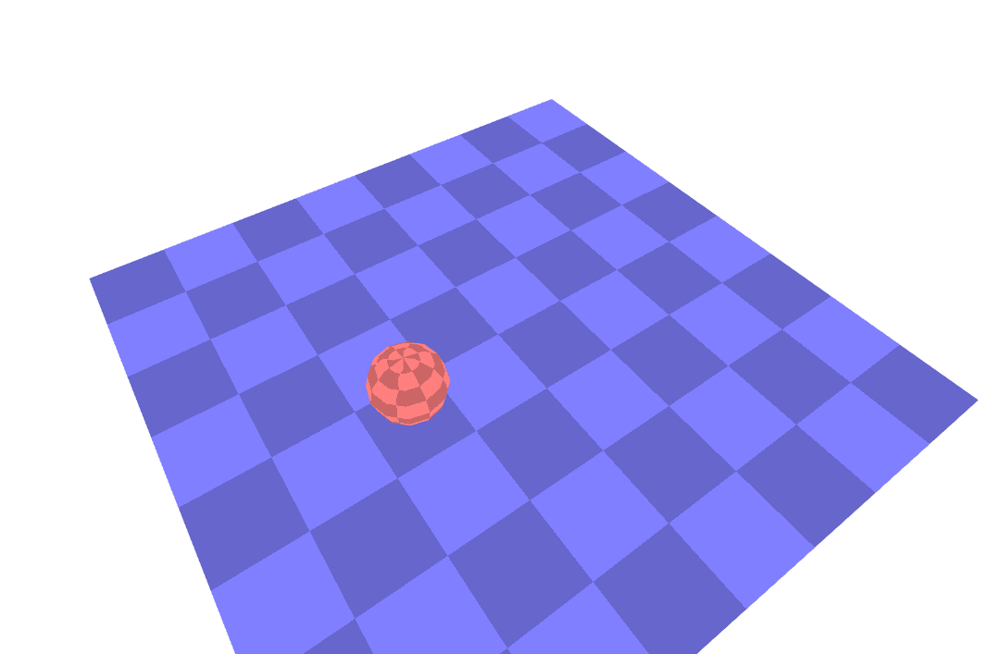
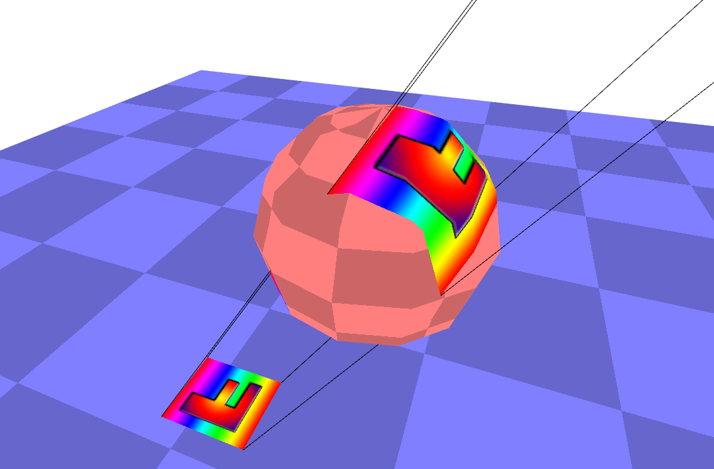
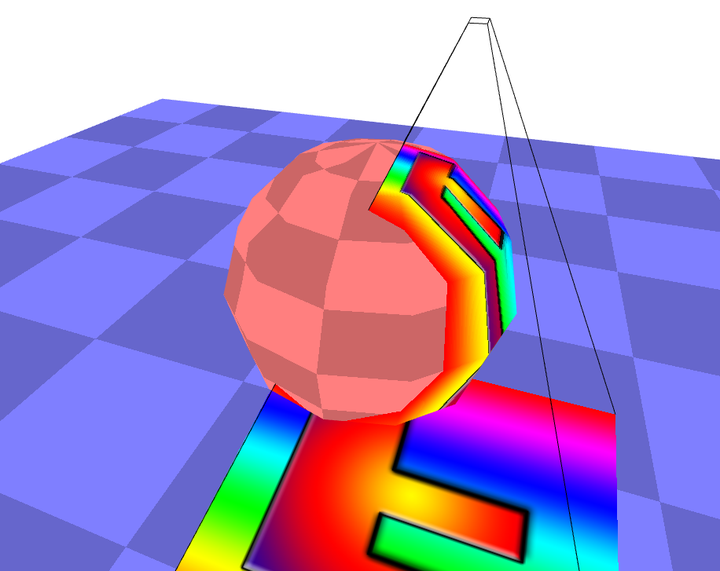

# [纹理]平面和透视投影映射

投影映射是投影一张'图像'的过程. 

类似于一个电影放映机对准一个屏幕, 然后将电影投影到屏幕上. 屏幕距离放映机越远, 则图像就越大.

## 平面投影映射

我们先来看平面投影的情况. 在这种情况下, 你需要将电影的放映机想象成和屏幕一样大小. 这样即便是屏幕离放映机很远, 电影的图像也不会变的很大, 它会保持原来的尺寸. 

首先我们需要在场景上绘制一个平面和一个球体.

然后, 在这之上, 加载一个纹理.

其代码在[DEMO](./code/[纹理]平面投影映射/index.html)可以看到

需要注意的是, 我们并没有真正的投影这个纹理, 我们是在做相反的事情, 即对被渲染物体的每一个像素, 我们判断纹理的哪一部分属是被投影到该像素上的, 然后再查找该部分纹理上的颜色.

## 投影纹理映射

如何模拟一个电影放映机呢? 我们只需要简单的使用一个投影举证来进行相乘就可以了. 

平面投影一个纹理有什么作用呢?

因为可以用来贴花, 贴花是一种在物体表面上放置溅射的油漆或者爆炸痕迹的方式. 要实现贴花, 通常不会使用我们这里这种着色器的做法, 相反, 我们需要写一些函数来遍历需要应用贴花的模型的几何, 对于每一个三角形, 你需要检查该三角形是否位于该贴花的范围内, 这与js的着色器列子中的`inRange`是一样的, 对于在贴花范围内的每个三角形, 你要吧三角形和投影的纹理坐标添加到某个新的几何中. 然后你把该贴花添加到你的绘制表中.

为贴花生成几何是对的, 否则你就需要为2个贴花, 3个贴花等等提供不同的着色器, 然后你的着色器很快就会变得很复杂, 并达到GPUS的着色器的纹理限制. 

还有另外一个作用是模拟真实世界的投影映射. 你对一个物体进行了3D建模, 你会把视屏投影到该模型上, 你使用了类似上面的代码来实现投影, 除了你的纹理是视频意外, 你可以编辑并且完善该视频, 使其匹配该模型, 而不用在实际现场中使用一个真正的投影仪. 

这种投影的另外一个用处就是: 用阴影映射来计算阴影.
