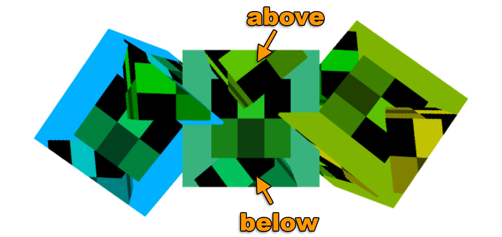

# [渲染]渲染到纹理

之前的数据纹理一节, 我们讲到如何利用js向纹理提供数据, 在这里, 我们会使用webgl渲染内容到纹理上, 这个话题在图像处理中简单的讲到过, 这里我们进行详细的介绍. 

渲染到纹理非常简单, 创建一个确定大小的纹理.

```js
// 创建渲染对象
const targetTextureWidth = 256;
const targetTextureHeight = 256;
const targetTexture = gl.createTexture();
gl.bindTexture(gl.TEXTURE_2D, targetTexture);
 
{
  // 定义 0 级的大小和格式
  const level = 0;
  const internalFormat = gl.RGBA;
  const border = 0;
  const format = gl.RGBA;
  const type = gl.UNSIGNED_BYTE;
  const data = null;
  gl.texImage2D(gl.TEXTURE_2D, level, internalFormat,
                targetTextureWidth, targetTextureHeight, border,
                format, type, data);
 
  // 设置筛选器，不需要使用贴图
  gl.texParameteri(gl.TEXTURE_2D, gl.TEXTURE_MIN_FILTER, gl.LINEAR);
  gl.texParameteri(gl.TEXTURE_2D, gl.TEXTURE_WRAP_S, gl.CLAMP_TO_EDGE);
  gl.texParameteri(gl.TEXTURE_2D, gl.TEXTURE_WRAP_T, gl.CLAMP_TO_EDGE);
}
```

注意, data是null, 我们不需要提供数据, 只需要让webgl分配一个纹理就可以了. 

接下来创建一个帧缓冲(framebuffer), 帧缓冲只是一个附件集, 附件是纹理或者renderbuffers, 我们之前讲过纹理, Renderbuffers和纹理很想, 但是支持纹理不支持的格式和可选项, 同时, 不能像纹理那样直接将renderbuffer提供给着色器. 

让我们来创建一个帧缓冲并和纹理进行绑定.

```js
// 创建并绑定帧缓冲
const fb = gl.createFramebuffer();
gl.bindFramebuffer(gl.FRAMEBUFFER, fb);
 
// 附加纹理为第一个颜色附件
const attachmentPoint = gl.COLOR_ATTACHMENT0;
gl.framebufferTexture2D(
    gl.FRAMEBUFFER, attachmentPoint, gl.TEXTURE_2D, targetTexture, level);
```

与纹理和缓冲相似, 在创建完帧缓冲以后, 我们需要将它绑定到`FrameBuffer`的绑定点, 那样所有方法都会作用到绑定的帧缓冲, 无论是哪个帧缓冲.

绑定帧缓冲以后, 每次调用`gl.clear`, `gl.drawArrays`或`gl.darwElements`, WebGL都会渲染到纹理上而不是画布上. 

将原来的渲染代码构造成一个方法, 就可以调用两次, 一次渲染到纹理, 一次渲染到画布. 

```js
function drawCube(aspect) {
  // 告诉它使用的程序（着色器对）
  gl.useProgram(program);
 
  // 启用位置属性
  gl.enableVertexAttribArray(positionLocation);
 
  // 绑定到位置缓冲
  gl.bindBuffer(gl.ARRAY_BUFFER, positionBuffer);
 
  // 告诉位置属性如何从 positionBuffer (ARRAY_BUFFER) 中读取数据
  var size = 3;          // 每次迭代需要三个单位数据
  var type = gl.FLOAT;   // 单位数据类型为 32 位浮点型
  var normalize = false; // 不需要单位化
  var stride = 0;        // 每次迭代移动的距离
  var offset = 0;        // 从缓冲起始处开始
  gl.vertexAttribPointer(
      positionLocation, size, type, normalize, stride, offset)
 
  // 启用纹理坐标属性
  gl.enableVertexAttribArray(texcoordLocation);
 
  // 绑定纹理坐标缓冲
  gl.bindBuffer(gl.ARRAY_BUFFER, texcoordBuffer);
 
  // 告诉纹理坐标属性如何从 texcoordBuffer 读取数据
  var size = 2;          // 每次迭代两个单位数据
  var type = gl.FLOAT;   // 单位数据类型是 32 位浮点型
  var normalize = false; // 不需要单位化数据
  var stride = 0;        // 每次迭代移动的数据
  var offset = 0;        // 从缓冲起始处开始
  gl.vertexAttribPointer(
      texcoordLocation, size, type, normalize, stride, offset)
 
  // 计算投影矩阵
 
  var aspect = gl.canvas.clientWidth / gl.canvas.clientHeight;
  var projectionMatrix =
      m4.perspective(fieldOfViewRadians, aspect, 1, 2000);
 
  var cameraPosition = [0, 0, 2];
  var up = [0, 1, 0];
  var target = [0, 0, 0];
 
  // 计算相机矩阵
  var cameraMatrix = m4.lookAt(cameraPosition, target, up);
 
  // 根据相机矩阵计算视图矩阵
  var viewMatrix = m4.inverse(cameraMatrix);
 
  var viewProjectionMatrix = m4.multiply(projectionMatrix, viewMatrix);
 
  var matrix = m4.xRotate(viewProjectionMatrix, modelXRotationRadians);
  matrix = m4.yRotate(matrix, modelYRotationRadians);
 
  // 设置矩阵
  gl.uniformMatrix4fv(matrixLocation, false, matrix);
 
  // 使用纹理单元 0
  gl.uniform1i(textureLocation, 0);
 
  // 绘制几何体
  gl.drawArrays(gl.TRIANGLES, 0, 6 * 6);
}
```

注意, 我们需要传入aspect计算投影矩阵, 因为目标纹理的比例和画布是不一样的.

然后, 绘制调用:

```js
// 绘制场景
function drawScene(time) {
 
  ...
 
  {
    // 通过绑定帧缓冲绘制到纹理
    gl.bindFramebuffer(gl.FRAMEBUFFER, fb);
 
    // 使用 3×2 的纹理渲染立方体
    gl.bindTexture(gl.TEXTURE_2D, texture);
 
    // 告诉WebGL如何从裁剪空间映射到像素空间
    gl.viewport(0, 0, targetTextureWidth, targetTextureHeight);
 
    // 清空画布和深度缓冲
    gl.clearColor(0, 0, 1, 1);   // clear to blue
    gl.clear(gl.COLOR_BUFFER_BIT | gl.DEPTH_BUFFER_BIT);
 
    const aspect = targetTextureWidth / targetTextureHeight;
    drawCube(aspect)
  }
 
  {
    // 渲染到画布
    gl.bindFramebuffer(gl.FRAMEBUFFER, null);
 
    // 立方体使用刚才渲染的纹理
    gl.bindTexture(gl.TEXTURE_2D, targetTexture);
 
    // 告诉WebGL如何从裁剪空间映射到像素空间
    gl.viewport(0, 0, gl.canvas.width, gl.canvas.height);
 
    // 清空画布和深度缓冲
    gl.clearColor(1, 1, 1, 1);   // clear to white
    gl.clear(gl.COLOR_BUFFER_BIT | gl.DEPTH_BUFFER_BIT);
 
    const aspect = gl.canvas.clientWidth / gl.canvas.clientHeight;
    drawCube(aspect)
  }
 
  requestAnimationFrame(drawScene);
}
```

案例查看[这里](./code/[[纹理]渲染到纹理/index.html)

记得要调用`gl.viewport`设置要绘制的对象的大小.

同样的当我们计算投影矩阵的时候需要使用正确的比例. 

以及, 我们这里是没有帧缓冲的, 只有纹理, 这意味着没有深度检测. 对于三维来说不能正常的体现. 



并且你会发现, 帧缓冲中没有深度缓冲, 但是画布是有的.

想要加上深度缓冲, 就需要创建一个, 然后附加到帧缓冲中.

```js
// 创建一个深度缓冲
const depthBuffer = gl.createRenderbuffer();
gl.bindRenderbuffer(gl.RENDERBUFFER, depthBuffer);
 
// 设置深度缓冲的大小和targetTexture相同
gl.renderbufferStorage(gl.RENDERBUFFER, gl.DEPTH_COMPONENT16, targetTextureWidth, targetTextureHeight);
gl.framebufferRenderbuffer(gl.FRAMEBUFFER, gl.DEPTH_ATTACHMENT, gl.RENDERBUFFER, depthBuffer);
```

现在帧缓冲加了以后, 内部的立方体也能正确的相交了.


## 其实Canvas本身就是一个纹理.

浏览器使用上方的技术实现的画布, 在背后他们创建了一个颜色纹理, 一个深度缓冲, 一个帧缓冲, 然后绑定到当前的帧缓冲, 当你调用你的渲染方法的时候, 就会绘制到这个纹理上, 然后再用那个纹理将画布渲染到网页上. 

