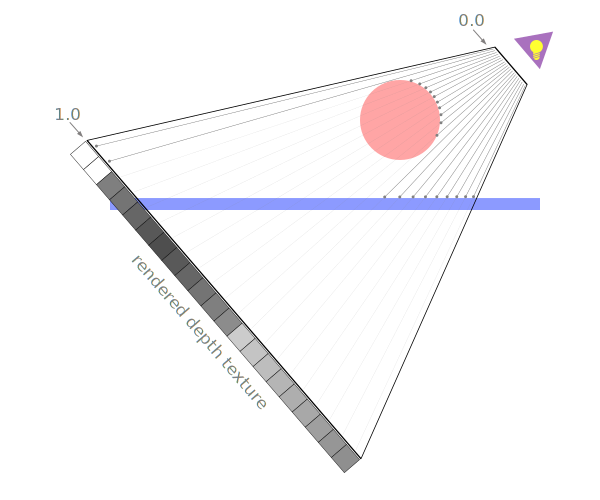

# 阴影

绘制阴影的办法不止一种. 每一种办法都有他们的优缺点. 

绘制阴影最常见的方法是使用 `阴影映射(shadow map)`

阴影映射是通过组合一些前面我们学到过的技术来实现的.

在平面的投影映射文章中, 我们知道了如何将一张图像投影到物体上. 


回想一下, 那时我们并没有把那张图像绘制在场景的物体上, 而是物体被渲染的时候, 对于每一个像素, 我们都会检查被投影的纹理是否在范围中, 如果在范围中, 我们会从被投影的纹理中采样相应的颜色, 如果不在范围内, 则我们会从另一个不同的纹理采样一个颜色, 纹理的颜色是通过使用纹理坐标进行查找的, 纹理坐标把一个纹理映射到了物体上. 

如果被投影的纹理里包含了来自光源视角的深度数据, 那么会怎么样呢? 换句话说, 假设上面的例子中, 在视椎体的顶端有一个光源, 而被投影的纹理包含了在该光源视角下的深度信息. 结果是, 球体会得到一个更加接近光源的深度值, 而平面会得到一个稍微远离光源的深度值. 



如果我们具有了这些深度信息, 那么我们在选择要渲染哪个颜色的时候, 我们就可以从被投影的纹理中进行采样, 得到一个`采样深度值`, 然后和当前正在绘制的像素的深度值进行比较. 如果当前像素的深度值比采样得到的深度值大, 则说明还有其他东西比当前像素更加接近光源. 

也就是说, 某样东西挡住了光源, 因此该像素是处于阴影中的. 


其中, 深度纹理被投影到光源视角下的视椎体内, 当我们绘制地板的像素时, 我们会计算在光源视角下, 该像素的深度值(图中的0.3). 然后我们在被投影的深度纹理中找到对应的深度值. 在光源视角下, 纹理内的深度值是0.1. 因为光线首先击中的球体. 因为`0.1 < 0.3`. 所以我们知道该位置的地板是位于阴影中的. 

首先, 我们来绘制阴影映射. 使用`平面投影的映射`中的最后一个例子, 然后`渲染到纹理`. 

在那里, 我们使用了一个深度渲染缓冲. 这为我们提供了一个深度缓冲, 以帮助对像素的排序, 但是, 我们并不能使用一个深度渲染缓冲作为一个纹理输入到着色器. 不过我们可以通过`WEBGL_depth_texture`的WebGL扩展, 我们可以尝试开启这个扩展, 它会给我们提供深度纹理. 有了深度纹理, 我们就可以把它附加到一个帧缓冲上, 然后使用该纹理作为着色器的输入.

该扩展的开启如下:

```js
function main() {
  // 获得一个 WebGL context
  /** @type {HTMLCanvasElement} */
  const canvas = document.querySelector('#canvas');
  const gl = canvas.getContext('webgl');
  if (!gl) {
    return;
  }
 
 // 开启深度纹理
  const ext = gl.getExtension('WEBGL_depth_texture');
  if (!ext) {
    return;
  }
}
```

现在, 类似的, 我们创建一个纹理和一个帧缓冲, 然后把该纹理作为`DEPTH_ATTACHEMENT`附加到帧缓冲上. 

```js
const depthTexture = gl.createTexture();
const depthTextureSize = 512;
gl.bindTexture(gl.TEXTURE_2D, depthTexture);
gl.texImage2D(
    gl.TEXTURE_2D,      // target
    0,                  // mip level
    gl.DEPTH_COMPONENT, // internal format
    depthTextureSize,   // width
    depthTextureSize,   // height
    0,                  // border
    gl.DEPTH_COMPONENT, // format
    gl.UNSIGNED_INT,    // type
    null);              // data
gl.texParameteri(gl.TEXTURE_2D, gl.TEXTURE_MAG_FILTER, gl.NEAREST);
gl.texParameteri(gl.TEXTURE_2D, gl.TEXTURE_MIN_FILTER, gl.NEAREST);
gl.texParameteri(gl.TEXTURE_2D, gl.TEXTURE_WRAP_S, gl.CLAMP_TO_EDGE);
gl.texParameteri(gl.TEXTURE_2D, gl.TEXTURE_WRAP_T, gl.CLAMP_TO_EDGE);
 
const depthFramebuffer = gl.createFramebuffer();
gl.bindFramebuffer(gl.FRAMEBUFFER, depthFramebuffer);
gl.framebufferTexture2D(
    gl.FRAMEBUFFER,       // target
    gl.DEPTH_ATTACHMENT,  // attachment point
    gl.TEXTURE_2D,        // texture target
    depthTexture,         // texture
    0);                   // mip level
```

由于一些原因(见下面), 我们还需要创建一个颜色纹理, 并把它作为一个`color attchment`附加到帧缓冲上, 即使我们并不会使用它. 

```js
// 创建一个和深度纹理相同尺寸的颜色纹理
const unusedTexture = gl.createTexture();
gl.bindTexture(gl.TEXTURE_2D, unusedTexture);
gl.texImage2D(
    gl.TEXTURE_2D,
    0,
    gl.RGBA,
    depthTextureSize,
    depthTextureSize,
    0,
    gl.RGBA,
    gl.UNSIGNED_BYTE,
    null,
);
gl.texParameteri(gl.TEXTURE_2D, gl.TEXTURE_MAG_FILTER, gl.NEAREST);
gl.texParameteri(gl.TEXTURE_2D, gl.TEXTURE_MIN_FILTER, gl.NEAREST);
gl.texParameteri(gl.TEXTURE_2D, gl.TEXTURE_WRAP_S, gl.CLAMP_TO_EDGE);
gl.texParameteri(gl.TEXTURE_2D, gl.TEXTURE_WRAP_T, gl.CLAMP_TO_EDGE);
 
// 把它附加到该帧缓冲上
gl.framebufferTexture2D(
    gl.FRAMEBUFFER,        // target
    gl.COLOR_ATTACHMENT0,  // attachment point
    gl.TEXTURE_2D,         // texture target
    unusedTexture,         // texture
    0);                    // mip level
```

为了使用深度纹理, 我们还需要能够使用不同的着色器来渲染场景多次. 

首先是定义一组简单的着色器, 用于渲染深度纹理, 然后再使用我们当前的着色器, 该着色器会投影一个纹理. 

因此, 首先让我们修改`drawScene`函数，以便我们可以传入想要用来渲染的着色器程序。

```js
function drawScene(
    projectionMatrix,
    cameraMatrix,
    textureMatrix,
    programInfo,
) {
    // 从相机矩阵中创建一个视图矩阵
    const viewMatrix = m4.inverse(cameraMatrix);

    gl.useProgram(programInfo.program);

    // 设置对于球体和平面都是一样的 uniforms
    // 注意: 在着色器中, 任何没有对应的 uniforms 的值都会被忽略
    webglUtils.setUniforms(programInfo, {
        u_view: viewMatrix,
        u_projection: projectionMatrix,
        u_textureMatrix: textureMatrix,
        u_projectedTexture: depthTexture,
    });

    // ------ 绘制球体 --------

    // 设置所有需要的 attributes
    webglUtils.setBuffersAndAttributes(gl, programInfo, sphereBufferInfo);

    // 设置球体特有的 uniforms
    webglUtils.setUniforms(programInfo, sphereUniforms);

    // 调用 gl.drawArrays 或 gl.drawElements
    webglUtils.drawBufferInfo(gl, sphereBufferInfo);

    // ------ 绘制平面 --------

    // 设置所有需要的 attributes
    webglUtils.setBuffersAndAttributes(gl, programInfo, cubeBufferInfo);

    // 设置我们刚刚计算的 uniforms
    webglUtils.setUniforms(programInfo, cubeUniforms);

    // 调用 gl.drawArrays 或 gl.drawElements
    webglUtils.drawBufferInfo(gl, cubeBufferInfo);
}
```

然后, 使用`drawScene`从光源的视角绘制一次场景, 然后使用深度纹理再绘制一次场景.

```js
function render() {
  webglUtils.resizeCanvasToDisplaySize(gl.canvas);
 
  gl.enable(gl.CULL_FACE);
  gl.enable(gl.DEPTH_TEST);
 
  // 首先从光源的视角绘制一次
  const lightWorldMatrix = m4.lookAt(
      [settings.posX, settings.posY, settings.posZ],          // position
      [settings.targetX, settings.targetY, settings.targetZ], // target
      [0, 1, 0],                                              // up
  );
  const lightProjectionMatrix = settings.perspective
      ? m4.perspective(
          degToRad(settings.fieldOfView),
          settings.projWidth / settings.projHeight,
          0.5,  // near
          10)   // far
      : m4.orthographic(
          -settings.projWidth / 2,   // left
           settings.projWidth / 2,   // right
          -settings.projHeight / 2,  // bottom
           settings.projHeight / 2,  // top
           0.5,                      // near
           10);                      // far
 
  // 绘制到深度纹理
  gl.bindFramebuffer(gl.FRAMEBUFFER, depthFramebuffer);
  gl.viewport(0, 0, depthTextureSize, depthTextureSize);
  gl.clear(gl.COLOR_BUFFER_BIT | gl.DEPTH_BUFFER_BIT);
 
  drawScene(lightProjectionMatrix, lightWorldMatrix, m4.identity(), colorProgramInfo);
 
  // 现在绘制场景到画布，把深度纹理投影到场景内
  gl.bindFramebuffer(gl.FRAMEBUFFER, null);
  gl.viewport(0, 0, gl.canvas.width, gl.canvas.height);
  gl.clear(gl.COLOR_BUFFER_BIT | gl.DEPTH_BUFFER_BIT);
 
  let textureMatrix = m4.identity();
  textureMatrix = m4.translate(textureMatrix, 0.5, 0.5, 0.5);
  textureMatrix = m4.scale(textureMatrix, 0.5, 0.5, 0.5);
  textureMatrix = m4.multiply(textureMatrix, lightProjectionMatrix);
  // 使用该世界矩阵的逆矩阵来创建一个
  // 可以变换其他坐标为相对于这个世界空间
  // 的矩阵。
  textureMatrix = m4.multiply(
      textureMatrix,
      m4.inverse(lightWorldMatrix));
 
  // 计算投影矩阵
  const aspect = gl.canvas.clientWidth / gl.canvas.clientHeight;
  const projectionMatrix =
      m4.perspectiveå(fieldOfViewRadians, aspect, 1, 2000);
 
  // 使用 look at 计算相机的矩阵
  const cameraPosition = [settings.cameraX, settings.cameraY, 7];
  const target = [0, 0, 0];
  const up = [0, 1, 0];
  const cameraMatrix = m4.lookAt(cameraPosition, target, up);
 
  drawScene(projectionMatrix, cameraMatrix, textureMatrix, textureProgramInfo); 
}
```

这里的 `lightWorldMatrix` 和 `lightProjectionMatrix`被重新修改了名字, 他们和之前是一样的, 只不过之前是我们投影纹理到任意一个空间内的. 现在我们尝试从光源的角度投影一个阴影纹理. 在数学上是一样的, 但重名后更和语义. 

在上面的代码, 我们首先使用之前绘制视椎体线框的着色器来渲染球体和平面到深度纹理中. 那个着色器只会绘制纯色的物体. 这就是当渲染到深度纹理时我们所需要做的全部事情. 

然后, 我们再渲染场景到画布中, 就像我们之前做的, 把纹理投影到场景内. 

当我们在着色器内引用深度纹理时, 只有红色分量是有效的, 所以我们会重复红色分量作为绿色分量和蓝色分量.

和之前的例子一样, 只不过我们不是通过加载一个图像, 而是通过渲染场景来生成一个深度纹理. 

深度值的范围是0.0到1.0, 代表它们在视椎体内的位置, 因此0.0表示接近视椎体的顶端的那端, 而1.0则是位于较远的开口的那端. 

因此, 剩下的, 则并不是在投影纹理的颜色和映射纹理的颜色中做选择, 我们可以使用深度纹理中的深度值来检查深度纹理的Z位置是离光源更近还是更远, 然后再检查要绘制的像素的深度值. 如果深度纹理的深度值更小, 则表明有某物挡住了光源, 该像素位于阴影之中. 

```glsl
precision mediump float;
// Passed in from the vertex shader.
varying vec2 v_texcoord;
varying vec4 v_projectedTexcoord;

uniform vec4 u_colorMult;
uniform sampler2D u_texture;
uniform sampler2D u_projectedTexture;

void main() {
    vec3 projectedTexcoord = v_projectedTexcoord.xyz / v_projectedTexcoord.w;
    float currentDepth = projectedTexcoord.z;

    // 判断是否在纹理内部
    bool inRange =
        projectedTexcoord.x >= 0.0 &&
        projectedTexcoord.x <= 1.0 &&
        projectedTexcoord.y >= 0.0 &&
        projectedTexcoord.y <= 1.0;
    
    float projectedDepth = texture2D(u_projectedTexture, projectedTexcoord.xy).r;
    float shadowLight = (inRange && projectedDepth <= currentDepth) ? 0.0 : 1.0;
    
    vec4 texColor = texture2D(u_texture, v_texcoord) * u_colorMult;
    float projectedAmount = inRange ? 1.0 : 0.0;
    gl_FragColor = vec4(texColor.rgb * shadowLight, texColor.a);
}
```

在上面的代码中, 如果`projectDepth`小于`currentDepth`, 则从光源的视角来看, 有某物体更加接近光源, 所以正在绘制的像素位于阴影中. 

如果我们运行它, 我们就会得到一个阴影.


我们可以在地面看到球体的阴影, 但是这些位于应该没有阴影的地方的奇怪的团是什么? 这些图案一般被称为"阴影痤疮(shaodow ance)". 这些团的来源是因为存储在深度纹理的深度数据已经被量化了, 深度数据已经是一个纹理, 一个像素网格. 它被从光源视角投影出来, 但是我们要把它和相机视角的深度值进行比较. 就意味着在这个深度纹理网格中的值和我们相机没有对齐, 因此, 当我们在计算`currentDepth`的时候, 有时候就会出现比`projectedDepth`稍微大一点的值, 有时候又会出现稍微小的值. 

让我们添加一个偏差值.

滑动该偏差值, 就可以看到它是如何影响图案的出现时间和出现的地方.

为了更加接近完整, 添加一个聚光灯. 


从阴影的代码中, 我们可以看到一个问题, 即我们的阴影映射的分辨率只有那么大, 所以即便计算方向光源只需要一个方向, 不需要光源本身的位置, 但为了能够决定哪块区域需要计算并应用阴影映射, 我们仍然需要选择一个光源位置.

## 为什么需要创阿金一个不会被使用的颜色纹理

webgl是基于opengl es2.0的, 而webgl规范基本上说wengl遵循opengl 2.0的规范, 除了webgl规范中列出的例外. 

当你创建一个帧缓冲的时候, 你就会添加`attachments`. 你可以添加所有类型的`attachments`. 

在上面的例子中, 我们添加了一个`RGBA/UNSIGNED_BYTE`纹理的`color attachment`和一个深度纹理`attachment`. 在渲染到纹理文章中, 我们附加了一个类似的`color attchment`. 但我们附加的另一个`attachment`是一个深度渲染缓冲, 而不是一个深度纹理. 我们还可以附加一个RGB纹理, 一个LUMINANCE纹理, 以及许多其他类型的纹理和渲染缓冲. 

OpenGL ES2.0规范给出了一堆关于某个`attchments`组合是否可以一起工作的规定. 其中的一个规则是至少有一个`attchment`, 另一个规则是它们必须具有相同的尺寸. 最后的规则是:

> 4.4.5 Framebuffer Completeness
> The combination of internal formats of the attached images does not violate an implementation-dependent set of restrictions.

这个不幸的措辞意味着即使没有 attachments 组合也能正常工作！

webgl委员会看到了这一点并决定要求webgl至少支持3中常见组合, 从webgl规范来看:

```js
COLOR_ATTACHMENT0 = RGBA/UNSIGNED_BYTE texture
COLOR_ATTACHMENT0 = RGBA/UNSIGNED_BYTE texture + DEPTH_ATTACHMENT = DEPTH_COMPONENT16 renderbuffer
COLOR_ATTACHMENT0 = RGBA/UNSIGNED_BYTE texture + DEPTH_STENCIL_ATTACHMENT = DEPTH_STENCIL renderbuffer
```

后来webgl_depth_texture扩展被创建. 该扩展真正说的是, 你可以创建深度纹理, 你可以附加它们到帧缓冲, 但该扩展并没有说更多关于需要组合的内容. 考虑到 OpenGL ES 2.0 规范的规则说，什么样的组合可以正常工作是由具体的实现决定的，考虑到 WebGL 规范只列出了 3 种必须正常工作的组合，而这 3 种组合都不包含深度纹理，**只有深度渲染缓冲，这意味着并不保证使用深度纹理总是可以正常工作，至少根据规范是这样的。**

实际上，似乎大多数驱动本身可以在只附加深度纹理的情况下正常工作。不幸的是，至少在 2020 年二月之前，`Safari` 不允许这种组合可以正常工作。它要求必须还要有一个 color attachment，很有可能需要一个 RGBA/UNSIGNED_BYTE color attachment。实际上，没有 color attachment 会失败也是符合上面的 WebGL 规范的。

总而言之，我们需要未使用的颜色纹理才能在 Safari 中正常工作。遗憾的是，这样也仍然不能保证这种组合可以在所有的驱动/gpus/浏览器中正常工作。幸运的是，这种组合看起来在任何地方都能够正常工作。同样幸运的是，WebGL2 所基于的 OpenGL ES 3.0 修改了规范，要求更多的组合也能正常工作。不幸的是，截止 2020 年二月，Safari 还不支持 WebGL2。所以，在 WebGL1 中，我们需要添加未使用的颜色纹理，然后祈祷它可以正常工作。

