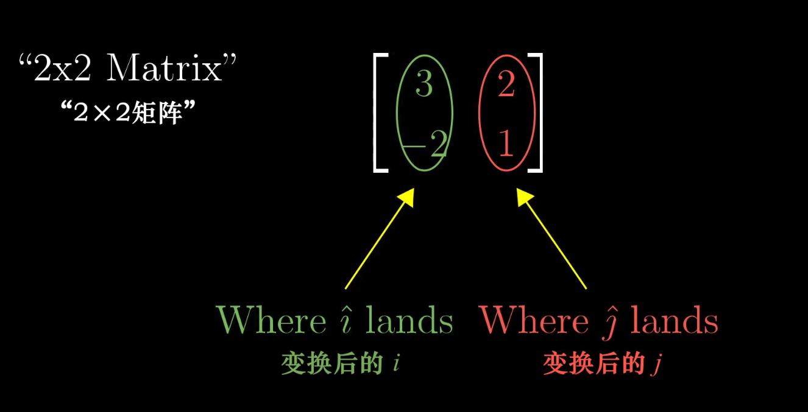
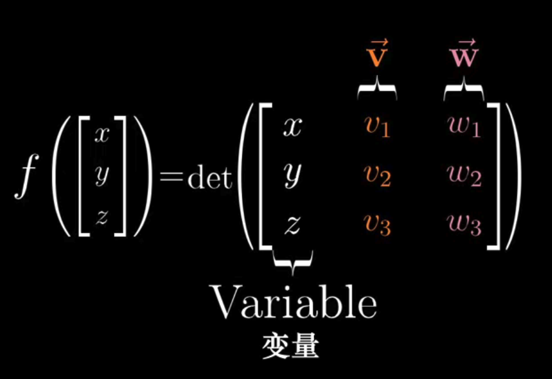
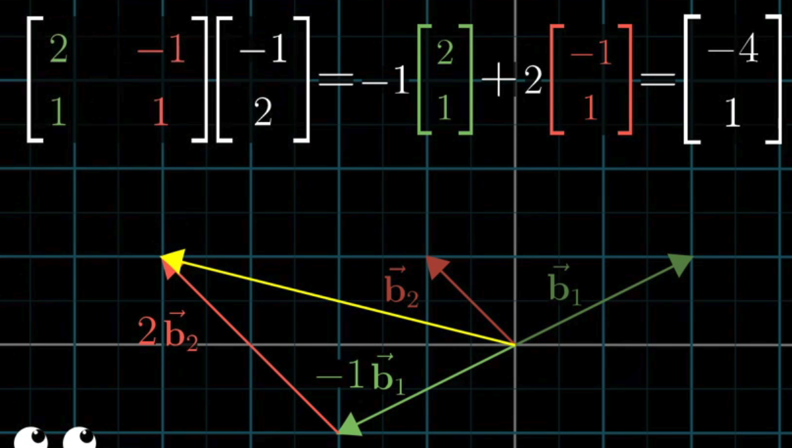
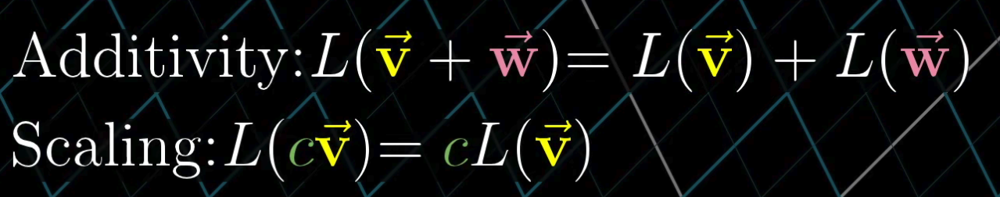

# 线性代数的本质

## 向量是什么

从三个角度看对于向量的解释:

- 物理: 向量是空间的一个有向的箭头, 一个向量由它的长度和它所指的方向决定, 只要方向和长度是确定的, 向量可以在空间中随意的平移.
- 计算机: 向量是有序的数字列表, 向量只是列表的一个花哨的说法
- 数学: 向量可以是任何东西, 只要保证两个向量相加以及数字与向量相乘是有意义的即可. 这种说法虽然抽象, 但是暗示了一个事情: **向量加法和向量数乘始终贯穿线性代数**, 二者起着很重要的作用.

我们具体的考虑向量的几何意义:


把向量放到坐标轴中:


- 一个向量的坐标由一对数构成, 分别表示对应的x轴和y轴的坐标位置.
- 每一对数表示一个唯一的向量, 每一个向量都可以由一对唯一的数表示.
- 可以以此推论三维下的向量定义

### 向量的加法


为什么向量的加法需要两个向量首尾相连?

本质上, 我们可以把向量看做移动特定的**运动**, 即在空间中朝着某个方向迈出一定的距离.

这样来理解, 就知道为什么向量的加法的运算的规则, 以及其几何上的定义了.

也就是说, 上面的向量加法的几何含义是:

1. 向v方向移动v个单位, 再向w方向移动w个单位.
2. 其和就相当于从原点移动到`v+w`所在的位置.

对于其他的运算来说:

1. 向量和常数(标量)相乘, 就相当于将一个向量的长度伸长为原来的两倍, 相当于运动了常数倍的丹玉
2. 常数如果是负的,就相当于运动的方向是和原来向量相反的方向


> **线性代数围绕着两种基本运算, 向量加法和向量数乘.**


## 线性组合, 张成的空间和基

 在xy坐标系中, 有两个非常特别的向量.

- 一个指向正右方, 长度为1, 通常被称为`i-hat`或者x方向的单位向量
- 一个指向正上方, 长度为1, 通常被称为`j-hat`或者y方向的单位向量

任何一个向量, 都可以看做是经过缩放的这两个向量的和. 

> 缩放向量并且相加

这个概念至关重要.

i向量和j向量就是xy坐标系的**基向量**.

当我们用数字描述向量的时候, 实际上, 我们默认是在用这组基向量来描述的. 

两个数乘向量的和, 被称为这两个向量的线性组合. 


如果固定其中的一个向量, 自由变换另一个向量, 你能表示一条直线上的所有点. 这可能可以解释"线性"的含义. 

如果同时变换两个向量(非共线), 则可以表示一个二维平面上的所有的点. 

如果两个初始的向量刚好是共线的话, 那就只能表示一条经过原点的线的上所有点.

如果两个都是零向量, 那么你只能表示原点了. 

在术语上, 我们这么说: 所有可以表示为给定向量线性组合的向量的集合, 被称为给定向量张成的空间(span).


两个向量张成的空间, 实际上是在问: 

> 仅通过向量加法和向量数乘这两种基础运算, 你能获得的所有可能向量的集合是什么

### 向量和点

我们用向量的**终点**来表示这条向量. 这样能很好的简化对于向量的想象.

### 三维空间

两个三维向量张成的空间是什么样的?

按照定义, 这个空间就是它们所有可能的线性组合. 

大概表现为在三维空间中的某个经过原点的平面.

如果我们再加上第三个向量, 就像这样:


这三个向量所有可能的线性组合构成了它们张成的空间. 这里有两种情况:

- 如果第三个向量恰好落在前两个向量所张成的平面上, 它们张成的空间并不会发生变化
- 否则, 我们就能得到三维空间中的所有三维向量. 

### 线性相关

对于这里的第一种情况以及之前我们看到的两个向量共线的情况, 我们可以这么描述:  

> 当你有多个向量, 并且可以移除其中一个而减小张成的空间,  那么我们称这个他们是**线性相关**的. 


另一种表述方式是: 

> 你拥有的一个向量, 可以表示为其他向量的线性组合(因为这个向量已经落在其他向量张成的空间之中)

相反, 如果所有向量都给张成的空间增添了新的维度, 那么他们是**线性无关**的. 


> 向量空间的一组基是张成该空间的一个线性无关向量集

## 矩阵和线性变换

什么是**线性变换**?

本质上, "变换" 本质上是"函数"的一种花哨的说法, 它接受输入内容, 并输出对应的结果. 特别的, 在线性代数中, 我们考虑的是接受一个向量并且输出一个向量的变换.

那么, 为什么不直接使用函数, 而是要用一个变换的概念?

实际上, 变换还暗示了一种可视化的方式来表达这种输入输出的关系. 向量的函数, 可以用"运动"来进行理解.

线性变换, 我们就理解为一个向量通过这种输入输出, "变换"成另一个向量的过程. 

直观的说，如果一个变换具有以下两条属性， 我们就称它是线性的：

1. 直线在变换后仍然保持为直线，不能弯曲
2. 原点保持固定

 总体的来说，我们应该把线性变换看做是“保持网格线平行且等距分布”的变换。


那么怎么样用数值来描述这种线性变换呢？


实际上，我们只需要记录两个基向量`i-hat`和`j-hat`变换后的位置。


而只要基向量变化，我们可以从而推断出其他任意的张开的空间中的向量的变换过程。

提取出其中的变换的公式：


运用这个公式， 我们可以对这个空间的任意向量求得起变换后的位置。

这样， 我们就将一个二维线性变换用4个数字完全表示。 我们将他们放在一起，叫做2阶矩阵。



你可以将他们理解为两个特殊的向量。

根据上面的运算过程，我们抽象出2阶矩阵的一般运算公式：


另一种视角，我们可以吧矩阵的列看做变换后的基向量。把矩阵向量乘法看做它们的线性组合。

 如果变化后的i-hat和变换后的j-hat是线性相关的。这意味着，它们张开的空间被挤压到他们所在的直线上。

## 矩阵乘法与线性复合变换

很多时候，我们可能会想要描述一些复杂的变换：一个变换以后再进行另一个变换。

比如：先旋转，然后剪切。

这个新的线性变换，通常被称为前两个独立变换的“复合变换”。

我们想要表示独立的这两段变换，可以连续用两个矩阵来处理坐标：


我们把新的复合矩阵可以看做前两个矩阵的乘积。注意，我们是先应用的旋转再应用剪切。这个阅读的顺序是相反的。


我们可以通过想象向量的变换，来理解这个变换公式的含义。

注意，由于两个变换施加的顺序不同，最后变换的效果也不同。所以矩阵的乘法是不具有交换性的。

但是矩阵乘法值支持结合律的。所以本质上，是**变换施加的顺序**决定了最后变换的效果。

## 附注1：三维空间中的线性变换

考虑这样一个三维变换。


实际上，这个推理过程和二维是类似的。也就是缩放+相加的过程。


而复合变换也是类似的。


## 行列式

一对向量基所围成的小正方形，其面积会随着变换的过程发生变化。比如下面这个表示缩放的矩阵：


这个线性变换将它的面积扩张了6倍。

而我们只要关注基向量所围成的小正方形面积在变换前后的变化，就能同理得出张开空间中所有其他区域的面积变化比例。

 这个面积的缩放比例，即线性变换改变面积的比例，被称为这个变换的**行列式**：


比如：一个线性变换的行列式是3，就意味着它讲一个区域的面积增加为原来的3倍。

如果一个线性变换的行列式为0，则说明它将一个二维变换的面积变成了一条线。


这也意味着，我们只要检验一个矩阵的行列式是否为0，我们就能了解这个矩阵所代表的的变换是否将空间压缩到更小的维度上。

### 行列式的负值

类似将平面空间进行了反转。就像把纸的另一面给翻上来了。我们也说，空间定向发生了改变：


当空间定向发生改变的时候，行列式表示为负数，其绝对值依然表示为空间缩放的比例。

### 三维空间行列式

同样的，三维空间的行列式，表示空间体积在空间变换的前后的比例。


简单的来看，我们可以把三维中的行列式理解为这个平行六面体的体积。

同样的，行列式为0表示把空间压缩为体积为0的东西，可能是一个面，也可能是一条线。

对于矩阵的列来说，他们必然是线性相关的。

那么对于三维来说，负值以为着什么呢？

有一种用来描述三维空间的定向，那就是“右手定则”


如果你在变换后的三维空间中仍然可以用右手定则表示，那么三维空间的定向是没有变化的。否则，如果在变换后，你只能用左手这么做。那么其行列式为负。 

### 行列式的计算

对于二阶矩阵的行列式：


从几何上进行直观的理解，如果bc为0，则ad实际上给出的是单位正方形缩放后形成的矩阵的面积。


如果，b/c其中一项为0，则我们会得到一个平行四边形，最后的面积仍然为ad：


而粗略的说，如果b/c都不为0，则bc项会告诉你平行四边形在对角方向上拉伸或者压缩了多少，更精确的计算则如下图表示的那样：


 而对于三阶行列式来说，这个计算过程的原理是一样的，不过会更加的复杂：


但是这些计算过程大概不属于线性代数的本质的体现。

## 逆矩阵、列空间以及零空间

线性代数可以用来描述对空间的操纵过程。这对计算机图形学和机器人学来说很有用。除此以外，它还能帮助我们求解特定的**方程组**。 

方程组, 指我们有一系列的未知量以及一系列与之相关的方程。

如果在每一个方程中，所有的未知量只具有常系数， 并且都只进行和运算，类似以下的形式：


我们一般会称这样的方程组叫做：“线性方程组”。

可以注意到，这样的计算和上面矩阵的乘法非常的相似。我们可以把他们写成矩阵形式：

  

这个公式所代表的的几何意义在于， 我们希望找到一个向量x，对其施加矩阵A的变换以后，变为向量v。

这个方程的解会依赖于矩阵A所代表的变换，是否将解空间进行了降维（线性相关），还是保持的解空间的维数。

换句话说，A的**行列式**为0(发生了降维)，还是不为0（没有发生降维）。

首先来看，没有发生降维（也就是A的行列式不为0）的情况： 

### 行列式不为0

在这种情况下，有且只有一个向量x在变换后与v重合，并且我们可以通过这个变换的逆变换，求出这个x。

 这个变换的逆变换，我们一般会称为`A的逆` ，记为`A^-1` 。

比如，一个逆时针旋转90度的变换，其逆变换就是顺时针旋转90度。

而且，当我们将`A^-1`与`A`相乘的时候，就表示一个什么都不做的变换，也叫作“恒等变换”。

我们可以用单位矩阵来表示。

类似于：

```javascript
[
    1, 0, 0,
    0, 1, 0,
    0, 0, 1
]
```

### 行列式为0

这情况下，矩阵表示将变量的解空间压缩或者降维，那么其逆变换，一般就是无法求的了。因为我们无法将低维的解空间升维，来得到一个唯一解。

但是不存在逆变换，解仍然可能是存在的。 


### 秩

我们用一个更精炼的概念来描述这个解存在的情况：秩。

当变换的结果是一条直线的时候，也就说，结果是一维的。那么我们说这个变换的秩为1. 

如果变换的结果是一个平面，它是二维的， 那么这个变换的秩为2.

从这里看来，秩代表着变换后的空间的维数。

### 列空间

不管是一条直线，一个平面还是三维的空间，所有可能的变换结果的集合。被称为矩阵的“列空间”。


我们知道， 矩阵的列告诉我们基向量变换后的位置。这些变换后的基向量张成的空间就是所有可能的变换结果。

换句话说，列空间，就是矩阵的列所张成的空间。


更精确的秩的定义，就是列空间的维数。

当秩达到最大值的时候，意味着秩和列数相等， 我们就称之为“满秩”（Full Rank）

我们可以比较简单的得到一些论断：

- 零向量一定在列空间中，因为线性变换必须保持原点位置不变。
- 对于一个满秩变换来说， 唯一能在变换后落在原点的就是零向量自身。 但是对于一个非满秩的矩阵来说，它会将空间压缩到一个更低的维度上。 这意味着，会有一系列的向量被压缩到零向量。 

### 零空间

这些变换后落在原点的向量的集合，就被称为矩阵的“零空间”或者“核”。

对于一个线性方程组来说，当向量v刚好是零向量的时候，零空间给出的就是这个向量方程所有可能的解。


### 小结

- 每个方程组都有一个线性变换与之联系。
- 当逆变换存在的时候，你可以用这个逆变换求解方程组。
- 列空间告诉我们什么时候存在解。
- 零空间告诉我们所有可能的解的集合。

## 附注2： 非方阵

我们讨论一个二维向量到三维向量的变换。


只要变换的过程是平行且等距分布，并且原点映射为自身，就称之为线性变换。

用矩阵代表这样一个变换，和之前的方法是类似的。找到每一个基向量变换后的位置， 然后把变换后基向量的坐标作为矩阵的列。


这意味着， 我们得到了一个3x2的矩阵。

用几何表示的话，就是一个在三维空间经过原点的二维平面。

注意，这个矩阵仍然是满秩的。因为列空间的维数和输入空间的维数是相等的。

一个3x2的矩阵的几何意义，就是将二维空间映射到三维空间上。

那么一个2x3的矩阵代表了什么呢？


- 三个基向量代表 原始空间是三维的
- 两行表示这三个基向量在变换后仅用两个坐标来描述，也就是落在了二维的平面上。

所以，这是一个从三维空间到二维空间的变换。


同理，我们还可以有二维到一维空间的变换。 


 

这样的变换，我们可以用一个1x2的矩阵表示：


这类的变换其实很有意义，它和点积是密切相关的。

## 点积与对偶性

### 点积的定义

对于两个维数相同的向量，求它们的点积，就是将对应的数字相乘然后将每一位相乘的结果相加：


### 点积的几何解释 

对于点积有一个比较优美的几何解释：


求两个向量v和w的点积，可以想象向量w朝着过原点和向量v终点的直线上进行投影（正交投影，下同），然后将投影的长度和向量v的长度相乘。你就得到了它们的点积。 

如果方向相反，则得到的值为负值。

这里可以得到几个推论：

- 当两个向量的方向夹角小于90度时，其点积为正。
- 当两个向量的方向夹角等于90度时，点积为0。
- 当两个向量的方向夹角大于90度时，点积为负。

点积与顺序无关。

点积为什么可以用相乘后相加的方法来运算，这和对偶性有关。

我们之前看到有不少函数能够接受二维向量并且输出一个数，但是对于线性变换来说，他比一般的函数要求会更加的严格。

### 二维变换的例子

我们来看一个例子。

假设你有一个线性变换， 它会将i-hat和j-hat分别变换到1和-2：


当我们要跟踪一个向量的时候，比如这里的向量（4,3），在变换之后的位置，那么我们就要进行这样的运算：


而1x2的矩阵和向量相乘这一数值运算的过程，就非常类似我们的点击的运算过程。这两者之间，应该有一些微妙的联系。

### 重新解释点积的运算

让我们来从几何角度出发，重新建立点积的运算过程：

我们想象有一个斜向的通过空间原点的数轴：


考虑这样一个二维向量，我们叫u-hat


如果我们要将二维的向量直接投影到这条数轴上，实际上就定义了一个从二维向量到数的函数，并且这个函数是线性的。

我们把这个函数要看做一个接受两个坐标并输出一个坐标的函数：


考虑向量的存在，我们应该是可以找到一个描述这个变换的1x2矩阵的（想像一个二元一次的方程），现在让我们从几何上来找到这个矩阵：


我们可以借助对称性来进行一个精妙的推理：


由于u和i是单位向量，他们两个是对称的。因子i在u上的投影商都就是u的x坐标的值。

同理，j在u上的投影， 也就是u的y坐标的值。

因此，我们就得到了这个投影的1x2矩阵：


对于空间中任何向量的变换，都可以通过与该矩阵的运算来得出，这就是为什么矩阵向量乘积何意解读为点积。


 

我们再来回顾这个过程：

- 我们有一个从二维空间到数轴的线性变换。
- 它并不是由向量数值或点积运算定义得到的，而是通过空间投影到给定的数轴上来定义
- 因为这个变换是线性的，所以它必然可以用某个1x2的矩阵来描述
- 而1x2矩阵和二维向量相乘的计算过程和转置矩阵并求点积的计算过程是相同的。所以，这个投影必然和某个二维向量相关。

这里的启示是： **无论什么时候，当我们看到一个二维到一维的线性变换，空间中一定会存在唯一的向量v与之相关。**

这就是数学中，对偶性的一个实例。

### 对偶性

对偶性贯穿数学的始终，在很多方面都有体现。

粗略的解释是：**两种数学事物之间自然而又出乎意料的对应关系**。

比如上面的情况：一个向量的对偶是由它定义的线性变换，一个多维空间到一维空间的线性变换的对偶是多维空间中的某个特定的向量。

### 小结

1. 表面上看，点击是理解投影的有利的几何工具，并且能够方便的检验两个向量的指向。但是更进一步的看，两个向量点乘，就是将其中一个向量转换为线性变换。
2. 虽然从数值上，他们只是恰好看起来有着一样的运算过程，但是本质上我们都是和向量在打交道。
3. 我们应该真正理解的是：不要把向量看做一个空间中的箭头，而是一个线性变换的位置载体。这样会更加容易理解向量的本质。向量就好像是一个特定变换的概念性的记号。

## 叉积

### 叉积的标准介绍

假如有两个向量v和w， 考虑它们所张成的平行四边形。类似这样：


v和w的叉积，也就是`v x w` 就是这个平行四边形的面积。

在此之上，我们考虑其方向性：

- 假如v在w的右侧，那么面积是正的
- 如果v在w的左侧，那么面积是负的

这说明，叉积是受顺序的影响的。 也就说：


正向或者负向可以通过基向量的位置来记忆。

### 叉积的计算

还记得行列式的定义吗，行列式代表了变换前后面积变化的比例。

因此，叉积的计算就是行列式的计算：


而对于负的叉积，他们的运算如下：


自然也是负数。

到现在为止，我们上面的计算并不是真正叉积的计算。

真正的叉积是**通过两个三维向量生成一个新的三维向量**。

仍然考虑这两个向量围城的平行四边形。新的三维向量如下：


- 长度为平行四边形的面积
- 方向垂直于平行四边形，并且符合右手定则


叉积的计算公式如下：


这个运算可以看做这样的过程：


### 以线性代数的眼光看叉积

我们回顾一下我们之前学到的对偶性：

>  每当你看到一个多维空间到数轴的线性变换是，它都与那个空间中的唯一一个向量对应，也就是说，应用线性变换和与这个向量点乘等价。

叉积的运算就是这个特性的一个实例。

1. 首先定义一个从三维空间到数轴的特定线性变换，并且它是根据向量v和w来定义的。
2. 找到它的对偶向量。
3. 说明这个对偶向量就是`v x w`

二维空间中计算向量的叉积大致是这样的：


从几何上说，它给出了两个向量张成的平行四边形的面积。其符号取决于向量的位置顺序。

但是我们外延到三维的时候情况就有所不同了。

三维向量不同于二维向量输出一个数字，而是接受两个向量并输出一个向量。不过我们可以进行一点变形来获得接近真实的叉积的定义。

我们将第一个向量看做一个变量，而原来的v和w保持不变。

并且将其看做一个函数：



这个函数就代表着：你输入一个向量`(x,y,z)`, 然后通过矩阵的行列式得到一个数。    其几何意义是：对于任一输入的向量`(x,y,z)`你都可以考虑由它和v与w确定的平行六面体的体积，然后根据定向确定符号。

注意： 这个函数是线性的。

所以，我们可以引入对偶性的思想：

因为这个函数是线性的，所以我们可以通过矩阵乘法来描述这个函数。具体的来说，因为这个函数从三维空间到一维空间，所以会存在一个1x3的矩阵来代表这个变换。


而对于对偶性来说，我们可以把整个变换看做与一个特定向量的点积，也就是说，存在一个向量p，使得p与其他任一向量`(x,y,z)`的点积等于一个3x3的矩阵的行列式。


这里我们稍微整理可以得到：


所以，这些常数，v和w坐标的特定组合，就是我们想要求得的向量p的坐标。


以上的运算过程，我们可以这么看：

> 当你将向量p和某个向量（x,y,z）点乘时，所得结果等于一个由（x,y,z）和v和w确定的平行六面体的有向体积。什么样的向量p满足这一性质？

p和其他向量点积的几何意义：


考虑到这一点，对于我们所关心的平行六面体的体积：

- 首先获得由v和w确定的平行四边形的面积
- 乘以向量（x,y,z）在垂直于平行四边形方向上的分量


也就是说，我们找到的线性函数对于给定向量的作用，就是讲这个向量投影到垂直于v和w的直线上，然后将投影长度与v和w张成的平行四边形的面积相乘。

但是，这和垂直于v和w的且长度为平行四边形面积的向量与`(x,y,z)`点乘是同一回事。且符号意义和右手定则相似。

这意味着我们找到了一个向量p，使得p和某个向量(x,y,z)点乘的时候，所得的结果是一个3x3的行列式。

这和我们之前通过特殊符号的技巧进行计算所得到的的向量，必然在几何上与这个向量对应。这就是叉积的计算过程与几何解释有关联的根本原因。  

#### 小结

我们首先定义了一个三维空间到数轴的线性变换，并且它是根据向量的v和w来定义的。

然后通过两种不同的方式来考虑这个变换的对偶向量。

## 基变换

### 基向量

我们可以把一个向量的坐标看做是对基向量的缩放。

而基向量可以看做是我们在坐标系中的一个隐含的假设，比如在二维坐标系中：

- i-hat 可以看做是向右移动一个单位的运动
- j-hat 可以看做是向上移动一个单位的运动

> 发生在向量与一组数之间的任意一种转化，都被称为一个坐标系，而其中两个特殊的向量：i-hat & j-hat 被我们称为这个坐标系的基向量。

 基向量不同，表示同一个向量的坐标就不同。

### 如何在不同的坐标系之间进行转换

 下面有个例子：



比如说，我们有一个原始坐标系A以及一个坐标系B。

其中矩阵的第一列和第二列就是基向量在坐标系B中的坐标表示。向量则是用坐标系A表示的。

这个计算过程就是将向量坐标从A坐标系转换到B坐标系。

 我们可以把基向量表示的矩阵看做一个线性变换。

从几何上说，我们做的这个线性变换是将坐标从A坐标系的网格转换到B坐标系的网格，但是从数值上说，是将B坐标系的坐标描述转换为用A坐标系描述。

相反的转换是怎么样的？

我们可以简单的取矩阵的逆，这样就将B坐标系转换到A坐标系了。

### 线性变换在不同坐标系中的转换

我们已经知道：矩阵代表了一个线性变换，以及矩阵的乘积对应于线性的复合变换。

比如说，在A坐标系下，我们现在有一个表示逆时针旋转90度的矩阵。我们要如何用B坐标系的基向量来表示这个旋转矩阵呢？


在这个变换中，我们追踪的是A坐标系中的基向量，并且在A坐标系中记录它们的去向。

如何用B坐标系的坐标来描述这个变换呢？

1. 首先我们给出一个在B坐标系下的向量
2. 用基变换矩阵转换为在A坐标下的向量
3. 将所得结果左乘线性变换矩阵（旋转90度）
4. 使用逆基变换矩阵转换为B坐标系下的向量

以之前的例子来说，表示如下：


这三个矩阵相乘得到的复合矩阵，就是在B坐标系下的逆时针旋转90所表示的变换矩阵。它接收用B坐标系表示的向量，输出逆时针旋转90度以后在B坐标系下表示的新向量。

一般来说，当你看到**A<sup>-1</sup> M A**这样的表达式，往往意味着一种数学上的转移作用。中间的矩阵M表示一个线性变换，两侧的矩阵则表示一种视角上的转化。 

## 特征向量与特征值

我们来考虑这样一个线性变换：

$$
\begin{bmatrix} 
3 & 1 \\
0 & 2 \\
\end{bmatrix}
$$

 我们关注它对一个特定向量的作用，并且考虑这个向量张成的空间，也就是通过原点和向量尖端的直线。大部分的向量在变换中都离开了其张成的空间。


但是某些特殊向量的确留在了它们所张成的空间中。 这意味着，矩阵对它的作用就仅仅是拉伸或者压缩，就像一个标量。 

比如在上面这个变换中的基向量`i-hat`在整个变换中都不会离开$x$轴。

再比如说一个比较隐蔽的向量$[-1, 1]$在变换之后，也没有离开自己的张成空间。 

对这个变换来说，以上这些拥有这种特殊性质（变换后仍然留在它们张成的空间中）的向量，这些特殊的向量就是所谓的**特征向量**。

每一个特殊向量都有一个所属的值，被称为**特征值**：即衡量特征向量在变换中拉伸或者压缩比例的因子。


换个例子，你可以有一个属于特征值$-1/2$的特征向量，就意味着，这个向量在变换中被反向，并且压缩为$1/2$。重点在于，它停留在它张成的直线上，并未发生旋转。

### 应用价值

我们考虑一个在三维变换中的线性变换。

如果我们能找到一个三维矩阵的特征向量，也就是流在它张成的空间中的向量。那么，你找到的就是旋转轴。而且把一个三维旋转看成绕某个轴旋转一定的角度，要比考虑相应的3阶矩阵要直观的多。

在这种情况下，一般特征值为1，因为旋转并不缩放任何一个向量。

对于任一矩阵描述的线性变换，你可以通过将矩阵的列看做变换后的基向量来理解它。

但是，理解线性比那换作用的关键往往较少依赖于一个固定的坐标系。更好的办法是求出其特征向量和特征值。

### 数学表示

用符号来表示的话，下面是特征向量的概念：


这个等式是说，矩阵向量乘积(也就是A乘以v) = 向量数乘(特征向量v乘以某个数$\lambda$ )

我们把右侧也写成矩阵向量乘积的形式，大致是这样的


现在将等式进行变换。


我们需要一个非零解v。也就是说，我们需要让$det(A-\lambda I) = 0$。这样才会存在一个非零向量，使得矩阵和它的乘积为零向量。

我们回顾一下这个推导的过程：


注意，二维变换矩阵不一定存在特征向量，比如：


它的每个向量都发生了旋转，所以不存在特征向量。

### 特征基

如果我们的基向量恰好是特征向量，来看看会发生什么。

比如下面这个变换矩阵：


我们可以看到除了对角线上的元素，其他的元素都为0。

对于这种：除了对角元意外其他元素都是0的矩阵，被称为对角矩阵。对角矩阵的所有基向量都是特征向量。矩阵的对角元就是他们所属的特征值。

对角矩阵在很多处理上都会很简单。比如重复相乘。


这样的元素也只是将每个基向量与对应特征值的100次幂相乘。


基向量同时刚好是特征向量的情况并不多见。但是如果你的变换有许多特征向量，多到你能通过这些向量张成全空间的特征向量，那么你就能把这些特征向量作为**基向量**。 

拿到你想要作为新的基的向量的坐标。然后将坐标作为一个矩阵的列，这个矩阵就是基变换矩阵。

然后通过基变换矩阵和变换矩阵所组成的复合矩阵，我们就能得到一个新的矩阵。


以上面的变换为了，这个新的矩阵必然是对角矩阵，并且对角元就是对应的特征值。 理由也很好解释，因为它所处的坐标系的基向量在变换中只进行了缩放。

一组基向量（同样是特征向量）构成的集合被称为一组特征基。

因此，如果你要计算一个非对角矩阵的变换矩阵的100次幂，那么比较好的一个办法就是先转换为特征基，然后计算完成后再转换回当前坐标系下的坐标。

这里的唯一限制就在于，你要找到一组特征基。

## 抽象向量空间

之前我们理解向量，可能是一个箭头，或者说一组数字。

这里会讨论一种即不是一个箭头也不是一组数字，但是同样具有向量特性的东西：函数。

- 某种意义上说，函数实际上只是另一种向量。（表示一种变换的过程？）

- 类比两个向量的相加，函数也可以相加，像这样：

  

- 类似的，函数个一个实数相乘也是有合理的解释的。


函数中也有类似于变换矩阵的东西，比如求导的过程，它将一个函数变换到另一个函数。往往我们用算子来表示这个概念。不过他们的意思是一样的。

一个函数变换是线性的，这表示这个变换具有：

- 可加性
- 成比例（一阶齐次）



另一种描述方法也可以说：“线性变换保持向量加法元素和数乘运算”。

求导是线性运算，因为它具有如下的性质：

可加性：


以及成比例：


那么我们用矩阵怎么描述求导呢？

首先以多项式为前提考虑这件事。


首先我们给这个空间赋予坐标的含义，选取一个基。

观察形式，我们可以用x的幂作为基函数。


因为，x的幂是无穷多的，所以我们的基函数也是无穷多的。不过没有关系，这只是说明我们把多项式当向量来处理的时候，他们会有无穷多的坐标。以下面的为例：


总的来说，因为每一个多项式都只有有限项，所以它的坐标就是有限长的一串数，加上无限长的一串0。


求导矩阵和其一个应用的示例：


函数和向量在多个概念上是如此的相似，区别甚至只在于它们的名称不同：


我们在这里所要指出的是，数学中有很多类似向量的事物。只要你处理的对象集具有合理的数乘和相加概念。不管是空间中的箭头，一组数、函数的集合，或者是你定义的而其他奇怪的东西的集合。线性代数中所有关于向量，线性变换和其他的概念都应该适用于它。

所有这些类似于向量的事物，比如箭头，一组数，函数等，他们构成的集合被称为”向量空间“。

 但是在现代数学中，如果要想让所有已经建立好的理论和概念适用于一个向量空间，那么它必须满足8条公理，虽然它们本质上就是一个清单，以保证向量加法和数乘的概念确实是你所希望的那样：


这些公里不是基础的自然法则，它们是一个媒介。一边连接这发现这些结论的数学家，另一边则连接着其他人，那些想要把这些结论应用于新的向量空间的人。

对于那些特殊的向量空间，只要它们满足这些公理，就能顺利的应用所有线性代数的结论。因此，我们往往会把所有结论抽象的进行表述，而不是去用具体的函数或者向量来进行表述。

这就是为什么教科书中，往往会根据可加性和成比例来定义线性变换，而不是用网格线保持平行且等距分布来定义。

回到我们最初的问题，向量是什么？

向量是什么其实并不重要，可以是箭头，一组数，函数或者其他的什么东西。向量可以是任何东西，只要它能满足公理。

## 克莱姆法则 & 几何解释

我们从两个小的线性方程组开始说起：


从线性代数的角度，我们可以把这个方程组看做对[x,y]向量的一个已知矩阵的变换：


变换后的结果是已知的，矩阵的列向量反映了矩阵是如何变换的，并且分别告诉了你基向量变换后的位置。

所以我们的问题就变成了：

> 哪个输入向量【x,y】在变换之后会变成【-4,-2】

注意，这里的结果首先要求矩阵的行列式不为0。我们暂且不讨论零行列式的情况。所以，这意味着线性变换后维数依然是相同的。

对于每一个输入向量有且只有一个输出向量，并且每一个输出向量也只对应一个输入向量。

思考一个问题：

> 有没有另一种对输入向量坐标值的几何解释，能在矩阵变换后保持不变呢？

从行列式的角度出发，假设我们有一个未知向量`[x,y]`，我们能得到一个基向量i和未知向量组成的平行四边形：


其面积就是：长度为1的底乘上与底边垂直的高。也就是输入向量的y坐标值。


相当于，我们用这个平行四边形的面积来表示y值。同时，考虑到坐标轴的符号，我们可以用平行四边形的有向面积来表示。简单来说，就是当y值为负的时候，四边形的面积也是负的。

同理，我们也可以用这种办法来表示x的值。


在此之上，我们来看在三维中的场景，如何表示z轴的值？

比起考虑z轴上的映射，更好的办法是：考虑向量和另外两个基向量i和j所组成的平行六面体。


其底面是由基向量i和j组成的正方形，面积为1。六面体的高就是这个六面体的体积。同样的，可以推理到x和y的坐标值定义上去。


为什么我们要这么讨论坐标值呢。在变换的前后，面的面积和体的体积是成比例放大或者缩小的，但是我们注意到，所有面积伸缩的比例都是一样的。


并且所有面积伸缩的比例都等于给定的行列式。

现在，我们来考虑一个新的平行四边形，第一条边是变换后的第一基向量（矩阵的第一列），第二条边是变换后的【x,y】。


因为面积伸缩的比例等于给定的行列式，在变换之前，面积是未知输入向量的y坐标值，所以

- 变换后的面积 = 矩阵的行列式 x y的值。

所以，我们就可以用输出的平行四边形的面积，来计算y，也就是：


其中的area就可以用一个新的平行四边形来表示：


同样，我们可以用同样的办法来求出x的值。


这种线性方程组的解法，被称为“克莱姆法则”。

三维的情况是类似的。
