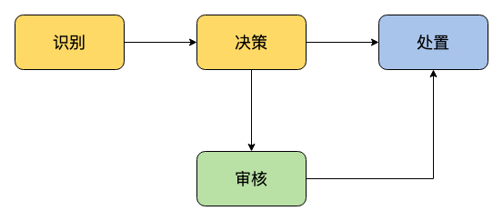
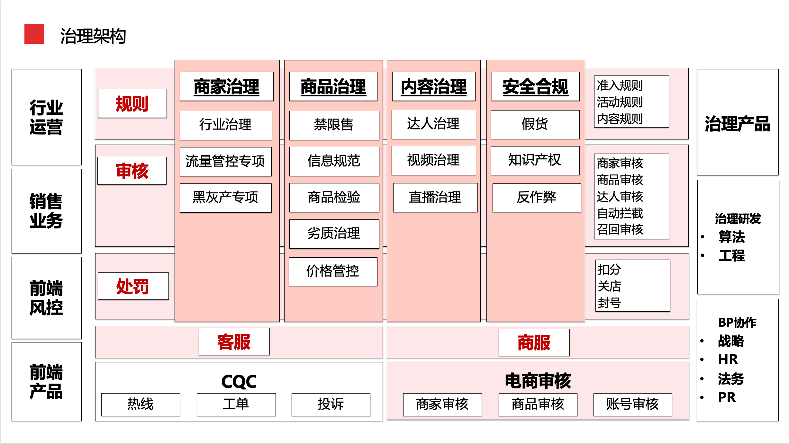
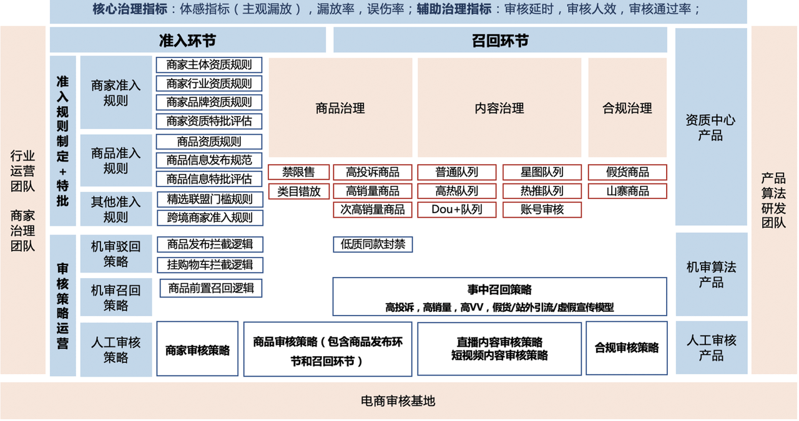
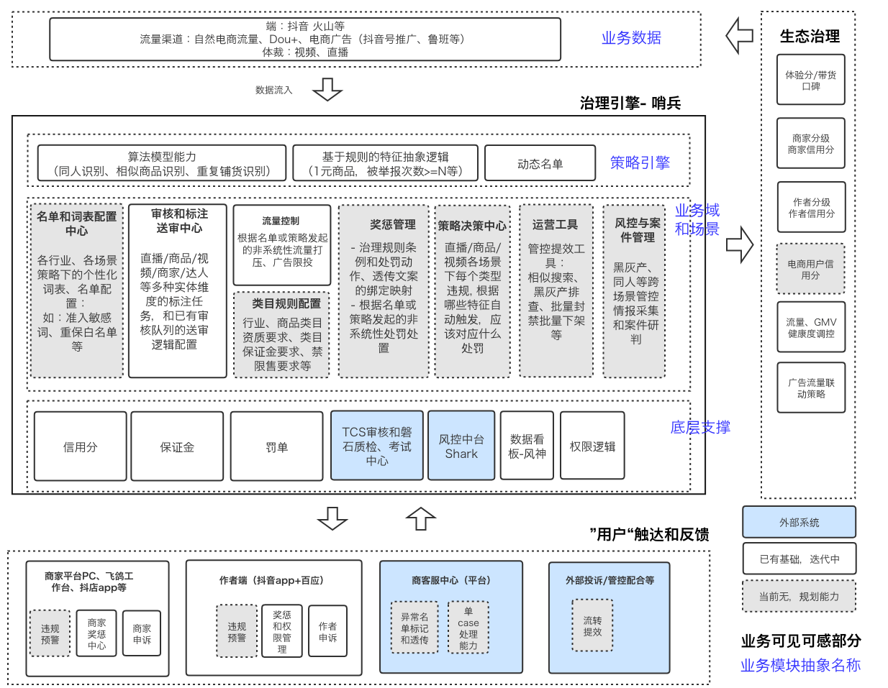
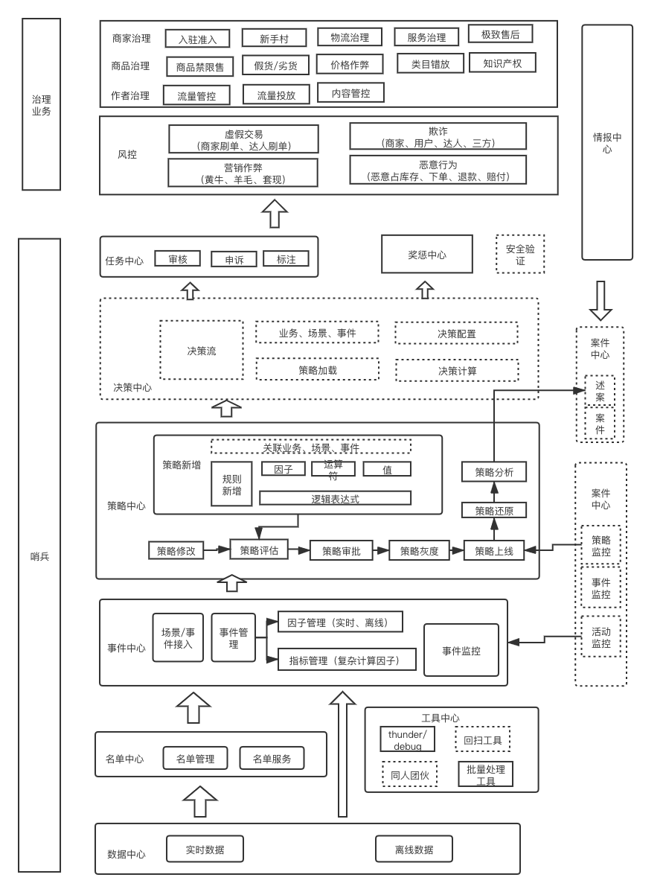
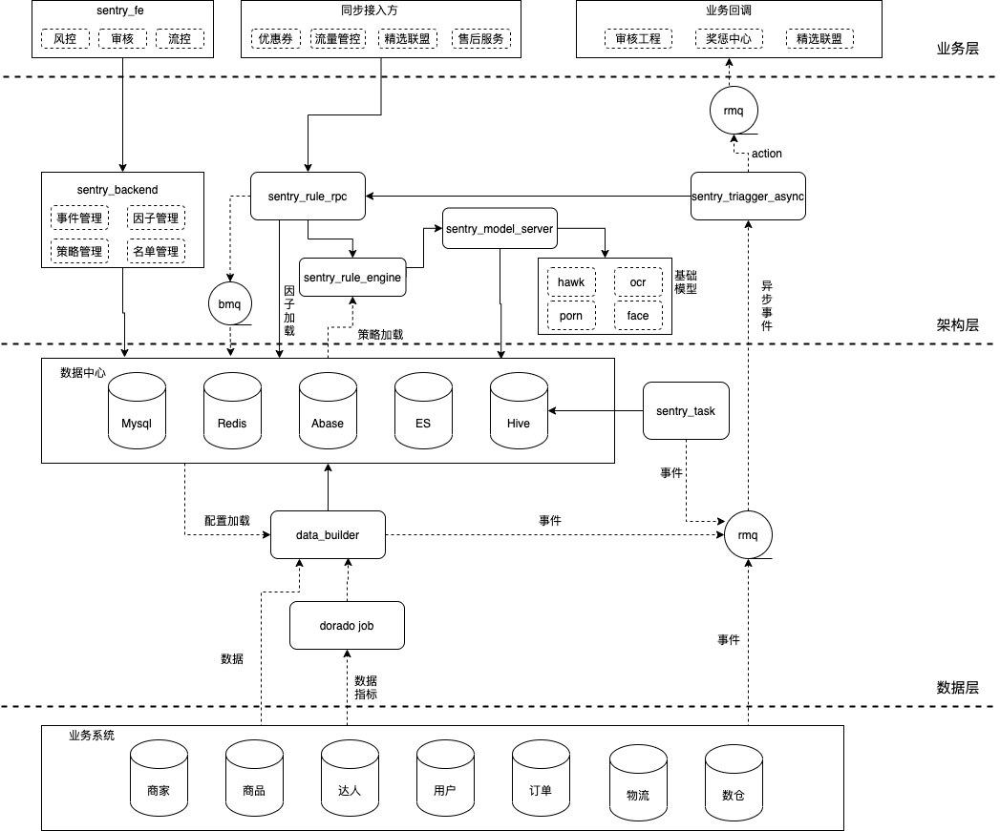
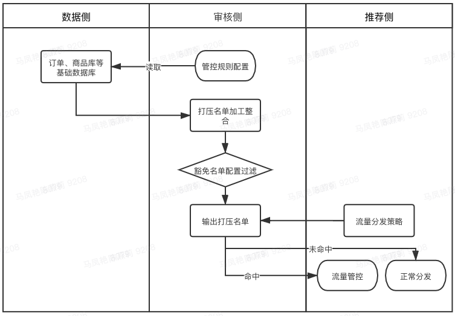
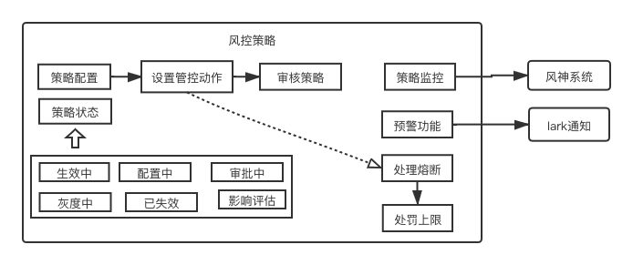

# 平台治理 all in one

## 0/电商架构

从整个电商业务的架构来看，平台治理只是其中的一个环节。

整个电商可以大概的分成【前台业务、中台业务、后台业务】。

其中前台业务包含【电商广告（鲁班），垂直行业解决方案（玉石），直播，购物车等内容】。

中台业务则更加复杂， 包含：

- 营销中心（活动，优惠卷，秒杀等）
- 订单中心（下单，履约，逆向等）
- 支付中心（支付，清算，账务等）
- 商家中心（商家入驻，店铺装修，资质管理）
- 商家客服IM（会话，客服，数据）
- 商品中心（商品，价格，库存，类目，评价）
- 物流中心（地址库。。。）
- 会员中心
- 联盟基础能力（达人选品，商品推广，分佣，MCN管理，商家服务商）

而平台治理则贯穿于前端和中台业务之间，负责管理进行审核，风控，流量治理，奖惩等等业务内容。

## 1/平台治理架构

平台治理的愿景是：打造一个安全合规的平台秩序，建立用户信赖的健康生态。

治理工作主要的四个环节是：识别，决策，审核，处置。




从四个环节出发，平台治理的大概架构大致如下：



纵向来说，以商家治理，商品治理，内容治理以及安全合规, ISV治理等作为治理对象. 横向来看,  则主要分为规则, 审核,  处罚三个核心的业务逻辑.

因此我们的主要业务方向就被划分为了：

- 审核工程
- 奖惩平台
- 治理引擎
- 麦哲伦治理（海外治理）

其中的海外治理属于独立的完整业务。我们在这里不进行表述，也不会影响业务逻辑的完整性。


### 1.1/审核工程

审核工程包含商家审核，商品审核，达人审核等准入环节的业务实现。以AI审核到人工复审形成高效率的商家商品准入流程。其大概的架构如下：



一个审核对象的大致流程大致是这样的：

```
商家/商品 
	-> 通过AI进行智能审核（机器审核）
	-> 人工对机审进行初审
  -> 人工质检
  -> 触发一定条件时，平台会进行主动回归，发起召回审核（风险质量召回）
  -> 命中高位评论模型以及存在举报的时候会进入人工复审（人工复审）
```

审核工程中，最主要的业务内容大致有这么几块：

- 商家准入审核
- 商品准入审核
- 商品召回
- 挂机（挂到抖音购物车）审核的内容审核
- 质检&知识产权

衍生出的平台和模块包括：

- 入驻和资质中心
- 商品的抽检平台
- 入驻规则模块
- 召回审核模块
- 判罚模块

后面我们在整体串联的时候，会看到审核工程的模块在整个治理业务中的位置。


### 1.2/奖惩平台

奖惩平台的使命是：判罚处置与引导教育相结合，宣教预警及时，量刑稳定适度，触达清晰有效。

奖惩在治理中处于中间环节，衔接违规识别和各端处置。

- 上游对接各个违规识别系统（电商审核，哨兵识别，抖音复审，直播中台，安全中心。。。）
- 下游对接各个业务域和端上（抖音用户，作者，商家，机构，服务商。。。），实现判罚处置的实际生效

整体上就是支撑起电商治理下的：【量刑->处置->触达/申诉/教育】 的完成奖惩流程。

另外一个对于平台来说的重要作用就是生产和维护治理域下的“证据/判罚/处置/申诉”的全链路数据资产。

整体的技术架构如下所示：

 

整体上就是将审核的内容结果通过违规识别，预警复检， 然后通过规则引擎来进行匹配和量刑，并后续通过执行平台进行处置，触达或者申诉。并且保全整个流程中的快照，操作记录，证据链，支撑下游的数据应用平台。


### 1.3/治理引擎（哨兵）

哨兵平台的定义是给运营和研发同学提供一站式可配置的治理平台，目标是覆盖电商日常的治理场景， 降低电商治理研发和审核的人力成本。

在整个平台治理业务中处于一个比较中间的位置。




其整体的业务架构大概如下所示：



哨兵涵盖了许多业务模块，比如：

- 策略中心：管理**策略**的新增，下架，修改，评估，查询
- 名单中心：进行白名单，敏感词等列表数据的管理。
- 事件中心：通过构建因子，进行场景/事件的构建。用于对接扣个业务场景屏蔽内部的一些接口细节，提供面向业务友好的接口，方便业务快速的接入。
- 运营工具：提供黑灰产管理，批量管理，保平推荐，预警单批量管理等运营工具。
- 。。。

关于哨兵的业务逻辑，我们在下一部分可以展开来说说。


## 2/哨兵

哨兵以打造`业务运营决策自动化一站式平台`为目标，提供对业务决策全生命周期管理的能力，从业务决策的挖掘、配置、评估、自动生效、再到监控和运营。帮助降低人力成本，提高决策的效率。

作为治理引擎，核心能力体现在：

- 分行业，分管控环节（如准入，内容审核，交易下单）健全模型和策略的识别能力
- 风控可实现事先预警、异常挖掘的自动化，实时training模型升级识别和对抗能力
- 管控规则和判罚梯度，判罚对象和动作均可配置，可逆。

整体的技术架构如下：




- 实时引擎： 业务时效性要求高，几毫秒到几百毫秒， 通常通过rpc同步调用接入，比如优惠券风控。
- 异步（近线引擎）：时效性要求中，几秒到分钟级， 通常通过mq接入或者rpc异步接入，结果再回调并通知业务方，比如商品准入审核
- 离线引擎：时效性要求低，分钟到天级。通过dorado任务回扫实现。

对于哨兵前端来说，可以从功能模块上进行划分和介绍：


### 2.1/策略中心

所谓的策略，就是根据不同的上游数据（规则），触发不同动作（管控手段）的业务行为。

策略的几个组成要素大致如下：

- 策略信息：策略本身的元信息
  - 策略场景：根据不同的策略类型：**流量**， **风控**，**审核**等，每种策略下面下存在不同的场景，比如风控下面就会分成订单，客服，商品等等。**场景是策略处理的依据**。
  - 策略名称：表示该策略的含义
  - **事件**：该策略场景下的某种业务动作，**事件中心**的管理对象。
  - 规则配置：针对该业务行为的部分指标建立规则进行筛选，规则的基本单位是**因子**，策略规则由因子和因子之间的逻辑关系建立起来。
  - 配置原因：针对该策略建立的补充描述
- 数据评估信息：策略生效后命中的数据样本信息，根据不同的策略类型配置内容不同。
- 管控动作：命中预定的类型+场景+规则之后，就出触发对应的管控动作。管控的动作分为：【阻断、放行、标记】三种类型，不同的类型下面会有一些动作和动作对应的配置。
  - 动作可以配置多个
    - 不同的动作对应不同的配置选项
  - 动作有特殊的动作熔断配置，可以决定如果在规定时间内触发次数达到上限，则不会再次触发动作

配置策略的大致流程也就是配置这些信息的过程：

1. 填写策略信息
2. 设置管控动作
3. 提交审核

这里有个简单的策略例子：

> 以`风控策略`为例，配置场景为`保险业务风险管理`，触发事件为：商家签约保险服务。同时配置规则如下：
>
> - 商家近90天的退货率 > 30%
>
> 则触发处置动作：发起`阻断`动作，配置优先级10（在有相同触发策事件的时候，动作执行的先后顺序），发起`商家奖惩`动作，按条例1568，对对应的商品进行`封禁`。

这就是一个简单的策略的配置和生效的过程。

#### 2.1.1/流量调控

流量调控是是策略中心的其中一种策略类型。其业务背景在于单独依靠审核，罚款，封号等强硬的惩罚措施，对于一些案例来说管控力度过大并且有舆论风险，流量调控可以通过流量管控的手段降低风险，快速实现基于商品，商家，作者维度的流量管控，降低平台的风险。

流量调控主要在三个方向上进行控制。

- 数据侧：从订单，商品库中获取基础数据
- 审核侧：通过规则的配置（因子），生成打压名单，通过豁免名单的配置过滤，输出最终的打压名单
- 推荐侧：通过调用流量分发策略，对命中的名单对象进行流量管控。



> 举个例子，我想对某个商品进行流量控制，
>
> 1. 在流量控制页面新增策略， 
> 2. 然后配置对应的商品因子，
> 3. 随后进行数据评估，
> 4. 评估完成后设置管控动作。
>
> 这样一个控制某个商品流量的策略就建立完成了。


#### 2.1.2/风控策略

风控策略是一个覆盖场景比较多的策略类型，包含了商品治理，商家治理，作者和联盟治理，恶意行为，反欺诈，反洗钱，反作弊等风险行为。

由于如此，风控策略的因子也会比较多



整体来说，风控策略的整体架构就是如上图显示。


#### 2.1.3/审核策略

对于审核策略，主要应用在商家审核以及店铺的审核。命中之后会进入相应的人工审核。

根据审核策略的内容，也会有特定的策略内容，管控动作。


### 2.2/名单配置中心

名单配置中心是作为电商通用名单配置模块，满足哨兵本身一起其他电商系统的名单需求，支持一些自定义的字段扩展， 满足一些内控安全要求。

名单配置中心，本质上是提供一个界面来对一批对象进行【存储、记录、管理】的功能。

名单内是可以对接到哨兵规则引擎进行应用，或者是提供开发接口让其他团队查询名单或者对象。

名单的结构可以分为名单本身的元信息和组成名单的对象，自身元信息大致如下：

- 名单的类型：商家，商品，用户，手机号，敏感词，其他。
- 名单的归属业务：平台治理，小店运营，百应运营等业务场景。
- 名单的名称：易于辨识和传递信息的名称配置
- 名单的Key：唯一标识
- 名单的描述：描述名单的具体的使用场景和注意事项

而对于**名单对象**， 在不同的名单类型下，指向的是不同的实体，比如商家入驻免保证金报名单中，名单对象就是位于名单中的每个商家实例。


#### 2.2.1/名单标签

> TODO: 名单标签对名单对象建立的影响


#### 2.2.2 敏感词&豁免词

> TODO：敏感词和豁免词


#### 2.2.3/黑&白&灰 名单


#### 2.2.4/重保名单

给相关核心用户提供的重点保护名单，豁免相应审核的商品或者产品


### 2.3/事件中心

事件中心是用于事件的管理和接入，屏蔽了内部接口细节，提供面向业务友好的接口，方便业务快速的接入。事件中心的主要能力有两个：事件监控，因子配置。


#### 2.3.1/事件管理

事件随业务和对应的场景进行区分，不同的业务+场景+事件组成策略。

每一个事件中包含了许多的因子，因子和事件是从属关系。

目前来说，事件不可自由创建，是有各个业务场景下预先定义和配置好的。


#### 2.3.2/因子管理

因子作为引擎中的基本要素存在，作用是在策略中通过逻辑判断决定策略的是否生效。

其主要组成有三部分：

- 元信息：因子自身的信息，包括：
  - 名称
  - 参数名称
  - 所属对象类型：商家/店铺/作者/订单等
  - 数据类型：int/long/string
  - 时效性：实时的获取数据还是T+1获取数据
  - 公共因子：若不是则与事件相关联
- 数据源信息：来源各个业务端上的数据，提供给因子进行判断
  - 在线数据源
  - 离线数据源
- 存储信息


### 2.4/运营工具

主要集成了一些运用常用的工具，来帮助运营同学提高工作效率。

- 黑灰产排查：对商家/商品/作者进行黑灰产的手动排查。
- 联盟推广管理：对商家的联盟推广权限进行批量操作
- 商品批量下架：批量的对违规商品进行下架处理
- 关单任务：通过建立关单任务， 对一些订单进行批量关闭，需要配置对应的订单圈定动作，并且可以设置用户触达，商家奖惩以及审批。
- 预警单批量管理：对预警单进行批量操作。