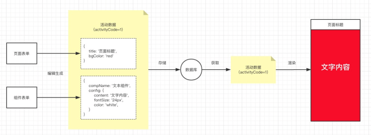
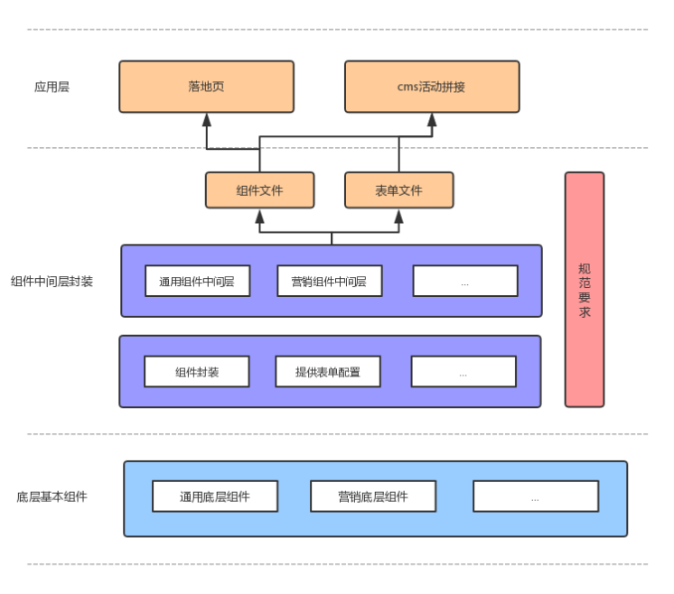

# 乐高项目总结

乐高的主要功能: 通过组件的拖拽和表单的配置生成一个页面. 

## 原理




## 架构



1. 底层组件库拆解为通用底层组件库, 营销底层组件库适配到不同的业务层组件
2. 业务层组件还在为营销组件, 投放组件等不同的组件库.
3. 每个组件都有对应的组件文件模板和表单组件模板
4. 在应用层, 落地页系统和cms控制台
5. 落地页负责渲染后台配置的活动页面
6. cms负责活动页面的创建和拼接

## 中间层组件库的编写

### 组件库的约定项目结构

```
├── README.md
├── babel.config.js
├── build
│   ├── new.js
│   ├── remove.js
│   └── share
│       ├── module.js
│       ├── templates.js
│       └── utils.js
├── components.json                     // 组件map文件
├── examples                            // 本地调试组件
│   ├── App.vue
│   ├── index.js
│   ├── router.js
│   └── views
│       ├── components
│       │   └── test.vue
│       └── home.vue
├── package.json
├── postcss.config.js
├── public
│   └── index.html
├── src
│   ├── api                             // 接口文件
│   │   ├── index.js
│   │   ├── url
│   │   │   └── gcudgel.js
│   │   └── util.js
│   ├── assets
│   │   └── js
│   │       ├── common.js
│   │       ├── const.js
│   │       ├── event.js                // 事件通信
│   │       └── variables.js
│   ├── cms                             // cms自定义
│   │   └── index.js
│   ├── components 
│   │   └── test
│   │       ├── form.js                 // 组件配置信息
│   │       └── index.vue               // 组件源码
│   ├── cms.js                          // 导出所有组件配置信息
│   ├── component-list.js               // 组件数据导出文件
│   └── index.js                        // 导出所有组件源码
├── vue.config.js
├── vue.exam-config.js
└── yarn.lock
```

### 组件列表文件

在源码目录的最外层, 有一个`component-list`文件, 其中包含了最终用于cms平台的组件列表信息, 其内容是一个配置对象, 大致的数据结构如下:

```js
[
    {
        type: '投放视觉组件', // 组件模块
        alias: '测试', // 组件模块名称
        hide: true, // 不在cms.js和index.js两个入口文件导出该模块
        helpUrl: '', // 帮助文档的地址
        components: [
            // 该模块中的组件
            {
                componentName: 'component', // 组件名称
                alias: '组件别名',
                icon: '', // 组件的图标, 用作组件的预览
                hide: true, // 不在cms.js和index.js两个入口文件该组件
                defaultConfig: {
                    // 提供一些默认的配置
                    discountType: 'bottom',
                    imgUrl: '',
                },
                defaultModuleInfo: {
                    // 基础的一些模块信息
                    moduleName: '置底留咨框', // 模块的名称
                    config: {
                        position: 'fixed', // 模块的定位模式
                    },
                    positionInfo: {
                        // 当前定位模式下的相关配置信息
                        ifBottom: true,
                        bottom: 0,
                        zIndex: 101,
                    },
                },
            },
        ],
    },
];
```

这个文件中的组件的初始信息是可以自动生成的, 当手动的修改的对应的配置信息以后, 可以通过refresh命令更新相关的文件.

### 组件开发

#### 组件数据结构的设计

页面的结构信息配置如下:

```ts
interface IPageInfo {
  title: string; // 活动标题
  bgColor: string; // 活动背景颜色
  type: '1' | '2'; // 1: 品牌落地页; 2: 车辆落地页
  ifShare: boolean; // 是否可以分享
  shareInfo?: {
    title: string; // 分享标题
    subTitle: string; // 分享副标题
    imgUrl: string; // 分享图标
  };
  ifTime: boolean; // 是否配置活动时间
  timeInfo?: {
    dates: Date[];
    ifBlankPage: boolean; // 是否展示过期空白页
  };
  ifActivity: boolean; // 是否配置营销活动
  marketingActivityId?: string; // 营销活动id
  ifClickLogin: boolean; // 点击页面是否要求登录
}
```

用户的信息结果如下:

```ts
interface IUserData {
  // 由于app和h5的信息不同，只列出相同的部分
  // app: 从Tower.getUserData中获取
  // h5: 从[market-data](https://fedoc.souche-inc.com/market-data)中获取
  token: 'string'; // 用户token
  phone: 'string'; // 用户手机号
  avatar: 'string'; // 用户头像
  userId: 'string'; // 用户id
  iid: 'string'; // 用户iid
}
```


组件的信息配置如下: 

```ts
interface IComponentProps {
  config: {
    // 这个字段是在cms中定义
    // 注册事件的时候需要这个字段
    // 本地调试（serve）的时候可以手动增加这个字段
    ref: string; // 组件唯一标识，格式: ComponentName_Timestamp
    [key: string]: any;
  }; // 组件自身配置
  pageInfo: IPageInfo; // 页面配置信息
  userData: IUserData; // 用户信息信息
  env: 'development' | 'prepub' | 'production'; // 项目运行环境
  inPreview: boolean; // 组件是否在拖拽的预览页面中
}
```

组件的通信主要通过`eventBus`模式来实现的, 结构定义如下:

```ts
interface IEventInfo {
  event: string;
  eventName: string; // 注册的事件名
  eventDesc: string; // 事件描述
}

interface IEvents {
  componentEvents: {
    // key值表示组件的config.ref (ComponentName_Timestamp)
    // 组件的唯一标识 对应 该组件注册的事件列表
    [key: string]: IEventInfo[]
  }
}
Vue.prototype.$events: Vue & IEvent = new Vue();
```

使用方式如下:

1. 注册一个事件:

```ts
vm.$events.$on('指定事件名');
```

2. 触发一个事件:

```ts
vm.$events.$emit('指定事件名')
```

3. 注册一个全局唯一的事件

```ts
// 引用事件混合（即 src/assets/js/event.js 文件）
export default {
  mixins: [eventMixin],
  created() {
    this.genEvent({
      event: '事件名',
      eventDesc: '事件描述',
      cb: () => {}, // 事件回调
    })
  }
}
```

这个方法的实现如下:

```ts
/**
 * 全局事件注册 并 在全局事件对象中增加事件列表 Variables.event.componentEvents { }
 * @param {String} event 事件名
 * @param {String} eventDesc 事件描述 cms表单展示用
 * @param {Function} cb 事件回调
 */
genEvent({
    event,
    eventDesc = '事件描述',
    cb,
}) {
    const list = Variables.events.componentEvents = Variables.events.componentEvents || {};
    const events = list[this.config.ref] = list[this.config.ref] || [];
    const eventName = `${this.config.ref}:${event}`;
    events.push({
        event,
        eventName,
        eventDesc,
    });
    Variables.events.$on(eventName, cb);
},
```

本质上是维护了一个`componentEvents`对象, 然后通过引入组件的唯一标识进行组件名称的唯一化处理. 然后推入当前的事件触发列表中去. 

最后通过`$on`去在事件总线上设置事件监听.

4. 触发一个全局唯一事件

```js
// vm.$events.componentEvents上可以获取所有注册事件
// 通过遍历找到指定事件
const componentEvents = vm.$events.componentEvents;
const componentRefs = Object.keys(componentEvents);
// 找到当前组件事件的名称
const componentRef = componentRefs.find(ref => ref.indexOf('CoTest') > -1);
const events = componentRefs[componentRef];
vm.$events.$emit(events[0].eventName);
```

之后, 在配置页面就可以通过选择不同的事件的下拉选择来触发不同的事件了.

### 组件配置

#### 组件参数

每个组件都会提供一个`form.js`的文件用于生成一个动态表单, 来对组件数据进行可视化的配置.

`form.js`的配置项设计如下:

```ts
type FormItemConfigType = FormItemConfig[] | {
  name: string; // 标题名字
  show: boolean; // 默认是否展示
  fixed: boolean; // 是否固定菜单
  list: FormItemConfig[]
}[]

interface IFormConfig {
  docUrl: string; // 组件说明文档
  hide: boolean; // 是否在左右组件列表隐藏该组件
  componentName: string; // 对应组件注册的名字
  cmsName: string; // cms上面展示的名字
  cmsLogo: string; // cms上面展示的logo
  formItems: FormItemConfigType | ((config: IComponentProps.config) => FormItemConfigType); 
  labelPosition: 'left' | 'right' | 'top'; // label标签位置
  defaultConfig: any; // 组件的默认配置
  // object: (descriptor)[https://github.com/yiminghe/async-validator#rules]
  // Function: 上下文环境为当前表单的实例, 组件校验的规则
  rules?: object | Function; 
  // 表单校验
  // 上下文环境为当前表单的实例
  checkData?: Function;
  autoBuryList: // 自动埋点数据
  	(config) => Array<{buryId: string; buryName: string;}> |
  	Array<{buryIdKey: string; buryNameKey: string}>
}

// 自定义组件
import CustomComponent from './custom-component';

// 一个组件的配置实例
const formConfig: IFormConfig = {
  componentName: 'CoTest',
  cmsName: '测试',
  cmsLogo: '//img.souche.com/f2e/2a889f20acfe114ad57e63d10dae0a7d.png', 
  // 组件表单的配置内容   
  formItems: [
    {
      itemType: 'input',
      label: '名字',
      prop: 'name',
    },
    {
      itemType: 'custom',
      component: CustomComponent
    }
  ],
  // 组件的默认配置
  defaultConfig: {
    // 组件的默认配置
    name: '默认名字'
  },
  // 表单的校验向
  rules() {
    // descriptor 如下
    return {
      name: {
        required: true,
        message: '必填'
      }
    }
  },
  // checkData内部默认如下
  // 可以自定义的校验函数
  checkData(cb) {
    this.$refs.form.validate(cb);
  },
  /**
   * componentInfo 变化组件的信息
   * marketState 结构可在页面信息中查看
   * next 调用该函数才能允许插入，传入字符串则alert警告
   */
  // 组件插入前的操作
  beforeCreate(marketState, next) {},
  // 当有组件要插入的时候触发
  beforeEachCreate(componentInfo, marketState, next) {},
  // 组件删除前的操作
  beforeRemove(marketState, next) {},
  // 当有组件要删除的时候触发
  beforeEachRemove(componentInfo, marketState, next) {}
}

export default formConfig;
```

#### 表单类型

cms配置后台会根据`form.js`中提供的`formItems`来生成对应的表单, 内置了一些通用的表单元素和自定义类型. 

```ts
{
  formItems: [
    {
      itemType: 'input',
      label: '文本内容',
      prop: 'text',
    },
    {
      itemType: 'color',
      label: '字体颜色',
      prop: 'color',
    }
  ]
} // => config: { text: string; color: string }
```

具体有下面这些类型:

```ts
interface IOption {
  label: string;
  value: any;
}

interface IBaseFormItemConfig {
  label: string; // 表单标签
  itemType: string; // cms上面提供的表单类型
  prop: string; // 配置对应的config字段
  // cms表单内部使用了element的表单组件
  // el-form-item的prop优先取这个字段，无则取上面prop
  // 组件校验的时候有用
  formItemProp?: string;
  if?: (config) => boolean;
}

// 输入框
interface IInputFormItemConfig extends IBaseFormItemConfig {
  itemType: 'input';
  placeholder?: string; // 占位
}

// 单选框
interface IRadioFormItemConfig extends IBaseFormItemConfig {
  itemType: 'radio';
  options: IOption[];
}

// 多选框
interface ICheckboxFormItemConfig extends IBaseFormItemConfig {
  itemType: 'checkbox';
  options: IOption[];
}

// 下拉菜单
interface ISelectFormItemConfig extends IBaseFormItemConfig {
  itemType: 'select';
  options?: IOption[];
  /**
  * 动态设置下拉参数
  * setOptions 通过回调函数resolve设置options,
  * valueKey 如果option的value值是对象，需传value中的唯一标识字段
  */
  setOptions?: (resolve: (options: IOption[]) => void) => void;
  valueKey?: string;
}

// 颜色组件
interface IColorFormItemConfig extends IBaseFormItemConfig {
  itemType: 'color';
}

// 文本编辑器
interface IEditorFormItemConfig extends IBaseFormItemConfig {
  itemType: 'editor';
}

// 上传图片
interface IUploadImgFormItemConfig extends IBaseFormItemConfig {
  // 返回数据结构
  // Array<{ imgUrl: string; buryName?: string; buryId?: string; }>
  itemType: 'uploadImg';
  limit?: number;
  hideConfig?: boolean; // 隐藏埋点、链接跳转配置
  hideLink?: boolean; // 隐藏链接跳转配置
}

// 上传单张图片
interface IUploadSingleImgFormItemConfig extends IBaseFormItemConfig {
  itemType: 'uploadSingleImg';
}

// 上传视频
interface IUploadVideoFormItemConfig extends IBaseFormItemConfig {
  // 返回数据结构
  // { aspectRatio: '16:9'; poster: string; sources: Array<{ src: string; }>; }
  itemType: 'uploadVideo';
}

// 跳转链接
interface ILinkFormItemConfig extends IBaseFormItemConfig {
  // 返回数据接口
  // {
  //   type: 'custom' | 'new-list' | 'new-detail' | 'used-list' | 'used-detail';
  //   data: any
  // }
  itemType: 'link';
}

// 自动埋点类型
interface IBuryInfo extends IBaseFormItemConfig {
  // 返回数据接口
  // {
  //   ifBury: boolean;
  //   buryName: string;
  //   buryId: string;
  // }
  itemType: 'buryInfo';
  prop: string; // 支持深路径
  desc: string; // 埋点描述（会被用作默认埋点名）
  buryNameKey: string; // 老埋点结构中埋点名对应的key值（支持深路径）
  buryIdKey: string; // 老埋点结构中埋点id对应的key值（支持深路径）
  disabled: boolean // 是否禁止勾选操作（默认:false）
}

// 自定义组件
// 接受参数props
// config 组件数据
// pageInfo 页面数据
// formItem 组件表单配置
// componentInfos 所有的组件数据
interface ICustomFormItemConfig {
  itemType: 'custom';
  component: Vue;
}
```

#### 统一埋点

表单类型中有预置的埋点类型, 用于同一的埋点组件. 发布活动的时候会获取配置下面的埋点数据, 供注册埋点使用. 

1. 使用内置表单项

```js
// formItemOpts
{
  itemType: 'buryInfo',
  prop: '', // 返回数据结构 { ifBury, buryName, buryId }
  desc: '', // 埋点提示，会用于默认的埋点名
  buryNameKey: '', // 老数据结构埋点名对应的字段
  buryIdKey: '', // 老数据结构埋点id对应的字段
  disabled: false // 是否禁止更改
}
```

2. 自定义组件内部使用(基础组件使用)

```html
<co-bury-info
  :componentName="componentName"
  :config="config"
  :formItem="formItemOpts"></co-bury-info>
```

#### 线索统计

用于统计当前页面所有的线索相关信息展示在数据页面中, 保存在`clueListJson`中.

```js
interface IBuryInfo {
	buryId: string;
	buryName: string;
  [key:string]: any;
}
  
interface IClueInfo {
  index?: number;
  clueCode: string; // 线索code
  clueName: string; // 线索名称
  clueType: string; // 线索类型（如：A，B）
  extraData?: object; // 存放其他的数据，不会在线索的列表中展示（如意向池信息等）
  clickBuryInfo: IBuryInfo; // 触发留咨埋点信息
  successBuryInfo: IBuryInfo;// 留咨提交成功埋点信息
}

// 完整数据示例
const clueInfoList:IClueInfo[] = [{
    index: 4 // 页面中组件的位置
    clueCode: 'clueCode',
    clueName: '营销留咨组件线索',
    clueType: 'A',
  	extraData: {} //存放其他的数据，在线索的列表中不展示，（意向池信息等）
    clickBuryInfo: {
      buryId: '',
      buryName: ''
    },
    successBuryInfo: {
      buryId: '',
      buryName: ''
    }
}]

// form.js中注册线索数据的示例
// 在form.js下维护setClueInfo方法
setClueInfo(config) {
  let itemSubmit = config.submitBuryInfo;
  let itemClick = config.clickBuryInfo;
  return [{
    clueCode: config.clueCategory,
    clueName: '营销留咨组件线索',
    clueType: 'A',
    clickBuryInfo: {
      buryId: itemClick.buryId,
      buryName: itemClick.buryName,
    },
    successBuryInfo: {
      buryId: itemSubmit.buryId,
      buryName: itemSubmit.buryName,
    },
  }];
},
```

#### 数据统计

```js
interface IBuryInfo {
	buryId: string;
	buryName: string;
  [key:string]: any;
}

interface ICoreBuryInfo {
	componentName: string;
  index: number;
  extraData: object;
  clickBuryInfo: IBuryInfo;
  successBuryInfo: IBuryInfo;
}

const coreBuryListJson: ICoreBuryInfo[] = [{
  	index: 3, // 页面中组件的位置
		componentName: '抽奖组件',
  	extraData: {},
		clickBuryInfo: {
			buryId: '抽奖点击',
			buryName: '抽奖点击'
		},
		successBuryInfo: {
			buryId: '抽奖成功',
			buryName: '抽奖成功'
		}
	}
]

// coreBury的来源
// 所有线索clueInfoList中的clickBuryInfo，successBuryInfo埋点信息都属于核心埋点，
// 会将这些埋点提取出来作为coreBury数据的来源
// 如果不是线索的但是也涉及到类似这种的（点击埋点+成功埋点 组合），可以使用方法单独的注册
// 如：抽奖组件没有留线索，但是也有抽奖触发前，抽奖成功后，也很重要，所以可以使用setCoreBuryInfo
// 单独的添加到coreBury中
setCoreBuryInfo(config) {
  let clickBuryInfoList = config.lotteryBury;
  let successBuryInfoList = config.lotteryBurySuccess;
  return {
    clickBuryInfo: {
      buryId: clickBuryInfo.buryId,
      buryName: clickBuryInfo.buryName,
    }, // 触发埋点信息
    successBuryInfo: {
      buryId: successBuryInfo.buryId,
      buryName: successBuryInfo.buryName,
    }, // 提交成功埋点信息
  };
}
```

## 编辑器原理

原理: iframe + postMessage

其中`iframe`的主要接口如下:

```html
<template>
    <div></div>
</template>

<script>
/**
 * 动态插入iframe
 * 提供loaded事件
 * @param Props.url
 * @param Slots.loading
 * @param Events.loaded
 **/
</script>
```

封装通信事件:

```ts
import Vue from 'vue';

let msgEvent;

/**
 * @desc 添加iframe事件
 * @param iframeWindow 通信对象
 **/
export const addIframeListener = (iframeWindow: Window) => {
    let count = 0;
    const events = new Vue();

    /**
     * @desc 订阅事件
     * @param event 事件名
     * @param cb 回调函数 回调参数（data：数据；resolve函数：通知触发事件回调成功，可传参）
     * @return {Function} off方法
     */
    Vue.prototype.$onIframe = (event, cb) => {
        // cb 回调参数 data, cbEvent
        const callback = (data, cbEvent) => {
            cb(data, cbEvent && ((...args) => events.$emit(cbEvent, ...args)));
        };
        events.$on(event, callback);
        return () => events.$off(event, callback);
    };

    /**
     * @desc 订阅事件 只会触发一次
     * @param event 事件名
     * @param cb 回调函数 回调参数（data：数据；resolve函数：通知触发事件回调成功，可传参）
     * @return {Function} off方法
     */
    Vue.prototype.$onceIframe = (event, cb) => {
        // cb 回调参数 data, cbEvent
        const callback = (data, cbEvent) => {
            cb(data, cbEvent && ((...args) => events.$emit(cbEvent, ...args)));
        };
        events.$once(event, callback);
        return () => events.$off(event, callback);
    };

    /**
     * @desc 触发事件
     * @param event 事件名
     * @param data 数据
     * @return {Promise<any>} 事件触发成功的回调
     */
    Vue.prototype.$emitIframe = (event, data) => new Promise((resolve) => {
        const cbEvent = `${event}_cb${count++}`;
        events.$on(cbEvent, (...cbData) => {
            events.$off(cbEvent);
            resolve(...cbData);
        });
        iframeWindow.postMessage({
            event,
            data,
            cbEvent,
        }, '*');
    });

    msgEvent = (e) => {
        const msgData = e.data;
        const { event, data, cbEvent } = msgData;

        if (!event) return false;

        events.$emit(event, data, cbEvent);
    };

    window.addEventListener('message', msgEvent);
};

export const rmIframeListener = () => {
    delete Vue.prototype.$onIframe;
    delete Vue.prototype.$emitIframe;
    window.removeEventListener('message', msgEvent);
};
```