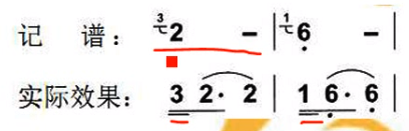

## 认识简谱

### 快速入门

- 简谱 1  2  3  4  5   6  7  
- 唱名 do re mi fa sol la si  
- 音名 C  D  E  F  G   A  B  
---
- 低音/倍低音
- 高音/倍高音
---
- 全音符: 4拍 `X - - -`
- 2分音符: 2拍 `X -`
- 4分音符: 1拍 `X`
- 7分音符: 1/2拍 `X_`
- 16分音符: 1/4拍 `X__`
- 32分音符: 1/8拍 `X___`
- 休止符: `0`

### 附点音符 / 附点休止符

作用: 增加前面音符时值的一半

`X .` = `1+1/2`拍

### 连音符号

- 同音连接, 后面的音符不演奏
- 异音连接, 弧线内连贯演奏


### 切分音

切分节奏

```
*
6
```

### 强弱拍 / 小节 / 小节线 / 终止线


### 拍号

表示拍子的记号, 叫做拍号. 

```
2/4

每小节有两拍, 以四分音符为一拍, 叫做四二拍
```

常用拍号有 四四, 四二, 四三, 八二, 八三, 八六 等等


### 常见强弱拍

四二拍: `强 弱 | 强 弱 |`

四三拍: `强 弱 弱 | 强 弱 弱 |`

四四拍: `强 弱 次强 弱 | 强 弱 次强 弱 |`

八六拍: `强 弱 弱 次强 弱 弱 | 强 弱 弱 次强 弱 弱 |`

### 弱起

单位拍弱起: 单拍中强弱交替, 在第一拍的弱拍中起

小节弱起: 从前一个小节的最后一拍(弱拍)起, 小节线省略

小节弱起且弱拍起: 从前一个小节的最后一拍的后半拍(弱拍)起

### 装饰音 -- 倚音

加在一个音的左上角的一个小音符叫单倚音. 




