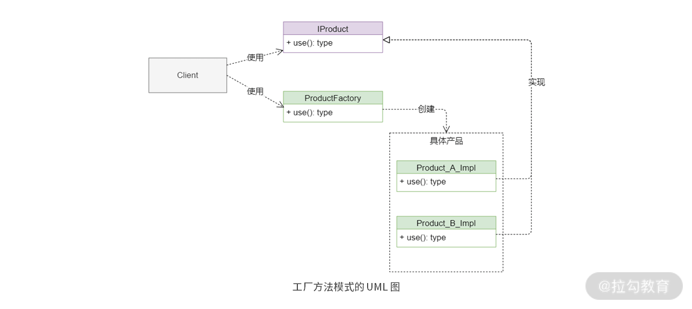

# 工厂模式:解决生成对象时的不确定性

工厂方法模式(Factory Methdod Pattern).

工厂方法模式, 俗称工厂模式. 类似抽象工厂模式, 但工厂方法模式因为只围绕着一类接口来进行对象的创建和使用, 使用场景更简单和单一, 在实际的项目中使用评率反而比抽象工厂模式更高.

## 模式原理分析

原始定义: 定义一个创建对象的接口, 但让实现这个接口的类决定实例化哪个类.

工厂方法模式的目的很简单: 封装对象的创建过程, 提升创建对象方法的可复用性.



工厂方法模式包含三个关键角色:

- 抽象接口(抽象产品)
- 核心工厂
- 具体产品(也可以是具体工厂)

其中, 核心工厂通常作为父类负责定义创建对象的抽象接口以及使用那些具体产品, 具体产品可以是一个具体的类, 也可以是一个具体工厂类, 负责生成具体的对象实例. 

不同于抽象工厂模式, 工厂方法模式侧重于直接对具体产品的实现进行封装和调用. 

用户通过使用核心工厂来获取具体实例对象, 在用过对象的统一接口来使用对象功能.

```java
//抽象产品
public interface IProduct {
    void apply();
}
//核心工厂类
public class ProductFactory {
    public static IProduct getProduct(String name){
        if ("a".equals(name)) {
            return new Product_A_Impl();
        }
        return new Product_B_Impl();
    }
}
//具体产品实现A
public class Product_A_Impl implements IProduct{
    @Override
    public void apply() {
        System.out.println("use A product now");
    }
}
//具体产品实现B
public class Product_B_Impl implements IProduct{
    @Override
    public void apply() {
        System.out.println("use B product now");
    }
}
//client使用者
public static void main(String[] args) {
    IProduct iProduct = ProductFactory.getProduct("");
    iProduct.apply();
    IProduct iProducta = ProductFactory.getProduct("a");
    iProducta.apply();
}
```

使用工厂方法模式可以很好的实现分离原则.

工厂方法模式封装了如下的变化:

- 工厂使用了哪些具体的实现算法
- 工厂使用的具体产品数量
- 工厂定义的抽象产品

**工厂方法模式是围绕着特定的抽象产品（一般是接口）来封装对象的创建过程，客户端只需要通过工厂类来创建对象并使用特定接口的功能。**

## 使用场景

1. 需要使用很多重复代码创建对象时，比如，DAO 层的数据对象、API 层的 VO 对象等
2. 创建对象要访问外部信息或资源时，比如，读取数据库字段，获取访问授权 token 信息
3. 创建需要统一管理生命周期的对象时，比如，会话信息、用户网页浏览轨迹对象等
4. 创建池化对象时，比如，连接池对象、线程池对象、日志对象等。这些对象的特性是：有限、可重用，使用工厂方法模式可以有效节约资源。
5. 希望隐藏对象的真实类型时，比如，不希望使用者知道对象的真实构造函数参数等。

工厂方法模式使用场景的本质：**尽可能地封装对象创建过程中所遇见的所有可能变化**

## 为什么要使用工厂方法模式

1. 为了把对象的创建和使用过程分开, 降低代码的耦合性
2. 减少重复代码
3. 统一管理创建对象的不同逻辑

## 优劣分析

优点:

1. 能根据用户的需求定制化的创建对象
2. 隐藏了具体使用哪种产品来创建对象
3. 实现同一抽象父类的多态性, 满足"里氏替换原则". 
4. 满足开闭原则

缺点:

- 抽象接口新增方法时, 会增加开发成本
- 具体工厂实现逻辑不统一, 增加代码理解难度

## 总结

如果对象的属性数量并不多, 并且创建过程也不复杂的话, 那么用不着使用工厂方法模式来创建对象, 毕竟工厂方法模式强调用使用继承来实现对象的创建, 会引入继承相关的副作用. 

工厂方法模式和抽象工厂模式虽然都用于创建对象，但是两者的侧重点是完全不同的。**工厂方法模式侧重于继承的连续性，而抽象工厂模式侧重于组合的扩展性**.

