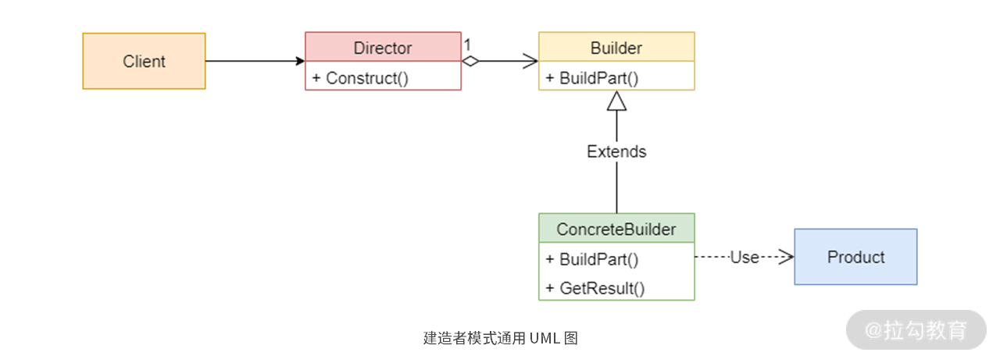

# 建造者模式:创建不同形式的复杂对象

- 为什么直接使用构造函数或者使用set方法来创建对象不方便?
- 为什么一定需要建造者模式来创建

## 建造者模式分析

> 将复杂对象的构造与其表示分离, 以便同一构造过程可以创建不同的表示

从图中我们可以看到, 建造者模式主要包含四个角色:

- **Product**: 代表最终构建的对象， 比如汽车类
- **Builder**: 代表建造者的抽象类（可以使用接口来代替）。 定义了构建Product的步骤， 它的子类需要实现这些步骤。同时，它还需要包含一个用来返回最终对象的方法`getProduct()`
- **ConcreteBuilder**: 达标Builder类的具体实现类
- **Director**： 代表需要建造最终对象的某种算法。 这里通过使用构造函数`Construct(Buildre builder)`来调用Builder的创建方法创建对象, 等创建完成后, 再通过`getProduct()`方法来获取最终的完整对象.

创建原理总结来说, 就是先创建一个建造者, 然后给建造者指定一个构建算法, 建造者按照算法中的步骤分步完成对象的额构建, 最后获取最终的对象.

建造者模式封装了如下的变化类型:

1. 每个具体建造器的构建步骤
2. 当前正在使用哪一个建造器
3. 现有建造器的数量
4. 一个建造器里面可以创建多个属性的特征.

## 常用场景分析

建造者模式有四种常见的使用场景:

- 需要生成的对象包含多个成员属性
- 需要生成的对象属性相互依赖, 需要指定其生成顺序
- 对象的创建过程独立于创建该对象的类
- 需要隔离复杂对象的创建和使用, 并使得相同的创建过程可以创建不同的产品

使用建造者模式能更方便地帮助我们按需进行对象的实例化，避免写很多不同参数的构造函数，同时还能解决同一类型参数只能写一个构造函数的弊端

## 为什么使用建造者模式

- 第一, 分阶段, 分步骤的方法更适合多次运算结果类创建场景
- 第二, 不需要关心特定类型的建造者的具体算法实现

## 收获与损失

使用建造者模式的优点:

- 分离创建与使用: 在建造者模式中, 使用者不需要知道你的内部实现算法
- 满足开闭原则: 每一个建造者都相对独立, 能方便的进行替换或者新增
- 自由的组合对象的创建过程

缺点:

- 使用返回优先
- 容易引起超大的类
- 增加代码的行数

## 总结

建造者模式应用的关键在于**抓住拆分步骤**, 这是与工厂模式最大的区别所在. 

