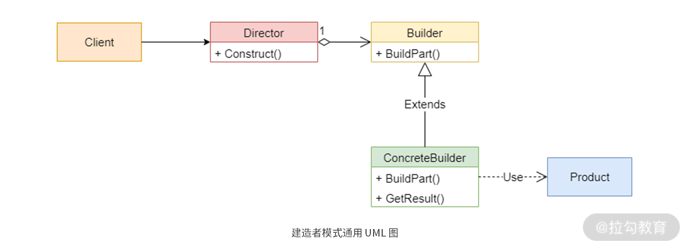

# 抽象工程模式: 统一不同代码风格下的代码级别

学习抽象工厂模式真正的重点和难点在于: 如何找到正确的抽象.

## 模式与案例分析

抽象工厂模式的原始定义: 提供一个用于创建相关或相关对象族的接口, 而无需指定其具体类型.

但是, 当我们在创建抽象工厂模式时, 最终还是会涉及指定具体的实现类.

换句话说, 定义只是说抽象工厂模式应该要朝着分析共性规律的方向走, 而在具体操作的时候, 我们还要仔细分析具体实现类应该怎么实现才行.

从图中, 我们看到抽象工厂模式包含四个关键角色:

- 抽象工厂
- 抽象产品(通用的一类对象或者接口)
- 具体工厂
- 具体产品(继承通用对象或接口后扩展特有的属性)

其中最关键的是: 抽象产品

抽象产品的好坏是直接决定了抽象工厂和具体工厂能否发挥最大作用的关键因素所在.

抽象工厂模式所隐藏的变化如下:

- 程序所支持的实例集合的数目
- 当前是使用的实例集合中的哪一个实例
- 在任意给定时刻被实例化的具体类型
- 实例集变化的而依据]

启示: 对于软件使用者来说, 他们更关心某一组产品的某些共性功能, 这些功能的具体实现他们并不在意. 对于软件创建者来说: 他们要找到正确的共性功能, 并尽可能隐藏具体的实现细节, 始终为找提供符合共性功能的软件. 

在理解抽象工厂模式的时候, 要牢牢记住: **如何找到某一个类产品的正确共性功能**.

## 使用场景分析

简单来说, 在软件开发中, 抽象工厂模式的使用场景主要就是解决跨平台兼容性的问题

在实际的代码实现中, 抽象工厂模式体现为定义一个抽象工厂类, 多个不同的具体工厂继承这个抽象工厂类后, 再各自实现相同的抽象功能, 进而实现代码上的多态性.

## 什么要使用抽象工厂模式

1. 对于不同产品系列具有比较多的共性特征时, 可以使用抽象工厂模式, 有助于提升组件的复用性
2. 当需要提升代码的扩展性并降低维护成本时, 把对象的创建和使用过程分开, 能有效的将代码统一到一个级别上. 
3. 解决跨平台带来的兼容性问题

## 优劣分析

优点:

- 符合开闭原则
- 可以保证同一工厂生成的产品符合预期
- 将使用和创建的代码进行解耦
- 满足单一职责原则
- 容易增加新的产品系列

缺点:

- 增加代码量
- 增加学习成本
- 变更产品的结构困难

## 总结

抽象工厂模式的本质, 在于寻找正确的抽象. 只有找到了正确的抽象产品, 才能发挥抽象工厂模式的作用.

