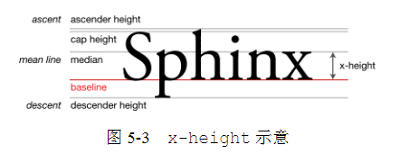

# 内联元素和流

## 字母X

- CSS中的极限就是基于字母X指定的
- `x-height`: 专指小写字母x的高度, 属于描述就是基线和等分线之间的距离



- ascender height: 上下线高度。
- cap height: 大写字母高度。
- median: 中线。
- descender height: 下行线高度

css中的`vertical-align:middle`就是计算的`x-height`的1/2位置进行垂直居中, 因此并不是绝对的垂直居中

#### x 和 ex

ex是CSS中的一个相对单位, 指的是小写字母x的高度, 就是指`x-height`

## line-height: 内联元素的基石

对于非替换元素的纯内联元素, 可视高度完全由`line-height`决定. 

如果是替换元素, 则`line-height`是不会受到影响的. 此时幽灵空白节点会变成撑开行高的元素

而在两种元素混合的时候, 他们共同构成的行框盒子, `line-height`则只能决定该盒子的最小高度.

在子元素继承`line-height`的时候, 如果是百分比或者长度值子元素会继承最终的计算值, 而如果是数值, 则会直接继承该数值. 

### line-height 的大值特性

无论内联元素`line-height`如何设置, 最终元素的高度都是由数值大的那个`line-height`决定的. 因为内联盒子中一定会存在与一个行框盒子中, 而行框盒子会有一个空白节点, 所以始终行框的高度会由最高的那个行高决定.

## vertical-align

该属性值可以分为以下4类:

- 线类: baseline(默认值), top, middle, bottom
- 文本类: text-tap, text-bottom
- 上标下标类: sub, super
- 数值百分比类: 20px, 2em, 20%等 

### vertical-align 作用的前提

只能应用于内联元素以及`display`为`table-cell`的元素. 


### vertical-align的线性类属性值

#### 1. inline-block 和 baseline

**vertical-align属性的默认是baseline在文本之类的内联元素中就是字符x的下边缘. 对于替换元素则是替换元素的下边缘. 如果是inline-block元素, 则规则要更加复杂: 一个inline-block元素, 如果里面没有内联元素, 或者`overflow`不是`visible`, 则该元素的极限就是其margin地边缘; 否则其极限就是内院中最后一行内联元素的基线**


#### 2. vertial-align: top/bottom

vertial-align: top, 垂直上边缘对其, 具体定义:
   1. 内联元素: 元素底部和当前行框盒子的顶部对齐
   2. table-cell元素: 元素低padding边缘和表格行的顶部对齐

bottom类似, 需要注意的地方在于: 内联元素的上下边缘对其的这个边缘是当前行框盒子的上下边缘, 并不是快容器


#### 3. vertical-align: middle

定义: 

1. 内联元素: 元素的垂直中心点与行框盒子基线往上1/2x-height处
2. `table-cell`: 单元格填充盒子相对于外边的表格行居中对齐


### vertical-align的文本类属性

- `vertical-align:text-top`: 盒子的顶部与父级内容区域的顶部对齐
- `vertical-align:text-bottom`: 盒子的底部和父级内容区域的底部对齐

所谓的父级内容区域, 指在父级元素当前`font-size`和`font-family`下应有的内容区域大小. 

### vertical-align的上标下标属性

- `vertical-align:super`: 提高盒子的基线到父级合适的上标基线位置.
- `vertical-align:sub`: 降低盒子的基线到父级合适的下标基线位置.


##  一个垂直居中的弹框实现

```html
<div class="container">   
    <div class="dialog"></dialog> 
</div>
```

```css
.container {   
    position: fixed;   
    top: 0; right: 0; bottom: 0; left: 0;   
    background-color: rgba(0,0,0,.5);   
    text-align: center;   
    font-size: 0;   
    white-space: nowrap;   
    overflow: auto; 
} 

.container:after {   
    content: '';   
    display: inline-block;   
    height: 100%;   
    vertical-align: middle; 
} 

.dialog {   
    display: inline-block;  
    vertical-align: middle;   
    text-align: left;   
    font-size: 14px;   
    white-space: normal;  
} 
```