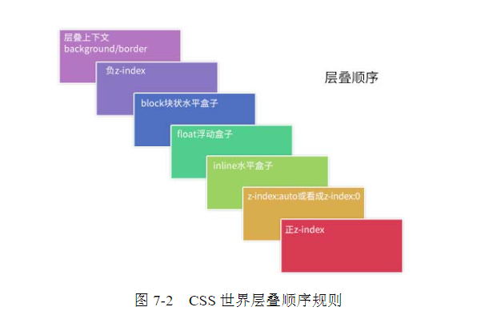
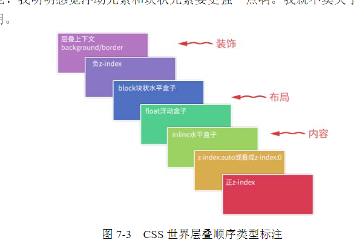

# CSS世界的层叠规则

**我们可以把层叠上下文理解为一种“层叠结界”，自成一个小世界。这个小世界中可能有其他的“层叠结界”，而自身也可能处于其他“层叠结界”中**

## z-index

层叠上下文(stacking context), 表示一个z轴, 决定了元素叠放时候的表现顺序

层叠水平(stacking level), 决定了同一个层叠上下文中元素在z轴上的显示顺序. 

以下是css2.1的时代的层叠顺序:

1. 位于最小面的`background/border`特指层叠上下文元素的边框和背景色, 每个层叠顺序规则仅适用于当前层叠上下文元素的小世界
2. inline水平盒子指的是包括`inline/inline-block/inline-table`元素的"层叠顺序", 他们都是同等级别的
3. 单纯从层叠水平上看, 实际`z-index: 0`和`z-index: auto`是可以看成是一样的. 注意这里的措辞--但从层叠水平上看, 实际上两者在层叠上下文有根本性的差异

## 层叠准则

1. 谁大谁上: 当具有明显的层叠水平标识的时候, 如生效的z-index属性值, 在同一个层叠上下文领域, 层叠水平值大的覆盖小的那一个
2. 后来居上: 当元素的层叠水平一致, 层叠顺序相同的时候, 在DOM流中处于后面的元素覆盖前面的元素

### 层叠上下文的特性

- 层叠上下文的层叠水平要比普通元素高
- 层叠上下文可以阻断元素的混合模式
- 层叠上下文可以嵌套, 内部曾得上下文及其所有子元素均受制于外部的层叠上下文
- 每个层叠上线文和兄弟元素独立, 也就是说, 当进行层叠变化或者渲染的时候, 只需要考虑后代元素
- 每个层叠上下文是自成体系的, 当元素发生层叠的时候, 整个元素被认为是在福层叠上下文的层叠顺序中

### 层叠上下文的创建

和块状上下文一样, 层叠上下文也基本上是由一些特定的CSS属性创建的. 层叠上下文的创建有这么几种

1. 根层叠上下文: 由html根元素创建
2. 普通层叠上下文: z-index值为数值的定位元素创建
3. 其他层叠上下文: 由其他css3属性创建的层叠上下文

### CSS3的层叠上下文

1. 元素为flex布局(父元素display:flex|inline-flex), 同时z-index值不是auto
2. 元素的opacity值不是1 
3. 元素的transform值不是none
4. 元素mix-blend-mode值不是normal
5. 元素的filter值不是none
6. 元素的ioslation值是isolate
7. 元素的will-change属性值为2-6任意一个
8. 元素的`-webkit-overflow-scrolling`设为`touch`

### 层叠上下文与层叠顺序

一旦普通元素具有了层叠上下文, 其层叠顺序就会变高

1. 如果层叠上下文不依赖z-index数值, 则层叠顺序是`z-index:auto`, 可以看做`z-index:0`级别
2. 如果层叠上下文依赖`z-index`, 则层叠顺序由`z-index`值决定

## z-index 负值

z-index是支持负值的. 但是也无法脱离当前的层叠上下文

z-index的作用:

1. 可访问性隐藏
2. IE8下的多背景模拟
2. 定位在元素的后面

## z-index "不犯二" 准则

对于非浮层元素, 避免设置z-index值, z-index值没有任何道理需要超过2. 由于z-index不能超过2, 故称"不犯二"准则. 

1. 定位元素一旦设置了z-index, 就会从普通元素变成层叠上下文元素, 相互的层叠顺序就发生了根本的变化
2. 避免`z-index`一山更比一山高的样式混乱问题

**页面上主体元素遵循z-index“不犯二”准则，浮层元素使用z-index“层级计数器”**

