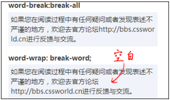

# 强大的文本处理能力

## line-height 和 font-size

`line-height`的部分类别属性是相对于`font-size`计算的, `vertical-align`百分比值属性又是相对于`line-height`计算的

### font-size和 ex, em, rem

- ex: x-height的高度
- em: 当前元素中的font-size大小
- rem: 根元素中的font-size大小

### font-size关键字属性

1. 相对尺寸关键字
   - larger: 相当于`<big>`
   - smaller: 相当于`<small>`
2. 绝对尺寸关键字
   - xx-large: 相当于`<h1>`
   - x-large: 相当于`<h2>`
   - large: 相当于`<h3>`
   - meduim: 相当于`<h4>`
   - small: 小, 相当于`<h5>`
   - x-small: `<h6>`
   - xx-small: 很小, 无对应


对于桌面端网页的建议:

1. 即使是定宽的传统桌面端网页, 也需要做响应式的设计
2. 如果由于各种原因无法响应式处理, 也没有必要全局都使用相对单位

### font-size: 0

桌面端的chrome无法设置小于12px的字体

## font-family

- serif：衬线字体。
- sans-serif：无衬线字体。
- monospace：等宽字体。
- cursive：手写字体。
- fantasy：奇幻字体。
- system-ui：系统UI字体

### 衬线字体和无衬线字体

衬线字体就是说笔画开始, 结束的地方有额外的装饰而且比话的粗细会有所不同的字体. 网页中常见的中文衬线字体是"宋体", 英文有"Times New Roman"、"Georgia"等. 无衬线字体没有这些额外的装饰, 而且笔画的粗细差不多, 比如中文的雅黑, 英文的"Arial"、"Verdana"、"Tahoma"、"Helivetica"、"Calibri"等

### 等宽字体

等宽字体一般是针对英文来说的.

1. 等宽字体利于代码呈现
2. 等宽字体与图形呈现更有利
3. ch单位: 表示一个0的宽度

### 中文字体和英文名称

一般在指定中文字体的时候, 我们会使用对应的英文名称

## font-weight

`font-weight`只能去100到900的整百数值. 

具体看字体是否有效果, 则需要看用户本地是否安装了对应的字体


## font

### 作为缩写的font属性

```css
font: [ [ font-style || font-variant || font-weight ]? font-size [ / line-height ]? font-family ]
```

### font 使用关键字

```css
font:caption | icon | menu | message-box | small-caption | status-bar
```

- caption：活动窗口标题栏使用的字体。
- icon：包含图标内容所使用的字体，如所有文件夹名称、文件名称、磁盘名称，甚至浏览器窗口标题所使用的字体。
- menu：菜单使用的字体，如文件夹菜单。
- message-box：消息盒里面使用的字体。
- small-caption：调色板标题所使用的字体。
- status-bar：窗体状态栏使用的字体。

## @font face

```css
@font-face {   
    font-family: 'example'; 
    src: url(example.ttf);
    font-style: normal; 
    font-weight: normal;
    unicode-range: U+0025-00FF;
    // font-variant: small-caps;
    // font-stretch: expanded;
    // font-feature-settings："liga1" on;
}
```

### font-family

字体名称

### src

src表示引入的字体资源可以是系统字体, 也可以是外链字体

#### 字体格式

- svg: 兼容ios4.1之前的版本
- eot: IE私有
- woff: web open font format. 字体小, 加载快, 安卓4.4以前
- woff2: 更小, 小得多, chrome/firefox支持较好
- ttf: 字体大, 安卓老版本也支持


兼容性写法:

```css
@font-face {   
    font-family: ICON;   
    src: url('icon.eot') format('eot'); 
    src: local('☺'),
         url('icon.woff2') format("woff2") 
         url('icon.woff')  format("woff"), 
         url('icon.ttf')   format("typetrue"); 
}
```

### font-weight

定义不同字重使用不同字体, 也可以用来定义响应式图标

### unicode-range

让特定的字符或者特定范围的字符使用指定的字体

### 字体图标技术

对svg的要求:

1. 纯路径, 不要有base64的内联图形
2. 使用填充而非描边
3. 宽高尺寸最好大于200

## 文本的控制

text-indent可以控制文字的缩进, 并且可以使用负值. 

`text-indent`的百分比是相对于当前元素的包含块计算的, 而不是当前元素, 由于`text-indent`最终作用域当前元素的内联盒子, 有时候会让人产生误会

- text-indent 仅对第一行内联盒子内容有效
- 非替换元素以外的display计算值为inline的内联元素设置`text-indent`值无效, 如果是`inline-block/inline-table`则会生效.
- input的text-indent无效
- button的text-indent有效, 但是存在差异
- input和textarea在低版本ie下有兼容问题

### letter-spacing

1. 继承性
2. 默认normal不一定为0
3. 支持负值
4. 和text-indent一样, 无论值多大多小, 第一行一定会保留至少一个字符
5. 支持小数值
6. 暂不支持百分比

### work-spacing

1. 继承性
2. 默认normal不一定为0
3. 支持负值
4. 支持小数值
5. 在css2.1中不支持百分比
6. 间隔算法会受到`text-spacing:justify`影响

### word-break和word-wrap的区别

对于word-break:

- word-break: normal; 使用默认的换行规则
- word-break: break-all; 允许任意非CJK(Chinese/Japanses/Korean)文本间的单词断行
- word-break: keep-all; 不许晕CJK文本换行, 只能在半角空格或者连字符处换行

对于word-wrap:

- normal: 正常的换行规则
- break-word: 一行单词中实在没有其他靠谱的换行点的时候换行

word-break和word-wrap的区别:

word-break:break-all的作用是所有的都换行，毫不留情，一点儿空隙都不放过，而word-wrap:break-word则带有怜悯之心，如果这一行文字有可以换行的点，如空格或CJK（中文/日文/韩文）之类的，就不打英文单词或字符的主意了，在这些换行点换行，至于对不对齐、好不好看则不关心，因此，很容易出现一片一片空白区域的情况



### white-space与换行和空格的控制

1. white-space的处理模型

white-space 属性声明了如何处理元素内的空白字符, 这类空白字符包括space(空格), Enter(回车), tab(制表符)产生的空白. 属性如下:

- normal: 合并空白字符和换行符
- pre: 空白字符不合并, 并且内容只在有换行符的地方换行
- nowrap: 合并空白字符, 单不允许文本环绕
- pre-wrap: 空白字符不合并, 并且内容只在有换行符的地方换行, 同时允许文本环绕
- pre-line: 合并空白那字符, 但只有换行符的地方换行, 允许文本环绕

2. white-space 与 最大可用宽度

应用:

- 包含块尺寸过小处理
- 单行文字溢出省略效果
- 水平列表切换效果

### text-align 元素对齐

`text-align:justify`效果实现并不太好

### text-decoration 下划线和文本重叠

`text-decoration:underline`可以给内联文本增加下划线，但是，如果对细节要求较高，就会发现，下划线经常会和中文文字的下边缘粘连在一起

这里最好的处理方法就是使用`border-bottom`替换这个属性


### text-transform 字符大小写

```css
text-transform: uppercase;
```

可以用于身份证输入或者验证码输入的场景


## :first-letter/:first-line

### :first-letter

`:first-letter`可以设置第一个字符的样式, 含义为首字符作为元素的假想子元素

假想子元素生效有一定的前提:

1. 元素的display必须是block, inline-block, list-item, table-cell, table-caption
2. 并不是所有的首字符都可以作为单独的伪元素存在, 例如常见的标点, 括号, 引号

此外, `:first-letter`能够设置的样式也是有限制的. 可设置的样式如下:

1. 字体相关的属性
2. 背景相关属性
3. marigin相关属性
4. padding相关属性
5. border相关属性
6. color属性
7. text修饰相关属性

此外:

1. 支持部分display属性值标签的嵌套, 但是限制于display为`inline、block、table、table-row、table-caption、table- cell、list-item`. 而display:flex可以直接选择下一行的字符内容
2. 颜色等权重总是会多一层


### :first-line

- 也支持双冒号写法, IE8只支持单冒号
- 只能作用块级元素, table/flex无效
- 支持部分css属性, 和`first-letter`一样
- 权重多了一层
- 支持标签嵌套

