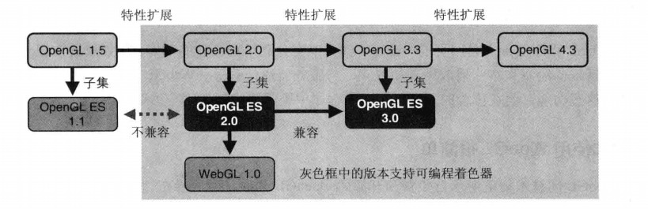
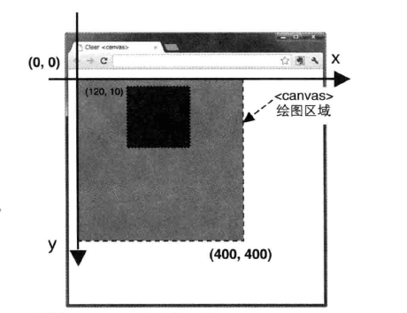
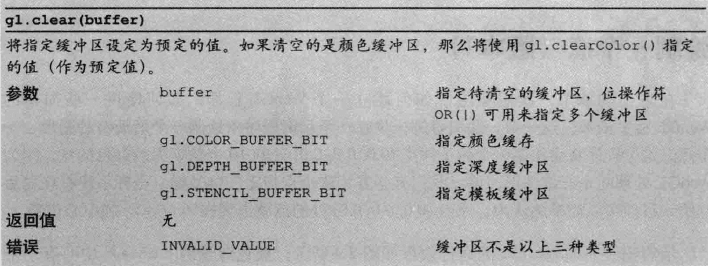
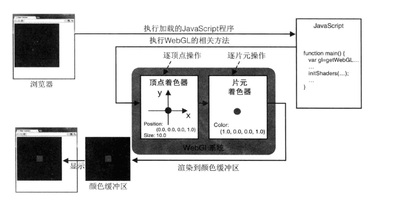
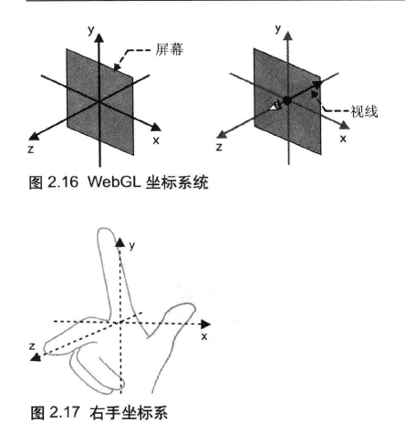
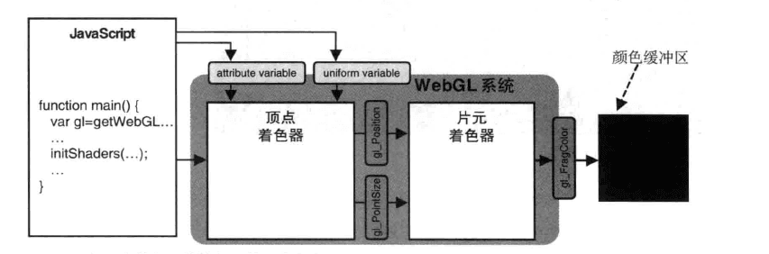
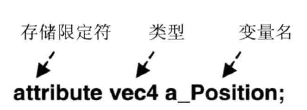
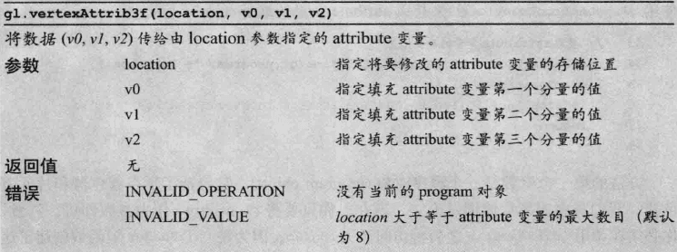

## 第一章&第二章 介绍与入门

### 介绍

#### 起源



#### Canvas

H5 支持`<canvas>`元素, 提供使用一些接口来绘制二维和三维图形, 它不直接提供绘图方法, 而是提供一种上下文(context)的机制来进行绘图.

```html
<canvas id="canvas-example" width="400" height="400">
    your browser not supports "canvas"
</canvas>
```

```js
let z_canvas = document.getElementById('canvas-example');
if (!z_canvas) {
    console.log('Fail to retrieve the <canvas> element');
    return;
}
//获取绘制二维图形的绘图上下文
let z_ctx = z_canvas.getContext('2d');

z_ctx.fillStyle = 'rgba(0,0,255,1.0)'; //blue
z_ctx.fillRect(120, 10, 150, 150);
```

坐标系:



### WebGL: 清空绘图区

```js
let canvas = document.getElementById('canvas-example');
if (!canvas) {
    console.log('Fail to retrieve the <canvas> element');
    return;
}

//获取WebGL绘图的上下文
let gl = getWebGLContext(canvas);
if (!gl) {
    console.log('Failed to get the rendering context for WebGL');
    return;
}

//清空<canvas>的颜色
gl.clearColor(0.0, 0.0, 0.0, 1.0);

//清空<canvas>
gl.clear(gl.COLOR_BUFFER_BIT);
```

这里的函数`getWebGLContext()`定义如下:

```js
/**
 * Initialize and get the rendering for WebGL
 * @param canvas <cavnas> element
 * @param opt_debug flag to initialize the context for debugging
 * @return the rendering context for WebGL
 */
function getWebGLContext(canvas, opt_debug) {
    // Get the rendering context for WebGL
    var gl = WebGLUtils.setupWebGL(canvas);
    if (!gl) return null;

    // if opt_debug is explicitly false, create the context for debugging
    if (arguments.length < 2 || opt_debug) {
        gl = WebGLDebugUtils.makeDebugContext(gl);
    }

    return gl;
}
```

在上面一个例子中, 我们在绘制矩形之前就制定了绘图颜色. 在 WebGL 中, 与之相似, 清空绘图区之前也要指定背景颜色.

另一个与 Web 中不同的是, WebGL 继承自 OpenGL 的, 所以它遵循传统的 OpenGL 颜色分量的取值范围(0.0~1.0).

一旦指定了背景色之后, 背景色就会驻存在`WebGL系统`中, 在下一次调用`gl.clearColor()`方法前不会改变. 换句话说, 如果将来什么时候你还想用同一个再清空一次绘图区, 没有必要再指定一次背景色.

清空绘图区域的参数`gl.COLOR_BUFFER_BIT`, 而不是`<canvas>`. 同样的, 这个方法实际上继承自`OpenGL`, 基于多基本缓冲区模型, 这可比二维绘图的上下文要更复杂. 清空绘图区域就是清空颜色缓冲区(color buffer), 传递参数`gl.COLOR_BUFFER_BIT`就是在告诉 WebGL 清空颜色缓冲区, 除了颜色缓冲区, WebGL 还会使用其他种类的缓冲区, 比如深度缓冲区和模板缓冲区. 模板缓冲区在这里不会涉及.



如果没有指定背景色, 则会应用默认值:

| 缓冲区     | 默认值            | 函数                   |
| ---------- | ----------------- | ---------------------- |
| 颜色缓冲区 | (0.0,0.0,0.0,0.0) | gl.clearColor(r,g,b,a) |
| 深度缓冲区 | 1.0               | gl.clearDepth(depth)   |
| 模板缓冲区 | 0                 | gl.clearStencol(s)     |

### WebGL: 绘制一个点(1)

WebGL 依赖于一种的称为`着色器(shader)`的绘图机制. 着色器提供了灵活且强大的绘制二位或三维图形的方法, 所有 WebGL 程序必须使用它. 着色器不仅强大, 而且更复杂, 是 WebGL 的一项重要的核心机制.

```js
//顶点着色器程序
let VSHADER_SOURCE = `void main() {
gl_Position=vec4(0.0,0.0,0.0,1.0);
gl_PointSize=10.0;
}`; //设置坐标, 设置尺寸

//片元着色器程序
let FSHADER_SOURCE = `void main(){
gl_FragColor=vec4(1.0,0.0,0.0,1.0);
}`; //设置颜色

function main() {
    //...

    //初始化着色器
    if (!initShaders(gl, VSHADER_SOURCE, FSHADER_SOURCE)) {
        console.log('Failed to initialize shaders');
        return;
    }

    //...

    //绘制一个点
    gl.drawArrays(gl.POINTS, 0, 1);
}

main();
```

WebGL 需要两种着色器:

-   **顶点着色器**(Vertex shader): 顶点着色器是用来描述顶点特性(位置, 颜色)的程序. 顶点指二维或三维空间中的一个点, 比如二维或三维图形的端点或交点.
-   **片元着色器**(Fragment shader): 进行逐片处理过程如光照的程序. 片元(`fragment`)是一个 WebGL 术语, 你可以将其理解为像素(图像的单元).

简单的说, 在三维场景中, 仅仅用线条和颜色把图形画出来是远远不够的. 比如视角的变化, 光照的变化等, 这都需要着色器来高度灵活的完成这些工作, 提供各种渲染效果.



示例程序的任务是, 在屏幕上绘制一个 10 像素大小的点, 用到了两个着色器:

-   顶点着色器指定了点的位置和尺寸
-   片元着色器指定了点的颜色

WebGL 程序包括运行在浏览器中的 JavaScript 和运行在 WebGL 的着色器程序两部分.

#### 顶点着色器

```c
void main(){
    gl_Position=vec4(0.0,0.0,0.0,1.0);
    gl_PointSize=10.0;
}
```

着色器使用类似于 C 的 OpenGL ES 着色器语言(GLSL ES)来编写. 和 C 语言程序一样, 必须包含一个 main()函数, void 关键字表示函数不会有返回值. 下面是几点说明:

-   gl_Position 和 gl_PointSize 为内置变量. 前者表示顶点位置, 后者表示点的尺寸. gl_Position 变量必须被赋值, 否则着色器就无法正常工作. 相反, gl_PointSize 并不是必须的, 如果你不赋值, 着色器就会为其取默认值 1.0.
-   gl_PointSize 为浮点数, 因此 10 是错误的, 正确的是 10.0.
-   vec4() : 由 4 个分量组成的矢量被称为 **齐次坐标** , 因为能够提高处理三维数据的效率, 所以在三维图形系统中被大量使用. 齐次坐标是四维的, 但是如果其最后一个是 1.0, 那么这个齐次坐标就可以表示"前三个分量为坐标值"的那个点.

> 齐次坐标使用如下的符号描述: `(x,y,z,w)`. 齐次坐标`(x,y,z,w)`等价于三维坐标`(x/w,y/w,z/w)`. 所以第四个分量为 1, 你就可以将它当做三维坐标来使用. w 的值必须是大于等于 0. 如果 w 趋于 0, 那么他所表示的点趋近无穷远. 其次坐标的存在, 使得用矩阵乘法来描述顶点变换称为可能, 三维图形系统在计算过程中, 通常使用齐次坐标来表示顶点的三维坐标.

#### 片元着色器

顶点着色器控制点的位置和大小, 片元着色器控制点的颜色. 如前所述, 片元就是显示在屏幕上的一个像素(严格意义上来说, 片元包括这个像素的位置, 颜色和其他信息).

#### 坐标系统

WebGL 处理三维图形, 所以它使用三维坐标系统(笛卡尔坐标系), 具有 X,Y,Z 轴. 这里的坐标系被称为右手坐标系, 可以用右手来表示:



相较`<canvas>`绘图区的坐标系, 需将前者映射到后者, 对应如下:

-   `<canvas>`的中心点: `(0.0, 0.0, 0.0)`
-   `<canvas>`的上边缘和下边缘: `(-1.0,0.0,0.0)`和`(1.0,0.0,0.0)`;
-   `<canvas>`的左边缘和右边缘: `(0.0,-1.0,0.0)`和`(0.0,1.0,0.0)`;

右手坐标系是 WebGL 默认的坐标系统, 使用其他坐标系也是可以能的.

### WebGL: 绘制一个点(2)

这一节讨论 js 和着色器之间传输数据.

#### 使用 attribute 变量

我们的目标是, 将位置信息从 js 程序中传给顶点着色器. 有两种方式可以做到这点, attribute 变量和 uniform 变量, 如图所示:



attribute 变量是一种 GLSL ES 变量, 被用来从外部向顶点着色器内传输数据,只有顶点着色器能使用它.

使用这个变量, 示例程序需要包含以下步骤:

1. 在顶点着色器中, 声明 attribute 变量;
2. 将 attribute 变量赋值给 gl_Position 变量;
3. 向 attribute 变量传输数据;

```js {5,21,28}
'use strict'

//顶点着色器
let VSHADER_SOURCE =
    `attribute vec4 a_Position;
void main(){
    gl_Position=a_Position;
    gl_PointSize=10.0;
}
`;
 ...


function main() {
    ...

    //初始化着色器
   ...

    //获取attribute变量的存储位置
    let a_Position = gl.getAttribLocation(gl.program, 'a_Position');
    if (a_Position < 0) {
        console.log('Failed to get the storage location of a_Position');
        return;
    }

    //将顶点位置传输给attribute变量
    gl.vertexAttrib3f(a_Position, 0.0, 0.0, 0.0);

    //清空<canvas>的颜色
    ...
}

main();
```

第 5 行中, 我们在着色器中声明了 attribute 变量, 关键词 attribute 被称为 存储限定符(storage qualifier), 它表示接下来的变量是一个 attribute 变量. attribute 变量必须声明成全局变量, 数据将从着色器外部传给该变量. 变量的声明必须按照下面的格式:

<div style='text-align:center'>`<存储限定符> <类型> <变量>`</div>

如图所示:



attribute 变量的类型是 vec4. 它将被赋值非 gl_Position, 后者的类型也是 vec4.

接下来,使用 `gl.getAttributeLocation(gl.program, 'a_Position')`获取变量的存储位置. 第一个参数是一个 **程序对象(program object)** , 它包括顶点着色器和片元着色器. 这在后面会展开讨论. 注意, 这不许在调用 initShader()之后再访问 gl.program, 因为是 initShader()函数创建了这个的程序对象. 第二个参数是想要获取存储地址的 attribute 变量的名称.

方法的返回值是 attribute 变量的存储地址. 这个地址被存储在 js 变量 a_Position 中, 以备之后使用.

函数规范如下:


#### 向 atribute 变量赋值

第 28 行中, 使用`gl.vertexAttrib3f`对变量进行赋值. 该函数规范如下:



这样, 在顶点着色器中, a_Position 的值就被赋给了 gl_Position.

#### gl.vertexAttrib3f 的同族函数

`gl.vertextAttrib3f()`是一系列同族函数中的一个, 该系列函数的任务就是从 js 向顶点着色器中的 attribute 变量传值. gl.vertexAttribut1f() 传输 1 个单精度值(v0), gl.vertexAttrib2f() 传输两个值(v0,v1), 而 gl.vertexAttrib4f 传输 4 个值(v0,v1,v2v,v3);

这些方法还有矢量版本:

```js
var position = new Float32Array([1.0, 2.0, 3.0, 1.0]);
gl.vertexAttrib4fv(a_Position, position);
//4_f_v 分别表示 4个矢量中元素个数 浮点数(f浮点,i整数) 矢量
```

### 通过鼠标绘制点

这部分基本上就是 JS 的运用, 不过有几个小细节:

```js
...
canvas.onmousedown = function(ev) {
    click(ev, gl, canvas, a_Position);
  };

  var g_points = [];
  function click(ev, gl, canvas, a_Position) {
    //鼠标点击位置
    let x = ev.clientX;
    let y = ev.clientY;
    let rect = ev.target.getBoundingClientRect();

    x = (x - rect.left - canvas.height / 2) / (canvas.height / 2);
    y = (canvas.width / 2 - (y - rect.top)) / (canvas.width / 2);

    //将坐标存储到g_points数组中
    g_points.push(x);
    g_points.push(y);
    //清除<canvas>
    gl.clear(gl.COLOR_BUFFER_BIT);

    let len = g_points.length;
    for (let i = 0; i < len; i += 2) {
      //将点的位置传递到变量a_Position中
      gl.vertexAttrib3f(a_Position, g_points[i], g_points[i + 1], 0.0);
      //绘制点
      gl.drawArrays(gl.POINTS, 0, 1);
    }
  }
```

-   第一点是鼠标的点击坐标换算成 WebGL 的坐标
-   第二点是每次点击的时候, 将点记录入数组, 每次通过循环渲染点列表.之所以每次重新渲染是有原因的, 因为 WebGL 使用的是颜色缓冲区. 它的绘制操作实际上是在颜色缓冲区中进行绘制的, 绘制结束后系统将缓冲区中的内容显示在屏幕上, 然后颜色缓冲区就会被重置, 其中的内容会丢失(这是默认操作,我们在后面讨论).

### 改变点的颜色

可以用 uniform 变量将颜色值传给着色器, 其步骤与用 attribute 变量传递的类似. 不同的仅仅是, 这次数据传输的目标是片元着色器, 而非顶点着色器:

准备 `uniform` 变量 -> 使用变量向`gl_FragColor`赋值. -> 将颜色数据从 js 传给该 uniform 变量

```js
...
//片元着色器
let FSHADER_SOURCE = `
precision mediump float;
uniform vec4 u_FragColor;
void main(){
gl_FragColor=u_FragColor;
}`; //设置颜色
...

let u_FragColor = gl.getUniformLocation(gl.program, "u_FragColor");
if (u_FragColor < 0) {
console.log("Failed to get the storage location of u_FragColor");
return;
}
...

var g_points = []; //鼠标点击位置数组
var g_colors = []; //存储点颜色的数组
function click(ev, gl, canvas, a_Position, u_FragColor) {

    //鼠标点击位置
    let x = ev.clientX;
    let y = ev.clientY;
    let rect = ev.target.getBoundingClientRect();

    x = (x - rect.left - canvas.height / 2) / (canvas.height / 2);
    y = (canvas.width / 2 - (y - rect.top)) / (canvas.width / 2);

    //将坐标存储到g_points数组中
    g_points.push([x, y]);
    //将点的颜色存储到g_colors数组中
    if (x >= 0.0 && y >= 0.0) {
        console.log("红色");
        g_colors.push([1.0, 0.0, 0.0, 1.0]); //红色
    } else if (x < 0.0 && y < 0.0) {
        console.log("绿色");
        g_colors.push([0.0, 1.0, 0.0, 1.0]); //绿色
    } else {
        console.log("白色");
        g_colors.push([1.0, 1.0, 1.0, 1.0]); //白色
    }

    //清除<canvas>
    gl.clear(gl.COLOR_BUFFER_BIT);

    let len = g_points.length;
    for (let i = 0; i < len; i++) {
        let xy = g_points[i];
        let rgba = g_colors[i];

        //将点的位置传递到变量a_Position中
        gl.vertexAttrib3f(a_Position, xy[0], xy[1], 0.0);
        //将点的颜色传输到u_FragColor变量中
        gl.uniform4f(u_FragColor, rgba[0], rgba[1], rgba[2], rgba[3]);
        //绘制点
        gl.drawArrays(gl.POINTS, 0, 1);
    }
}
```
