## 第三章: 绘制和变换三角形

### 绘制多个点

构建三维模型的基本单位是三角形. 不管三维模型的形状多么复杂, 其基本组成部分都是三角形, 只不过复杂的模型由更多的三角形构成. 通过创建更细小和更大量的三角形, 就可以创建更复杂和更逼真的三维模型.

想要绘制由多个顶点组成的图形, 比如三角形, 矩形和立方体来说, 你需要一次性地将图形的顶点全部传入顶点着色器, 然后才能把图形画出来.

WebGL 提供了一种很方便的机制, 即 **缓冲区对象** (buffer object), 它可以一次性地向着色器传入多个顶点的数据. 缓冲区对象是 WebGL 系统中的一块内存区域, 我们可以一次性向缓冲区对象中填充大量的顶点数据, 然后将这些数据保存在其中, 供顶点着色器使用.

```js
var VSHADER_SOURCE =
    'attribute vec4 a_Position;\n' +
    'void main() {\n' +
    '  gl_Position = a_Position;\n' +
    '  gl_PointSize = 10.0;\n' +
    '}\n';

// Fragment shader program
var FSHADER_SOURCE = 'void main() {\n' + '  gl_FragColor = vec4(1.0, 0.0, 0.0, 1.0);\n' + '}\n';

function main() {
    var canvas = document.getElementById('canvas-example');

    var gl = getWebGLContext(canvas);
    if (!gl) {
        console.log('Failed to get the rendering context for WebGL');
        return;
    }

    //初始化着色器
    if (!initShaders(gl, VSHADER_SOURCE, FSHADER_SOURCE)) {
        console.log('Failed to intialize shaders.');
        return;
    }

    //设置顶点坐标
    var n = initVertexBuffers(gl);
    if (n < 0) {
        console.log('Failed to set the positions of the vertices');
        return;
    }

    //设置背景色
    gl.clearColor(0, 0, 0, 1);

    //清空canvas
    gl.clear(gl.COLOR_BUFFER_BIT);

    //绘制三个点
    gl.drawArrays(gl.POINTS, 0, n);
}

function initVertexBuffers(gl) {
    var vertices = new Float32Array([0.0, 0.5, -0.5, -0.5, 0.5, -0.5]);
    var n = 3; // 点的个数

    //创建缓冲区对象 <-(1)
    var vertexBuffer = gl.createBuffer();
    if (!vertexBuffer) {
        console.log('Failed to create the buffer object');
        return -1;
    }

    //将缓冲区对象绑定到目标  <-(2)
    gl.bindBuffer(gl.ARRAY_BUFFER, vertexBuffer);
    //向缓冲区对象中写入数据 <-(3)
    gl.bufferData(gl.ARRAY_BUFFER, vertices, gl.STATIC_DRAW);

    var a_Position = gl.getAttribLocation(gl.program, 'a_Position');
    if (a_Position < 0) {
        console.log('Failed to get the storage location of a_Position');
        return -1;
    }
    // 将缓冲区对象分配给a_Position变量 <-(4)
    gl.vertexAttribPointer(a_Position, 2, gl.FLOAT, false, 0, 0);

    // 链接a_Position变量与分配给它的缓冲区对象 <-(5)
    gl.enableVertexAttribArray(a_Position);

    return n;
}
```

缓冲区对象是 WebGL 系统中的一块存储区, 你可以在缓冲区对象中保存想要绘制的所有顶点的数据, 如图所示. 先创建一个缓冲区, 然后向其中写入顶点数据, 你就能一次性地向顶点着色器中传入多个顶点的`attribute`变量的数据.

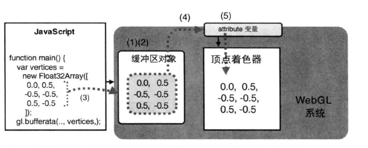

使用缓冲区对象向顶点着色器传入多个顶点的数据, 需要遵循以下 5 个步骤. 处理其他对象, 如纹理对象, 缓冲区对象时的步骤也比较类似. 大致如下:

1. 创建缓冲区对象(gl.createBuffer()).
2. 绑定缓冲区对象(gl.bindBuffer()).
3. 将数据写入缓冲区对象(gl.bufferDate()).
4. 将缓冲区对象分配给一个 attribute 对象(gl.vertexAttribPointer()).
5. 开启 attribute 变量(gl.enableVertexAttribArray()).

下面仔细的解释这个几个步骤:

#### 创建缓冲对象(gl.createBuffer())

在使用缓冲区对象之前, 你必须创建它:

```js
let vertexBuffer = gl.createBuffer();
```

使用 WebGL 时, 你需要调用 gl,createBuffer()方法来创建缓冲区对象. 执行完该方法后, WebGL 对象多了一个创建出来的缓冲区对象.

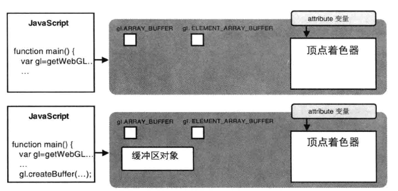

图中的两个关键字在下面会进行解释.

相关的两个函数如下:

gl.createBuffer() //创建缓冲区对象

-   返回 null: 创建失败
-   返回非 null: 新创建的缓冲区对象

gl.deleteBuffer(buffer)

-   参数: buffer 待删除的缓冲区对象
-   返回: 无

#### 绑定缓冲区(gl.bindBuffer())

创建缓冲区后的下一步就是将缓冲区对象绑定到 WebGL 系统中已经存在的"目标"上.

```js
gl.bindBuffer(gl.ARRAY_BUFFER, vertexBuffer);
```

函数参考如下:

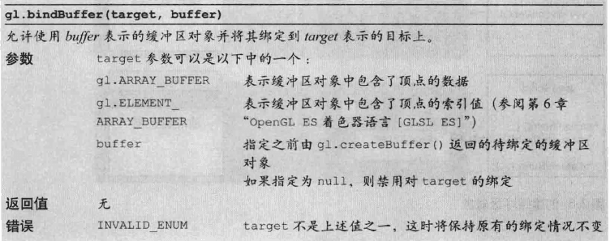

在示例程序上, 我们把缓冲区对象绑定到 `gl.ARRAY_BUFFER` 目标上, 缓冲区对象中存储着的关于顶点的数据(顶点的位置坐标). 接下来, 就可以像缓冲区独享中写入数据了.

#### 向缓冲区中写入数据(gl.bufferData())

第三步, 开辟空间并向缓冲区中写入数据.

`gl.bufferData()`方法将 vertices 中的数据写入了绑定到第一个参数`gl.ARRAY_BUFFER`上的缓冲区对象. 我们不能直接向缓冲区写入数据, 而只能向"目标"写入数据, 所以要向缓冲区写数据, 必须先绑定.

WebGL 状态如图所示:

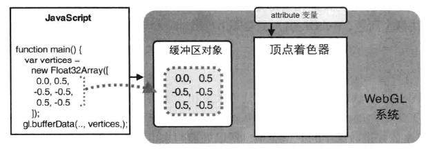

`gl.bufferDtat()`的规范如下:


这里传入了一个特殊的数组:

```js
var vertices = new Float32Array([0.0, 0.5, -0.5, -0.5, 0.5, -0.5]);
```

JS 中的数据是一种通用类型, WebGL 引入了类型化数组, Float32Array 就是其中之一.

WebGL 中的类型化数组如下所示:

| 数组类型     | 每个元素所占字节数 | 描述                              |
| ------------ | ------------------ | --------------------------------- |
| Int8Array    | 1                  | 8 位整数型(char)                  |
| UInt8Array   | 1                  | 8 位无符号整数(unsigned char)     |
| Int16Array   | 2                  | 16 位整数型(short)                |
| UInt16Array  | 2                  | 16 位无符号整数型(unsigned short) |
| Int32Array   | 4                  | 32 位整数型(signed int)           |
| UInt32Array  | 4                  | 32 位无符号整数型(unsigned int)   |
| Float32Array | 4                  | 单精度 32 位浮点数(float)         |
| Float64Array | 8                  | 双精度 64 位浮点数(double)        |

与 JavaScript 中的数组类似, 类型化数组也有一系列的方法和属性, 但是与普通的 Array 数组不同, 类型化数组不支持 push()和 pop()方法.

| 方法属性和常量    | 描述                                              |
| ----------------- | ------------------------------------------------- |
| get(index)        | 获取第 index 个元素值                             |
| set(index,value)  | 设置第 index 个元素的值为 value                   |
| set(array,offset) | 从第 offset 个元素开始将数组 array 中的值填充进去 |
| length            | 数组的长度                                        |
| BYTES_PER_ELEMENT | 数组中每个元素所占的字节数                        |

#### 将缓冲区对象分配给 attribute 变量(gl.vertexAttribPoint())

`gl.vertexAttribPointer()`方法解决这个问题, 他可以将整个缓冲区对象分配给 attribute 变量. 该函数规范如下:

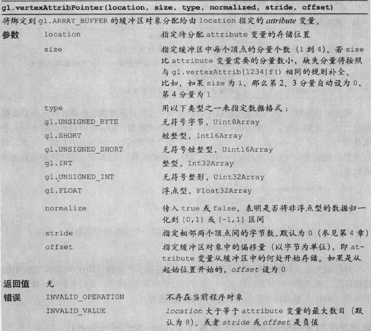

#### 开启 attribute 变量(gl.enableVertexAttribArray())

为了使顶点着色器能够访问缓冲区内的数据, 我们需要使用`gl.enableVertexAttribArray()`方法来开启 attribute 变量.

当执行该函数并传入一个已经分配好换中去的 attribute 变量后, 我们就开启了该变量, 也就是说, 缓冲区对象和 attribute 变量之间的链接就建立起来了.

同样可以使用`gl.disableVertexArray(location)`来关闭分配.

#### gl.drawArrays()的第二个和第三个参数

在对 gl.drawArrays()作进一步详细说明之前, 先看看这个方法:

gl.drawArrays(mode,first,count)

-   mode: 指定绘制的方式,可接受以下常量符号:
    -   gl.POINTS: 一系列的点
    -   gl.LINES: 线段, 如果点是基数, 则最后一个点将被忽略
    -   gl.LINE_STRIP: 线条, 中间的点是同时被前一段的终点和下一段的起点
    -   gl.LINE_LOOP: 回路, 在上面模式的基础上, 最后一个点和第一个点连起来形成闭环.
    -   gl.TRIANGLES: 一系列单独的三角形, 三的整数倍, 否则最后一两个点将被忽略.
    -   gl.TRIANGLE_STRIP: 一系列条带状的三角形, 依次是是(v0,v1,v2), (v2,v1,v3),(v2,v3,v4)...(第二个三角形的顺序是为了保持第二个三角形的绘制也按照逆时针的顺序).
    -   gl.TRIANGLE_FAN: 一系列三角形组成的类似于扇形的图形, 前三个点构成了第一个三角形, 接下来的一个点和前一个三角形的最后一条边组成接下来的一个三角形, 这些三角形会这样绘制:(v0,v1,v2),(v0,v2,v3)...
-   first: 指定从哪个点开始绘制(整数型)
-   count: 指定绘制需要用到多少个顶点(整数型)

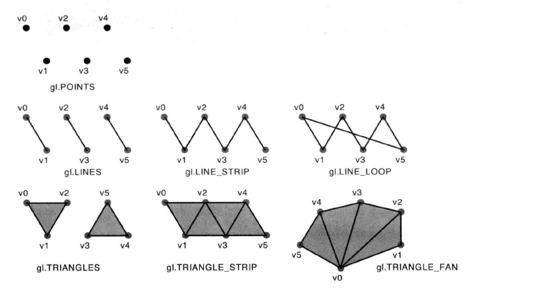

### 绘制三角形

这部分的代码相比较上一节代码相比, 只有两处关键的改动, 二者几乎是一样的.

1. 绘制面的时候, 不需要指定点的大小

```js
...
  "  gl_Position = a_Position;\n" +
  // "  gl_PointSize = 10.0;\n" +
  "}\n";
...
```

2. 修改参数

```js
...
  // gl.drawArrays(gl.POINTS, 0, n);
  gl.drawArrays(gl.TRIANGLES, 0, n);
...
```

### 移动, 旋转和缩放

#### 平移

平移操作是逐顶点操作, 通过对每个顶点坐标的坐标分量进行平移计算, 就能对整个三角形进行平移操作.

所以我们应该在顶点着色器中中进行操作, 而不是片元着色器. 修改代码就很简单了.

```js
//顶点着色器
...
"uniform vec4 u_Translation;\n" +
"void main() {\n" +
"  gl_Position = a_Position+u_Translation;\n" +
...

...
var u_Translation = gl.getUniformLocation(gl.program, "u_Translation");
if (!u_Translation) {
  console.log("Failed to get the storage location of u_Translation");
  return;
}
...
```

因为`a_Position`和`u_Translation`变量都是 vec4 类型的, 所以可以世界使用+号, 两个矢量的对应分量将会被同时相加.

齐次坐标矢量的最后一个分量 w, 如果是 1.0, 那么前三个分量就可以表示一个点的三维坐标, 在这里的例子. w1+w2 必须是 1.0.所以平移矢量的 w 分量只能为 0.0.

#### 旋转

旋转比平移更为复杂一些, 因为描述一个旋转, 需要指明:

-   旋转轴
-   旋转方向
-   旋转角度

完整描述如下: 绕`Z`轴,逆时针旋转了`β`角度. 其中, 关于"逆时针"的约定是, 如果 β 是正值, 观察者在 Z 轴正半轴某处. 实现沿着 Z 轴负方向进行观察, 那么看到的物体就是逆时针旋转的. 这种情况可以称为 **正旋转** 也可以使用右手来确认旋转方向.

右手握拳, 大拇指指向旋转轴的正方向, 右手其他手指指向旋转的方向, 因此正旋转又称为右手法则旋转.

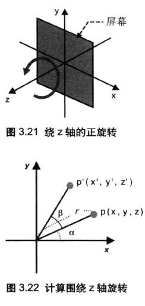

如图所示, xy 轴的坐标计算需要使用三角函数来进行一些计算.

同样是在顶点着色器中进行改动:

```js
let VSHADER_SOURCE =
    'attribute vec4 a_Position;\n' +
    // "uniform vec4 u_Translation;\n" +
    'uniform float u_CosB, u_SinB;\n' +
    'void main() {\n' +
    // "  gl_Position = a_Position+u_Translation;\n" +
    // "  gl_PointSize = 10.0;\n" +
    '  gl_Position.x = a_Position.x * u_CosB - a_Position.y * u_SinB;\n' +
    '  gl_Position.y = a_Position.x * u_SinB + a_Position.y * u_CosB;\n' +
    '  gl_Position.z = a_Position.z;\n' +
    '  gl_Position.w = 1.0;\n' +
    '}\n';
```

在主程序中进行赋值:

```js
let radian = (Math.PI * ANGLE) / 180.0; // Convert to radians
let cosB = Math.cos(radian);
let sinB = Math.sin(radian);

let u_CosB = gl.getUniformLocation(gl.program, 'u_CosB');
let u_SinB = gl.getUniformLocation(gl.program, 'u_SinB');
if (!u_CosB || !u_SinB) {
    console.log('Failed to get the storage location of u_CosB or u_SinB');
    return;
}
gl.uniform1f(u_CosB, cosB);
gl.uniform1f(u_SinB, sinB);
```

缩放上原理不变, 同样是通过对于被顶点坐标进行操作来实现图形的变换

#### 变换矩阵: 旋转

对于简单的变换, 可以使用数学表达式来实现, 但是当情形变得复杂时, 计算就比较复杂了.

变换矩阵非常适合操作计算机图形.

对应于坐标, 其矩阵如下所示:

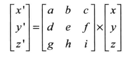

对应:

x'=ax+by+cz

y'=dx+ey+fz

z'=gx+hy+iz

比较:

x' = xcosβ - ysinβ

y' = xsinβ + ycosβ

z' = z

带入到等式中:

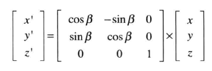

这个矩阵就被称为 **变换矩阵** , 因为它将右侧的矢量(x,y,z), 通过矩阵运算为了左侧矢量. 这个矩阵进行的变换是一次旋转, 所以这个矩阵又可以称为 **旋转矩阵** .

变换举证在三维计算机图形学中应用的非常广泛, 以至于着色器本省就实现了矩阵和矢量相乘的功能. 但是在我们修改着色器代码以采用矩阵之前, 先来快速浏览一般几种变换矩阵.

#### 变换矩阵: 平移

看这两个式子:

x' = ax+by+cz

x' = x + Tx

因为第二个等式中的常量, 我们无法通过使用一个三阶矩阵来表示平移. 所以使用一个四阶矩阵, 第四个分量就是我们前面所说的 w 分量(一般为 1). 也就是说, 假设 p 的坐标为(x,y,z,1), 平移之后的点 p'的坐标为(x',y',z',1), 矩阵方程的一般式如下所示:

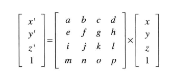

针对平移的话, 一般 x,y,z 的系数如下所示:

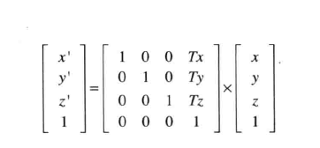

通过变换矩阵的直接相加, 就实现了两个变换操作的叠加, 其矩阵方程如下所示:

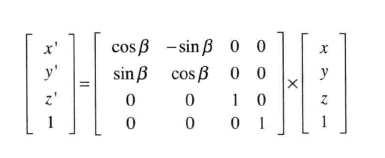

#### 代码: 矩阵示例

通过一些理论准备, 现在我们可以来使用变换矩阵来重写之前的代码了.

关键代码有两处:

顶点着色器中:

```js
let VSHADER_SOURCE =
    'attribute vec4 a_Position;\n' +
    'uniform mat4 u_xformMatrix;\n' +
    'void main() {\n' +
    '  gl_Position = u_xformMatrix * a_Position;\n' +
    '}\n';
```

以及主程序的赋值:

```js
let radian = (Math.PI * ANGLE) / 180.0; //转弧度制
let cosB = Math.cos(radian),
    sinB = Math.sin(radian);

//注意. WebGL中矩阵是列主序的
let xformMatrix = new Float32Array([
    cosB,
    sinB,
    0.0,
    0.0,
    -sinB,
    cosB,
    0.0,
    0.0,
    0.0,
    0.0,
    1.0,
    0.0,
    0.0,
    0.0,
    0.0,
    1.0
]);

let u_xformMatrix = gl.getUniformLocation(gl.program, 'u_xformMatrix');

gl.uniformMatrix4fv(u_xformMatrix, false, xformMatrix);
```

着色器内置了常用的矢量和矩阵运算功能, 这是专为三维计算机图形学而设计的.

这里还有一点值得注意的, WebGL 和 OpenGL 一样, 矩阵元素是按列主序存储在数组中的.

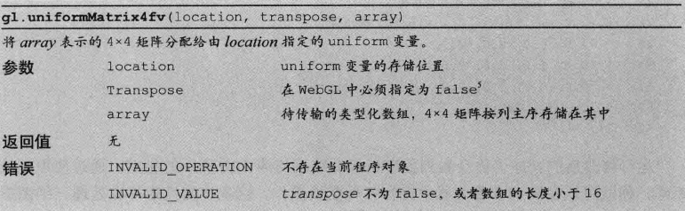

至于平移,所有原理都是一样的:

```js
let Tx = 0.5,
    Ty = 0.5,
    Tz = 0.0;

let xformMatrix = new Float32Array([1.0, 0.0, 0.0, 0.0, 0.0, 1.0, 0.0, 0.0, 0.0, 0.0, 1.0, 0.0, Tx, Ty, Tz, 1.0]);
```

#### 变换矩阵: 缩放

最后我们来看缩放的变换矩阵. 假设 P(x,y,z)经过缩放变成了 P'(x',y',z');

假设在三个方向 X,Y,Z 轴上的缩放影子 Sx,Sy,Sz 不相关, 那么有:

x' = Sx \* x

y' = Sy \* y

z' = Sz \* z

由此可知, 缩放的变换矩阵如下:

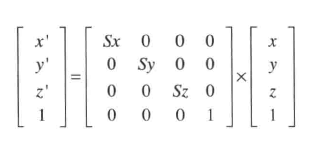
