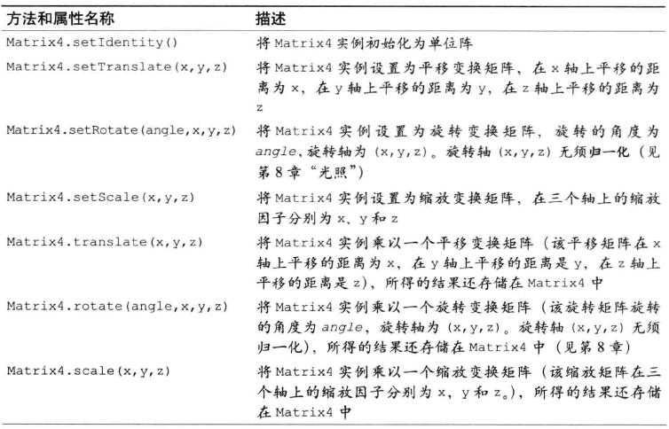

## 第四章: 高级变换和动画基础

### 矩阵函数库

虽然平移, 旋转, 缩放等变换操作都可以用一个 4x4 的矩阵表示, 但是在写 WebGL 程序的时候, 手动计算每个矩阵很耗费时间. 为了简化编程, 大多数开发者都使用矩阵操作函数来影藏矩阵计算的细节, 简化与矩阵有关的操作.

这里我们使用一个矩阵变换库: cuon-matrix.js

在 OpenGL 中, 我们无需手动指定变换矩阵的每个元素, 因为 OpenGL 提供了一些有用的函数来帮助我们创建变换矩阵, 但是在 WebGL 中并没有提供类似的矩阵函数. 这里有一个专门为本书编写的函数库, 允许使用类似 OpenGL 中类似的方式创建变换矩阵.

在 JS 的 Math 对象中提供了计算角度正弦值和余弦值的方法, 类似的, 在 cuon-matrix 矩阵库中提供了创建变换矩阵的方法.

Matrix4 是矩阵库提供的新类型, 顾名思义, Matrix 对象表示一个 4x4 的矩阵, 该对象内部使用类型化数组 Floated2Array 来存储矩阵的元素.

我们利用这个矩阵方法来重写 RotatedTrianles_Matrix 程序, 找找感觉:

与第三章旋转矩阵唯一不同的地方之处, 如下所示:

```html
<script src="../lib//cuon-matrix.js"></script>
<script src="./RotatedTriangle_Matrix4.js"></script>
```

```js
//为旋转矩阵穿件Matrix对象
var xformMatrix = new Matrix4();
//将xformMatrix设置为旋转矩阵
xformMatrix.setRotate(ANGLE, 0, 0, 1);
let u_xformMatrix = gl.getUniformLocation(gl.program, 'u_xformMatrix');
//将旋转矩阵传输给顶点着色器
gl.uniformMatrix4fv(u_xformMatrix, false, xformMatrix.elements);
```

注意, setRotate 函数接收的参数是: 旋转角(角度制而非弧度制)和旋转轴(x,y,z), 这里的旋转轴是从原点指向(x,y,z)的轴, 正值是逆时针方向.

Matrix4 对象所支持的方法和属性:




记得复习一下单位矩阵的定义:

### 复合变换

如你所料, 我们使用的矩阵库支持矩阵乘法, 下面来看看一个先平移后旋转的例子:

```js
...
 let ANGLE = 60.0;
  let Tx=0.5;

  xformMatrix.setRotate(ANGLE, 0, 0, 1);//旋转
  xformMatrix.translate(Tx,0,0);//平移

  let u_xformMatrix=gl.getUniformLocation(gl.program,'u_xformMatrix');
...
```

注意到, "先平移后旋转"的顺序和构造模型矩阵的顺序是相反的, 这是因为变换矩阵最终要与三角形的三个顶点的原始矢量相乘, 因为等式是这样的:

$$
<转换后坐标> = <旋转矩阵> x ( <平移矩阵> x <原始坐标> )
$$

等于:

$$
<转换后坐标> = ( <旋转矩阵> x <平移矩阵> ) x <原始坐标>
$$

调换顺序:

```js
xformMatrix.setTranslate(Tx, 0, 0);
xformMatrix.rotate(ANGLE, 0, 0, 1);
```

### 动画

让一个三角形转动起来, 你需要做的是: 不断擦除和重绘三角形, 并且在每次重绘时轻微的改变其角度.

```js
//动画

let VSHADER_SOURCE =
    'attribute vec4 a_Position;\n' +
    'uniform mat4 u_ModelMatrix;\n' +
    'void main() {\n' +
    '  gl_Position = u_ModelMatrix * a_Position;\n' +
    '}\n';

let FSHADER_SOURCE = 'void main() {\n' + '  gl_FragColor = vec4(1.0, 0.0, 0.0, 1.0);\n' + '}\n';

//旋转速度(度/秒)
let ANGLE_STEP = 45.0;

function main() {
    let canvas = document.getElementById('canvas-example');

    // Get the rendering context for WebGL
    let gl = getWebGLContext(canvas);
    if (!gl) {
        console.log('Failed to get the rendering context for WebGL');
        return;
    }

    // Initialize shaders
    if (!initShaders(gl, VSHADER_SOURCE, FSHADER_SOURCE)) {
        console.log('Failed to intialize shaders.');
        return;
    }

    // Write the positions of vertices to a vertex shader
    let n = initVertexBuffers(gl);
    if (n < 0) {
        console.log('Failed to set the positions of the vertices');
        return;
    }

    gl.clearColor(0.0, 0.0, 0.0, 1.0);

    //获取u_ModelMatrix变量的存储位置
    let u_ModelMatrix = gl.getUniformLocation(gl.program, 'u_ModelMatrix');
    if (!u_ModelMatrix) {
        console.log('Failed to get the storage location of u_ModelMatrix');
        return;
    }

    //三角形的当前旋转角度
    let currentAngle = 0.0;
    //模型矩阵, Matrix4对象
    let modelMatrix = new Matrix4();

    //开始绘制三角形
    let tick = function() {
        currentAngle = animate(currentAngle); //更新旋转角
        draw(gl, n, currentAngle, modelMatrix, u_ModelMatrix);
        requestAnimationFrame(tick, canvas); //请求浏览器调用tick
    };
    tick();
}

function initVertexBuffers(gl) {
    let vertices = new Float32Array([0.0, 0.5, -0.5, -0.5, 0.5, -0.5]);
    var n = 3; // The number of vertices

    // Create a buffer object
    var vertexBuffer = gl.createBuffer();
    if (!vertexBuffer) {
        console.log('Failed to create the buffer object');
        return -1;
    }

    // Bind the buffer object to target
    gl.bindBuffer(gl.ARRAY_BUFFER, vertexBuffer);
    // Write date into the buffer object
    gl.bufferData(gl.ARRAY_BUFFER, vertices, gl.STATIC_DRAW);

    // Assign the buffer object to a_Position variable
    var a_Position = gl.getAttribLocation(gl.program, 'a_Position');
    if (a_Position < 0) {
        console.log('Failed to get the storage location of a_Position');
        return -1;
    }
    gl.vertexAttribPointer(a_Position, 2, gl.FLOAT, false, 0, 0);

    // Enable the assignment to a_Position variable
    gl.enableVertexAttribArray(a_Position);

    return n;
}

function draw(gl, n, currentAngle, modelMatrix, u_ModelMatrix) {
    // Set the rotation matrix
    modelMatrix.setRotate(currentAngle, 0, 0, 1); // Rotation angle, rotation axis (0, 0, 1)

    // Pass the rotation matrix to the vertex shader
    gl.uniformMatrix4fv(u_ModelMatrix, false, modelMatrix.elements);

    // Clear <canvas>
    gl.clear(gl.COLOR_BUFFER_BIT);

    // Draw the rectangle
    gl.drawArrays(gl.TRIANGLES, 0, n);
}

// Last time that this function was called
var g_last = Date.now();
function animate(angle) {
    // Calculate the elapsed time
    var now = Date.now();
    var elapsed = now - g_last;
    g_last = now;
    // Update the current rotation angle (adjusted by the elapsed time)
    var newAngle = angle + (ANGLE_STEP * elapsed) / 1000.0;
    return (newAngle %= 360);
}

main();
```

虽然即将要进行多次绘制操作, 但是只需要指定一次背景色. 同样, 也只需要获取一次顶点着色器的`u_ModelMatrix`变量的存储地址. 因为着色其中变量的存储地址也不会改变.

在`draw()`函数之外, 每次调用含 set 前缀的方法重新计算, 而不需要使用 new 运算符创建之.

`tick()`函数实现了上文提到的机制以, 该函数将反复调用, 每次调用就会更新`currentAngle`并重新绘制三角形.

#### 反复调用绘制函数(tick())

如前所示, 为了使三角形动起来, 我们需要反复进行:

1. 更新三角形的当前角度`currentTriangle`
2. 调用绘制函数, 根据当前角度绘制三角形.

我们把这两部操作写在一个匿名函数中, 然后把这个匿名函数赋值给 tick 变量, 在函数中, 通过`requestAnimationFrame`函数, 对浏览器发出一次请求, 请求在未来某个适当的时机调用`tick()`方法.

传统上我们在 JS 中重复执行特定的某个任务, 使用`setInterval()`函数, 但由于在多页面中, 无论页面是否被激活其中的`setinterval()`函数都会被激活, 所以会增加浏览器的负担. `requestAminationFrame`是新引入的方法, 还没有实现标准化, 在 webgl-utils.js 库中提供了该函数的定义并向下兼容了.

当浏览器重绘的时候,就会调用这个函数.

使用这个函数的好处是可以避免在未激活的标签页上运行动画. 使用时注意下面几点:

1. 无法指定重复调用的间隔; 函数 func(第一个参数)会在浏览器需要网页的某个元素(第二个参数)重绘时被调用.
2. 浏览器成功调用一次 func 后, 想再次调用, 就必须再次发起请求, 因为前一次请求已经结束.所以这个函数更像`setTimeOut`而不是`setInterval`, 所以我们在函数末尾回调了本身, 来形成循环调用.
