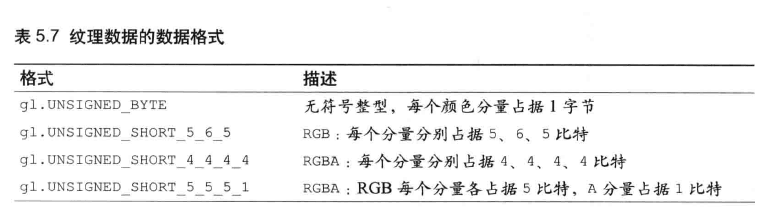

## 第五章 颜色与纹理

这一章有三个问题:

1. 将顶点的其他数据(如颜色等)传入顶点着色器.
2. 发生在顶点着色器和片元着色器之间的从图形到偏远的转化, 又称 **图元光栅化(rasterzation process)**
3. 将图像(或称文理)映射到图形或三维对象的表面上.

### 将非坐标数据传入顶点着色器

在绘制多个点的基础上(绘制三角形那章), 只需要修改两个地方的代码,第一个是顶点着色器代码中:

```js
let VSHADER_SOURCE =
    'attribute vec4 a_Position;\n' +
    'attribute float a_PointSize;\n' +
    'void main() {\n' +
    '  gl_Position = a_Position;\n' +
    '  gl_PointSize = a_PointSize;\n' +
    '}\n';
```

增加了描述点的大小的变量, 另一个修改的地方是函数`initVertexBuffers()`中.

```js
function initVertexBuffers(gl) {
    let vertices = new Float32Array([
        // Coordinate and size of points
        0.0,
        0.5,
        -0.5,
        -0.5,
        0.5,
        -0.5
    ]);
    let n = 3; // The number of vertices

    let sizes = new Float32Array([
        10.0,
        20.0,
        30.0 //点的尺寸
    ]);

    //创建缓冲区对象
    let vertexBuffer = gl.createBuffer();
    let sizeBuffer = gl.createBuffer();

    //将顶点坐标写入缓冲区对象并开启
    gl.bindBuffer(gl.ARRAY_BUFFER, vertexBuffer);
    gl.bufferData(gl.ARRAY_BUFFER, vertices, gl.STATIC_DRAW);
    let a_Position = gl.getAttribLocation(gl.program, 'a_Position');

    gl.vertexAttribPointer(a_Position, 2, gl.FLOAT, false, 0, 0);
    gl.enableVertexAttribArray(a_Position);

    //将顶点尺寸写入缓冲区对象并开启
    gl.bindBuffer(gl.ARRAY_BUFFER, sizeBuffer);
    gl.bufferData(gl.ARRAY_BUFFER, sizes, gl.STATIC_DRAW);
    let a_PointSize = gl.getAttribLocation(gl.program, 'a_PointSize');

    gl.vertexAttribPointer(a_PointSize, 1, gl.FLOAT, false, 0, 0);
    gl.enableVertexAttribArray(a_PointSize);

    return n;
}
```

下面来解释这个程序

#### 创建多个缓冲区对象

在代码中定义了包含顶点坐标数据的数组 `sizes` , 随后创建了两个缓冲区对象`vertexBuffer`和`sizeBuffer`, 前者用来存储顶点坐标数据, 后者用来存储顶点尺寸数据.

随后的步骤就与第三章中绘制多个点的步骤一致了, 当 WebGL 系统准备就绪, 执行`gl.drawArrays()`函数时, 存储在缓冲区对象中的数据将按照其在缓冲区中的顺序依次传给对应的 attribute 变量. 在顶点着色器中, 将这两个变量赋值, 即完成了.

#### 步进和偏移参数

多个缓冲区对象向着色器对象传递多种数据比较适合数据量不打的情况. 当程序中的复杂三维图形具有成千上万个顶点时, 维护所有的顶点数据就变得困难. 不过 WebGL 允许我们把顶点的坐标和尺寸数据打包到同一个缓冲区对象中, 并通过某种机制分别访问缓冲区对象中不同种类的数据. 比如, 可以将顶点的坐标和尺寸数据 **交错组织**:

```js
function initVertexBuffers(gl) {
    let verticesSizes = new Float32Array([
        // Coordinate and size of points
        0.0,
        0.5,
        10.0,
        -0.5,
        -0.5,
        20.0,
        0.5,
        -0.5,
        30.0
    ]);
    let n = 3; // The number of vertices

    //创建缓冲区对象
    let vertexSizeBuffer = gl.createBuffer();

    //将顶点坐标写入缓冲区对象并开启
    gl.bindBuffer(gl.ARRAY_BUFFER, vertexSizeBuffer);
    gl.bufferData(gl.ARRAY_BUFFER, verticesSizes, gl.STATIC_DRAW);

    let FSIZE = verticesSizes.BYTES_PER_ELEMENT;

    let a_Position = gl.getAttribLocation(gl.program, 'a_Position');

    gl.vertexAttribPointer(a_Position, 2, gl.FLOAT, false, FSIZE * 3, 0);
    gl.enableVertexAttribArray(a_Position);

    //将顶点尺寸写入缓冲区对象并开启
    let a_PointSize = gl.getAttribLocation(gl.program, 'a_PointSize');

    gl.vertexAttribPointer(a_PointSize, 1, gl.FLOAT, false, FSIZE * 3, FSIZE * 2);
    gl.enableVertexAttribArray(a_PointSize);

    return n;
}
```

`main()`函数流程与前面相同, 只有`initVertexBuffers()`被修改了.

具体流程就像这样, 创建缓冲区对象, 绑定之, 把数据写入缓冲区对象. 然后将每个元素的大小存储到`FSIZE`中, 手动把缓冲区对象分配给 attribute, 然后调用`vertexAttribPointer`函数.


如图所示, 每一个顶点有 3 个数据值, 因此 stride 应该设置为每项数据大小的 3 倍, 即 3xFSIZE

### 修改颜色(varying 变量)

我们需要在缓冲区对象中填充顶点坐标与颜色数据, 然后分配给`attribute`变量, 用以处理颜色.

第二章中使用了一个`uniform`变量来将颜色信息传入片元着色器, 然而, 这是个"一致的" (uniform) 变量, 而不是 "可变的" (varying), 我们不可能为每个顶点都准备一个值, 所以那个程序中的所有顶点都只能是同一个颜色. 我们使用一种新的**varying** 变量向片元着色器中传入数据, 实际上, varing 变量的作用是从顶点着色器向片元着色器传输数据.

修改顶点着色器和片元着色器的代码:

```js
let VSHADER_SOURCE =
    'attribute vec4 a_Position;\n' +
    'attribute vec4 a_Color;\n' +
    'varying vec4 v_Color;\n' + //varying变量
    'void main() {\n' +
    '  gl_Position = a_Position;\n' +
    '  gl_PointSize = 10.0;' +
    '  v_Color = a_Color;\n' + //将数据传给片元着色器
    '}\n';

// Fragment shader program
let FSHADER_SOURCE =
    '#ifdef GL_ES\n' +
    'precision mediump float;\n' +
    '#endif\n' +
    'varying vec4 v_Color;\n' +
    'void main() {\n' +
    '  gl_FragColor = v_Color;\n' +
    '}\n';
```

以及渲染函数中的代码:

```js
function initVertexBuffers(gl) {
    let verticesColors = new Float32Array([
        0.0,
        0.5,
        1.0,
        0.0,
        0.0,
        -0.5,
        -0.5,
        0.0,
        1.0,
        0.0,
        0.5,
        -0.5,
        0.0,
        0.0,
        1.0
    ]);
    let n = 3; // The number of vertices

    //创建缓冲区对象
    let vertexColorBuffer = gl.createBuffer();
    if (!vertexColorBuffer) {
        console.log('Failed to create the buffer object');
        return false;
    }

    //将顶点坐标写入缓冲区对象并开启
    gl.bindBuffer(gl.ARRAY_BUFFER, vertexColorBuffer);
    gl.bufferData(gl.ARRAY_BUFFER, verticesColors, gl.STATIC_DRAW);

    let FSIZE = verticesColors.BYTES_PER_ELEMENT;

    let a_Position = gl.getAttribLocation(gl.program, 'a_Position');

    gl.vertexAttribPointer(a_Position, 2, gl.FLOAT, false, FSIZE * 5, 0);
    gl.enableVertexAttribArray(a_Position);

    //将顶点尺寸写入缓冲区对象并开启
    let a_Color = gl.getAttribLocation(gl.program, 'a_Color');

    gl.vertexAttribPointer(a_Color, 3, gl.FLOAT, false, FSIZE * 5, FSIZE * 2);
    gl.enableVertexAttribArray(a_Color);

    return n;
}
```

在顶点着色器中, 我们声明了`attribute`变量 a_Color 用以接收颜色数据, 然后声明了新的 varying 变量 v_Color, 该变量负责将颜色值将被传给片元说则其, 注意 varying 变量只能是 float 类型的.

在 WebGL 中, 如果顶点着色器与片元着色器中有类型和命名都相同的 varying 变量, 那么顶点着色器赋给该变量的值就会被自动地传入片元着色器中.


如果把`gl.drawArray`的第一个参数改为`gl.TRIANGLES`后,就能到到一个颜色平滑过渡的三角形:


这看起来很神奇

#### 彩色三角形

在解释上面的彩色三角形的结果之前, 先回头看看第三章中的纯红色三角形:


关键代码贴在下面:

```js
let VSHADER_SOURCE =
  "attribute vec4 a_Position;\n" +
  "uniform float u_CosB, u_SinB;\n" +
  "void main() {\n" +
  "  gl_Position.x = a_Position.x * u_CosB - a_Position.y * u_SinB;\n" +
  "  gl_Position.y = a_Position.x * u_SinB + a_Position.y * u_CosB;\n" +
  "  gl_Position.z = a_Position.z;\n" +
  "  gl_Position.w = 1.0;\n" +
  "}\n";

...

function main() {
  ...
  gl.drawArrays(gl.TRIANGLES, 0, n);
}

function initVertexBuffers(gl) {
  let vertices = new Float32Array([0, 0.5, -0.5, -0.5, 0.5, -0.5]);
  let n = 3;
  ...
  gl.vertexAttribPointer(a_Position, 2, gl.FLOAT, false, 0, 0)
  ...
  return n;
}

main();
```

我们在`initVertexBuffers()`函数中将顶点坐标写入缓冲区, 然后将缓冲区对象分配给`a_Position`变量, 最后调用`gl.drawArrays()`执行顶点着色器, 当顶点着色器执行时, 缓冲区中的三个顶点坐标依次传给`a_Position`变量, 在赋值给`gl_Position`.

这里有一些被掩饰的细节, 实际上, 在顶点着色器和片元着色器之间, 有这样两个步骤:

1. 图形装配过程: 将孤立的顶点转配成几何图形, 几何图形的类别由`gl.drawArrays`函数的第一个参数决定.
2. 光栅化过程: 将装配好的几何图形转化为片元.


一旦光栅化完成, 程序就开始逐片调用片元着色器, 每次调用就处理一个片元, 对于每个片元, 片元着色器计算出该片元的颜色, 并写入颜色缓冲区, 直到最后一个片元被处理完成, 浏览器就会显示出最终的结果.


```js
var FSHADER_SOURCE =
    'precision mediump float;\n' +
    'uniform float u_Width;\n' +
    'uniform float u_Height;\n' +
    'void main() {\n' +
    '  gl_FragColor = vec4(gl_FragCoord.x/u_Width, 0.0, gl_FragCoord.y/u_Height, 1.0);\n' +
    '}\n';
```

这里使用了内置变量`gl_FragColor`, 其第一个和第二个分量表示片元在`<canvas>`坐标系中的坐标值.

得到的三角形是这样的:


#### varying 变量的作用和内插过程

了解了顶点着色器与片元着色器之间的几何图形装配和光栅化过程, 现在来看看那个彩色的渐变三角形.

实际上, 我们把顶点的颜色赋值给了顶点着色器中的`varying`变量`v_Color`, 它的值被传给片元着色器中的同名, 同类型变量. 但是, 更准确的说, 顶点着色中的`v_Color`变量在传入片元着色器之前经过了内插过程. 所以, 片元着色器中的`v_Color`变量和顶点着色器中的`v_Color`变量实际上并不是一回事, 这也正是这种变量为`varying`变量的原因.

而所谓内插, 看这张图就可明了:


好了, 继续吧

### 在矩形表面贴上图像

三维图形中有一项跟重要的技术, 叫做 **纹理映射(texture mapping)** . 纹理映射实际上就是将一张图像映射到一个几何图形的表面上去. 将一张真实世界的图片贴到一个有两个三角形组成的矩阵上, 这张图片就成为 "纹理图像" 或 "纹理" .

在 WebGL 中,纹理映射有四步:

1. 准备映射到几何图形上的纹理图像
2. 为几何图形配置纹理映射方式
3. 加载纹理图像,进行配置和使用
4. 在片元着色器中将相应的纹素从纹理中抽取出来, 并将纹素的颜色赋给片元

#### 纹理坐标

纹理坐标是纹理图像上的坐标, 通过纹理坐标可以在纹理图像上获取纹素颜色, WebGL 系统中的纹理坐标系统是二维的, 并且四个角的坐标分别是: 左下角(0.0,0.0), 右下角(1.0,0.0),右上角(1.0,1.0)以及左上角(0.0,1.0). 纹理坐标值与图像自身的尺寸无关, 在 WebGL 用为了与 x,y 坐标进行区分使用了 s,t 命名纹理坐标系统.


通过纹理图像的纹理坐标与几何形体顶点坐标间的映射关系, 来确定如何将纹理图像贴上去. 来看看代码示例:

```js
//矩阵纹理渲染
// 顶点着色器
var VSHADER_SOURCE =
  "attribute vec4 a_Position;\n" +
  "attribute vec2 a_TexCoord;\n" +
  "varying vec2 v_TexCoord;\n" +
  "void main() {\n" +
  "  gl_Position = a_Position;\n" +
  "  v_TexCoord = a_TexCoord;\n" +
  "}\n";

// 片元着色器
var FSHADER_SOURCE =
  "#ifdef GL_ES\n" +
  "precision mediump float;\n" +
  "#endif\n" +
  "uniform sampler2D u_Sampler;\n" +
  "varying vec2 v_TexCoord;\n" +
  "void main() {\n" +
  "  gl_FragColor = texture2D(u_Sampler, v_TexCoord);\n" +
  "}\n";

function main() {
  ...

  //设置顶点信息
  var n = initVertexBuffers(gl);
  if (n < 0) {
    console.log("Failed to set the vertex information");
    return;
  }

  // Specify the color for clearing <canvas>
  gl.clearColor(0.0, 0.0, 0.0, 1.0);

  // 配置纹理
  if (!initTextures(gl, n)) {
    console.log("Failed to intialize the texture.");
    return;
  }
}

function initVertexBuffers(gl) {
  var verticesTexCoords = new Float32Array([
    // 顶点坐标和纹理坐标
    -0.5,  0.5,   0.0, 1.0,
    -0.5, -0.5,   0.0, 0.0,
     0.5,  0.5,   1.0, 1.0,
     0.5, -0.5,   1.0, 0.0,
  ]);
  var n = 4; // The number of vertices

  // 创建缓冲区对象
  var vertexTexCoordBuffer = gl.createBuffer();
  if (!vertexTexCoordBuffer) {
    console.log("Failed to create the buffer object");
    return -1;
  }

  // 将顶点坐标和纹理坐标写入缓冲区对象
  gl.bindBuffer(gl.ARRAY_BUFFER, vertexTexCoordBuffer);
  gl.bufferData(gl.ARRAY_BUFFER, verticesTexCoords, gl.STATIC_DRAW);

  var FSIZE = verticesTexCoords.BYTES_PER_ELEMENT;
  //Get the storage location of a_Position, assign and enable buffer
  var a_Position = gl.getAttribLocation(gl.program, "a_Position");
  if (a_Position < 0) {
    console.log("Failed to get the storage location of a_Position");
    return -1;
  }
  gl.vertexAttribPointer(a_Position, 2, gl.FLOAT, false, FSIZE * 4, 0);
  gl.enableVertexAttribArray(a_Position); // Enable the assignment of the buffer object

  //获取纹理坐标地址
  var a_TexCoord = gl.getAttribLocation(gl.program, "a_TexCoord");
  if (a_TexCoord < 0) {
    console.log("Failed to get the storage location of a_TexCoord");
    return -1;
  }
  // Assign the buffer object to a_TexCoord variable
  gl.vertexAttribPointer(a_TexCoord, 2, gl.FLOAT, false, FSIZE * 4, FSIZE * 2);
  gl.enableVertexAttribArray(a_TexCoord); // 开启纹理坐标

  return n;
}

function initTextures(gl, n) {
  var texture = gl.createTexture(); // 创建纹理对象
  if (!texture) {
    console.log("Failed to create the texture object");
    return false;
  }

  // 获取u_Smapler的存储位置
  var u_Sampler = gl.getUniformLocation(gl.program, "u_Sampler");
  if (!u_Sampler) {
    console.log("Failed to get the storage location of u_Sampler");
    return false;
  }
  var image = new Image(); // 创建image对象
  if (!image) {
    console.log("Failed to create the image object");
    return false;
  }
  // 注册图像加载事件响应函数
  image.onload = function() {
    loadTexture(gl, n, texture, u_Sampler, image);
  };
  // 告诉浏览器去加载图像
  image.src = "../resources/sky.jpg";

  return true;
}

function loadTexture(gl, n, texture, u_Sampler, image) {
  gl.pixelStorei(gl.UNPACK_FLIP_Y_WEBGL, 1); //对纹理图像进行y周翻转
  // 开启0号纹理单元
  gl.activeTexture(gl.TEXTURE0);
  // 向target绑定纹理对象
  gl.bindTexture(gl.TEXTURE_2D, texture);

  // 配置纹理参数
  gl.texParameteri(gl.TEXTURE_2D, gl.TEXTURE_MIN_FILTER, gl.LINEAR);
  // 配置纹理图像
  gl.texImage2D(gl.TEXTURE_2D, 0, gl.RGB, gl.RGB, gl.UNSIGNED_BYTE, image);

  //将0号纹理传递给着色器
  gl.uniform1i(u_Sampler, 0);

  gl.clear(gl.COLOR_BUFFER_BIT); // Clear <canvas>

  gl.drawArrays(gl.TRIANGLE_STRIP, 0, n); // Draw the rectangle
}
```

我们从这段代码中的第 27 行开始讲起,

#### 设置纹理坐标(initVertexBuffers())

将纹理坐标传入顶点着色器, 与讲其他顶点数据(颜色等)传入顶点着色器的方法是一直的. 我们把纹理坐标和顶点坐标写在同一个缓冲区中, 定义数组, 成对记录每个顶点的顶点坐标和纹理坐标. (44 行)

然后将顶点坐标和纹理坐标写入缓冲区对象, 分配给不同的变量并开启它们. (61~82)

#### 配置和加载纹理(initTetxures())

`initTetxures()`函数负责配置和加载纹理: 调用`gl.createTexture()`创建纹理对象, 再使用`gl.getUniformLocaion`从片元着色器中获取`uniform`变量`u_Sampler`的存储位置, 该变量用来接收纹理图像.(87~99)

关于`gl.createTexture()`函数, 这里进行一些介绍:


调用该函数将在 WebGL 系统中创建一个纹理对象.

同样, 也可以使用`gl.deleteTexture()`来删除一个纹理对象. 注意, 如果视图删除一个已经被删除的纹理对象, 不会报错也不会产生任何作用.


#### 为 WebGL 配置纹理(loadTexture())

`loadTexture()`函数的内容在上面代码的 115~133, 主要任务是配置纹理供 WebGL 使用.

使用图像之前, 必须对它进行 Y 轴翻转(116), 因为 PNG,BMP,JPG 等格式图片的坐标系统的 Y 轴方向是相反的.


`gl.pixelStorei()`函数规范如下:


#### 激活纹理单元(gl.activeTexture())

WebGL 通过一种称为 **纹理单元(texture unit)** 的机制来同时使用多个纹理. 每个纹理单元有一个单元编码来管理一张纹理图像. 即使你的陈谷只需要一张纹理图像, 也要为其指定一个纹理单元(118)

系统支持的纹理单元个数取决于硬件和浏览器的 WebGL 实现, 但是在默认情况下, WebGL 至少支持 8 个纹理单元, 一些其他的系统支持的个数更多. 内置的变量`gl.TEXTURE0...gl.TEXTURE7`各表示一个纹理单元.

在使用纹理单元之前, 还需要调用`gl.activeTexture`来激活, 使用方法如示例程序中所示.

#### 绑定纹理对象(gl.bindTexture())

接下来, 就是告诉 WebGL 系统纹理对象使用的是哪种类型的纹理, 在对纹理对象进行操作之前, 我们需要绑定纹理对象,就像使用缓冲区一样:在缓冲区对象进行操作之前, 也需要绑定缓冲区对象. WebGL 支持两种类型的纹理.


立方体纹理的内容超出了本书的讨论范围, 如果对此感兴趣, 可以参考<OpenGL ES2.0 编程指南>这本书.

使用`gl.bindTexture(target, texture)`方法绑定纹理对象.


该方法完成了两个任务, 开启纹理对象, 以及将纹理对象绑定到纹理单元上. 在本例中, 0 号纹理单元已经被激活了

#### 配置纹理对象的参数(gl.texParameteri())

接下来, 还需要配置纹理对象的参数, 以此来设置纹理图像映射到图形上的具体方式: 如何根据纹理坐标获取纹素颜色, 按哪种方式重复填充纹理, 都通过使用通用函数`gl.texParameteri()`来进行设置:


#### 将图像分配给纹理对象(gl.texImageD())


快速的看一下调用该方法时每个参数的取值:

level 直接取 0, 因为我们没有用到金字塔纹理.

format 参数表示纹理数据的格式, 具体如下:


**流明** 指的是我们刚知道的物体表面的亮度, 通常使用物体表面 RGB 分量值的加权平均来计算流明.

type 参数指定了纹理数据类型, 如下表:



第一种是最常用的. 后面几种可以用来压缩数据, 减少浏览器加载图像的时间.

#### 将纹理单元传递给片元着色器(gl.uniform1i())

我们使用 uniform 变量来表示万里, 因为纹理图像不会随着片元变化.

```GLSL
...
uniform sampler2D u)Sampler;
...
```

必须将着色器中表示纹理对象的`uniform`变量声明为一种特殊的, 专用于纹理对象的数据类型:


#### 顶点着色器获得纹理坐标, 传递给片元着色器

片元着色器使用内置函数 `texture2D`抽取纹素颜色, 函数描述如下:


注意返回值的类型:


纹理放大和缩小方法的参数将决定 WebGL 系统以何种方式内插出片元. 我们将`texture2D`函数返回值赋给了`gl_FragColor`变量, 然后片元着色器将当前片元染成这个颜色, 随后映射到图形上.

效果是这样的的:


### 多幅纹理

WebGL 可以出来多幅纹理, 纹理单元就是为了这个目的而设计的. 这里我们来在矩形上重复粘贴两幅纹理图像:

程序关键代码如下:

```js
// MultiTexture.js (c) 2012 matsuda and kanda
// Vertex shader program
var VSHADER_SOURCE =
...

// Fragment shader program
var FSHADER_SOURCE =
...
  'uniform sampler2D u_Sampler0;\n' +
  'uniform sampler2D u_Sampler1;\n' +
  'varying vec2 v_TexCoord;\n' +
  'void main() {\n' +
  '  vec4 color0 = texture2D(u_Sampler0, v_TexCoord);\n' +
  '  vec4 color1 = texture2D(u_Sampler1, v_TexCoord);\n' +
  '  gl_FragColor = color0 * color1;\n' +
  '}\n';

function main() {
  ...

  // 配置纹理
  if (!initTextures(gl, n)) {
    console.log('Failed to intialize the texture.');
    return;
  }
}

function initVertexBuffers(gl) {
  var verticesTexCoords = new Float32Array([
    // Vertex coordinate, Texture coordinate
    -0.5,  0.5,   0.0, 1.0,
    -0.5, -0.5,   0.0, 0.0,
     0.5,  0.5,   1.0, 1.0,
     0.5, -0.5,   1.0, 0.0,
  ]);
  var n = 4; // The number of vertices
...
  return n;
}

function initTextures(gl, n) {
  // Create a texture object
  var texture0 = gl.createTexture();
  var texture1 = gl.createTexture();
...
  // Get the storage location of u_Sampler0 and u_Sampler1
  var u_Sampler0 = gl.getUniformLocation(gl.program, 'u_Sampler0');
...

  // Create the image object
  var image0 = new Image();
  var image1 = new Image();
  if (!image0 || !image1) {
    console.log('Failed to create the image object');
    return false;
  }
  // Register the event handler to be called when image loading is completed
  image0.onload = function(){ loadTexture(gl, n, texture0, u_Sampler0, image0, 0); };
  image1.onload = function(){ loadTexture(gl, n, texture1, u_Sampler1, image1, 1); };
  // Tell the browser to load an Image
  image0.src = '../resources/sky.jpg';
  image1.src = '../resources/circle.gif';

  return true;
}
// Specify whether the texture unit is ready to use
var g_texUnit0 = false, g_texUnit1 = false;
function loadTexture(gl, n, texture, u_Sampler, image, texUnit) {
  gl.pixelStorei(gl.UNPACK_FLIP_Y_WEBGL, 1);// Flip the image's y-axis
  // Make the texture unit active
  if (texUnit == 0) {
    gl.activeTexture(gl.TEXTURE0);
    g_texUnit0 = true;
  } else {
    gl.activeTexture(gl.TEXTURE1);
    g_texUnit1 = true;
  }
  // Bind the texture object to the target
  gl.bindTexture(gl.TEXTURE_2D, texture);

  // Set texture parameters
  gl.texParameteri(gl.TEXTURE_2D, gl.TEXTURE_MIN_FILTER, gl.LINEAR);
  // Set the image to texture
  gl.texImage2D(gl.TEXTURE_2D, 0, gl.RGBA, gl.RGBA, gl.UNSIGNED_BYTE, image);

  gl.uniform1i(u_Sampler, texUnit);   // Pass the texure unit to u_Sampler

  // Clear <canvas>
  gl.clear(gl.COLOR_BUFFER_BIT);

  if (g_texUnit0 && g_texUnit1) {
    gl.drawArrays(gl.TRIANGLE_STRIP, 0, n);   // Draw the rectangle
  }
}
```
