> WebGL入门指南读书笔记- 第六章: OpenGL ES着色器语言

<!-- more -->

## OpenGL ES 着色器语言

主要内容:

-   数据, 变量和变量类型
-   矢量, 矩阵, 结构体. 数组. 采样器(纹理)
-   attribute, uniform , varying 变量
-   精度限定词
-   预处理和指令

基础:

-   着色器程序和 C 语言更接近, 它从`main()`函数开始执行, 着色器程序必须有且仅有一个`main()`函数, 而且该函数不能接受任何参数, `void`犯贱自表示这个函数不返回值.


### 数据, 变量和变量类型

-   GLSL 支持两种数据值类型:

    -   数值类型: GLSL ES 支持整形数(0,1,2)和浮点数(3.14,29.98)
    -   布尔值类类型: true/false

-   变量: 规则和 js 一直, GLSL 的关键字如下:


保留字如下:

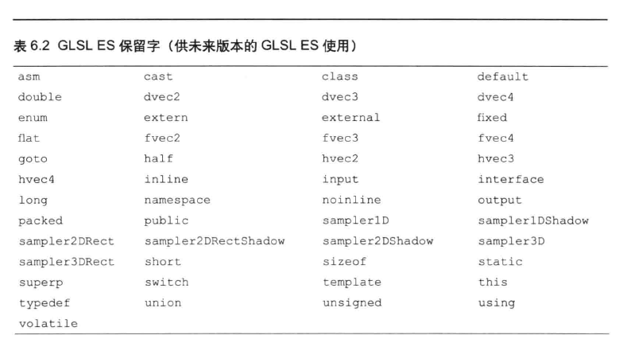

-   GLSL 是强类型语言, 基本支持的类型如下:
    -   float: 单精度浮点数
    -   int: 整数
    -   bool: 布尔值
        支持任意两个类型的强制转换: float(xxx)

*   运算符: 除了 JS 中支持的基本运算符, GLSL 支持:
    -   ^^: 逻辑异或,两者中有且仅有一个为 true, 则返回 true

### 矢量, 矩阵

GLSL ES 支持矢量和矩阵:

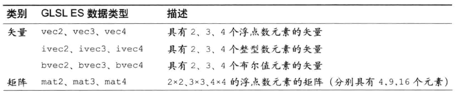

构造矢量可以使用矢量构造函数:

```GLSL
vec3 v3 = vec3(1.0,0.0,0.0);
vec2 v2 = vec2(v3);//使用v3的前两个元素
vec4 v4 = vec4(1.0);//将v4设置为(1.0,1.0,1.0,1.0)

vec4 v4b = vec4(v2,v4);//先用v2填充, 没有填满就继续用v4中的元素填充
```

构造矩阵同样有类似的矩阵构造函数:

需要注意的一点是, 矩阵的构造序列是矩阵的 T, 也就是列主序的.

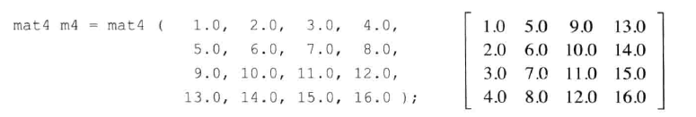

构造函数的用法:

```GLSL
vec2 v2_1 = vec2(1.0, 3.0);
vec2 v2_2 = vec2(2.0, 4.0);
mat2 m2_1 = mat(v2_1, v2_2);//1.0 2.0
                            //3.0 4.0

vec4 v4 = vec4(1.0, 3.0, 2.0, 4.0);
mar2 m2_2 = mat3(v4);//1.0 2.0
                     //3.0 4.0

mat2 m2=mat2(1.0,3.0,v2_2);

mat m4=mat4(1.0);//创建四阶单位矩阵
//1.0 0.0 0.0 0.0
//0.0 1.0 0.0 0.0
//0.0 0.0 1.0 0.0
//0.0 0.0 0.0 1.0
```

#### 访问矢量或矩阵中的元素

访问方法可以使用`.`或者`[]`, 先来看`.`

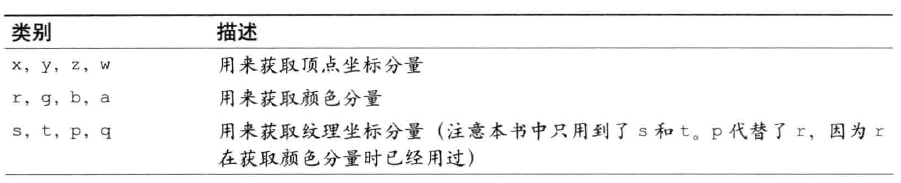

`.`访问有单独访问:

```GLSL
vec3 v3=vec3(1.0, 2.0, 3.0);
float f;

f=v3.x;//1.0
f=v3.y;//2.0
f=v3.z;//3.0

f=v3.r;//1.0
f=v3.s;//1.0

f=v3.w;//error 超出矢量长度, 不存在w
```

还有聚合访问:

```GLSL
vec2 v2;
v2=v3.xy;//(1.0, 2.0)
v2=v3.yz;//(2.0, 3.0) 省略任意分量
v2=v3.xz;//(1.0, 3.0) 跳过任意分量
v2=v3.yx;//(2.0, 1.0) 逆序
v2=v3.xx;//(1.0, 1.0) 任意重复
```

聚合赋值:

```GLSL
vec4 position = vec(1.0, 2.0, 3.0, 4.0);
position.xw=vec2(5.0, 6.0);//position = (5.0, 2.0, 3.0, 6.0)
```

`[]`运算符:

```GLSL
//m4:
//1.0 5.0 9.0 13.0
//2.0 6.0 10.0 14.0
//3.0 7.0 11.0 15.0
//4.0 8.0 12.0 16.0
vec4 v4 = m4[0]; //获取m4矩阵的第一列, 即[1.0, 2.0, 3.0, 4.0]

float m23 = m4[1][2]; //第2列第3个元素(7.0)
```

`[]`和`.`混合访问:

```GLSL
float m32 = m4[2].y;//第三列中的第二个元素(10.0)
```

注意一点, `[]`中只能出现 **常量索引值**, 包括:

-   整形字面量(0,1,...)
-   用 const 修饰的全局变量或局部变量, 不包括函数参数
-   循环索引
-   由前面三条中的项组成的表达式

### 运算符

先看看所有矢量和矩阵可用的运算符:

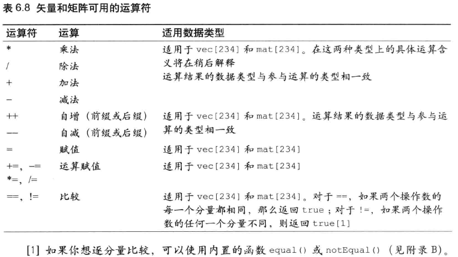

运算赋值操作作用域矢量或矩阵时, 实际上是逐分量地对于矩阵或矢量的每一个元素进行独立的运算赋值.

相关运算法则与数学中的规则是一致的.

### 结构体

定义结构体:

```GLSL
struct light{
    vec4 color;
    vec3 position;
}

light i1,i2;//声明了light类型的变量i1,i2;
```

此外, 可以同时声明:

```GLSL
struct light{//结构体
    vec4 color;//光的颜色
    vec3 positon;//光源位置
}ll;//该结构体类型的变量ll
```

-   构造和赋值

```GLSL
l1=light(vec4(0.0, 1.0, 0.0, 1.0), vec3(8.0, 3.0, 0.0));
```

-   访问成员

```GLSL
vec4 color = l1.color;
vec3 position = l1.positon;
```

-   运算

结构体本身只支持赋值(=)和比较(==,!=)两种运算. 注意, 赋值和比较运算符不适合用于含有数组和纹理成员的结构体.

### 数组

GLSL ES 只支持一维数组, 并且不支持 js 中的数组函数操作. 创建数组如下:

```GLSL
float floatArray[4];
vec4 vecArray[2];
```

数组的长度必须是大于 0 的 **整形常量表达式**:

-   整形字面量
-   用 const 限定字修饰的全局变量或局部变量
-   由前两条组成的表达式

同时, 只有整形常量表达式和`uniform`变量, 可以被用作数组的索引值. 此外, 与 js 和 c 不同的是, 数组不能再声明时被一次性地初始化, 而必须显示地对每个元素进行初始化.

```GLSL
vec4Array[0] = vec4(4.0,3.0,6.0,1.0);
vec4Array[1] = vec4(3.0,2.0,0.0,1.0);
```

### 取样器(纹理)

**取样器(sampler)** 是 GLSL ES 支持的一种内置类型. 我们只能通过这种类型变量访问纹理.

-   定义:

有两种基本的取样器类型: sampler2D 和 samplerCube . 取样器变量只能是 uniform 变量, 或者需要访问纹理的函数, 如 textuew2D() 函数的参数:

```GLSL
uniform sampler2D u_Sampler;
```

-   赋值:

唯一能赋值给取样器变量的就是纹理单元编号, 而且你必须使用 WebGL 方法`gl.uniformli()`来进行赋值. (参考第五 5 章)

-   运算:

除了=,==,!=, 取样器变量不可以作为操作数参与运算.

与其他类型变量不同, 取样器类型变量收到着色器支持的纹理单元的最大数量限制. 看下面表格:

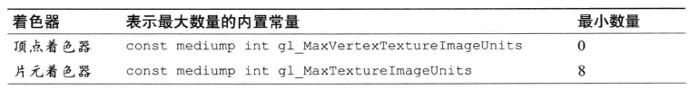

### 运算符优先级

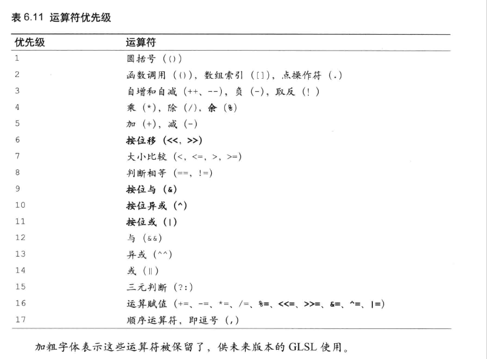

### 函数

GLSL 定义函数的方式更接近 C 语言:

```GLSL
ReturnType funcNam(type arg0,...){
    ...
    returen xxx
}
```

::: tip 提示
不能在一个函数内部调用它本身(不允许递归), 这项限制的目的也是为了便于编译器对函数进行内联展开
:::

还有几点需要注意:

1. 调用函数需要手动进行提升
2. 参数有值传递和地址传递, 这通过参数限定词来处理:

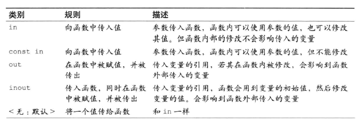

使用如下:

```GLSL
void luma2 (in vec3 color, out float brightness){
    brightness = ...
}
```

#### 内置函数

GLSL 内置函数通过下面这样图表来一览:

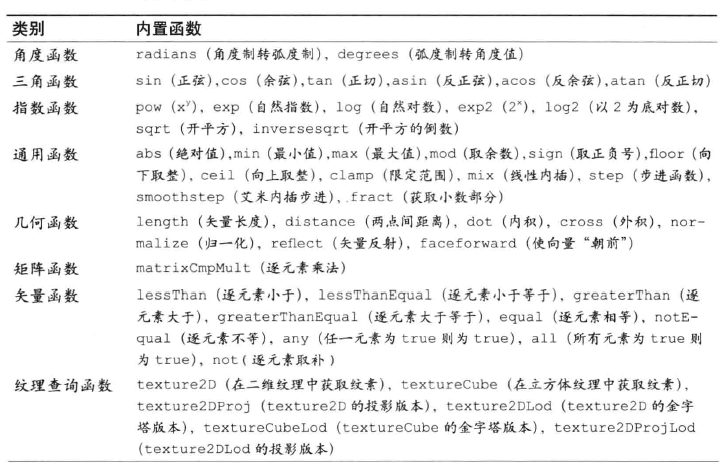

### 全局变量和局部变量

在 GLEL ES 中, 如果变量声明在函数的外面, 那么它就是全局变量, 如果声明在函数内部, 那就是局部变量.

#### 存储限定字

在 GLSL ES 中, 我们经常使用`attribute`,`varying`,`uniform`限定字来修饰变量, 除此之外, 我们也会使用`const`限定字, 表示着色器中的某个变量是恒定的常量.

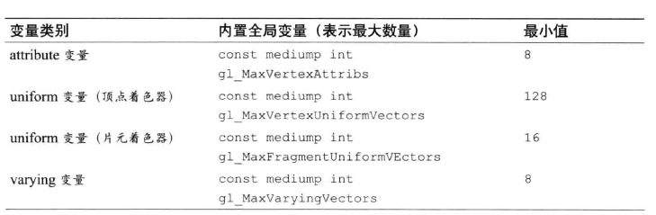

### 精度限定字

GLSL ES 新引入了精度限定字, 目的是帮助着色器程序提高运行效率, 削减内存开支.

精度限定字用来表示每种数据具有的精度(比特位数).

写法如下:

```GLSL
#ifdef GL_ES
precision mediump float;
#endif
```

共有三种, 如表:

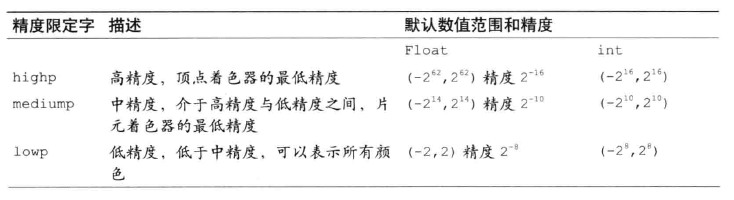

::: tip 提示
首先, 在某些 WebGL 环境中, 片元着色器可能不支持 highp 精度,检查的方法在后面讨论; 其次, 数值范围和精度实际上也是与系统环境相关的, 可以使用`gl.getShaderPrecosionFormat()`来检查
:::

在 GLSL 中, 一般是有默认精度的, 但是有一个例外:

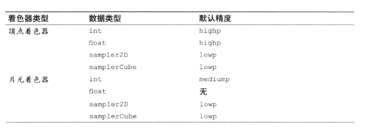

片元着色器中的 float 类型没有默认精度, 所以我们需要手动指定, 如果不在片元着色器中限定 float 类型的精度, 就会导致报错.

WebGL 是否在片元着色器中支持 highp 精度, 取决于具体的设备, 如果支持的话, 那么着色器就会定义内置宏 `GL_FRAGMENT_PRECISION_HIGH`, 也就是预处理指令的一种

### 预处理指令

预处理指定就是在真正编译之前对代码进行预处理,一般以`#`号开始

下面是我们可能用到的有三种预处理指令:

```GLSL
#if 条件表达式
//IF 如果为真,执行这里
#endif

#ifdef 宏
如果定义了宏, 执行这里
#endif

#ifndef 宏
//如果没有定义某宏, 执行这里
#endif
```

还有一些其他的指令:

-   可以使用`#define 宏名 宏内容`来进行宏定义. 和 C 语言不通, GLSL ES 中的宏没有宏参数
-   可以使用`#undef 宏名`来解除宏定义
-   可以使用`#else`配合`#ifdef`, 比如:

```GLSL
#define NUM 100
#if NUM==100
//如果宏NUM为100, 执行这里
#else
否则, 执行这里
#endif
```

宏的名称是任意的, 只要别和预定义的内置宏冲突即可


两个小例子:

1. 使用宏来进行精度限定:

```GLSL
#ifdef GL_ES
#ifdef GL_FRAGMENT_PRECISION_HIGH
precision highp float;
#else
precision mediump float;
#endif
#endif
```

2. 指定 GLSL ES 版本

```GLSL
#version number//number可以为100(GLSL ES 1.00)或者101(GLSL ES 1.01), 默认版本为100.
```

该指令必须在色器顶部, 在其之前只能有注释和空白.
