> WebGL入门指南读书笔记- 第七章: 三维世界

<!-- more -->

## 三维世界

### 视点和视线

三维和二维最显著的区别就是三维多了一个 Z 轴. 这使得复杂度增加了.

我们要考虑两点:

-   观察方向, 即观察者自己在什么位置. 在看场景的哪一部分
-   可视距离, 即观察者能看多远

我们将观察者所处的位置称为 **视点(eye point)**, 从视点出发沿着观察方向的射线称为 **视线(viewing direction)**. 这里先来研究视点和视线如何表述观察者, 下一节再来看"观察者看多远"的问题.

#### 视点, 观察目标点和上方向

一图说之:

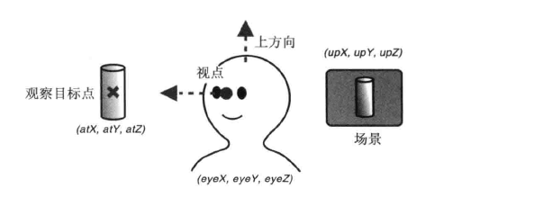

-   视点: 观察者所在的三维空间中的位置, 视线的起点. 在接下来的几节中, 视点坐标用(eyeX, eyeY, eyeZ);
-   观察目标点: 被观察目标所在的点. 红丝线从十点出发, 穿过观察目标点并继续延伸. 注意, 观察目标点是一个点, 而不是视线方向, 只有同时知道观察目标点和视点, 才能算出视线方向. 观察目标点的坐标用(atX, atY, atZ)表示
-   上方向: 最终绘制在屏幕中的向上的方向. 为了将观察者固定住, 我们需要指定上方向. 上方向是具有三个分量的矢量, 用(upX, upY, upZ)表示. '

在 WebGL 中, 我们可以用上述三个矢量创建一个 **视图矩阵(view matrix)**, 然后将该矩阵传给顶点着色器. 视图矩阵可以表示观察者的状态, 是因为它最终影响了显示在屏幕上的视图, 也就是观察者观察到的场景. cuon-matrix.js 提供了 Matrix4.setLookAt()函数可以根据上述三个矢量来创建视图矩阵:

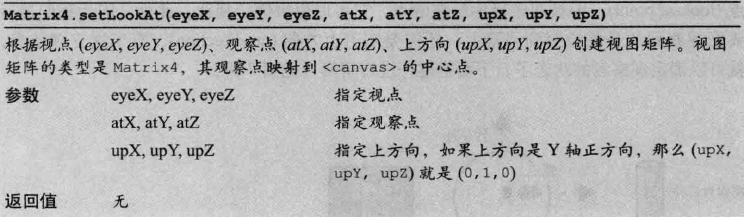

在 WebGL 中, 观察者的默认状态应该是如下的:

-   视点位于坐标原点(0,0,0)
-   视线为 Z 轴负方向(0,0,-1), 上方为 Y 轴负方向(0,1,0).

使用如下:

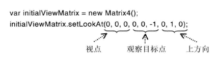

这里有一个完整的示例程序:

```js
let VSHADER_SOURCE = `
attribute vec4 a_Position;
attribute vec4 a_Color;
uniform mat4 u_ViewMatrix;
varying vec4 v_Color;
void main(){
    gl_Position = u_ViewMatrix * a_Position;
    v_Color = a_Color;
}`;

let FSHADER_SOURCE = `
#ifdef GL_ES
precision mediump float;
#endif
varying vec4 v_Color;
void main() {
    gl_FragColor=v_Color;
}`;

function main() {
...

    // 初始化着色器
    if (!initShaders(gl, VSHADER_SOURCE, FSHADER_SOURCE)) {
      console.log('Failed to intialize shaders.');
      return;
    }

    // Set the vertex coordinates and color (the blue triangle is in the front)
    var n = initVertexBuffers(gl);
...
    // Specify the color for clearing <canvas>
    gl.clearColor(0, 0, 0, 1);

    // Get the storage location of u_ViewMatrix
    var u_ViewMatrix = gl.getUniformLocation(gl.program, 'u_ViewMatrix');
    if (!u_ViewMatrix) {
      console.log('Failed to get the storage locations of u_ViewMatrix');
      return;
    }

    // Set the matrix to be used for to set the camera view
    var viewMatrix = new Matrix4();
    viewMatrix.setLookAt(0.20, 0.25, 0.25, 0, 0, 0, 0, 1, 0);

    // Set the view matrix
    gl.uniformMatrix4fv(u_ViewMatrix, false, viewMatrix.elements);
...

    // Draw the rectangle
    gl.drawArrays(gl.TRIANGLES, 0, n);
  }

  function initVertexBuffers(gl) {
    var verticesColors = new Float32Array([
      //三角形顶点位置, 以及颜色的RGBA分量
       0.0,  0.5,  -0.4,  0.4,  1.0,  0.4, // The back green one
      -0.5, -0.5,  -0.4,  0.4,  1.0,  0.4,
       0.5, -0.5,  -0.4,  1.0,  0.4,  0.4,

       0.5,  0.4,  -0.2,  1.0,  0.4,  0.4, // The middle yellow one
      -0.5,  0.4,  -0.2,  1.0,  1.0,  0.4,
       0.0, -0.6,  -0.2,  1.0,  1.0,  0.4,

       0.0,  0.5,   0.0,  0.4,  0.4,  1.0,  // The front blue one
      -0.5, -0.5,   0.0,  0.4,  0.4,  1.0,
       0.5, -0.5,   0.0,  1.0,  0.4,  0.4,
    ]);
    var n = 9;

    // Create a buffer object
    var vertexColorbuffer = gl.createBuffer();
    if (!vertexColorbuffer) {
      console.log('Failed to create the buffer object');
      return -1;
    }

    // Write the vertex coordinates and color to the buffer object
    gl.bindBuffer(gl.ARRAY_BUFFER, vertexColorbuffer);
    gl.bufferData(gl.ARRAY_BUFFER, verticesColors, gl.STATIC_DRAW);

    var FSIZE = verticesColors.BYTES_PER_ELEMENT;
    // Assign the buffer object to a_Position and enable the assignment
    var a_Position = gl.getAttribLocation(gl.program, 'a_Position');
    if(a_Position < 0) {
      console.log('Failed to get the storage location of a_Position');
      return -1;
    }
    gl.vertexAttribPointer(a_Position, 3, gl.FLOAT, false, FSIZE * 6, 0);
    gl.enableVertexAttribArray(a_Position);

    // Assign the buffer object to a_Color and enable the assignment
    var a_Color = gl.getAttribLocation(gl.program, 'a_Color');
...
    gl.vertexAttribPointer(a_Color, 3, gl.FLOAT, false, FSIZE * 6, FSIZE * 3);
    gl.enableVertexAttribArray(a_Color);

    // Unbind the buffer object
    gl.bindBuffer(gl.ARRAY_BUFFER, null);

    return n;
  }
```

效果如下:

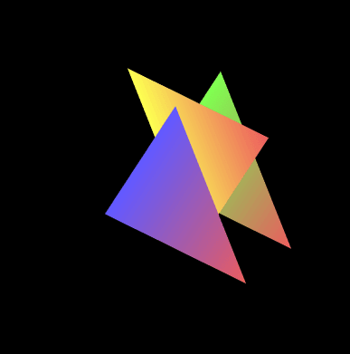

用我们前面学到的知识, 可以理解这个程序的所有内容, 在此便不再解释一遍了.

第四章矩阵旋转程序绘制了一个绕 Z 轴旋转一定角度的三角形, 我们结合这个, 得到一个使用键盘控制旋转的叠加矩阵图形:

```js
// LookAtTrianglesWithKeys.js (c) 2012 matsuda
// Vertex shader program
var VSHADER_SOURCE =
  'attribute vec4 a_Position;\n' +
  'attribute vec4 a_Color;\n' +
  'uniform mat4 u_ViewMatrix;\n' +
  'varying vec4 v_Color;\n' +
  'void main() {\n' +
  '  gl_Position = u_ViewMatrix * a_Position;\n' +
  '  v_Color = a_Color;\n' +
  '}\n';
...

function main() {
 ...

  // Get the storage location of u_ViewMatrix
  var u_ViewMatrix = gl.getUniformLocation(gl.program, 'u_ViewMatrix');
...
  // 创建矩阵对象
  var viewMatrix = new Matrix4();
  // 注册键盘事件响应函数
  document.onkeydown = function(ev){ keydown(ev, gl, n, u_ViewMatrix, viewMatrix); };

  draw(gl, n, u_ViewMatrix, viewMatrix);   // Draw
}

...

var g_eyeX = 0.20, g_eyeY = 0.25, g_eyeZ = 0.25; // Eye position
function keydown(ev, gl, n, u_ViewMatrix, viewMatrix) {
    if(ev.keyCode == 39) { // The right arrow key was pressed
      g_eyeX += 0.01;
    } else
    if (ev.keyCode == 37) { // The left arrow key was pressed
      g_eyeX -= 0.01;
    } else { return; }
    draw(gl, n, u_ViewMatrix, viewMatrix);
}

function draw(gl, n, u_ViewMatrix, viewMatrix) {
  // Set the matrix to be used for to set the camera view
  viewMatrix.setLookAt(g_eyeX, g_eyeY, g_eyeZ, 0, 0, 0, 0, 1, 0);

  // Pass the view projection matrix
  gl.uniformMatrix4fv(u_ViewMatrix, false, viewMatrix.elements);

  gl.clear(gl.COLOR_BUFFER_BIT);     // Clear <canvas>

  gl.drawArrays(gl.TRIANGLES, 0, n); // Draw the rectangle
}

```

这个例子中, 我们注册了键盘事件响应函数. 每当左方向键或右方向键激活, 就会调用`draw()`函数进行重绘.

但如果观察运行效果, 会发现视点极左或极右的时候, 三角形会缺一角:

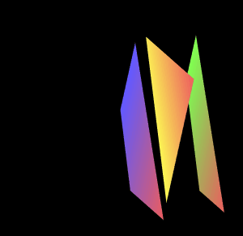

这是因为我们没有指定 **可视范围(visible range)**, 即实际观察得到的区域边界.

### 可视范围(正射)

虽然我们可以吧三维物体放在三维空间的任意位置, 但是只有当它在可视范围内时, WebGL 才会去绘制它. 事实上, 不绘制可视范围外的对象, 是基本的降低程序开销的手段. 绘制可视范围外的对象没有意义.

除了水平和垂直范围的限制, WebGL 还限制观察者的可视深度, 有了这些限制, 我们就定义了 **可视空间(view volume)**.

### 可视空间

有两类常用的可是空间:

-   长方体可是空间, 又叫 盒状空间, 由 **正射投影(orthographic projection)**产生.
-   四棱锥 / 金字塔 可视空间, 有 **透视投影(prespective projection)**产生.

透视投影贴近现实, 适用于大多数的场景. 正射投影适用于建筑平面图等物体大小与其所在位置没有关系的场合.

先来看看基于正射投影的盒装可视空间的工作原理.

可视空间由前后两个矩形表面确定, 分别称为 **近裁剪面** 和 **远裁剪面**

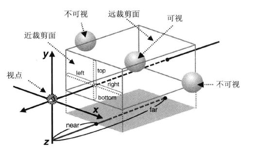

`<canvas>`上显示的就是可视空间中物体在近裁剪面上的投影. 如果裁剪面的宽高比与`<canvas>`上不一样, 画面就会按照`<canvas>`的宽高比进行压缩, 物体会被扭曲. 近裁剪面和远裁剪面之间的盒形空间就是可视空间, 只有在此空间内的物体会被显示出来. 如果某个物体的一部分在可视空间之内, 一部分在外面, 那就只显示空间内的部分.

#### 定义盒状可视空间

cuon-mastrix.js 提供了`Matrix4.setOrtho()`方法可用来设置投影矩阵, 定义盒状可视空间:

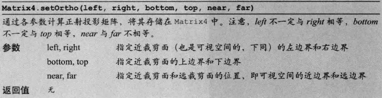

这里用到的矩阵被称为 **正交投影矩阵(orthographic projection matrix)** .

来看一个示例程序:

```js
// OrthoView.js (c) 2012 matsuda
// Vertex shader program
var VSHADER_SOURCE =
  'attribute vec4 a_Position;\n' +
  'attribute vec4 a_Color;\n' +
  'uniform mat4 u_ProjMatrix;\n' +
  'varying vec4 v_Color;\n' +
  'void main() {\n' +
  '  gl_Position = u_ProjMatrix * a_Position;\n' +
  '  v_Color = a_Color;\n' +
  '}\n';

// Fragment shader program
var FSHADER_SOURCE =
  '#ifdef GL_ES\n' +
  'precision mediump float;\n' +
  '#endif\n' +
  'varying vec4 v_Color;\n' +
  'void main() {\n' +
  '  gl_FragColor = v_Color;\n' +
  '}\n';

function main() {
...

  // Create the matrix to set the eye point, and the line of sight
  var projMatrix = new Matrix4();
  // Register the event handler to be called on key press
  document.onkeydown = function(ev){ keydown(ev, gl, n, u_ProjMatrix, projMatrix, nf); };

  draw(gl, n, u_ProjMatrix, projMatrix, nf);   // Draw the triangles
}
...

// The distances to the near and far clipping plane
var g_near = 0.0, g_far = 0.5;
function keydown(ev, gl, n, u_ProjMatrix, projMatrix, nf) {
  switch(ev.keyCode){
    case 39: g_near += 0.01; break;  // The right arrow key was pressed
    case 37: g_near -= 0.01; break;  // The left arrow key was pressed
    case 38: g_far += 0.01;  break;  // The up arrow key was pressed
    case 40: g_far -= 0.01;  break;  // The down arrow key was pressed
    default: return; // Prevent the unnecessary drawing
  }

  draw(gl, n, u_ProjMatrix, projMatrix, nf);
}

function draw(gl, n, u_ProjMatrix, projMatrix, nf) {
  // Specify the viewing volume
  projMatrix.setOrtho(-1.0, 1.0, -1.0, 1.0, g_near, g_far);

  // Pass the projection matrix to u_ProjMatrix
  gl.uniformMatrix4fv(u_ProjMatrix, false, projMatrix.elements);

  gl.clear(gl.COLOR_BUFFER_BIT);       // Clear <canvas>

  // Display the current near and far values
  nf.innerHTML = 'near: ' + Math.round(g_near * 100)/100 + ', far: ' + Math.round(g_far*100)/100;

  gl.drawArrays(gl.TRIANGLES, 0, n);   // Draw the triangles
}
```

这个程序中可以使用方向键设置可视空间矩阵的 near 和 far 值.

#### 定义透视投影可视空间

透视投影遵循近大远小的透视法则.

透视投影空间示意如下.

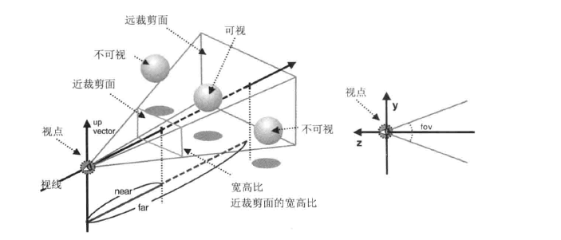

就像盒状可视空间那样, 透视投影可视空间也有视点, 视线, 近裁剪面和远裁剪面.

不论是透视投影可视空间还是盒状可视空间, 我们都用投影矩阵来表示它. 但是定义矩阵的参数不同. Matrix4 对象的`setPerspective()`方法可以用来定义透视投影可视空间.

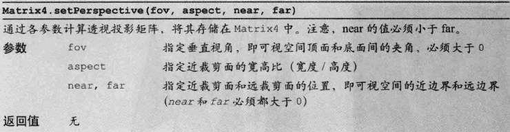

定义了透视投影可视空间的矩阵被称为透视投影矩阵.

注意, 第 2 各参数 aspect 是近裁剪面的宽高比, 而不是水平视角.

来看一个示例程序:

```js
// PerspectiveView.js (c) 2012 matsuda
// Vertex shader program
var VSHADER_SOURCE =
  'attribute vec4 a_Position;\n' +
  'attribute vec4 a_Color;\n' +
  'uniform mat4 u_ViewMatrix;\n' +
  'uniform mat4 u_ProjMatrix;\n' +
  'varying vec4 v_Color;\n' +
  'void main() {\n' +
  '  gl_Position = u_ProjMatrix * u_ViewMatrix * a_Position;\n' +
  '  v_Color = a_Color;\n' +
  '}\n';

...

function main() {
  ...

  // 设置顶点坐标和颜色
  var n = initVertexBuffers(gl);
  ...

  // get the storage locations of u_ViewMatrix and u_ProjMatrix
  var u_ViewMatrix = gl.getUniformLocation(gl.program, 'u_ViewMatrix');
  var u_ProjMatrix = gl.getUniformLocation(gl.program, 'u_ProjMatrix');
  ...

  var viewMatrix = new Matrix4();　//视图矩阵
  var projMatrix = new Matrix4();  //投影矩阵

  // 计算/设置 视图矩阵和投影矩阵
  viewMatrix.setLookAt(0, 0, 5, 0, 0, -100, 0, 1, 0);
  projMatrix.setPerspective(30, canvas.width/canvas.height, 1, 100);
  // Pass the view and projection matrix to u_ViewMatrix, u_ProjMatrix
  gl.uniformMatrix4fv(u_ViewMatrix, false, viewMatrix.elements);
  gl.uniformMatrix4fv(u_ProjMatrix, false, projMatrix.elements);

  // Clear <canvas>
  gl.clear(gl.COLOR_BUFFER_BIT);

  // Draw the triangles
  gl.drawArrays(gl.TRIANGLES, 0, n);
}

function initVertexBuffers(gl) {
  var verticesColors = new Float32Array([
    // Three triangles on the right side
    0.75,  1.0,  -4.0,  0.4,  1.0,  0.4, // The back green one
    0.25, -1.0,  -4.0,  0.4,  1.0,  0.4,
    1.25, -1.0,  -4.0,  1.0,  0.4,  0.4,

    0.75,  1.0,  -2.0,  1.0,  1.0,  0.4, // The middle yellow one
    0.25, -1.0,  -2.0,  1.0,  1.0,  0.4,
    1.25, -1.0,  -2.0,  1.0,  0.4,  0.4,

    0.75,  1.0,   0.0,  0.4,  0.4,  1.0,  // The front blue one
    0.25, -1.0,   0.0,  0.4,  0.4,  1.0,
    1.25, -1.0,   0.0,  1.0,  0.4,  0.4,

    // Three triangles on the left side
   -0.75,  1.0,  -4.0,  0.4,  1.0,  0.4, // The back green one
   -1.25, -1.0,  -4.0,  0.4,  1.0,  0.4,
   -0.25, -1.0,  -4.0,  1.0,  0.4,  0.4,

   -0.75,  1.0,  -2.0,  1.0,  1.0,  0.4, // The middle yellow one
   -1.25, -1.0,  -2.0,  1.0,  1.0,  0.4,
   -0.25, -1.0,  -2.0,  1.0,  0.4,  0.4,

   -0.75,  1.0,   0.0,  0.4,  0.4,  1.0,  // The front blue one
   -1.25, -1.0,   0.0,  0.4,  0.4,  1.0,
   -0.25, -1.0,   0.0,  1.0,  0.4,  0.4,
  ]);
  var n = 18; // Three vertices per triangle * 6

  ...

  return n;
}
```

运行界面如下:

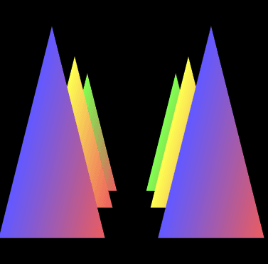

可视空间示意:

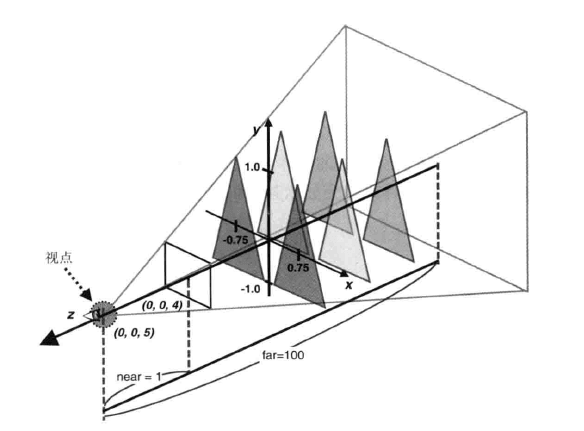

### 投影矩阵的作用

先来看透视投影矩阵. 运用透视投影矩阵主要进行了两次变换:

1. 根据三角形和视点的距离, 按比例对三角形进行了缩小变换.
2. 对三角形进行平移变换, 使其贴近实现.

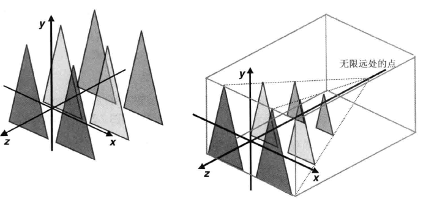

这表示. 可视空间的规范可以用一系列基本变换来定义. Matrix4 对象的`setPerspective`方法根据可视空间参数, 计算对应的变换矩阵.(计算方法见附录).

换一个角度看, 透视投影矩阵实际上将金字塔状的可视空间变换为了盒状的可视空间, 这个盒状的可视空间又称 **规范立方体(Canonial View Volume)** .

### 正确的处理对象的前后关系

默认情况下, WebGL 为了加速绘图操作, 是按照顶点在缓冲区中的顺序来处理它们的. 前面所有的示例程序都是先定义远的物体, 后定义近的物体,从而产生正确的效果.

WebGL 会把后绘制的图形覆盖先绘制的图形.

为了解决这个问题, WEbGL 提供了 **隐藏面消除(hidden surface remoal)**. 这个功能是帮助我们消除那些被遮挡的表面. 这个功能内嵌在 WebGL 中, 只需要简单的开启它就好:

1. 开启隐藏面消除功能:

```js
gl.enable(gl.DEPTH_TEST);
```

2. 在绘制之前, 清除深度缓冲区:

```js
gl.clear(gl.DEPTH_BUFFER_BIT);
```

这里使用了`gl.enable`函数, 它实际上可以开启 WebGL 中的很多功能, 规范如下:

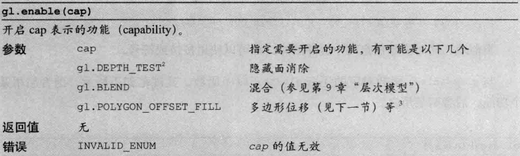

第二步方法中清除的深度缓冲区(depth buffer)是一个中将对象, 其作用就是帮助 WebGL 进行隐藏面消除. WebGL 在颜色缓冲区中绘制几个图形, 绘制完成后将颜色缓冲区显示到`<canvas>`上. 如果要将隐藏面消除, 那就必须知道每个几何图形的深度信息, 而深度缓冲区就是用来存储深度信息的. 由于深度方向通常是 Z 轴方向, 所以我们有时候也称它 Z 缓冲区.

绘制任意帧前, 都必须清楚深度缓冲区, 以消除绘制上一阵时留下的痕迹, 如若不然, 会报错.

当然, 颜色缓冲区也要清除:

```js
gl.clear(gl.COLOR_BUFFER_BIT | gl.DEPTH_BUFFER_BIT);
```

清除任意两个缓冲区, 都可以使用按位或.

与`gl.enable`对应的, `gl.disable`函数用来禁用功能, 规范如下:

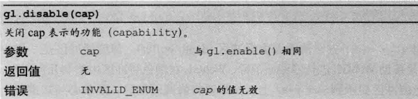

示例程序的关键代码如下:

```js
...

function main() {
  ...

  // Specify the color for clearing <canvas>
  gl.clearColor(0.0, 0.0, 0.0, 1.0);
  // Enable depth test
  gl.enable(gl.DEPTH_TEST);
  ...
  gl.clear(gl.COLOR_BUFFER_BIT | gl.DEPTH_BUFFER_BIT);
  ...
  gl.drawArrays(gl.TRIANGLES, 0, n);   // Draw the triangles
  ...
  gl.drawArrays(gl.TRIANGLES, 0, n);   // Draw the triangles
}

function initVertexBuffers(gl) {
  var verticesColors = new Float32Array([
    // Vertex coordinates and color
     0.0,  1.0,   0.0,  0.4,  0.4,  1.0,  // The front blue one
    -0.5, -1.0,   0.0,  0.4,  0.4,  1.0,
     0.5, -1.0,   0.0,  1.0,  0.4,  0.4,

     0.0,  1.0,  -2.0,  1.0,  1.0,  0.4, // The middle yellow one
    -0.5, -1.0,  -2.0,  1.0,  1.0,  0.4,
     0.5, -1.0,  -2.0,  1.0,  0.4,  0.4,

     0.0,  1.0,  -4.0,  0.4,  1.0,  0.4, // The back green one
    -0.5, -1.0,  -4.0,  0.4,  1.0,  0.4,
     0.5, -1.0,  -4.0,  1.0,  0.4,  0.4,
  ]);
  var n = 9;
...

  return n;
}
```

#### 深度冲突

隐藏面消除是 WebGL 中复杂而强大的特性. 但是当几何图形或物体的两个表面极为接近是,就会出现新的问题使得表面看上去斑斑驳驳. 这种现象被称为 **深度冲突(Z fighting)**.

WebGL 提供一种被称为 **多边形偏移(polygon offset)** 的机制来解决这个问题. 该机制将自动在 Z 值上加上一个偏移量, 偏移量的值由物体表面相对于观察者视线的角度来确定. 启用该机制需要两行代码:

1. 启用多边形偏移:

```js
gl.enable(gl.POLYGON_OFFSET_FILL);
```

2. 在绘制之前指定用来计算偏移量的参数:

```js
gl.polygonOffset(1.0, 1.0);
```

该函数的规范如下:

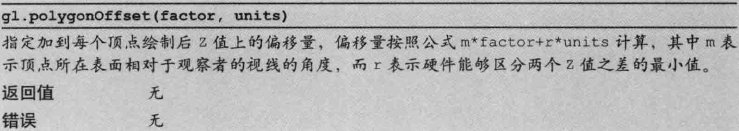

### 立方体

由我们一直的绘制函数用来绘制一个立方体都比较麻烦. WebGL 提供了一种完美的方案: `gl.drawElements()`. 使用该函数替代`gl.drawArrays()`进行绘制, 只需要模型的每一个顶点的坐标.

先看看这个函数的规范:

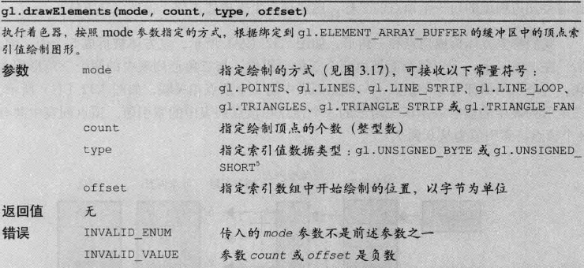

示例程序代码如下:

```js
//顶点着色器
var VSHADER_SOURCE =
    'attribute vec4 a_Position;\n' +
    'attribute vec4 a_Color;\n' +
    'uniform mat4 u_MvpMatrix;\n' +
    'varying vec4 v_Color;\n' +
    'void main() {\n' +
    '  gl_Position = u_MvpMatrix * a_Position;\n' +
    '  v_Color = a_Color;\n' +
    '}\n';

// 片元着色器
var FSHADER_SOURCE =
    '#ifdef GL_ES\n' +
    'precision mediump float;\n' +
    '#endif\n' +
    'varying vec4 v_Color;\n' +
    'void main() {\n' +
    '  gl_FragColor = v_Color;\n' +
    '}\n';

function main() {
    var canvas = document.getElementById('webgl');

    var gl = getWebGLContext(canvas);
    if (!gl) {
        console.log('Failed to get the rendering context for WebGL');
        return;
    }

    if (!initShaders(gl, VSHADER_SOURCE, FSHADER_SOURCE)) {
        console.log('Failed to intialize shaders.');
        return;
    }

    var n = initVertexBuffers(gl);
    if (n < 0) {
        console.log('Failed to set the vertex information');
        return;
    }

    //开启深度检测
    gl.clearColor(0.0, 0.0, 0.0, 1.0);
    gl.enable(gl.DEPTH_TEST);

    var u_MvpMatrix = gl.getUniformLocation(gl.program, 'u_MvpMatrix');
    if (!u_MvpMatrix) {
        console.log('Failed to get the storage location of u_MvpMatrix');
        return;
    }

    // 设置观察点和透视投影
    var mvpMatrix = new Matrix4();
    mvpMatrix.setPerspective(30, 1, 1, 100);
    mvpMatrix.lookAt(3, 3, 7, 0, 0, 0, 0, 1, 0);

    // Pass the model view projection matrix to u_MvpMatrix
    gl.uniformMatrix4fv(u_MvpMatrix, false, mvpMatrix.elements);

    // Clear color and depth buffer
    gl.clear(gl.COLOR_BUFFER_BIT | gl.DEPTH_BUFFER_BIT);

    // Draw the cube
    gl.drawElements(gl.TRIANGLES, n, gl.UNSIGNED_BYTE, 0);
}

function initVertexBuffers(gl) {
    // Create a cube
    //    v6----- v5
    //   /|      /|
    //  v1------v0|
    //  | |     | |
    //  | |v7---|-|v4
    //  |/      |/
    //  v2------v3
    var verticesColors = new Float32Array([
        // Vertex coordinates and color
        1.0,
        1.0,
        1.0,
        1.0,
        1.0,
        1.0, // v0 White
        -1.0,
        1.0,
        1.0,
        1.0,
        0.0,
        1.0, // v1 Magenta
        -1.0,
        -1.0,
        1.0,
        1.0,
        0.0,
        0.0, // v2 Red
        1.0,
        -1.0,
        1.0,
        1.0,
        1.0,
        0.0, // v3 Yellow
        1.0,
        -1.0,
        -1.0,
        0.0,
        1.0,
        0.0, // v4 Green
        1.0,
        1.0,
        -1.0,
        0.0,
        1.0,
        1.0, // v5 Cyan
        -1.0,
        1.0,
        -1.0,
        0.0,
        0.0,
        1.0, // v6 Blue
        -1.0,
        -1.0,
        -1.0,
        0.0,
        0.0,
        0.0 // v7 Black
    ]);

    // Indices of the vertices
    var indices = new Uint8Array([
        0,
        1,
        2,
        0,
        2,
        3, // front
        0,
        3,
        4,
        0,
        4,
        5, // right
        0,
        5,
        6,
        0,
        6,
        1, // up
        1,
        6,
        7,
        1,
        7,
        2, // left
        7,
        4,
        3,
        7,
        3,
        2, // down
        4,
        7,
        6,
        4,
        6,
        5 // back
    ]);

    // Create a buffer object
    var vertexColorBuffer = gl.createBuffer();
    var indexBuffer = gl.createBuffer();
    if (!vertexColorBuffer || !indexBuffer) {
        return -1;
    }

    // Write the vertex coordinates and color to the buffer object
    gl.bindBuffer(gl.ARRAY_BUFFER, vertexColorBuffer);
    gl.bufferData(gl.ARRAY_BUFFER, verticesColors, gl.STATIC_DRAW);

    var FSIZE = verticesColors.BYTES_PER_ELEMENT;
    // Assign the buffer object to a_Position and enable the assignment
    var a_Position = gl.getAttribLocation(gl.program, 'a_Position');
    if (a_Position < 0) {
        console.log('Failed to get the storage location of a_Position');
        return -1;
    }
    gl.vertexAttribPointer(a_Position, 3, gl.FLOAT, false, FSIZE * 6, 0);
    gl.enableVertexAttribArray(a_Position);
    // Assign the buffer object to a_Color and enable the assignment
    var a_Color = gl.getAttribLocation(gl.program, 'a_Color');
    if (a_Color < 0) {
        console.log('Failed to get the storage location of a_Color');
        return -1;
    }
    gl.vertexAttribPointer(a_Color, 3, gl.FLOAT, false, FSIZE * 6, FSIZE * 3);
    gl.enableVertexAttribArray(a_Color);

    // Write the indices to the buffer object
    gl.bindBuffer(gl.ELEMENT_ARRAY_BUFFER, indexBuffer);
    gl.bufferData(gl.ELEMENT_ARRAY_BUFFER, indices, gl.STATIC_DRAW);

    return indices.length;
}
```

本例使用了透视投影变换, 顶点着色器对顶点坐标进行了简单的变换, 片元着色器接受 varying 变量并赋值给`gl_FragColor`, 对片元进行着色.

#### 向缓冲区中写入顶点的坐标, 颜色和索引.

本例的`initVertexBuffers()`函数通过缓冲区对象`verticesColors`向顶点着色器中的`attribute`变量传顶点坐标和颜色信息, 这一点与之前无异. 但是本例不再按照`verticesColors`中的顶点顺序来进行绘制, 所以必须额外关注每个顶点的索引值. 我们通过索引值来指定绘制的顺序.

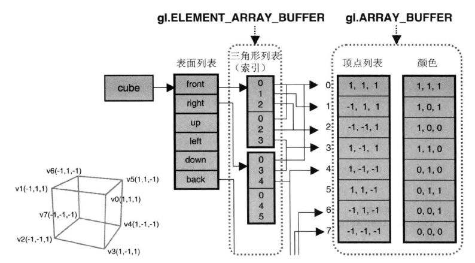

绑定缓冲区, 以及向缓冲区写入索引数据的过程与之前的代码类似. 改变的一点是绑定的目标由`gl.ARRAY_BUFFER`变成了`gl.ELEMENT_ARRAY_BUFFER`, 这实际上告诉 WebGL, 该缓冲区中的内容是顶点的索引值数据.

WebGL 内部如下:

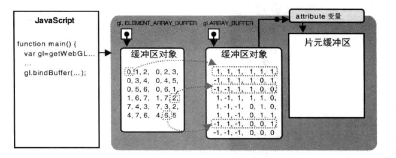

#### 立方体的颜色.

我们知道顶点着色器进行的是逐顶点的计算, 接受的是逐顶点的信心. 这说明, 若果你想要指定表面的颜色, 你也需要将颜色定义为逐顶点的信息, 并传给顶点着色器. 举个栗子, 你想要把立方体的前表面涂成蓝色, 前表面由顶点 v0,1,2,3 组成, 那么你就需要将这 4 个顶点都指定为蓝色.

但是你会发现, 顶点 v0 不仅在钱表面上, 也在右表面和上表面上, 如果你将 v0 指定为蓝色, 那么它在另外另个表面上也会是蓝色. 所以我们需要创建多个相同坐标的顶点.

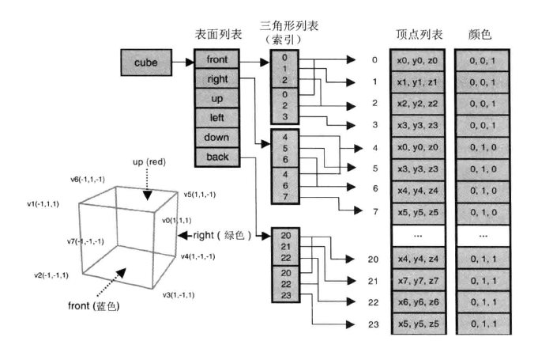

此时的三角形列表, 也就是顶点索引值序列, 对每个面都指向一组不同的顶点, 不在有前表面和上表面共享一个顶点的情况, 这样一来就可以实现前面的效果, 为每个表面涂上不同的颜色了.

```js
...
function main() {
  ...
  var n = initVertexBuffers(gl);
  ...
  gl.drawElements(gl.TRIANGLES, n, gl.UNSIGNED_BYTE, 0);
}

function initVertexBuffers(gl) {
  // Create a cube
  //    v6----- v5
  //   /|      /|
  //  v1------v0|
  //  | |     | |
  //  | |v7---|-|v4
  //  |/      |/
  //  v2------v3

  var vertices = new Float32Array([   // Vertex coordinates
     1.0, 1.0, 1.0,  -1.0, 1.0, 1.0,  -1.0,-1.0, 1.0,   1.0,-1.0, 1.0,  // v0-v1-v2-v3 front
   ...
     1.0,-1.0,-1.0,  -1.0,-1.0,-1.0,  -1.0, 1.0,-1.0,   1.0, 1.0,-1.0   // v4-v7-v6-v5 back
  ]);

  var colors = new Float32Array([     // Colors
    0.4, 0.4, 1.0,  0.4, 0.4, 1.0,  0.4, 0.4, 1.0,  0.4, 0.4, 1.0,  ...
    0.4, 1.0, 1.0,  0.4, 1.0, 1.0,  0.4, 1.0, 1.0,  0.4, 1.0, 1.0   // v4-v7-v6-v5 back
  ]);

  var indices = new Uint8Array([       // Indices of the vertices
     0, 1, 2,   0, 2, 3,    // front
     4, 5, 6,   4, 6, 7,    // right
     8, 9,10,   8,10,11,    // up
    12,13,14,  12,14,15,    // left
    16,17,18,  16,18,19,    // down
    20,21,22,  20,22,23     // back
  ]);

  // Create a buffer object
  var indexBuffer = gl.createBuffer();
  if (!indexBuffer)
    return -1;

  // Write the vertex coordinates and color to the buffer object
  if (!initArrayBuffer(gl, vertices, 3, gl.FLOAT, 'a_Position'))
    return -1;

  if (!initArrayBuffer(gl, colors, 3, gl.FLOAT, 'a_Color'))
    return -1;

  // Write the indices to the buffer object
  gl.bindBuffer(gl.ELEMENT_ARRAY_BUFFER, indexBuffer);
  gl.bufferData(gl.ELEMENT_ARRAY_BUFFER, indices, gl.STATIC_DRAW);

  return indices.length;
}

function initArrayBuffer(gl, data, num, type, attribute) {
  var buffer = gl.createBuffer();   // Create a buffer object
  ...
  // Write date into the buffer object
  gl.bindBuffer(gl.ARRAY_BUFFER, buffer);
  gl.bufferData(gl.ARRAY_BUFFER, data, gl.STATIC_DRAW);
  // Assign the buffer object to the attribute variable
  var a_attribute = gl.getAttribLocation(gl.program, attribute);
 ...
  gl.vertexAttribPointer(a_attribute, num, type, false, 0, 0);
  // Enable the assignment of the buffer object to the attribute variable
  gl.enableVertexAttribArray(a_attribute);

  return true;
}
```

-   在前文的 HelloCube.js 中, 顶点的坐标和颜色数据存储在同一个缓冲区中. 虽然有着种种好处, 但这样做略显笨重, 本例中我们将顶点的坐标和颜色分别存储在不同的两个缓冲区中.
-   顶点数组, 颜色数组和索引数组按照图中的配置进行了修改
-   为了程序结构紧凑, 定义了函数`initArrayBuffer()`, 封装了缓冲区对象的创建, 绑定, 数据写入和开启等操作
