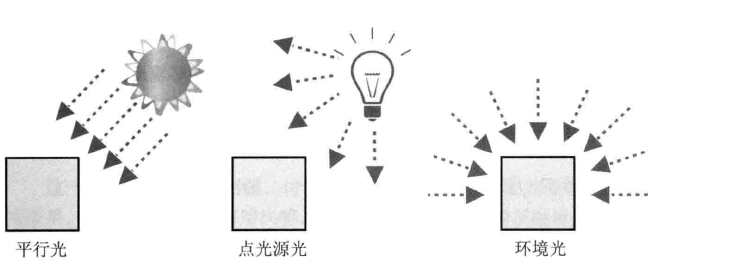
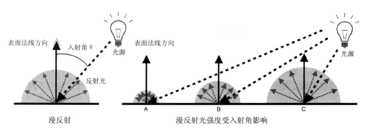
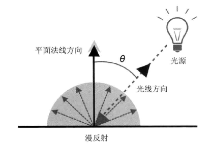
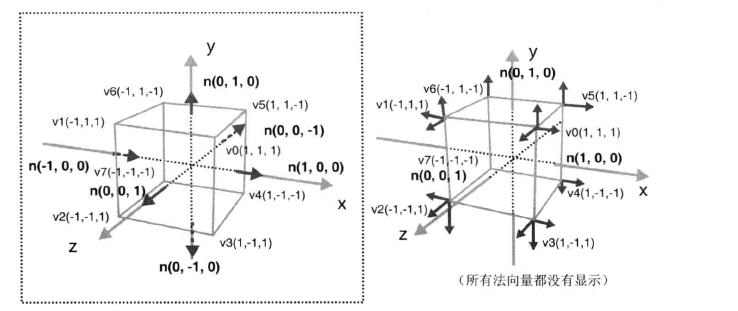
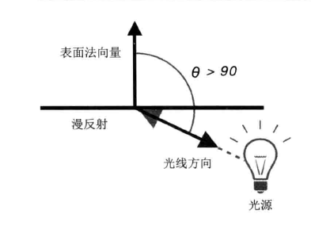
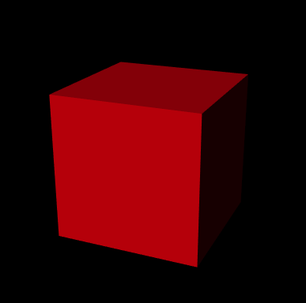
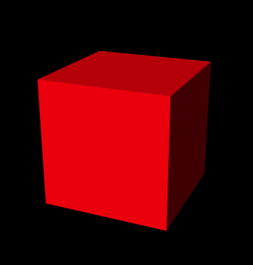
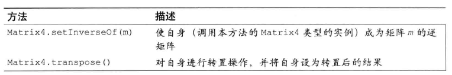
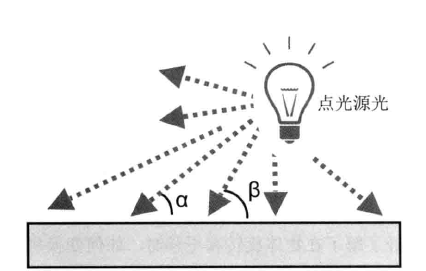

> WebGL入门指南读书笔记- 第八章: 光照

<!-- more -->

## 光照

主要内容:

-   明暗, 阴影, 不同类型的光: 点光源, 平行光, 散射光
-   物体表面反射光线的方式: 漫反射和环境反射
-   编写代码实现光照效果

### 光照原理

在现实中, 当光线照射到物体上, 有两个现象:

-   根据光源和光线方向, 物体表面的明暗程度发生变化
-   根据光源和光线方向, 物体向地面投下了影子

在三维图形学中术语 **着色(shading)** 的真正含义就是, 根据光照条件重建 "物体各表面明暗不一的效果"的过程. 物体向地面投下影子的现象, 又被称为 **阴影(shadowing)** , 本节只讨论前者.

讨论着色过程之前, 有两件事需要考虑:

-   发出光线的光源的类型
-   物体表面如何反射光线

### 光源类型

当物体背光线照射时, 必然存在发出光线的光源. 自然界的光源有 **平行光**, **点光源光**. 我们用 **环境光** 来模拟自然界的非直射光. 这就是三种基本类型的光. 至于其他例如 **聚光灯光** 等特殊的光源, 不再讨论范围内.



### 反射类型

物体表面反射光线的方式有两种: **漫反射(diffuse reflection)** 和 **环境反射(enviroment/ambient reflection)**. 本节的终点是如何根据入射光信息(入射光的方向和颜色)以及物体表面特性(表面固有颜色--基底色信息和反射特性)来计算出反射光的颜色.

#### 漫反射

漫反射是针对平行光或点光源而言的, 漫反射的反射光在各个方向上是均匀的, 如下图:



如果物体表面像镜子一样光滑, 那么光鲜就会以特定的角度反射出去. 否则, 就会上图一样发生漫反射.

漫反射中反射光的颜色取决于 入射光的颜色, 表面的基底色, 入射光与表面形成的入射角.

我们将入射角定义为入射光与表面的法线形成的夹角, 用 `θ` 表示, 那么漫反射光的颜色可以这样计算:

$$
<漫反射光颜色> = <入射光颜色> x <表面基底色> x cosθ
$$

入射光颜色指的是点光源或平行光的颜色, 乘法操作是在颜色矢量上逐分量(RGB)进行的, 因为漫反射光在各个方向上都是"均匀"的, 所以从任何角度上看上去其强度都相等.

#### 环境反射

环境反射是针对环境光而言的. 在环境反射中, 反射光的方向可以认为就是入射光的反方向. 由于环境光照射物体的方式就是各方向均匀, 强度相等的, 所以反射光也是个方向均匀的.

$$
<环境反射光颜色> = <入射光颜色> x <表面基底色>
$$

漫反射和混进反射加起来, 才会得到物体最终被观察到的颜色.

$$
<表面的反射光颜色> = <漫反射光颜色> + <环境反射光颜色>
$$

### 平行光下的漫反射

GLSLES 内置了点积运算函数. 我们用`·`来表示点积运算:

$$
<漫反射颜色>=<入射光颜色> x <表面基底色> x (<光线方向>·<法线方向>)
$$

这里有两点需要注意

-   光线方向矢量和表面法线矢量的长度必须为 1, 否则反射光的颜色就会过暗或过亮. 将一个矢量的长度调整为 1, 通视保持方向不变的过程称为 **归一化(normalization)**. GLSL EL 提供了内置的归一化函数.
-   这里的"光线方向", 实际上是入射方向的反方向, 即从入射点指向光源方向,如下图所示:



#### 法线: 表面的朝向

物体表面的朝向, 即垂直于表面的方向, 又称法线或法向量. 一个表面具有两个法向量. 因为每个表面具有"正面"和"背面".

在三维图形学中, 表面的正面和背面取决于绘制表面时的顶点顺序. 顺时针为正面. 逆时针为背面.



一旦计算好每个平面的法向量, 接下来就是将数据传给着色器程序. 以前的程序吧颜色作为"逐顶点数据"存储在缓冲区中, 并传给着色器. 对法向量数据也可以这样做. 如图所示, 每个顶点对应 3 个法向量, 就像之前每个顶点对应 3 个颜色值一样.

下面来看一个示例程序:

```js
// LightedCube.js
// 顶点着色器
var VSHADER_SOURCE =
  'attribute vec4 a_Position;\n' +
  'attribute vec4 a_Color;\n' +
  'attribute vec4 a_Normal;\n' +        //法向量
  'uniform mat4 u_MvpMatrix;\n' +
  'uniform vec3 u_LightColor;\n' +     // 光线颜色
  'uniform vec3 u_LightDirection;\n' + // 归一化的世界坐标
  'varying vec4 v_Color;\n' +
  'void main() {\n' +
  '  gl_Position = u_MvpMatrix * a_Position ;\n' +
  // 对法向量进行归一化
  '  vec3 normal = normalize(a_Normal.xyz);\n' +
  //计算光线方向和法向量的点击
  '  float nDotL = max(dot(u_LightDirection, normal), 0.0);\n' +
  // 计算漫反射光的颜色
  '  vec3 diffuse = u_LightColor * a_Color.rgb * nDotL;\n' +
  '  v_Color = vec4(diffuse, a_Color.a);\n' +
  '}\n';
...

function main() {
...

  // Initialize shaders
  if (!initShaders(gl, VSHADER_SOURCE, FSHADER_SOURCE)) {
    console.log('Failed to intialize shaders.');
    return;
  }

  // 设置顶点坐标, 颜色和法向量
  var n = initVertexBuffers(gl);
...

  // Get the storage locations of uniform variables and so on
  var u_MvpMatrix = gl.getUniformLocation(gl.program, 'u_MvpMatrix');
  var u_LightColor = gl.getUniformLocation(gl.program, 'u_LightColor');
  var u_LightDirection = gl.getUniformLocation(gl.program, 'u_LightDirection');
...

  // 设置光线颜色为白色
  gl.uniform3f(u_LightColor, 1.0, 1.0, 1.0);
  // 设置光线方向
  var lightDirection = new Vector3([0.5, 3.0, 4.0]);
  lightDirection.normalize();     // 归一化
  gl.uniform3fv(u_LightDirection, lightDirection.elements);

  // 计算模型视图投影矩阵
  var mvpMatrix = new Matrix4();    // Model view projection matrix
  mvpMatrix.setPerspective(30, canvas.width/canvas.height, 1, 100);
  mvpMatrix.lookAt(3, 3, 7, 0, 0, 0, 0, 1, 0);
  // 将模型视图投影矩阵传给u_MvpMatrix变量
  gl.uniformMatrix4fv(u_MvpMatrix, false, mvpMatrix.elements);
...
}

function initVertexBuffers(gl) {
  // Create a cube
  //    v6----- v5
  //   /|      /|
  //  v1------v0|
  //  | |     | |
  //  | |v7---|-|v4
  //  |/      |/
  //  v2------v3
  var vertices = new Float32Array([   // 顶点坐标
     1.0, 1.0, 1.0,  -1.0, 1.0, 1.0,  -1.0,-1.0, 1.0,   1.0,-1.0, 1.0, // v0-v1-v2-v3 front
     1.0, 1.0, 1.0,   1.0,-1.0, 1.0,   1.0,-1.0,-1.0,   1.0, 1.0,-1.0, // v0-v3-v4-v5 right
     1.0, 1.0, 1.0,   1.0, 1.0,-1.0,  -1.0, 1.0,-1.0,  -1.0, 1.0, 1.0, // v0-v5-v6-v1 up
    -1.0, 1.0, 1.0,  -1.0, 1.0,-1.0,  -1.0,-1.0,-1.0,  -1.0,-1.0, 1.0, // v1-v6-v7-v2 left
    -1.0,-1.0,-1.0,   1.0,-1.0,-1.0,   1.0,-1.0, 1.0,  -1.0,-1.0, 1.0, // v7-v4-v3-v2 down
     1.0,-1.0,-1.0,  -1.0,-1.0,-1.0,  -1.0, 1.0,-1.0,   1.0, 1.0,-1.0  // v4-v7-v6-v5 back
  ]);

...

  var normals = new Float32Array([    // 法向量
    0.0, 0.0, 1.0,   0.0, 0.0, 1.0,   0.0, 0.0, 1.0,   0.0, 0.0, 1.0,  // v0-v1-v2-v3 front
    1.0, 0.0, 0.0,   1.0, 0.0, 0.0,   1.0, 0.0, 0.0,   1.0, 0.0, 0.0,  // v0-v3-v4-v5 right
    0.0, 1.0, 0.0,   0.0, 1.0, 0.0,   0.0, 1.0, 0.0,   0.0, 1.0, 0.0,  // v0-v5-v6-v1 up
   -1.0, 0.0, 0.0,  -1.0, 0.0, 0.0,  -1.0, 0.0, 0.0,  -1.0, 0.0, 0.0,  // v1-v6-v7-v2 left
    0.0,-1.0, 0.0,   0.0,-1.0, 0.0,   0.0,-1.0, 0.0,   0.0,-1.0, 0.0,  // v7-v4-v3-v2 down
    0.0, 0.0,-1.0,   0.0, 0.0,-1.0,   0.0, 0.0,-1.0,   0.0, 0.0,-1.0   // v4-v7-v6-v5 back
  ]);

...
  // Write the vertex property to buffers (coordinates, colors and normals)
  if (!initArrayBuffer(gl, 'a_Position', vertices, 3, gl.FLOAT)) return -1;
  if (!initArrayBuffer(gl, 'a_Color', colors, 3, gl.FLOAT)) return -1;
  if (!initArrayBuffer(gl, 'a_Normal', normals, 3, gl.FLOAT)) return -1;

...

  return indices.length;
}
...
```

我们在顶点着色器中实现了计算公式

#### 顶点着色器

顶点着色器中`a_Color`变量表示表面基底色, `a_Normal`变量表示表面法线方向, `u_LightColor`变量表示入射光颜色, `u_LightDirection`变量表示入射光方向. 注意, 入射光方向`u_LightDirection`是在世界坐标系下的, 而且在转入着色器之前已经在 js 中归一化了, 这样就能避免在顶点着色器每次执行的时候都对它进行归一化.

有了这些信息, 就可以在顶点着色器中进行计算了. `a_Normal`变量是 vec4 类型的, 使用前三个分量 x,y,z 表示法线方向, 所以我们将这三个分量提取出来进行归一化, 对 vec3 类型的变量进行归一化就不必这样. 本例使用 vec4 类型的`a_Normal`变量是为了方便对下一个示例程序进行扩展. GLSL ES 提供了内置函数`normalize()`对矢量常函数进行归一化. 归一化的结果赋给 vec3 类型的 normal 变量供之后使用.

```GLSL
float nDotL = max(dot(u_LightDirection, normal), 0.0);
```

光线方向存储在`u_lightDirection`变量中, 而且已经被归一化了, 可以直接使用. 法线方向存储在之前进行归一化后的结果 normal 变量中. 使用 GLSL ES 提供的内置函数`dot()`计算两个矢量的点击`<光线方向>·<法线方向>`, 该函数接受两个矢量作为参数, 返回它们的点积, 如果点积大于 0, 那就将点积赋值给`nDotL`, 如果小于 0, 就直接赋值 0. 因为点积值小于 0 意味着 cosθ 大于 90 度.说明光线照射在表面的背面上, 因此赋值 0.



所有的准备工作这里就完成了, a_Color 变量就是顶点的颜色. 被从 vec4 对象转换成了 vec3 对象, 因为其第四个分量(透明度)与计算的式子无关.

实际上, 物体表面的透明度确是会影响物体的外观. 但这里的光照计算较为复杂, 我们暂时认为物体是不透明的, 这样就计算出了漫反射光的颜色`diffuse`:

```GLSL
vec3 diffuse = u_LightColor * a_Color.rgb * nDotL;
v_Color = vec4(diffuse, a_Color.a);
```

然后, 将`diffuse`的值赋给`v_Color`并补上第 4 分量.

顶点着色器运行的结果就是计算出了`v_Color`变量. 下面看一下 js 如何将数据传给顶点着色器的.

#### JS 程序流程

js 将光的颜色`u_LightColor`和方向`u_LightDirection`传给顶点着色器. 首先用`gl.uniform3f`函数将`u_LightColor`赋值为(1.0,1.0,1.0),表示入射光是白光.

```js
gl.uniform3f(u_LightColor, 1.0, 1.0, 1.0);
```

下一步是设置光线方向, 注意光线方向必须被归一化. cuon-matrix 为 vector3 类型提供了归一化函数,使用方法就像代码所展示的那样. 注意 js 和 GLSL ES 对矢量归一化有不同之处.

归一化之后, 使用`gl.uniform3fv`将其分配给着色器中的`u_LightDirection`变量, 最后再`initVertexBuffers`函数中为每个顶点定义法向量. 法向量数据存储在 normal 数组中, 然后被`initArrayBuffer()`函数传给了顶点着色器的`a_Normal`变量.

示例程序的运行效果如下图所示:



### 环境光下的漫反射

环境光是由墙壁等其他物体反射产生的, 所以环境光的强度通常比较弱, 假设环境光是较弱的白光(0.2,0.2,0.2), 而物体表面是红色的(1.0,0.0,0.0), 根据式子, 有环境光产生的反射光颜色就是暗红色(0.2,0.0,0.0).

下面来看一个示例程序:

```js
// LightedCube_ambient.js (c) 2012 matsuda
// Vertex shader program
var VSHADER_SOURCE =
 ...
  'uniform vec3 u_AmbientLight;\n' +   // Color of an ambient light
  'varying vec4 v_Color;\n' +
  'void main() {\n' +
...
  '  vec3 ambient = u_AmbientLight * a_Color.rgb;\n' +
     // Add the surface colors due to diffuse reflection and ambient reflection
  '  v_Color = vec4(diffuse + ambient, a_Color.a);\n' +
  '}\n';

...

function main() {
 ..
  var u_AmbientLight = gl.getUniformLocation(gl.program, 'u_AmbientLight');
 ...
  gl.uniform3f(u_AmbientLight, 0.2, 0.2, 0.2);

 ...
}

...
```

这个示例程序相比较上一个而言, 只修改了关键的几处代码.

顶点着色器中新增了`u_AmbientLight`变量用来接受环境光的颜色值. 接着根据式子, 使用该变量和表面的基底色`a_Color`计算出反射光的颜色, 将其存储在`ambient`变量中. 这样我们就有环境反射产生的颜色`ambient`和平行光漫反射产生的颜色`diffuse`. 最后根据式子进行计算.

示例程序的效果如下:



### 运动物体的光照效果

立方体旋转时, 每个表面的法向量也会随之变化. 一般规律如下:

-   平移变换不会改变法向量, 因为平移不会改变物体的方向.
-   旋转变换会改变法向量
-   缩放变换对法向量的影响比较复杂, 如果缩放比例在所有轴上都一致的话, 法向量不会变化. 即是物体在某些轴上的缩放比例并不一致, 法向量也并不一定会变化.

#### 魔法矩阵: 逆转置矩阵

对顶点进行变换的矩阵称为模型矩阵. 如何计算变换之后的法向量呢, 只要将变换之前的法向量乘以模型矩阵的 **逆转置矩阵(inverse transpose mastrix)** 即可.

逆转置矩阵, 就是逆矩阵的转置. 逆矩阵的意思是 `M*R=E`, 其中矩阵 R 就是矩阵 M 的逆, 或者说 M 和 R 互逆.

Matrix4 对象提供了便捷的方法来完成上述任务:



假如模型矩阵存储在`modelMatrix`对象中, 下面这段代码将会计算它的逆转置矩阵, 并将其存储在`normalMatrix`对象中:

```js
Matrix4 normalMatrix=new Matrix4();
//计算模型矩阵
...
//根据模型矩阵计算用来变换法向量的矩阵
normalMatrix.setInverseOf(modelMatrix);
normalMatrix.transpose();
```

下面来看看示例程序, 该程序使立方体绕 z 轴顺时针旋转 90 度, 然后沿 y 轴平移 0.9 个单位, 并且处于平行光和环境光的照射下.

```js
// LightedTranslatedRotatedCube.js (c) 2012 matsuda
// Vertex shader program
var VSHADER_SOURCE =
  'attribute vec4 a_Position;\n' +
  'attribute vec4 a_Color;\n' +
  'attribute vec4 a_Normal;\n' +
  'uniform mat4 u_MvpMatrix;\n' +
  'uniform mat4 u_NormalMatrix;\n' +   //用来变换法向量的矩阵
  'uniform vec3 u_LightColor;\n' +     //光的颜色
  'uniform vec3 u_LightDirection;\n' + //归一化的世界坐标
  'uniform vec3 u_AmbientLight;\n' +   // 环境光颜色
  'varying vec4 v_Color;\n' +
  'void main() {\n' +
  '  gl_Position = u_MvpMatrix * a_Position;\n' +
     // 计算变换后的法向量并归一化
  '  vec3 normal = normalize(vec3(u_NormalMatrix * a_Normal));\n' +
     // 计算光线方向和法向量的点击
  '  float nDotL = max(dot(u_LightDirection, normal), 0.0);\n' +
     //计算漫反射光的颜色
  '  vec3 diffuse = u_LightColor * a_Color.rgb * nDotL;\n' +
     // 计算环境光产生的反射光的颜色
  '  vec3 ambient = u_AmbientLight * a_Color.rgb;\n' +
     // 将以上两个相加作为最终的颜色
  '  v_Color = vec4(diffuse + ambient, a_Color.a);\n' +
  '}\n';

...

function main() {
  ...

  // 获取unifrom等变量的地址
  var u_MvpMatrix = gl.getUniformLocation(gl.program, 'u_MvpMatrix');
  var u_NormalMatrix = gl.getUniformLocation(gl.program, 'u_NormalMatrix');
...

  // 计算模型矩阵
  modelMatrix.setTranslate(0, 0.9, 0); // 沿Y轴平移
  modelMatrix.rotate(90, 0, 0, 1);     // 绕Z轴旋转
  // 计算模型视图投影矩阵
  mvpMatrix.setPerspective(30, canvas.width/canvas.height, 1, 100);
  mvpMatrix.lookAt(3, 3, 7, 0, 0, 0, 0, 1, 0);
  mvpMatrix.multiply(modelMatrix);
  // 将模型视图投影矩阵传给u_MvpMatrix变量
  gl.uniformMatrix4fv(u_MvpMatrix, false, mvpMatrix.elements);

  //根据模型矩阵计算用来变换法向量的矩阵
  normalMatrix.setInverseOf(modelMatrix);
  normalMatrix.transpose();
  //将用来变换法向量的矩阵传给u_NormalMatrix
  gl.uniformMatrix4fv(u_NormalMatrix, false, normalMatrix.elements);
...
}
```

顶点着色器的流程与前面的程序类型, 区别在于, 本例根据前述的规则先用模型矩阵的逆转置矩阵对`a_Normal`进行了变换, 再赋值给`normal`, 而不是直接赋值.

### 点光源光

与平行光相比, 点光源发出的光, 在三维空间的不同位置上其方向也不同. 所以对点光源光下的物体进行着色时需要在每个入射点计算点光源光在该处的方向.



下面来看一个示例程序:

```js
// PointLightedCube.js (c) 2012 matsuda
// 顶点着色器程序
var VSHADER_SOURCE =
  'attribute vec4 a_Position;\n' +
  ...
  'uniform mat4 u_ModelMatrix;\n' +   // 模型矩阵
  'uniform mat4 u_NormalMatrix;\n' +  // 用来变换法向量的矩阵
  'uniform vec3 u_LightColor;\n' +    // 光的颜色
  'uniform vec3 u_LightPosition;\n' + // 光源位置(世界坐标系)
  'uniform vec3 u_AmbientLight;\n' +  // 环境光颜色
  'varying vec4 v_Color;\n' +
  'void main() {\n' +
  '  gl_Position = u_MvpMatrix * a_Position;\n' +
     // 计算比那换后的法向量并归一化
  '  vec3 normal = normalize(vec3(u_NormalMatrix * a_Normal));\n' +
  '  vec4 vertexPosition = u_ModelMatrix * a_Position;\n' +
  '  vec3 lightDirection = normalize(u_LightPosition - vec3(vertexPosition));\n' +
  '  float nDotL = max(dot(lightDirection, normal), 0.0);\n' +
  '  vec3 diffuse = u_LightColor * a_Color.rgb * nDotL;\n' +
  '  vec3 ambient = u_AmbientLight * a_Color.rgb;\n' +
  '  v_Color = vec4(diffuse + ambient, a_Color.a);\n' +
  '}\n';

...

function main() {
 ...

  var u_ModelMatrix = gl.getUniformLocation(gl.program, 'u_ModelMatrix');
 ...
  var u_LightColor = gl.getUniformLocation(gl.program, 'u_LightColor');
  var u_LightPosition = gl.getUniformLocation(gl.program, 'u_LightPosition');
...

  //设置光的颜色
  gl.uniform3f(u_LightColor, 1.0, 1.0, 1.0);
 ...

  var modelMatrix = new Matrix4();  // 模型矩阵
  var mvpMatrix = new Matrix4();
  var normalMatrix = new Matrix4();

  modelMatrix.setRotate(90, 0, 1, 0);
  gl.uniformMatrix4fv(u_ModelMatrix, false, modelMatrix.elements);

  ...
}
```

最关键的变化发生在顶点着色器中. 首先使用模型矩阵变换顶点坐标, 获得顶点在世界坐标系中的坐标(即变换后的坐标), 以便计算点光源光在顶点出的方向. 点光源向四周放射光线, 所以顶点出的光线方向是由点光源坐标减去顶点坐标而得到的矢量. 点光源在世界坐标系中的坐标已经传给了着色器中的`u_LightPosition`, 而前面已经算出了顶点在世界坐标系中的坐标, 这样就计算出了光线方向矢量. 注意归一化. 最后点积运算.

### 更逼真: 逐片元光照.

要在表面的每一点上计算光照产生的颜色, 似乎时刻不可能完成的任务. 但实际上, 我们只需要逐片元的进行计算. 终于使用上片元着色器了.

先来看示例程序:

```js
var VSHADER_SOURCE =
    'attribute vec4 a_Position;\n' +
    //  'attribute vec4 a_Color;\n' + // Defined constant in main()
    'attribute vec4 a_Normal;\n' +
    'uniform mat4 u_MvpMatrix;\n' +
    'uniform mat4 u_ModelMatrix;\n' + // Model matrix
    'uniform mat4 u_NormalMatrix;\n' + // Transformation matrix of the normal
    'varying vec4 v_Color;\n' +
    'varying vec3 v_Normal;\n' +
    'varying vec3 v_Position;\n' +
    'void main() {\n' +
    '  vec4 color = vec4(1.0, 1.0, 1.0, 1.0);\n' + // Sphere color
    '  gl_Position = u_MvpMatrix * a_Position;\n' +
    // Calculate the vertex position in the world coordinate
    '  v_Position = vec3(u_ModelMatrix * a_Position);\n' +
    '  v_Normal = normalize(vec3(u_NormalMatrix * a_Normal));\n' +
    '  v_Color = color;\n' +
    '}\n';

// Fragment shader program
var FSHADER_SOURCE =
    '#ifdef GL_ES\n' +
    'precision mediump float;\n' +
    '#endif\n' +
    'uniform vec3 u_LightColor;\n' + // Light color
    'uniform vec3 u_LightPosition;\n' + // Position of the light source
    'uniform vec3 u_AmbientLight;\n' + // Ambient light color
    'varying vec3 v_Normal;\n' +
    'varying vec3 v_Position;\n' +
    'varying vec4 v_Color;\n' +
    'void main() {\n' +
    // Normalize the normal because it is interpolated and not 1.0 in length any more
    '  vec3 normal = normalize(v_Normal);\n' +
    // Calculate the light direction and make it 1.0 in length
    '  vec3 lightDirection = normalize(u_LightPosition - v_Position);\n' +
    // The dot product of the light direction and the normal
    '  float nDotL = max(dot(lightDirection, normal), 0.0);\n' +
    // Calculate the final color from diffuse reflection and ambient reflection
    '  vec3 diffuse = u_LightColor * v_Color.rgb * nDotL;\n' +
    '  vec3 ambient = u_AmbientLight * v_Color.rgb;\n' +
    '  gl_FragColor = vec4(diffuse + ambient, v_Color.a);\n' +
    '}\n';
```

为了逐片元的计算光照, 你需要知道:

1. 片元在世界坐标系下的坐标
2. 片元出表面的法向量.

可以在顶点着色器中, 将顶点的世界坐标和法向量以 varying 变量的形式传入片元着色器, 片元着色器中的同名变量就已经是内插后的逐片元值了.

顶点着色器使用模型矩阵乘以顶点坐标计算出顶点的世界坐标, 将其赋值非 v_Position 变量. 经过内插过程后, 片元着色器就获得了逐片元的 v_Position 变量, 也就是片元的世界坐标, 类似的, 同样的去获取法向量.

片元着色器计算光照效果的方法和前面相同, 首先对法向量进行归一化,饭后分别计算点光源光和环境光产生的反射光的颜色, 并将两个结果加起来, 赋值给 gl_FragColor, 片元就会显示为这个颜色.

如果场景中有超过一个点光源, 那么就需要在片元着色器中计算每一个点光源(以及环境光)对片元的颜色贡献, 并将他们全部加起来.
