> WebGL入门指南读书笔记- 第九章: 层次模型

<!-- more -->

## 层次模型

主要内容:

-   有多个简单的部件组成的复杂模型
-   为复杂物体(机器人手臂)建立具有层次化结构的三维模型
-   使用模型矩阵, 模拟机器人手臂上的关节运动
-   研究`initShader()`函数的实现, 了解初始化着色器的内部细节

### 多个简单模型组成的复杂模型

#### 层次结构模型

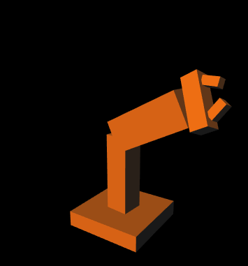

绘制机器人手臂这样一个复杂的模型, 最常用的方法就是按照模型中各个部件的层次顺序, 从高到低注意绘制, 并在每个关节上应用模型矩阵. 比如图中, 肩关节, 肘关节, 腕关节, 指关节都有各自的旋转矩阵.

注意, 三维模型和现实中的人类或者机器人不一样, 它的部件并没有真正连接在一起, 如果直接转动上臂, 那么肘部以下的部分, 包括前壁, 手掌和手指, 只会留在原地, 这样手臂就断开了. 所以, 当上臂绕肩关节转动时, 你需要在代码中实现"肘部以下的部跟随上臂转动"的逻辑.

简单的情况下, 比如, 使用模型矩阵使上臂绕肩关节转动 30 度, 然后在绘制肘关节以下的各个部位时, 为他们施加同一个模型矩阵就可以了.

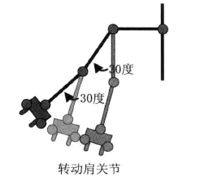

如果情况稍微复杂一点, 同样将变换矩阵一一映射到所有模型也就可以了

#### 单关节模型

我们先来看一个单关节模型的例子. 示例程序如下:

```js
// JointModel.js (c) 2012 matsuda
// Vertex shader program
var VSHADER_SOURCE =
  'attribute vec4 a_Position;\n' +
  'attribute vec4 a_Normal;\n' +
  'uniform mat4 u_MvpMatrix;\n' +
  ...
  'void main() {\n' +
  '  gl_Position = u_MvpMatrix * a_Position;\n' +
 ...
  '}\n';

...

function main() {
  ...
  // Set the vertex information
  var n = initVertexBuffers(gl);
  ...
  var u_MvpMatrix = gl.getUniformLocation(gl.program, 'u_MvpMatrix');
  var u_NormalMatrix = gl.getUniformLocation(gl.program, 'u_NormalMatrix');
  ...
  var viewProjMatrix = new Matrix4();
  viewProjMatrix.setPerspective(50.0, canvas.width / canvas.height, 1.0, 100.0);
  viewProjMatrix.lookAt(20.0, 10.0, 30.0, 0.0, 0.0, 0.0, 0.0, 1.0, 0.0);

  // Register the event handler to be called when keys are pressed
  document.onkeydown = function(ev){ keydown(ev, gl, n, viewProjMatrix, u_MvpMatrix, u_NormalMatrix); };

  draw(gl, n, viewProjMatrix, u_MvpMatrix, u_NormalMatrix);  // Draw the robot arm
}

var ANGLE_STEP = 3.0;    // The increments of rotation angle (degrees)
var g_arm1Angle = -90.0; // The rotation angle of arm1 (degrees)
var g_joint1Angle = 0.0; // The rotation angle of joint1 (degrees)

function keydown(ev, gl, n, viewProjMatrix, u_MvpMatrix, u_NormalMatrix) {
  switch (ev.keyCode) {
    case 38: // Up arrow key -> the positive rotation of joint1 around the z-axis
      if (g_joint1Angle < 135.0) g_joint1Angle += ANGLE_STEP;
      break;
    case 40: // Down arrow key -> the negative rotation of joint1 around the z-axis
      if (g_joint1Angle > -135.0) g_joint1Angle -= ANGLE_STEP;
      break;
    case 39: // Right arrow key -> the positive rotation of arm1 around the y-axis
      g_arm1Angle = (g_arm1Angle + ANGLE_STEP) % 360;
      break;
    case 37: // Left arrow key -> the negative rotation of arm1 around the y-axis
      g_arm1Angle = (g_arm1Angle - ANGLE_STEP) % 360;
      break;
    default: return; // Skip drawing at no effective action
  }
  // Draw the robot arm
  draw(gl, n, viewProjMatrix, u_MvpMatrix, u_NormalMatrix);
}

...

// Coordinate transformation matrix
var g_modelMatrix = new Matrix4(), g_mvpMatrix = new Matrix4();

function draw(gl, n, viewProjMatrix, u_MvpMatrix, u_NormalMatrix) {
  // Clear color and depth buffer
  gl.clear(gl.COLOR_BUFFER_BIT | gl.DEPTH_BUFFER_BIT);

  // Arm1
  var arm1Length = 10.0; // Length of arm1
  g_modelMatrix.setTranslate(0.0, -12.0, 0.0);
  g_modelMatrix.rotate(g_arm1Angle, 0.0, 1.0, 0.0);    // Rotate around the y-axis
  drawBox(gl, n, viewProjMatrix, u_MvpMatrix, u_NormalMatrix); // Draw

  // Arm2
  g_modelMatrix.translate(0.0, arm1Length, 0.0); 　　　// Move to joint1
  g_modelMatrix.rotate(g_joint1Angle, 0.0, 0.0, 1.0);  // Rotate around the z-axis
  g_modelMatrix.scale(1.3, 1.0, 1.3); // Make it a little thicker
  drawBox(gl, n, viewProjMatrix, u_MvpMatrix, u_NormalMatrix); // Draw
}

var g_normalMatrix = new Matrix4(); // Coordinate transformation matrix for normals

// Draw the cube
function drawBox(gl, n, viewProjMatrix, u_MvpMatrix, u_NormalMatrix) {
  // Calculate the model view project matrix and pass it to u_MvpMatrix
  g_mvpMatrix.set(viewProjMatrix);
  g_mvpMatrix.multiply(g_modelMatrix);
  gl.uniformMatrix4fv(u_MvpMatrix, false, g_mvpMatrix.elements);
  // Calculate the normal transformation matrix and pass it to u_NormalMatrix
  g_normalMatrix.setInverseOf(g_modelMatrix);
  g_normalMatrix.transpose();
  gl.uniformMatrix4fv(u_NormalMatrix, false, g_normalMatrix.elements);
  // Draw
  gl.drawElements(gl.TRIANGLES, n, gl.UNSIGNED_BYTE, 0);
}
```

`main()`函数部分基本没有变化, 主要的变化发生在`initVertexBuffers()`函数中, 它将 arm1 和 arm2 的数据写入相应的缓冲区, 以前程序中的立方体都是以原点为中心, 且边长为 2.0. 这里为了更好的模拟机器人手臂, 使用如下的立方体, 原点位于底面中心, 底面是边长为 3.0 的正方形, 高度为 10.0. 将原点置于立方体的底面中心, 是为了便于是立方体绕关节转动.

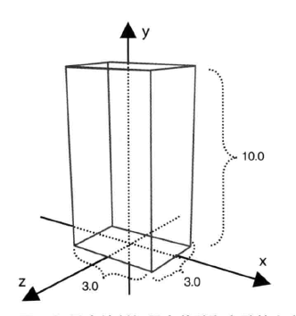

`main()`函数首先根据可视空间, 视点和视线方向计算出了视图投影矩阵`viewProjMatrix`.

然后在键盘事件响应函数中调用`keydown()`函数.

#### 绘制层次模型(draw())

`draw()`函数的任务是绘制机器人手臂. 注意 `draw()`函数和`drawBox()`函数用到了全局变量`g_modelMatrix`和`g_mvpMatrix`

`draw()`函数内部调用了`drawBox()`函数, 每次调用绘制一个必将, 先绘制下方较细 arm1,再绘制三方较粗 arm2.

### 多节点模型

这一节中, 把`JointModel`扩展为`MultiJointModel`, 后者绘制了一个具有多个关节的完整机器人手臂, 包括基座(base), 上臂(arm1), 前臂(arm2), 手掌(palm), 两根手指(finger1 & finger2 ), 全部通过键盘来控制, 如图所示:

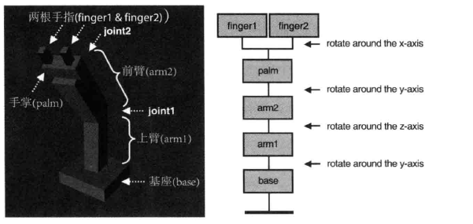

示例程序如下, 主要有两处不同, `keydown()`函数相应更多的按键相应, `draw()`函数绘制各部件更加的复杂.

示例程序的按键响应部分:

```js
// MultiJointModel.js (c) 2012 matsuda and itami
...
var ANGLE_STEP = 3.0;     // The increments of rotation angle (degrees)
var g_arm1Angle = 90.0;   // The rotation angle of arm1 (degrees)
var g_joint1Angle = 45.0; // The rotation angle of joint1 (degrees)
var g_joint2Angle = 0.0;  // The rotation angle of joint2 (degrees)
var g_joint3Angle = 0.0;  // The rotation angle of joint3 (degrees)

function keydown(ev, gl, n, viewProjMatrix, u_MvpMatrix, u_NormalMatrix) {
 ...
    case 90: // 'ｚ'key -> the positive rotation of joint2
      g_joint2Angle = (g_joint2Angle + ANGLE_STEP) % 360;
      break;
    case 88: // 'x'key -> the negative rotation of joint2
      g_joint2Angle = (g_joint2Angle - ANGLE_STEP) % 360;
      break;
    case 86: // 'v'key -> the positive rotation of joint3
      if (g_joint3Angle < 60.0)  g_joint3Angle = (g_joint3Angle + ANGLE_STEP) % 360;
      break;
    case 67: // 'c'key -> the nagative rotation of joint3
      if (g_joint3Angle > -60.0) g_joint3Angle = (g_joint3Angle - ANGLE_STEP) % 360;
      break;
    default: return; // Skip drawing at no effective action
  }
  // Draw the robot arm
  draw(gl, n, viewProjMatrix, u_MvpMatrix, u_NormalMatrix);
}
...
```

示例程序的绘制模型部分:

```js
// Coordinate transformation matrix
var g_modelMatrix = new Matrix4(), g_mvpMatrix = new Matrix4();

function draw(gl, n, viewProjMatrix, u_MvpMatrix, u_NormalMatrix) {
  // Clear color and depth buffer
  gl.clear(gl.COLOR_BUFFER_BIT | gl.DEPTH_BUFFER_BIT);

  // Draw a base
  var baseHeight = 2.0;
  g_modelMatrix.setTranslate(0.0, -12.0, 0.0);
  drawBox(gl, n, 10.0, baseHeight, 10.0, viewProjMatrix, u_MvpMatrix, u_NormalMatrix);

  // Arm1
  ...

  // Arm2
  var arm2Length = 10.0;
  ...

  // A palm
  var palmLength = 2.0;
  g_modelMatrix.translate(0.0, arm2Length, 0.0);       // Move to palm
  g_modelMatrix.rotate(g_joint2Angle, 0.0, 1.0, 0.0);  // Rotate around the y-axis
  drawBox(gl, n, 2.0, palmLength, 6.0, viewProjMatrix, u_MvpMatrix, u_NormalMatrix);  // Draw

  // Move to the center of the tip of the palm
  g_modelMatrix.translate(0.0, palmLength, 0.0);

  // Draw finger1
  pushMatrix(g_modelMatrix);
    g_modelMatrix.translate(0.0, 0.0, 2.0);
    g_modelMatrix.rotate(g_joint3Angle, 1.0, 0.0, 0.0);  // Rotate around the x-axis
    drawBox(gl, n, 1.0, 2.0, 1.0, viewProjMatrix, u_MvpMatrix, u_NormalMatrix);
  g_modelMatrix = popMatrix();

  // Draw finger2
  g_modelMatrix.translate(0.0, 0.0, -2.0);
  g_modelMatrix.rotate(-g_joint3Angle, 1.0, 0.0, 0.0);  // Rotate around the x-axis
  drawBox(gl, n, 1.0, 2.0, 1.0, viewProjMatrix, u_MvpMatrix, u_NormalMatrix);
}

var g_matrixStack = []; // Array for storing a matrix
function pushMatrix(m) { // Store the specified matrix to the array
  var m2 = new Matrix4(m);
  g_matrixStack.push(m2);
}

function popMatrix() { // Retrieve the matrix from the array
  return g_matrixStack.pop();
}
```

`draw()`函数的任务和 jointModel 中的相同, 就是对每个部件进行 平移, 旋转 和绘制. 一次绘制不会动的 base, arm1, arm2, palm 等部件.

比较麻烦的是 finger1 和 finger2 , 因为它们不是上下层的关系, 而是都连接在 palm 上, 此时要格外注意计算模型矩阵的过程.

### initShader()函数的作用

之前我们一直使用辅助函数`initShaders()`. 它隐藏了建立和初始化着色器的细节. 掌握这部分内容不是必须的, 直接使用`initShaders()`函数也能编写出不错的 WebGL 程序.

`initShaders()`函数的作用是, 编译 GLSL ES 代码, 创建和初始化着色器供 WebGL 使用. 具体的分为下面 7 个步骤:

1. 创建着色器对象(gl.createShader()).
2. 向着色器对象中填充着色器程序的源代码(gl.shaderSource()).
3. 编译着色器(gl.compileShader()).
4. 创建程序对象(gl.createProgram()).
5. 为程序对象分配着色器(gl.attchShader()).
6. 连接程序对象(gl.linkProgram()).
7. 使用程序对象(gl.userProgram()).

在讨论这里每一条之前, 首先, 这里出现了两种对象: **着色器对象(shader object)** 和 **程序对象(program object)** .

-   着色器对象: 着色器对象管理一个顶点着色器或一个片元着色器. 每一个着色器都有一个着色器对象.
-   程序对象: 程序对象是管理着色器对象的容器. 在 WebGL 中, 一个程序对象必须包含一个顶点着色器和一个片元着色器.

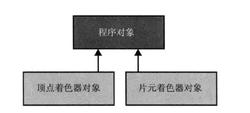

下面我们逐条讨论上面的几个步骤:

#### 创建着色器对象(gl.createShader())

所有的着色器对象都必须通过调用`gl.createShader()`来创建.

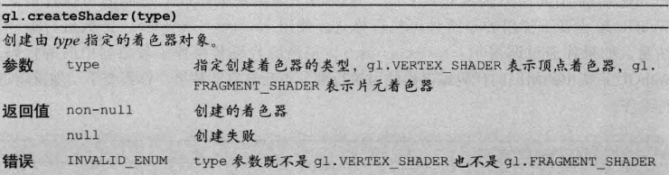

`gl.createShader`函数根据传入的参数创建一个顶点着色器或者片元着色器. 如果不在需要这个着色器. 可以使用`gl.deleteShader()`函数来删除着色器.

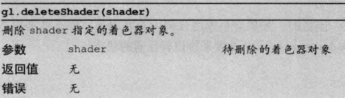

如果着色器对象还在使用, 那么`gl.deleteShader`并不会立刻删除着色器, 而是要等到程序对象不再使用该着色器后, 才将其删除.

#### 指定着色器对象的代码(gl.shaderSource())

通过`gl.shaderSource()`函数向着色器指定 GLSL ES 源代码. 在 js 程序中, 源代码以字符串形式存储. 详细的可以看附录 F 中"从文件中载入着色器程序".

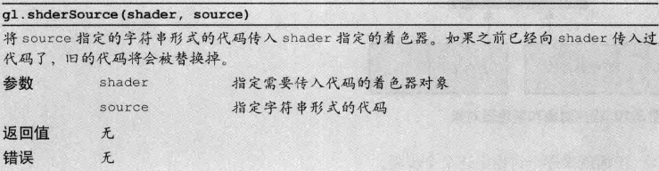

#### 编译着色器(gl.compileShader())

向着色器对象传入源代码之后, 还需要对其进行编译才能使用. GLSL EL 语言和 js 不同而更接近 C/C++, 在使用之前需要编译成二进制可执行格式, WebGL 系统真正使用的是这种可执行格式. 使用`gl.compileShader`函数进行编译. 注意, 如果通过调用`gl.shaderSource()`, 用新的代码替换掉了着色器中旧的代码, WebGL 系统中的用旧的代码编译出的可执行部分不会被自动替换, 需要手动地重新进行编译.

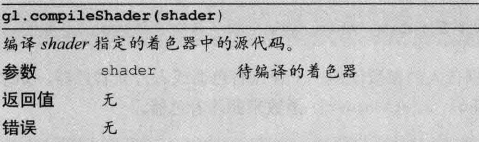

当调用次函数时, 如果着色器代码中存在错误, 那么就会出现编译错误, 可以调用`gl.getShaderParameter()`函数来检查着色器的状态.

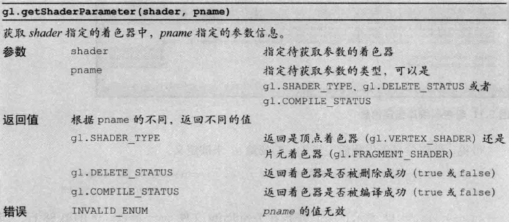

调用`gl.getShaderParameter()`并将参数`pname`指定为`gl.COMPILE_STATUS`, 就可以检查着色器编译是否成功.

如果编译失败. `gl.getShaderParameter()`会返回 false, WebGL 系统会把编译错误的具体内容写入着色器的 **信息日志(information log)**. 我们可以通过`gl.getShaderInfoLog()`来获取之.

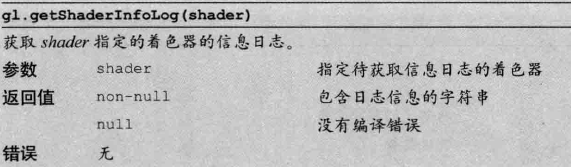

虽然日志信息的具体格式依赖于浏览器的实现, 但大多数 WebGL 系统给出的错误信息都会包含代码出错行的行号.

#### 创建程序对象(gl.createProgram())

如前所述, 程序对象包含了顶点着色器和片元着色器, 可以调用`gl.createProgram()`来创建程序对象. 事实上, 之前使用程序对象, `gl.getAttribLocation()`函数和`gl.getUniformLocation()`函数的第一个参数, 就是这个程序对象.

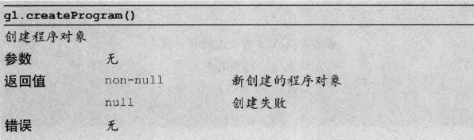

调用`gl.deleteProgram()`函数来删除程序对象

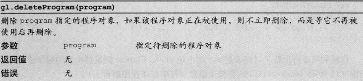

一旦程序对象被创建以后, 就要向程序附上两个着色器.

#### 为程序对象分配着色器对象(gl.attachShader())

WebGL 系统要运行起来, 必须要有两个着色器: 一个顶点着色器和一个片元着色器. 可以使用`gl.attachShader()`函数为程序对象分配这两个着色器.

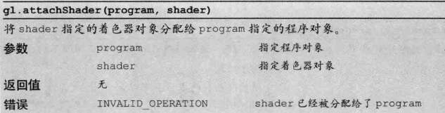

着色器在赋给程序对象前, 并不一定要为其指定代码或进行编译(空的着色器赋给程序对象是被允许的). 类似的, 可以使用`gl.detachShader()`函数来解除分配给程序对象的着色器.

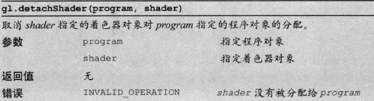

#### 连接程序对象(gl.linkProgram())

在为程序对象分配了两个着色对象后, 还需要将(顶点着色器和片元)着色器连接起来, 使用`gl.linkProgram()`函数来进行这一步操作.

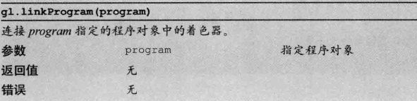

程序对象进行着色器连接操作, 目的是保证:

1. 顶点着色器和片元着色器的`varying`变量同名同类型, 且一一对应
2. 顶点着色器对每个`varying`变量赋了值;
3. 顶点着色器和片元着色器中的同名`uniform`变量也是同类型的(无序一一对应, 即某些 uniform 变量可以出现在一个着色器中而不出现在另一个中)
4. 着色器中的`attribute`变量, `uniform`变量和`varying`变量的个数没有差偶偶着色器的上限.
   等等

在着色器连接之后, 应当检查时候连接成功. 通过调用`gl.getProgramPara-meters()`函数来实现.

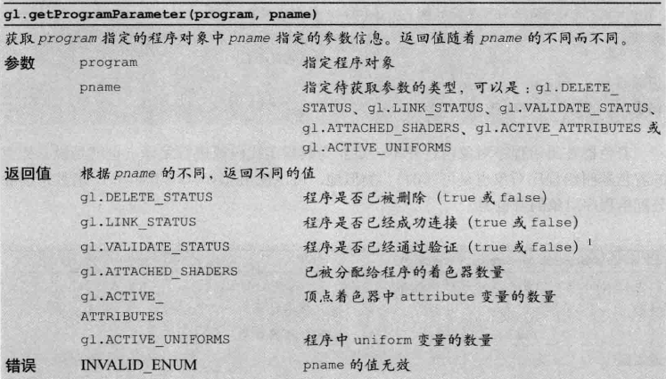

如果程序已经成功连接, 我们就得到了一个二进制的可执行模块供 WebGL 系统使用. 如果连接失败了, 也可以通过调用`gl.getProgramInfoLog()`从信息日志中获取连接出错信息.

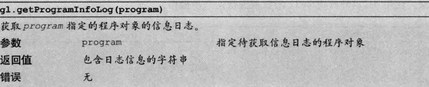

#### 告知 WebGL 系统所用的程序对象(gl.useProgram())

最后, 通过调用`gl.useProgram()`告知 WebGL 系统绘制时使用哪个程序对象

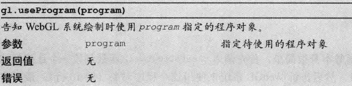

这个函数的存在使得 WebGK 可以在绘制前准备多个程序对象, 然后再绘制的时候根据需要切换程序对象.

这样建立和初始化着色器的任务就算完成了.
