# 第十章: 高级技术

## 高级技术

### 鼠标控制物体旋转

使用鼠标来控制物体旋转, 需要根据鼠标的移动情况创建旋转矩阵, 更新模型视图投影矩阵, 并对物体的顶点坐标进行变换.

具体的实现思路可以是这样的: 在鼠标左键按下时记录鼠标的初始坐标, 然后在鼠标移动的时候计算位移, 并以这个位移来计算旋转矩阵.


示例程序如下:

```js
//使用鼠标旋转物体
//顶点着色器
let VSHADER_SOURCE = `
...
void main(){
    gl_Position = u_MvpMatrix * a_Position;
   ...
}`;
//片元着色器
...

function main() {
  ...
    //设置顶点信息
    var n = initVertexBuffers(gl);
  ...
    viewProjMatrix.setPerspective(30.0, canvas.width / canvas.height, 1.0, 100.0);
    viewProjMatrix.lookAt(3.0, 3.0, 7.0, 0.0, 0.0, 0.0, 0.0, 1.0, 0.0);

    //注册鼠标事件
    var currentAngle = [0.0, 0.0]; // 当前旋转角度 ([x-axis, y-axis] degrees)
    initEventHandlers(canvas, currentAngle);
  ...
    var tick = function () {   // 执行绘制
        draw(gl, n, viewProjMatrix, u_MvpMatrix, currentAngle);
        requestAnimationFrame(tick, canvas);
    };
    tick();
}

...
function initEventHandlers(canvas, currentAngle) {
    let dragging = false;//拖曳判定
    let lastX = -1, lastY = -1;//上一次鼠标位置

    canvas.onmousedown = function (ev) {
        let x = ev.clientX, y = ev.clientY;
        //鼠标在cavas中时, 开始拖曳
        let rect = ev.target.getBoundingClientRect();
        if (rect.left <= x && x < rect.right && rect.top <= y && y < rect.bottom) {
            lastX = x; lastY = y;
            dragging = true;
        }
    };

    canvas.onmouseup = function (ev) {
        dragging = false;
    }

    canvas.onmousemove = function (ev) {
        var x = ev.clientX, y = ev.clientY;
        if (dragging) {
            var factor = 150 / canvas.height; // 旋转比
            var dx = factor * (x - lastX);
            var dy = factor * (y - lastY);
            // 显示x轴的旋转在正负90度只爱你
            currentAngle[0] = Math.max(Math.min(currentAngle[0] + dy, 90.0), -90.0);
            currentAngle[1] = currentAngle[1] + dx;
        }
        lastX = x, lastY = y;
    };
}

var g_MvpMatrix = new Matrix4();
function draw(gl, n, viewProjMatrix, u_MvpMatrix, currentAngle) {
    g_MvpMatrix.set(viewProjMatrix);
    g_MvpMatrix.rotate(currentAngle[0], 1.0, 0.0, 0.0);//旋转X轴
    g_MvpMatrix.rotate(currentAngle[1], 0.0, 1.0, 0.0);//旋转Y轴

    gl.uniformMatrix4fv(u_MvpMatrix, false, g_MvpMatrix.elements);

    gl.clear(gl.COLOR_BUFFER_BIT | gl.DEPTH_BUFFER_BIT);//清除

    gl.drawElements(gl.TRIANGLES, n, gl.UNSIGNED_BYTE, 0);//绘制
}

...
```

### 选中物体

可以遵循以下步骤, 检查鼠标点击是否点击了立方体:

1. 当鼠标左键按下时, 将整个立方体重绘为单一的红色
2. 读取鼠标点击 ÷ 的像素颜色
3. 使用立方体原来的颜色对其进行重绘
4. 如果第 2 步读取到的是红色, 那就显示消息"立方体被点击"

如果不加以处理, 那么当立方体被重绘为红色时, 就可以看到这个立方体闪烁了一下红色. 为了使用户看不到立方体的这一闪烁过程, 我们在取出像素颜色之后立即将立方体重绘成原来的样子.

示例代码如下:

```js
var VSHADER_SOURCE =
  ...
  'uniform mat4 u_MvpMatrix;\n' +
  'uniform bool u_Clicked;\n' + // 鼠标按下
  'varying vec4 v_Color;\n' +
  'void main() {\n' +
  '  gl_Position = u_MvpMatrix * a_Position;\n' +
  '  if (u_Clicked) {\n' + //  鼠标按下时用红色进行绘制
  '    v_Color = vec4(1.0, 0.0, 0.0, 1.0);\n' +
  '  } else {\n' +
  '    v_Color = a_Color;\n' +
  '  }\n' +
  '}\n';

...
function main() {
...
  var u_Clicked = gl.getUniformLocation(gl.program, 'u_Clicked');
...

  gl.uniform1i(u_Clicked, 0); // Pass false to u_Clicked

  var currentAngle = 0.0; // Current rotation angle
  // Register the event handler
  canvas.onmousedown = function(ev) {   // Mouse is pressed
    var x = ev.clientX, y = ev.clientY;
    var rect = ev.target.getBoundingClientRect();
    if (rect.left <= x && x < rect.right && rect.top <= y && y < rect.bottom) {
      // If pressed position is inside <canvas>, check if it is above object
      var x_in_canvas = x - rect.left, y_in_canvas = rect.bottom - y;
      var picked = check(gl, n, x_in_canvas, y_in_canvas, currentAngle, u_Clicked, viewProjMatrix, u_MvpMatrix);
      if (picked) alert('The cube was selected! ');
    }
  }
...
}
...
function check(gl, n, x, y, currentAngle, u_Clicked, viewProjMatrix, u_MvpMatrix) {
  var picked = false;
  gl.uniform1i(u_Clicked, 1);  // Pass true to u_Clicked
  draw(gl, n, currentAngle, viewProjMatrix, u_MvpMatrix); // Draw cube with red
  // Read pixel at the clicked position
  var pixels = new Uint8Array(4); // Array for storing the pixel value
  gl.readPixels(x, y, 1, 1, gl.RGBA, gl.UNSIGNED_BYTE, pixels);

  if (pixels[0] == 255) // The mouse in on cube if R(pixels[0]) is 255
    picked = true;

  gl.uniform1i(u_Clicked, 0);  // Pass false to u_Clicked(rewrite the cube)
  draw(gl, n, currentAngle, viewProjMatrix, u_MvpMatrix); // Draw the cube

  return picked;
}
```

程序中使用了`gl.readPixels()`函数从颜色缓冲区中读取点击处的像素颜色. 下面是该函数的规范:

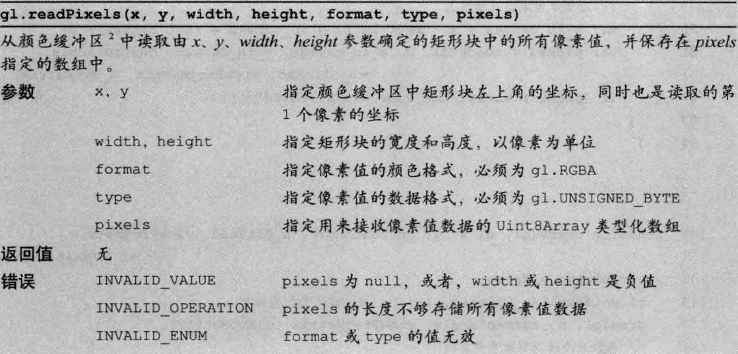

同样的, 我们可以使用类似的原理写一个获取点击面的是事件

### HUD

在三维场景上叠加文本或二维图形信息, 已达到 HUD 的效果.

三维部分的代码取自上一小节的代码, 额外的工作是在三维场景前方绘制一些图形和文字.

使用 HTML 和 canvas 函数来实现 HUD, 我们遵循如下步骤:

1. 在 HTML 文件中, 为 WebGL 绘制的三维图形准备一个`<canvas>`, 同时为二维的 HUD 信息在准备一个`<canvas>`. 令这两个`<canvas>`重叠, 并让 HUD 的`<canvas>`叠在上面.
2. 在前一个`<canvas>`使用 WebGL API 绘制三维场景.
3. 在后一个`<canvas>`上使用 canvas2DAPI 绘制 HUD 信息.

示例代码如下:

```js
...

function main() {
  // Retrieve <canvas> element
  var canvas = document.getElementById('webgl');
  var hud = document.getElementById('hud');

 ...
  // Get the rendering context for WebGL
  var gl = getWebGLContext(canvas);
  // Get the rendering context for 2DCG
  var ctx = hud.getContext('2d');
  ...
  // Register the event handler
  hud.onmousedown = function(ev) {   // Mouse is pressed
  ...
    var picked = check(gl, n, x_in_canvas, y_in_canvas, currentAngle, u_Clicked, viewProjMatrix, u_MvpMatrix);
  ...
  }

  var tick = function() {   // Start drawing
    currentAngle = animate(currentAngle);
    draw2D(ctx, currentAngle); // Draw 2D
    draw(gl, n, currentAngle, viewProjMatrix, u_MvpMatrix);
    requestAnimationFrame(tick, canvas);
  };
  tick();
}

...

function draw2D(ctx, currentAngle) {
  ctx.clearRect(0, 0, 400, 400); // Clear <hud>
  // Draw triangle with white lines
  ctx.beginPath();                      // Start drawing
  ctx.moveTo(120, 10); ctx.lineTo(200, 150); ctx.lineTo(40, 150);
  ctx.closePath();
  ctx.strokeStyle = 'rgba(255, 255, 255, 1)'; // Set white to color of lines
  ctx.stroke();                           // Draw Triangle with white lines
  // Draw white letters
  ctx.font = '18px "Times New Roman"';
  ctx.fillStyle = 'rgba(255, 255, 255, 1)'; // Set white to the color of letters
  ctx.fillText('HUD: Head Up Display', 40, 180);
  ctx.fillText('Triangle is drawn by Canvas 2D API.', 40, 200);
  ctx.fillText('Cube is drawn by WebGL API.', 40, 220);
  ctx.fillText('Current Angle: '+ Math.floor(currentAngle), 40, 240);
}

...
```

了解了 HUD 的原理, 那么在网页上方显示三维物体就非常简单了.

### 雾化(大气效果)

在三维图形学中, 术语 **雾化(fog)** 用来描述远处的物体看上去比较模糊. 实际上, 人格介质的物体都可能表现出雾化, 比如水下的物体.

大致上表现可以是下面这样的:

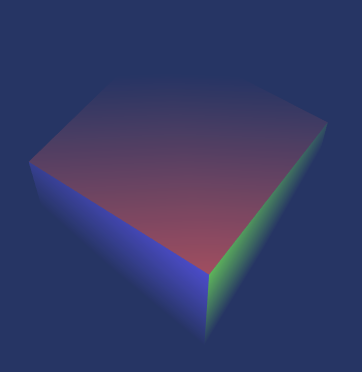

雾化的实现有很多种, 这里使用最简单的一种: **线性雾化(linear fog)**. 在线性雾化中, 某一点的雾化程度取决于它与视点之间的距离, 距离越远雾化程度越高. 线性雾化有起点和终点, 起点表示雾化开始之处, 终点表示完全雾化之处.

某一点雾化的程度可以定位为 **雾化因子(fog factor)**, 并在线性雾化公式中被计算出来:

$$ <雾化因子>=(<终点>-<当前点与视点间的具体>)/(<终点>-<起点>) $$

$$ <片元颜色>=<物体表面颜色> x <雾化因子> + <雾的颜色> x (1- <雾化因子>) $$

示例程序如下:

```js
// Fog.js (c) 2012 matsuda and ohnishi
// Vertex shader program
var VSHADER_SOURCE =
  ...
  'uniform mat4 u_ModelMatrix;\n' +
  'uniform vec4 u_Eye;\n' +
  'varying vec4 v_Color;\n' +
  'varying float v_Dist;\n' +
  'void main() {\n' +
  '  gl_Position = u_MvpMatrix * a_Position;\n' +
  '  v_Color = a_Color;\n' +
  '  v_Dist = distance(u_ModelMatrix * a_Position, u_Eye);\n' +
  '}\n';

// Fragment shader program
var FSHADER_SOURCE =
  'uniform vec3 u_FogColor;\n' + // Color of Fog
  'uniform vec2 u_FogDist;\n' +  // Distance of Fog (starting point, end point)
  'varying vec4 v_Color;\n' +
  'varying float v_Dist;\n' +
  'void main() {\n' +
  '  float fogFactor = clamp((u_FogDist.y - v_Dist) / (u_FogDist.y - u_FogDist.x), 0.0, 1.0);\n' +
  '  vec3 color = mix(u_FogColor, vec3(v_Color), fogFactor);\n' +
  '  gl_FragColor = vec4(color, v_Color.a);\n' +
  '}\n';

function main() {
  ...
  var n = initVertexBuffers(gl);
 ...
  // Color of Fog
  var fogColor = new Float32Array([0.137, 0.231, 0.423]);
  // Distance of fog [where fog starts, where fog completely covers object]
  var fogDist = new Float32Array([55, 80]);
  // Position of eye point (world coordinates)
  var eye = new Float32Array([25, 65, 35, 1.0]);
  ...
  // Pass fog color, distances, and eye point to uniform variable
  gl.uniform3fv(u_FogColor, fogColor); // Colors
  gl.uniform2fv(u_FogDist, fogDist);   // Starting point and end point
  gl.uniform4fv(u_Eye, eye);           // Eye point

  // Set clear color and enable hidden surface removal
  gl.clearColor(fogColor[0], fogColor[1], fogColor[2], 1.0); // Color of Fog
  gl.enable(gl.DEPTH_TEST);

  ...
  var mvpMatrix = new Matrix4();
  mvpMatrix.setPerspective(30, canvas.width/canvas.height, 1, 1000);
  mvpMatrix.lookAt(eye[0], eye[1], eye[2], 0, 2, 0, 0, 1, 0);
  mvpMatrix.multiply(modelMatrix);
  gl.uniformMatrix4fv(u_MvpMatrix, false, mvpMatrix.elements);
  document.onkeydown = function(ev){ keydown(ev, gl, n, u_FogDist, fogDist); };

  // Clear color and depth buffer
  gl.clear(gl.COLOR_BUFFER_BIT | gl.DEPTH_BUFFER_BIT);
  // Draw
  gl.drawElements(gl.TRIANGLES, n, gl.UNSIGNED_BYTE, 0);

  var modelViewMatrix = new Matrix4();
  modelViewMatrix.setLookAt(eye[0], eye[1], eye[2], 0, 2, 0, 0, 1, 0);
  modelViewMatrix.multiply(modelMatrix);
  modelViewMatrix.multiplyVector4(new Vector4([1, 1, 1, 1]));
  mvpMatrix.multiplyVector4(new Vector4([1, 1, 1, 1]));
  modelViewMatrix.multiplyVector4(new Vector4([-1, 1, 1, 1]));
  mvpMatrix.multiplyVector4(new Vector4([-1, 1, 1, 1]));
}
```

这里:

1. 顶点着色器计算出当前顶点与视点的距离并传入片元着色器
2. 片元着色器根据片元与视点的距离, 计算雾化因子, 最终计算出片元的颜色
3. 程序向着色器传入了视点在世界坐标系下的坐标, 所以雾化因子是在世界坐标系下计算的.

处理线性雾化, 还有多种其他雾化算法, 如 OpenGL 中常用的指数雾化. 使用其他雾化算法也很简单, 只需要在着色器中修改雾化指数的计算方法即可.

#### 使用 W 分量

在顶点着色器中计算顶点与视点的距离, 会造成较大的开销, 或者会影响性能. 我们可以使用另外一种方法来近似估算出这个距离, 就是使用顶点经过模型视图投影矩阵变幻后的坐标的 W 分量.

```js
...
  "v_Dist = gl_Position.w;\n' +"
...
```

### 绘制圆形的点

为了绘制一个原点, 我们需要将原先的方点"削"成圆形的. 在第五章"颜色和纹理"中, 我们知道顶点着色器和片元着色器之间发生了光栅化过程, 一个顶点被光栅化为多个偏关, 如果直接进行绘制, 画出来的就是方形的点, 如果在片元着色器中稍作改动, 就能绘制出原型的点了.

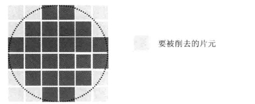

为了将矩形削成圆形, 需要知道每个片元在光栅化过程中的坐标. 在第五章中, 片元着色器中通过内置变量`gl_FragCoord`来访问片元的坐标. 实际上, 片元着色器还提供了另一个内置变量`gl_PointCoord`. 如下表所示:

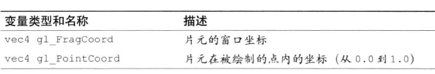

示例程序如下:

```js
var VSHADER_SOURCE =
  'attribute vec4 a_Position;\n' +
  'void main() {\n' +
  '  gl_Position = a_Position;\n' +
  '  gl_PointSize = 10.0;\n' +
  '}\n';

// Fragment shader program
var FSHADER_SOURCE =
 ...
  'void main() {\n' +    // Center coordinate is (0.5, 0.5)
  '  float d = distance(gl_PointCoord, vec2(0.5, 0.5));\n' +
  '  if(d < 0.5) {\n' +  // Radius is 0.5
  '    gl_FragColor = vec4(1.0, 0.0, 0.0, 1.0);\n' +
  '  } else { discard; }\n' +
  '}\n';
```

### α 混合

颜色中的 α 分量(即 RGBA 中的 A)控制着颜色的透明度. 下面使用一个示例程序来实现半透明效果, 实现这种效果需要用到颜色的 α 分量, 该功能被称为 **α 混合** 或 **混合** ,WebGL
已经内置了该功能, 只需要开启:

1. 开启混合功能:`gl.enable(gl.BLEND)`
2. 指定混合函数:`gl.blendFunc(gl.SRC_ALPHA,gl.ONE_MINUS_SRC_ALPHA)`

效果如下:

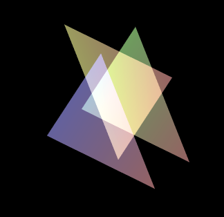

程序中使用的`gl.blendFunc()`函数的作用. 实际上 WebGL 用到了两个颜色, 即 **源颜色(source color)** 和 **目标颜色()**

前者是等待混合的颜色,后者是准备被混合进去的颜色. 比如, 后绘制的三角形的颜色需要缓和到前绘制的三角形的颜色重.

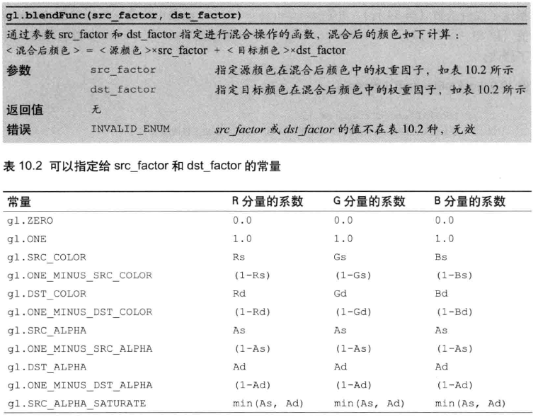

::: tip 提示
WebGL 移除了 OpenGL 中的`gl.CONSTANT_COLOR`,  
`gl.ONE_MINUS_CONSTANT_COLOR`,`gl.CONSTANT_ALPHA`,  
`gl.ONE_MINUS_CONSTANT_ALPHA`.
:::

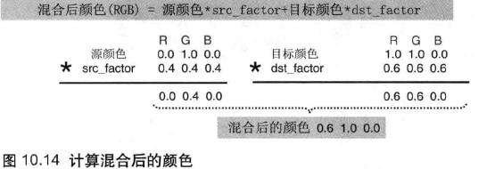

### 三维物体的透明

同样的使用 α 混合功能, 可以在一个立方体上实现半透明效果.

要注意的一点是, 如果程序开启了隐藏面消除功能, 隐藏的片元不被绘制, 就不会有半透明的效果. 实际上,只需要注释掉这行即可.

#### 透明和不透明共存

关闭隐藏面消除过于简单粗暴, 并不能满足实际的需要. 我们需要寻找其他机制:

1. 开启隐藏面消除功能
2. 绘制所有不透明的物体(α 为 1.0)
3. 锁定用于进行隐藏面消除的深度缓冲区的写入操作, 使它只读:`gl.depthMask(false)`
4. 绘制所有半透明的物体, 注意它们应当按照深度排序, 然后从后往前绘制
5. 释放深度缓冲区, 使之可读可写: `gl.depthMask(true)`

### 切换着色器

实际上, 对不同的物体经常需要使用不同的着色器来绘制, 每个着色器中可能有非常复杂的逻辑以实现各种不同的效果. 我们可以准备多个着色器, 然后根据需要来切换使用它们.

关键代码实际上很简单:

1. 准备用来绘制单色立方体的着色器
2. 准备用来绘制纹理立方体的着色器
3. 调用`createProgram()`函数,利用第 1 步创建出的着色器, 创建着色器程序对象.
4. 调用`createProgram()`函数, 利用第 2 步创建出的着色器创建着色器程序对象.
5. 调用`gl.useProgram()`函数, 指定使用第 3 步创建出的着色器程序对象
6. 通过缓冲区对象向着色器中传入`attribute`变量并开启之.
7. 绘制单色立方体
8. 调用`gl.useProgram`函数, 指定使用第 4 步创建出的着色器程序对象
9. 通过缓冲区对象向着色器传入`atribute`变量并开启之
10. 绘制纹理立方体

看下示例程序:

```js
//单色立方体顶点着色器
var SOLID_VSHADER_SOURCE =
...
//单色立方体片元着色器
var SOLID_FSHADER_SOURCE =
...
//纹理立方体顶点着色器
var TEXTURE_VSHADER_SOURCE =
...
//纹理立方体片元着色器
var TEXTURE_FSHADER_SOURCE =
...

function main() {
...

  //初始化着色器
  var solidProgram = createProgram(gl, SOLID_VSHADER_SOURCE, SOLID_FSHADER_SOURCE);
  var texProgram = createProgram(gl, TEXTURE_VSHADER_SOURCE, TEXTURE_FSHADER_SOURCE);
  if (!solidProgram || !texProgram) {
    console.log('Failed to intialize shaders.');
    return;
  }

  //获取绘制单色立方体着色器的变量
  solidProgram.a_Position = gl.getAttribLocation(solidProgram, 'a_Position');
  solidProgram.a_Normal = gl.getAttribLocation(solidProgram, 'a_Normal');
  solidProgram.u_MvpMatrix = gl.getUniformLocation(solidProgram, 'u_MvpMatrix');
  solidProgram.u_NormalMatrix = gl.getUniformLocation(solidProgram, 'u_NormalMatrix');

  // 获取attribute/uniform变量的存储地址
  texProgram.a_Position = gl.getAttribLocation(texProgram, 'a_Position');
  texProgram.a_Normal = gl.getAttribLocation(texProgram, 'a_Normal');
  texProgram.a_TexCoord = gl.getAttribLocation(texProgram, 'a_TexCoord');
  texProgram.u_MvpMatrix = gl.getUniformLocation(texProgram, 'u_MvpMatrix');
  texProgram.u_NormalMatrix = gl.getUniformLocation(texProgram, 'u_NormalMatrix');
  texProgram.u_Sampler = gl.getUniformLocation(texProgram, 'u_Sampler');

  ...

  // 设置顶点信息
  var cube = initVertexBuffers(gl);
  if (!cube) {
    console.log('Failed to set the vertex information');
    return;
  }

  //设置纹理
  var texture = initTextures(gl, texProgram);
  if (!texture) {
    console.log('Failed to intialize the texture.');
    return;
  }

  ...

  //开始绘制
  var currentAngle = 0.0; // Current rotation angle (degrees)
  var tick = function() {
    currentAngle = animate(currentAngle);  // Update current rotation angle

    gl.clear(gl.COLOR_BUFFER_BIT | gl.DEPTH_BUFFER_BIT); // Clear color and depth buffers
    // 绘制单色立方体
    drawSolidCube(gl, solidProgram, cube, -2.0, currentAngle, viewProjMatrix);
    // 绘制纹理立方体
    drawTexCube(gl, texProgram, cube, texture, 2.0, currentAngle, viewProjMatrix);

    window.requestAnimationFrame(tick, canvas);
  };
  tick();
}

function initVertexBuffers(gl) {

  ...

  var o = new Object(); //使用该对象返回多个缓冲区对象
  // 将顶点信息写入缓冲区对象
  o.vertexBuffer = initArrayBufferForLaterUse(gl, vertices, 3, gl.FLOAT);
  o.normalBuffer = initArrayBufferForLaterUse(gl, normals, 3, gl.FLOAT);
  o.texCoordBuffer = initArrayBufferForLaterUse(gl, texCoords, 2, gl.FLOAT);
  o.indexBuffer = initElementArrayBufferForLaterUse(gl, indices, gl.UNSIGNED_BYTE);
  if (!o.vertexBuffer || !o.normalBuffer || !o.texCoordBuffer || !o.indexBuffer) return null;

  o.numIndices = indices.length;

 ...
}
```

### 渲染到纹理

使用 WebGL 渲染三维图形, 然后将渲染结果作为纹理贴到另一个三维物体上去. 实际上, 把渲染结果作为纹理使用就是动态地生成图像, 而不是向吴福气请求加载外部图形. 在纹理图像被贴上图形之前, 我们还可以对其做一些额外的处理, 比如生成动态模糊或景深效果. 下一节我们用这项技术来实现影子.

现在先介绍一些前置知识:

#### 帧缓冲区对象和渲染缓冲区对象

在默认情况下, WebGL 在颜色缓冲区中进行绘图, 在开启隐藏面消除功能时, 还会用到深度缓冲区. 总之, 绘制的结果图像是存储在颜色缓冲区中的.

**帧缓冲区对象(framebuffer object)**可以用来代理颜色缓冲区或深度缓冲区. 如图所示, 绘制在帧缓冲区中的对象并不会直接显示在`<canvas>`上, 你可以先对帧缓冲区中的内容进行一些处理再显示, 或者直接用其中的内容作为纹理图像. 在帧缓冲区中进行绘制的过程又称为 **离屏绘制(offscreen drawing)**.

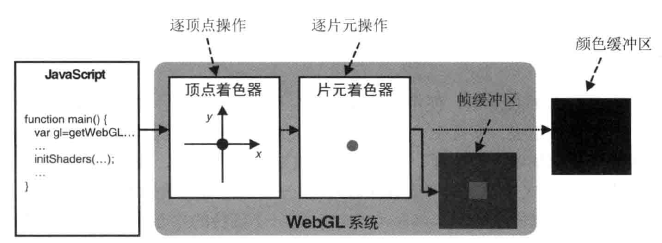

帧缓冲区对象的结构如下图所示. 它提供了颜色缓冲区和深度缓冲区的替代品. 绘制操作并不是直接发生在帧缓冲区中的, 而是发生在帧缓冲区 **所关联的对象(attachment)**上. 一个帧缓冲区有 3 个关联对象: **颜色关联对象(color attachment)**, **深度关联对象(depth attachment)**和 **模板关联对象(stencil attachment)**, 分别用来替代颜色缓冲区, 深度缓冲区和模板缓冲区.

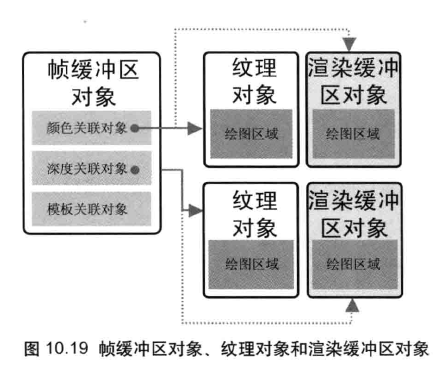

经过一些设置, WebGL 就可以向帧缓冲区的关联对象中写入数据. 每个关联对象可以是两种类型的: 纹理对象或 **渲染缓冲区(renderbuffer object)**. 纹理对象存储着纹理图像, 当我们吧纹理对象作为颜色关联对象关联到帧缓冲区对象后, WebGL 就可以在纹理对象中绘图. 渲染缓冲区对象表示一种更加通用的绘图区域, 可以向其中写入多种类型的数据.

#### 如何实现渲染到纹理

瑞上所述, 我们要实现吧 WebGL 渲染出的图像作为纹理使用, 那么就需要将纹理对象作为颜色关联对象关联到帧缓冲区对象上, 然后在帧缓冲区中进行绘制, 此时颜色关联对象(纹理对象)就代替了颜色缓冲区. 此时仍然需要进行隐藏面消除, 所以我们又创建了一个渲染缓冲区对象来作为帧缓冲区的深度关联对象, 以替代深度缓冲区. 帧缓冲区的设置如下图所示:

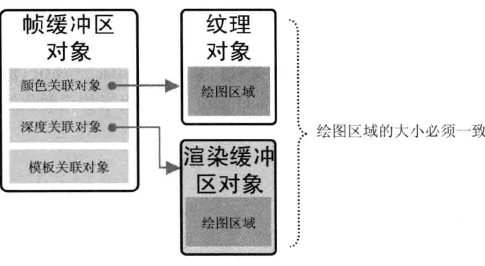

实现上述配饰需要 8 个步骤:

1. 创建帧缓冲区对象(gl.createFramebffer())
2. 创建纹理对象并设置其尺寸和参数(gl.createTexture(),gl.bindTexture(),gl.texImage2D(),gl.Parameteri())
3. 创建渲染缓冲区对象(gl.createRenderbudder())
4. 绑定渲染缓冲区对象并设置其尺寸(gl.bindRenderBuffer(),gl.renderbuffer-Storage())
5. 将帧缓冲区的颜色关联对象指定为一个纹理对象(gl.framebufferTexture2D())
6. 将帧缓冲区的深度关联对象指定为一个渲染缓冲区对象(gl.framebuferRenderbuffer())
7. 检查帧缓冲区是否正确配置(gl.checkFramebufferStatus)
8. 在帧缓冲区进行绘制(gl.bindFrameBuffer())

```js
...
// 离屏绘制的尺寸
var OFFSCREEN_WIDTH = 256;
var OFFSCREEN_HEIGHT = 256;

function main() {
...

  //设置顶点信息
  var cube = initVertexBuffersForCube(gl);
  var plane = initVertexBuffersForPlane(gl);
  ...
  var texture = initTextures(gl);
  ...

  // 初始化帧缓冲区(FBO)
  var fbo = initFramebufferObject(gl);
  ...
  var viewProjMatrix = new Matrix4();   // Prepare view projection matrix for color buffer
  viewProjMatrix.setPerspective(30, canvas.width/canvas.height, 1.0, 100.0);
  viewProjMatrix.lookAt(0.0, 0.0, 7.0, 0.0, 0.0, 0.0, 0.0, 1.0, 0.0);

  var viewProjMatrixFBO = new Matrix4();   // Prepare view projection matrix for FBO
  viewProjMatrixFBO.setPerspective(30.0, OFFSCREEN_WIDTH/OFFSCREEN_HEIGHT, 1.0, 100.0);
  viewProjMatrixFBO.lookAt(0.0, 2.0, 7.0, 0.0, 0.0, 0.0, 0.0, 1.0, 0.0);

  // Start drawing
 ...
    draw(gl, canvas, fbo, plane, cube, currentAngle, texture, viewProjMatrix, viewProjMatrixFBO);
 ...
}

...

function initFramebufferObject(gl) {
  var framebuffer, texture, depthBuffer;
...
  //创建帧缓冲区(FBO)
  framebuffer = gl.createFramebuffer();
...
  // 创建纹理对象并设置其尺寸和参数
  texture = gl.createTexture();
...
  gl.bindTexture(gl.TEXTURE_2D, texture);

  gl.texImage2D(gl.TEXTURE_2D, 0, gl.RGBA, OFFSCREEN_WIDTH, OFFSCREEN_HEIGHT, 0, gl.RGBA, gl.UNSIGNED_BYTE, null);
  gl.texParameteri(gl.TEXTURE_2D, gl.TEXTURE_MIN_FILTER, gl.LINEAR);
  framebuffer.texture = texture; // Store the texture object

  // 创建渲染缓冲区对象并设置尺寸和参数
  depthBuffer = gl.createRenderbuffer(); // Create a renderbuffer ...
  gl.bindRenderbuffer(gl.RENDERBUFFER, depthBuffer); // Bind the object to target
  gl.renderbufferStorage(gl.RENDERBUFFER, gl.DEPTH_COMPONENT16, OFFSCREEN_WIDTH, OFFSCREEN_HEIGHT);

  // 将纹理和渲染缓冲区对象关联到帧缓冲区对象上
  gl.bindFramebuffer(gl.FRAMEBUFFER, framebuffer);
  gl.framebufferTexture2D(gl.FRAMEBUFFER, gl.COLOR_ATTACHMENT0, gl.TEXTURE_2D, texture, 0);
  gl.framebufferRenderbuffer(gl.FRAMEBUFFER, gl.DEPTH_ATTACHMENT, gl.RENDERBUFFER, depthBuffer);

  // 检查缓冲区是否正确被加载
  var e = gl.checkFramebufferStatus(gl.FRAMEBUFFER);
  ...
  // Unbind the buffer object
  gl.bindFramebuffer(gl.FRAMEBUFFER, null);
  gl.bindTexture(gl.TEXTURE_2D, null);
  gl.bindRenderbuffer(gl.RENDERBUFFER, null);


  return framebuffer;
}
...
```

下面来详细的解释这几个函数:

#### gl.createFramebuffer() 创建帧缓冲对象

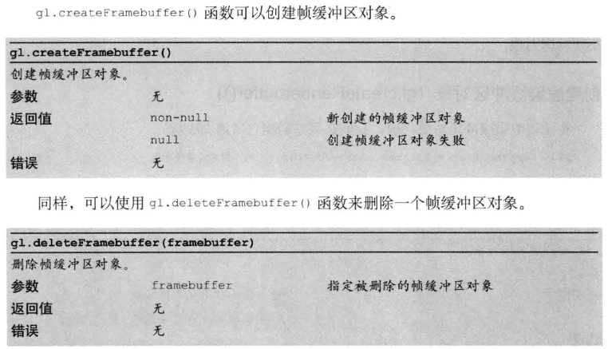

创建出帧缓冲区对象后, 还需要将其颜色关联对象指定为一个纹理对象, 将其深度关联对象指定为一个渲染缓冲区对象.

#### gl.createRenderbuffer() 创建渲染缓冲区对象

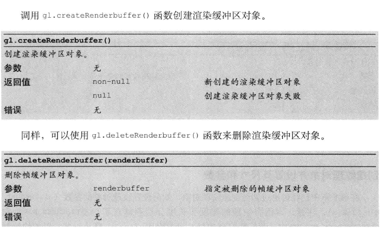

#### 绑定渲染缓冲区并设置尺寸

gl.bindRenderbuffer() 用于绑定渲染缓冲区:

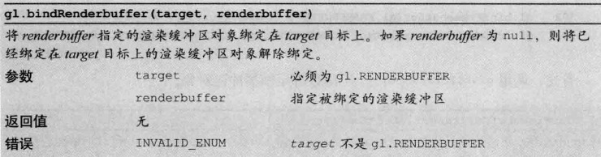

gl.renderbufferStorage() 用于设置渲染缓冲区的参数:

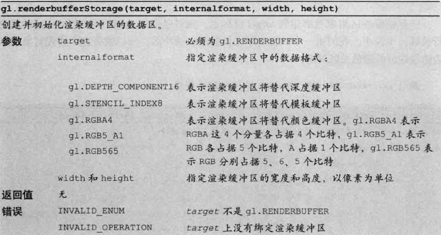

#### 将纹理对象关联到帧缓冲区对象

使用`gl.bindFramebuffer()`来绑定帧缓冲区对象:

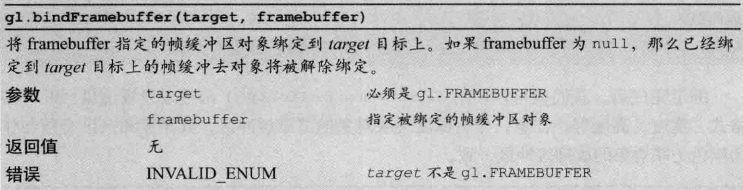

将这个纹理对象指定为帧缓冲区的颜色关联对象:调用`gl.framebufferTexture2D`:

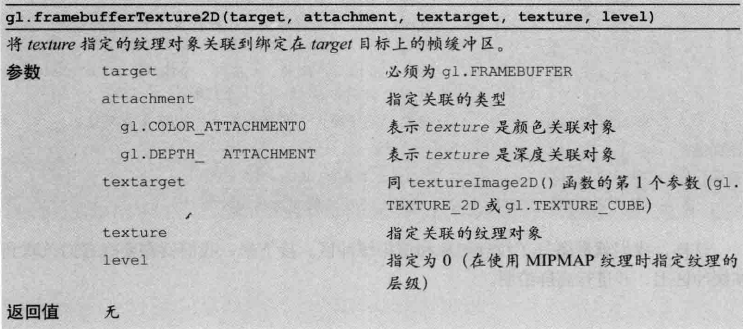

#### 将渲染缓冲区对象关联到帧缓冲区对象

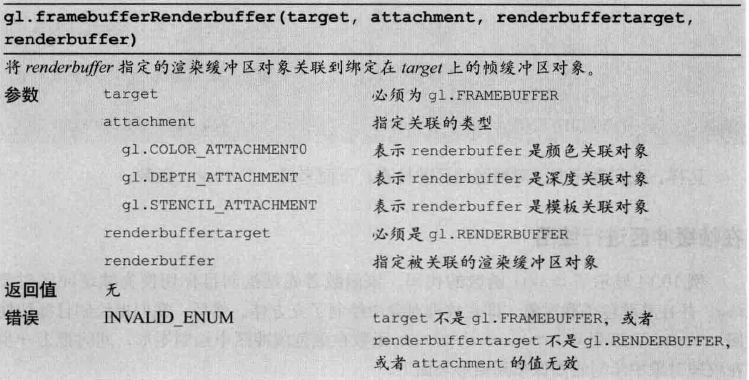

#### 检查帧缓冲区的配置(gl.checkFramebufferStatus())

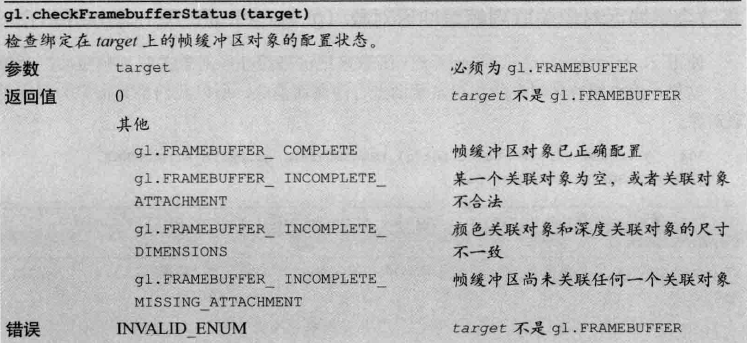

### 绘制阴影

实现阴影有若干种不同的方法, 本节做介绍的方法采用的是 **阴影贴图(shadow map)**, 或称 **深度贴图(depth map)**. 该方法具有较好的表现力, 在多种计算机图形学的场合, 甚至电影特效中都有使用.

实现阴影的基本思想是: 太阳看不见阴影. 如果在光源处放置以为观察者, 其实现方向与光线方向一致, 那么观察者也看不到阴影. 它看到的每一处都在光的照射下, 没看到的物体则在阴影中.

这里我们需要用到光源与物体之间的距离来决定物体是否可见.

如图所示, 同一条光线上有两个点 P1, P2. 由于 P2 的 z 值大于 P1, 故 P2 在阴影中.

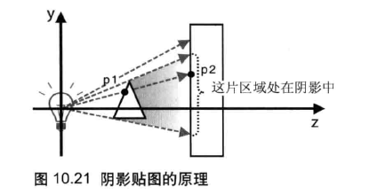

我们需要使用两对着色器来实现阴影:

1. 一对着色器用来计算光源到物体的距离
2. 另一对着色器根据 1 中计算出的距离绘制场景.

使用一张纹理图像把(1)的结果传入(2)中, 这张纹理图像就被称为 **阴影贴图(shadow map)**, 而通过阴影贴图实现阴影的方法就被称为 **阴影映射(shadow mapping)**. 阴影映射的过程包括以下两步:

1. 将视点移到光源的位置, 并运行 1 中的着色器. 这时, 那些"将要被绘出"的片元都是被光照射到的, 即落在这个像素上的各个片元中最前面的. 我们并不实际的绘制出片元的颜色, 而是将片元的 z 值写入到阴影贴图中.
2. 将视点移回原来的位置, 运行 2 中的着色器绘制场景. 此时, 我们计算出每个片元在光源坐标系(即(1)中的视点坐标系)下的坐标, 并与阴影贴图中记录的 z 值比较, 如果前者大于后者, 就说明当前片元处理阴影之中, 用较深暗的颜色绘制.

下面我们来看看示例程序:

```js
// 生成阴影贴图的顶点缓冲区
var SHADOW_VSHADER_SOURCE =
    'attribute vec4 a_Position;\n' +
    'uniform mat4 u_MvpMatrix;\n' +
    'void main() {\n' +
    '  gl_Position = u_MvpMatrix * a_Position;\n' +
    '}\n';

//生成阴影贴图的片元缓冲区
var SHADOW_FSHADER_SOURCE =
    '#ifdef GL_ES\n' +
    'precision mediump float;\n' +
    '#endif\n' +
    'void main() {\n' +
    '  gl_FragColor = vec4(gl_FragCoord.z, 0.0, 0.0, 0.0);\n' + // Write the z-value in R
    '}\n';

// 正常绘制时用到的顶点缓冲区
var VSHADER_SOURCE =
    'attribute vec4 a_Position;\n' +
    'attribute vec4 a_Color;\n' +
    'uniform mat4 u_MvpMatrix;\n' +
    'uniform mat4 u_MvpMatrixFromLight;\n' +
    'varying vec4 v_PositionFromLight;\n' +
    'varying vec4 v_Color;\n' +
    'void main() {\n' +
    '  gl_Position = u_MvpMatrix * a_Position;\n' +
    '  v_PositionFromLight = u_MvpMatrixFromLight * a_Position;\n' +
    '  v_Color = a_Color;\n' +
    '}\n';

// 正常绘制是用到的片元缓冲区
var FSHADER_SOURCE =
    '#ifdef GL_ES\n' +
    'precision mediump float;\n' +
    '#endif\n' +
    'uniform sampler2D u_ShadowMap;\n' +
    'varying vec4 v_PositionFromLight;\n' +
    'varying vec4 v_Color;\n' +
    'void main() {\n' +
    '  vec3 shadowCoord = (v_PositionFromLight.xyz/v_PositionFromLight.w)/2.0 + 0.5;\n' +
    '  vec4 rgbaDepth = texture2D(u_ShadowMap, shadowCoord.xy);\n' +
    '  float depth = rgbaDepth.r;\n' + // Retrieve the z-value from R
    '  float visibility = (shadowCoord.z > depth + 0.005) ? 0.7 : 1.0;\n' +
    '  gl_FragColor = vec4(v_Color.rgb * visibility, v_Color.a);\n' +
    '}\n';
```

前两个着色器负责生成阴影贴图. 我们需要将会之目标切换到帧缓冲区对象, 把视点在光源处的模型视图投影矩阵传给`u_MvpMatrix`变量, 并运行着色器. 着色器会将每个片元的 z 值写入帧缓冲区关联的阴影贴图中. 顶点着色器的任务很简单, 将顶点坐标乘以模型视图投影矩阵, 而片元着色器略复杂一些, 它将片元的 z 值写入纹理贴图中. 为此, 这里使用了片元着色器的内置变量`gl_FragCoord`.

`gl_FragCoord`的内置变量是 vec4 类型的, 用来表示片元的坐标. gl_FragCoord.x 和 gl_fragCoord.y 是片云在屏幕上的坐标, gl_fragCoord.z 是深度值. 它们通过(gl_Position.xyz/gl_Position.w)/2.0+0.5 计算出来的, 都被归一化到[0.0,1.0]区间. 如果`gl_FragCoord.z`为 0.0, 则表示该片元在近裁剪面上. 如果是 1.0, 则表示片元在远裁剪面上. 我们将该值写入到阴影贴图的 R 分量, 或者你也可以使用其他分量.

后两个着色器将绘制目标切回颜色缓冲区, 把视点一会原味, 开始真正绘制场景. 此时我们需要比较片云在光源坐标系下的 z 值和阴影贴图中对应的值来决定当前片元是够处在阴影之中. u_MvpMatrix 变量是视点在原处的模型视图投影矩阵, 而`u_MvpMatrixFromLight`变量是第 1 步中视点位于光远处时的模型视图投影矩阵. 顶点着色器计算每个顶点在光源坐标系中的坐标 v_PositionFromLight 并传入片元着色器.

片元着色器的任务是根据片元在光源坐标系中的坐标`v_positionFromLight`计算出可以与阴影贴图相比较的 Z 值.

阴影贴图中的 Z 值是计算出来的, 为了使这里的结果能与之比较, 我们需要通过同样的计算来进行归一化. 然后, 为了将 z 值与阴影贴图中的相应纹素值比较, 通过`v)PositionFromLight`的 x 和 y 坐标从阴影贴图中获取纹素. 但我们知道, WebGL 中的 x 和 y 坐标都是在[-1.0, 1.0]区间中的. 如图所示, 纹理坐标 s 和 t 是在[0.0, 1.0]的区间中, 所以我们需要将 x 和 y 坐标转化为 s 和 t 坐标

还有一点, 我们在进行比较的时候, 加了一个 0.005 的偏移量. 如果你在示例程序中删去这个偏移量, 矩形平面上会出现条带状阴影, 叫做 **马赫带(mach
band)**

偏移量 0.005 的作用就是消除马赫带. 为什么会出现这个马赫带?

我们知道纹理图像的 RGBA 分量重, 每个分量都是 8 位, 那么存储在阴影贴图中的 z 值进度也只有 8 位, 而与阴影贴图进行比较的值`shadowCoord.z`是 float 类型的, 有 16 位. 比如说, 假设 z 值为 0.1234567, 8 位的浮点数的进度是 1/256, 也就是 0.00390625, 根据:

$$ 0.1234567/(1/256)=31.6049152 $$

在 8 位精度下,0.1234567 实际上是 31 个 1/256, 即 0.12109375. 同理 16 位精度下 0.1234567 实际上是 8090 个 1/65536, 即 0.12344360. 前者比后者小, 这意味着, 即使是完全相同的坐标, 在阴影贴图中的 z 值可能回避 shadowCoord.z 中的值小, 这就造成了矩形平面的某些区域被误认为是硬硬了. 我们在进行比较时, 为阴影贴图添加一个偏移量 0.005, 就可以产生马赫带. 注意, 偏移量应当略大于精度, 比如这里的 0.005 就略大于 1/256.

下面看看示例程序的 js 代码:

```js
var OFFSCREEN_WIDTH = 2048, OFFSCREEN_HEIGHT = 2048;
var LIGHT_X = 0, LIGHT_Y = 7, LIGHT_Z = 2; // Position of the light source

function main() {
  ...
  // Get the rendering context for WebGL
  var gl = getWebGLContext(canvas);
  ...
  //初始化以生成阴影贴图的着色器.
  var shadowProgram = createProgram(gl, SHADOW_VSHADER_SOURCE, SHADOW_FSHADER_SOURCE);
  shadowProgram.a_Position = gl.getAttribLocation(shadowProgram, 'a_Position');
  shadowProgram.u_MvpMatrix = gl.getUniformLocation(shadowProgram, 'u_MvpMatrix');
  if (shadowProgram.a_Position < 0 || !shadowProgram.u_MvpMatrix) {
    console.log('Failed to get the storage location of attribute or uniform variable from shadowProgram');
    return;
  }

  // 初始化正常绘制的着色器
  var normalProgram = createProgram(gl, VSHADER_SOURCE, FSHADER_SOURCE);
...

  // 设置顶点信息
  var triangle = initVertexBuffersForTriangle(gl);
  var plane = initVertexBuffersForPlane(gl);
  if (!triangle || !plane) {
    console.log('Failed to set the vertex information');
    return;
  }

  //初始化帧缓冲区
  var fbo = initFramebufferObject(gl);
  ...
  gl.activeTexture(gl.TEXTURE0); // Set a texture object to the texture unit
  gl.bindTexture(gl.TEXTURE_2D, fbo.texture);

  // Set the clear color and enable the depth test
  gl.clearColor(0, 0, 0, 1);
  gl.enable(gl.DEPTH_TEST);

  var viewProjMatrixFromLight = new Matrix4(); // Prepare a view projection matrix for generating a shadow map
  viewProjMatrixFromLight.setPerspective(70.0, OFFSCREEN_WIDTH/OFFSCREEN_HEIGHT, 1.0, 100.0);
  viewProjMatrixFromLight.lookAt(LIGHT_X, LIGHT_Y, LIGHT_Z, 0.0, 0.0, 0.0, 0.0, 1.0, 0.0);

  var viewProjMatrix = new Matrix4();          // Prepare a view projection matrix for regular drawing
  viewProjMatrix.setPerspective(45, canvas.width/canvas.height, 1.0, 100.0);
  viewProjMatrix.lookAt(0.0, 7.0, 9.0, 0.0, 0.0, 0.0, 0.0, 1.0, 0.0);

  var currentAngle = 0.0; // Current rotation angle (degrees)
  var mvpMatrixFromLight_t = new Matrix4(); // A model view projection matrix from light source (for triangle)
  var mvpMatrixFromLight_p = new Matrix4(); // A model view projection matrix from light source (for plane)
  var tick = function() {
    currentAngle = animate(currentAngle);

    gl.bindFramebuffer(gl.FRAMEBUFFER, fbo);               // Change the drawing destination to FBO
    gl.viewport(0, 0, OFFSCREEN_HEIGHT, OFFSCREEN_HEIGHT); // Set view port for FBO
    gl.clear(gl.COLOR_BUFFER_BIT | gl.DEPTH_BUFFER_BIT);   // Clear FBO

    gl.useProgram(shadowProgram); // Set shaders for generating a shadow map
    // Draw the triangle and the plane (for generating a shadow map)
    drawTriangle(gl, shadowProgram, triangle, currentAngle, viewProjMatrixFromLight);
    mvpMatrixFromLight_t.set(g_mvpMatrix); // Used later
    drawPlane(gl, shadowProgram, plane, viewProjMatrixFromLight);
    mvpMatrixFromLight_p.set(g_mvpMatrix); // Used later

    gl.bindFramebuffer(gl.FRAMEBUFFER, null);               // Change the drawing destination to color buffer
    gl.viewport(0, 0, canvas.width, canvas.height);
    gl.clear(gl.COLOR_BUFFER_BIT | gl.DEPTH_BUFFER_BIT);    // Clear color and depth buffer

    gl.useProgram(normalProgram); // Set the shader for regular drawing
    gl.uniform1i(normalProgram.u_ShadowMap, 0);  // Pass 0 because gl.TEXTURE0 is enabledする
    // Draw the triangle and plane ( for regular drawing)
    gl.uniformMatrix4fv(normalProgram.u_MvpMatrixFromLight, false, mvpMatrixFromLight_t.elements);
    drawTriangle(gl, normalProgram, triangle, currentAngle, viewProjMatrix);
    gl.uniformMatrix4fv(normalProgram.u_MvpMatrixFromLight, false, mvpMatrixFromLight_p.elements);
    drawPlane(gl, normalProgram, plane, viewProjMatrix);

    window.requestAnimationFrame(tick, canvas);
  };
  tick();
}
```

main 函数首先初始化两个着色器程序, 然后初始化三角形和矩形顶点的数据, 接着调用 initFramebufferObject()函数创建帧缓冲区对象. 一切斗鱼 FramebuffObject 中一样. 再接着, 将帧缓冲区的纹理关联对象, 即阴影贴图绑定到 0 号纹理单元. 将单元编号传给 u_ShadowMap 变量.

接下来, 我们建立了视点在光远处的视图投影矩阵, 以申城纹理贴图, 关键之处在于需要光源的位置作为视点的职位传入 lookat 函数, 然后建立了用来正常绘制场景的视图投影矩阵

最后,绘制整个场景, 三角形, 矩形和阴影. 首先, 将会之目标切换为帧缓冲区, 执行着色器 shadowprogram 以生成阴影贴图. 你应该注意到, 在生成阴影贴图的过程中, 我们将模型视图投影矩阵保存了下来, 因为稍后执行`noremalProgram()`以完成常规绘制时, 片元着色器也需要该矩阵.

#### 提高精度

虽然我们成功实现了阴影效果, 但这仅适用于光源距离物体较近 的情况, 如果我们把光源拿远以下, 比如将 y 坐标改为 40. 你就会发先阴影消失了

阴影消失的原因是, 随着光源与照射物体间的距离边缘, gl_fragCoord.z 的值也会增大, 当光源足够远时, gl_FragCoord.z 就大道无法存储在只有 8 位的 R 分量了. 简单的解决方式是, 使用阴影贴图中的 RGBA 这四个分量, 用 4 个字节共 32 位存储 z 值. 实际上, 已经有例行的方法来完成这项任务.

这里的示例程序我们只改动了片元着色器:

```js
var SHADOW_FSHADER_SOURCE =
 ...
  'void main() {\n' +
  '  const vec4 bitShift = vec4(1.0, 256.0, 256.0 * 256.0, 256.0 * 256.0 * 256.0);\n' +
  '  const vec4 bitMask = vec4(1.0/256.0, 1.0/256.0, 1.0/256.0, 0.0);\n' +
  '  vec4 rgbaDepth = fract(gl_FragCoord.z * bitShift);\n' + // Calculate the value stored into each byte
  '  rgbaDepth -= rgbaDepth.gbaa * bitMask;\n' + // Cut off the value which do not fit in 8 bits
  '  gl_FragColor = rgbaDepth;\n' +
  '}\n';
...
// Fragment shader program for regular drawing
var FSHADER_SOURCE =
 ...
  'float unpackDepth(const in vec4 rgbaDepth) {\n' +
  '  const vec4 bitShift = vec4(1.0, 1.0/256.0, 1.0/(256.0*256.0), 1.0/(256.0*256.0*256.0));\n' +
  '  float depth = dot(rgbaDepth, bitShift);\n' + // Use dot() since the calculations is same
  '  return depth;\n' +
  '}\n' +
  'void main() {\n' +
  '  vec3 shadowCoord = (v_PositionFromLight.xyz/v_PositionFromLight.w)/2.0 + 0.5;\n' +
  '  vec4 rgbaDepth = texture2D(u_ShadowMap, shadowCoord.xy);\n' +
  '  float depth = unpackDepth(rgbaDepth);\n' + // Recalculate the z value from the rgba
  '  float visibility = (shadowCoord.z > depth + 0.0015) ? 0.7 : 1.0;\n' +
  '  gl_FragColor = vec4(v_Color.rgb * visibility, v_Color.a);\n' +
  '}\n';
```

片元着色器将 gl_FragCoord.z 拆为 4 个字节 RGBA, 已获得最高精度

片元着色器调用`unpackDepth()`函数获取 z 值. 该函数是自定义函数,根据如下公式从 RGBA 分量重还原出高进度的原始 Z 值.

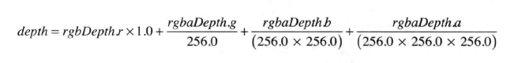

这样我们就还原了原始的 z 值, 并将它与 shadowCoord.z 相比较.我们仍然添加了一个偏移量 0.0015 来消除马赫带. 因为此时 z 值的精度已经提高到了 float, 在 medium 精度下, 精度为 $2^(-10)$

### 加载三维模型

本节使用的模型为 Blender 软件生成的 OBJ 格式的模型. OBJ 格式是基于文本的, 易于阅读和理解, 也易于转化为其他格式.

程序需要从模型文件中读取数据, 并保存在之前使用的那些数组和缓冲区中, 具体的, 程序需要:

1. 准备 Float32Array 类型的数组 vertices, 从文件中读取模型的顶点坐标数据并保存到其中
2. 准备 Float32Array 类型的数组 colors, 从文件中读取模型的顶点颜色数据并保存到其中
3. 准备 Float32Array 类型的数组 normals, 从文件中读取模型的顶点法线数据并保存到其中
4. 准备 Uint16Array 类型的数据 indices, 从文件中读取顶点索引数据并保存在其中, 顶点索引数据定义了组成整个模型的三角形序列
5. 将前 4 步获取的数据写入缓冲区中, 调用 gl.drawElements()绘制出整个立方体

#### OBJ 文件格式

OBJ 格式的文件由若干个部分组成, 包括 顶点坐标部分, 表面定义部分, 材质定义部分等. 每个部分定义了多个顶点, 法线, 表面等.

```obj
# Blender v2.60 (sub 0) OBJ File: ''
# www.blender.org
mtllib cube.mtl
o Cube
v 1.000000 -1.000000 -1.000000
v 1.000000 -1.000000 1.000000
v -1.000000 -1.000000 1.000000
v -1.000000 -1.000000 -1.000000
v 1.000000 1.000000 -1.000000
v 1.000000 1.000000 1.000001
v -1.000000 1.000000 1.000000
v -1.000000 1.000000 -1.000000
usemtl Material
f 1 2 3 4
f 5 8 7 6
f 2 6 7 3
f 3 7 8 4
f 5 1 4 8
usemtl Material.001
f 1 5 6 2
```

-   #号开头表示注释, 文件中这两行包含了 blender 软件信息
-   第三行引用了一个外部材质文件
-   第四行指定了模型的名称
-   下面 5~12 行按照`v x y z [w]`的格式定义了顶点的坐标, w 可选
-   13~20 行`usemtl <材质名>`指定了材质名称, 材质定义在第三行的 MTL 文件中
-   14~18 定义了使用这个材质的表面. 每个表面是有顶点的纹理坐标和发现的索引序列定义的

```obj
f v1 v2 v3 v4
```

其中 vX 是之前定义的顶点的索引值, 注意索引值从 1 开始.

-   法线定义格式如下:

```obj
f v1//vn1 v2//vn2 v3//vn3
```

其中 vnX 是法相向量的索引面, 从 1 开始

-   19~20 定义了使用另一个材质的表面, 即橘黄色的表面

#### MTL 文件格式

```mtl
# Blender MTL File: ''
# Material Count: 2
newmtl Material
Ka 0.000000 0.000000 0.000000
Kd 1.000000 0.000000 0.000000
Ks 0.000000 0.000000 0.000000
Ns 96.078431
Ni 1.000000
d 1.000000
illum 0
newmtl Material.001
Ka 0.000000 0.000000 0.000000
Kd 1.000000 0.450000 0.000000
Ks 0.000000 0.000000 0.000000
Ns 96.078431
Ni 1.000000
d 1.000000
illum 0
```

-   1~2: 注释
-   3: `newmtl <材质名>` , 该名被 OBJ 文件使用
-   4~6: Ka, Kd, Ks 定义了表面的环境色, 漫射色和高光色.
-   7: Ns 指定了高光色的权重
-   8: Ni 指定了表面光学目睹
-   9: d 指定透明度
-   10: illum 指定了光照模型
-   11~18:以同样方式定义了另一种材质

#### 示例程序

示例程序主要分为 5 个步骤:

1. 准备一个空的缓冲区对象
2. 读取 OBJ 文件内容
3. 解析
4. 将解析出的顶点数据写入缓冲区
5. 进行绘制

```js
function main() {
  ...
  if (!initShaders(gl, VSHADER_SOURCE, FSHADER_SOURCE)) {
    console.log('Failed to intialize shaders.');
    return;
  }
  ...
  // Get the storage locations of attribute and uniform variables
  var program = gl.program;
  program.a_Position = gl.getAttribLocation(program, 'a_Position');
  program.a_Normal = gl.getAttribLocation(program, 'a_Normal');
  program.a_Color = gl.getAttribLocation(program, 'a_Color');
  program.u_MvpMatrix = gl.getUniformLocation(program, 'u_MvpMatrix');
  program.u_NormalMatrix = gl.getUniformLocation(program, 'u_NormalMatrix');
  ...
  // 为顶点坐标, 颜色和发下爱你准备空缓冲区独享
  var model = initVertexBuffers(gl, program);
  if (!model) {
    console.log('Failed to set the vertex information');
    return;
  }
  ...
  // 开始读取OBJ文件
  readOBJFile('cube.obj', gl, model, 60, true);

  ...
    draw(gl, gl.program, currentAngle, viewProjMatrix, model);
  ...
}

// 创建缓冲区对象并进行初始化
function initVertexBuffers(gl, program) {
  var o = new Object(); // Utilize Object object to return multiple buffer objects
  o.vertexBuffer = createEmptyArrayBuffer(gl, program.a_Position, 3, gl.FLOAT);
  o.normalBuffer = createEmptyArrayBuffer(gl, program.a_Normal, 3, gl.FLOAT);
  o.colorBuffer = createEmptyArrayBuffer(gl, program.a_Color, 4, gl.FLOAT);
  o.indexBuffer = gl.createBuffer();
  ...
  return o;
}

//创建缓冲区对象, 分配相应的变量并开启
function createEmptyArrayBuffer(gl, a_attribute, num, type) {
  var buffer =  gl.createBuffer();  // 创建缓冲区对象
  if (!buffer) {
    console.log('Failed to create the buffer object');
    return null;
  }
  gl.bindBuffer(gl.ARRAY_BUFFER, buffer);
  gl.vertexAttribPointer(a_attribute, num, type, false, 0, 0);
  gl.enableVertexAttribArray(a_attribute);
  return buffer;
}

//读取文件
function readOBJFile(fileName, gl, model, scale, reverse) {
  var request = new XMLHttpRequest();

  request.onreadystatechange = function() {
    if (request.readyState === 4 && request.status !== 404) {
      onReadOBJFile(request.responseText, fileName, gl, model, scale, reverse);
    }
  }
  request.open('GET', fileName, true); // 创建请求
  request.send();                      // 发起请求
}

var g_objDoc = null;      // OBJ文件中的文本
var g_drawingInfo = null; // 用来绘制三维模型的信息

//完成对OBJ文件的读取
function onReadOBJFile(fileString, fileName, gl, o, scale, reverse) {
  var objDoc = new OBJDoc(fileName);  //创建OBJdoc对象
  var result = objDoc.parse(fileString, scale, reverse);
  if (!result) {
    g_objDoc = null; g_drawingInfo = null;
    console.log("OBJ file parsing error.");
    return;
  }
  g_objDoc = objDoc;
}
```

本例中, main()函数使用`createEmptyArrayBuffer()`函数创建了若干个空缓冲区. 实际上, 该函数不仅创建了缓冲区对象, 还将缓冲区分配给了相应的`attribute`变量并开启之, 只是没有向其中写入数据. 第 64 行将缓冲区保存为 model 属性. 接下来, 程序调用`readOBJFile`函数读取 OBJ 文件中的内容, 并解析成数据写入缓冲区. 函数流程如下:

1. 创建一个`XMLHttpRequest`对象
2. 注册事件响应函数, 当加载模型文件完成时调用
3. 使用`open()`方法创建一个请求, 以加载模型文件
4. 发起请求, 开始加载模型文件

这里我们自定义了 OBJDoc 对象,该对象的细节这里不展开描述, 解析数据的过程如下所示:

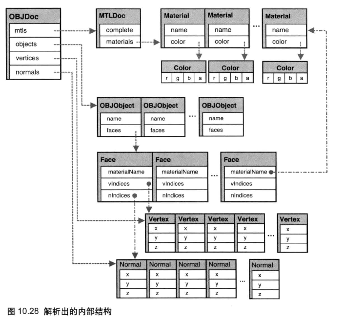

### 响应上下文丢失

WebGL 使用了计算机的图形硬件, 而这部分资源是被操作系统管理, 由包括浏览器在内的多个应用程序共享. 在某些特殊情况下, 如另一个程序接管了图形硬件, 户或者操作系统进入休眠, 浏览器就会失去使用这些资源的权利, 并导致存储在硬件中的数据丢失. 在这种情况下, WebGL 绘图上下文就会丢失. 比如电脑进入休眠状态后重新唤醒的情况.

WebGL 提供了两个事件来表示这种情况:

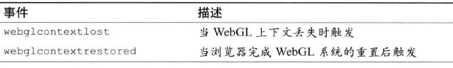

上下文事件对视的时候, gl 对象就失效了, 所有在 gl 上的操作, 如创建缓冲区对象和纹理对象, 初始化着色器, 设置背景色等等都失效了. 重置 WebGL 系统后, 就触发了上下文回复之间, 这时需要重新完成上述步骤.

我们使用`canvas`的监听注册函数来监听上下文丢失的事件

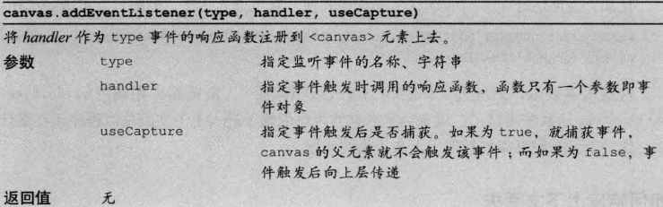

示例程序如下:

```js
...
function main() {
  // Retrieve <canvas> element
  var canvas = document.getElementById('webgl');

  // Register event handler for context lost and context restored events
  canvas.addEventListener('webglcontextlost', contextLost, false);
  canvas.addEventListener('webglcontextrestored', function(ev) { start(canvas); }, false);

  start(canvas);   // Perform WebGL related processes
}
...

function start(canvas) {
  // Get the rendering context for WebGL
  var gl = getWebGLContext(canvas);
  if (!gl) {
    console.log('Failed to get the rendering context for WebGL');
    return;
  }

  // Initialize shaders
  if (!initShaders(gl, VSHADER_SOURCE, FSHADER_SOURCE)) {
    console.log('Failed to intialize shaders.');
    return;
  }
...
}
...
function contextLost(ev) { // 上下文丢失事件响应函数
  cancelAnimationFrame(g_requestID); //  停止动画
  ev.preventDefault();  // 阻止默认行为
}
```
